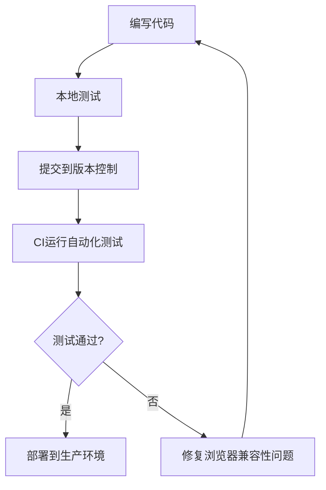

# JavaScript 浏览器兼容性

## 什么是浏览器兼容性？

浏览器兼容性是指网站或Web应用程序在不同浏览器中正常运行的能力。由于不同浏览器可能实现JavaScript标准的方式不同，或者支持不同的特性，开发者在创建网站时需要考虑这些差异，确保用户无论使用什么浏览器，都能获得一致的体验。

:::note
即使是现代浏览器，也可能在JavaScript特性支持上存在细微差别，尤其是对于最新的ECMAScript功能。
:::

## 为什么浏览器兼容性很重要？

- **用户体验**：确保所有用户获得一致的体验，无论他们使用哪种浏览器
- **市场覆盖**：扩大网站的受众范围，不排除使用特定浏览器的用户
- **维护成本**：减少因浏览器差异导致的错误处理时间
- **品牌形象**：提供稳定、可靠的用户体验，增强品牌信誉

## 常见的浏览器兼容性问题

### 1. JavaScript语法和API差异

不同浏览器可能支持不同版本的JavaScript，导致某些语法或API在一些浏览器中不可用。

```js
// 箭头函数在IE11中不支持
const sum = (a, b) => a + b;

// Promise.allSettled在旧版浏览器中不支持
const promises = [fetch('/api/data1'), fetch('/api/data2')];
Promise.allSettled(promises).then(results => {
  console.log(results);
});
```

### 2. DOM API差异

浏览器可能在DOM操作方法上有所不同。

```js
// 某些DOM方法在不同浏览器中实现不一致
const element = document.getElementById('myElement');

// 在某些旧版浏览器中可能不支持classList
element.classList.add('new-class');

// 在旧版浏览器中可能不存在
element.closest('.parent');
```

### 3. CSS渲染差异

虽然这不是JavaScript问题，但通常与JavaScript结合使用时会出现问题，比如动态样式应用。

```js
// 添加可能在不同浏览器中渲染不同的样式
element.style.display = 'flex'; // 在旧版IE中不支持
```

## 处理浏览器兼容性的策略

### 特性检测

特性检测是处理兼容性的最佳实践之一。通过检查特定功能是否存在，而不是检测浏览器类型。

```js
// 不好的做法 - 浏览器嗅探
if (navigator.userAgent.indexOf("Chrome") !== -1) {
  // 针对Chrome的代码
}

// 好的做法 - 特性检测
if (typeof element.classList !== "undefined") {
  element.classList.add('new-class'); 
} else {
  // 替代方案
  const classes = element.className.split(" ");
  if (classes.indexOf('new-class') === -1) {
    element.className += " new-class";
  }
}
```

### 使用Polyfills

Polyfill是一段代码，用于在旧浏览器中提供新功能的支持。

```js
// 为不支持Array.from的浏览器添加polyfill
if (!Array.from) {
  Array.from = function(arrayLike) {
    return Array.prototype.slice.call(arrayLike);
  };
}

// 使用Array.from，即使在旧浏览器中
const nodeList = document.querySelectorAll('.items');
const itemsArray = Array.from(nodeList);
```

### Babel转译

Babel是一个JavaScript编译器，可以将新版本的JavaScript代码转换为旧版本，以便在旧浏览器中运行。

```js
// 现代JavaScript代码
const multiply = (a, b) => a * b;
const numbers = [1, 2, 3].map(n => n * 2);
const { name, age } = person;

// Babel将其转换为兼容代码
"use strict";
var multiply = function multiply(a, b) {
  return a * b;
};
var numbers = [1, 2, 3].map(function(n) {
  return n * 2;
});
var name = person.name,
    age = person.age;
```

### 渐进增强与优雅降级

- **渐进增强**：先构建适用于所有浏览器的基础功能，然后为支持现代特性的浏览器添加增强功能。
- **优雅降级**：先构建具有完整功能的现代网站，然后为旧浏览器提供替代解决方案。

```js
// 渐进增强示例
function setupImageGallery() {
  // 基础功能 - 适用于所有浏览器
  const images = document.querySelectorAll('.gallery img');
  images.forEach(img => {
    img.addEventListener('click', function() {
      // 基础点击处理
      window.location.href = this.dataset.fullsizeUrl;
    });
  });

  // 增强功能 - 现代浏览器模态窗口
  if (window.IntersectionObserver && 'content-visibility' in document.body.style) {
    setupModernGallery(images);
  }
}
```

## 实用工具和资源

### 1. 浏览器支持检查工具

- **[Can I use](https://caniuse.com/)** - 查看各种前端技术在不同浏览器中的支持情况
- **[MDN Web Docs](https://developer.mozilla.org/)** - 提供详细的浏览器兼容性信息
- **[Browserstack](https://www.browserstack.com/)** - 提供跨浏览器测试平台

### 2. 自动处理兼容性

- **Babel** - 转译JavaScript代码
- **core-js** - 提供全面的JavaScript polyfills
- **Autoprefixer** - 为CSS属性添加适当的浏览器前缀

```js
// 使用core-js导入需要的polyfill
import 'core-js/features/array/from';
import 'core-js/features/promise';
import 'core-js/features/object/assign';

// 然后使用这些特性，无需担心兼容性
const items = Array.from(document.querySelectorAll('.item'));
const newObj = Object.assign({}, oldObj);
```

## 实际案例：创建跨浏览器兼容的图片懒加载

让我们看一个实际案例，展示如何实现一个兼容多浏览器的图片懒加载功能：

```js
function setupImageLazyLoad() {
  // 检查浏览器是否支持IntersectionObserver
  if ('IntersectionObserver' in window) {
    // 现代浏览器 - 使用IntersectionObserver
    const imageObserver = new IntersectionObserver((entries, observer) => {
      entries.forEach(entry => {
        if (entry.isIntersecting) {
          const img = entry.target;
          const src = img.dataset.src;
          
          if (src) {
            img.src = src;
            img.removeAttribute('data-src');
            imageObserver.unobserve(img);
          }
        }
      });
    });
    
    // 监听所有带有data-src属性的图片
    document.querySelectorAll('img[data-src]').forEach(img => {
      imageObserver.observe(img);
    });
  } else {
    // 旧浏览器 - 使用滚动事件作为备选方案
    function lazyLoadFallback() {
      const lazyImages = document.querySelectorAll('img[data-src]');
      const windowHeight = window.innerHeight;
      
      lazyImages.forEach(img => {
        const rect = img.getBoundingClientRect();
        
        // 检查图片是否在可视范围内
        if (rect.top <= windowHeight && rect.bottom >= 0) {
          const src = img.dataset.src;
          
          if (src) {
            img.src = src;
            img.removeAttribute('data-src');
          }
        }
      });
      
      // 如果所有图片都已加载，移除事件监听
      if (lazyImages.length === 0) {
        window.removeEventListener('scroll', lazyLoadThrottled);
        window.removeEventListener('resize', lazyLoadThrottled);
      }
    }
    
    // 使用节流函数避免过多调用
    function throttle(fn, delay) {
      let lastCall = 0;
      return function(...args) {
        const now = new Date().getTime();
        if (now - lastCall < delay) {
          return;
        }
        lastCall = now;
        return fn(...args);
      };
    }
    
    const lazyLoadThrottled = throttle(lazyLoadFallback, 200);
    
    window.addEventListener('scroll', lazyLoadThrottled);
    window.addEventListener('resize', lazyLoadThrottled);
    
    // 初始化加载
    lazyLoadFallback();
  }
}

// 页面加载后调用
document.addEventListener('DOMContentLoaded', setupImageLazyLoad);
```

这个实例实现了：

1. 现代浏览器使用 `IntersectionObserver` API实现高效懒加载
2. 不支持的浏览器使用传统滚动事件作为备选方案
3. 应用了节流功能，减少性能问题
4. 采用特性检测而非浏览器检测

## 浏览器兼容性测试

为确保跨浏览器兼容性，你应该进行以下几种测试：

### 手动测试

在不同浏览器和设备上手动测试你的应用：
- 主要桌面浏览器（Chrome, Firefox, Safari, Edge）
- 移动浏览器（iOS Safari, Android Chrome）
- 不同操作系统（Windows, macOS, Linux, iOS, Android）

### 自动化测试

使用自动化测试工具简化跨浏览器测试流程：
- **Browserstack**
- **Sauce Labs**
- **Selenium**
- **Cypress**

### 持续集成

将跨浏览器测试集成到CI/CD流程中，确保每次代码更改都不会破坏跨浏览器兼容性。



## 总结与最佳实践

### 关键要点总结

- 浏览器兼容性是确保网站在所有浏览器中正常工作的关键因素
- 使用特性检测而非浏览器检测
- 利用polyfills和转译器支持旧浏览器
- 采用渐进增强或优雅降级策略
- 持续测试不同浏览器中的兼容性

### 最佳实践

1. **设定支持范围**：确定你需要支持哪些浏览器和版本，不要盲目支持过于陈旧的浏览器
2. **使用现代工具链**：Babel、Webpack等构建工具可自动处理大部分兼容性问题
3. **避免浏览器特定代码**：尽量使用标准API而非浏览器特定实现
4. **保持更新**：定期检查和更新你的polyfills和兼容性解决方案
5. **测试、测试、再测试**：在多种浏览器上反复测试应用功能

## 练习与挑战

1. 创建一个表单验证脚本，确保在所有主流浏览器中运行
2. 实现一个拖放功能，包含现代API和旧浏览器的备选方案
3. 创建一个使用localStorage的应用，为不支持的浏览器提供cookie备选方案
4. 使用Babel编译ES6代码并测试在IE11中的运行情况

## 其他资源

- **书籍**：《JavaScript高级程序设计》中的跨浏览器开发章节
- **在线课程**：Udemy和Pluralsight上的JavaScript兼容性课程
- **开发者工具**：学习使用各浏览器的开发者工具识别兼容性问题
- **社区**：Stack Overflow和GitHub上的兼容性问题讨论

:::tip
记住，浏览器兼容性是一个权衡过程。支持过多的旧浏览器可能会增加开发和维护成本，而支持太少可能会失去部分用户。根据你的用户群体和项目需求做出明智决策。
:::

通过理解和应用这些浏览器兼容性策略，你可以创建出在各种环境中都能稳定运行的JavaScript应用，给用户提供一致的优质体验。