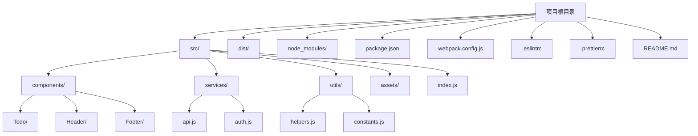

# JavaScript 开发最佳实践

---
title: JavaScript 开发最佳实践
description: 学习JavaScript开发中的最佳实践，包括代码组织、性能优化、调试技巧和常见陷阱的避免方法。
---

## 引言

随着Web应用程序变得越来越复杂，采用良好的JavaScript开发实践变得尤为重要。本文将介绍一系列JavaScript开发的最佳实践，帮助你编写更清晰、更高效、更易于维护的代码。无论你是刚开始学习JavaScript，还是想提升自己的编码技能，这些实践都将帮助你成为一名更优秀的开发者。

## 代码风格和格式化

### 一致的命名约定

```javascript
// 不推荐
var name = "John";
var UserAge = 25;
var user_location = "New York";

// 推荐
const userName = "John";
const userAge = 25;
const userLocation = "New York";
```

:::tip 小提示
对于变量和函数名，推荐使用驼峰命名法（camelCase）；对于类名，使用帕斯卡命名法（PascalCase）；对于常量，使用全大写加下划线（SNAKE_CASE）。
:::

### 使用现代JavaScript语法

```javascript
// ES5 语法
var numbers = [1, 2, 3];
var doubled = [];
for (var i = 0; i < numbers.length; i++) {
  doubled.push(numbers[i] * 2);
}

// ES6+ 语法 (推荐)
const numbers = [1, 2, 3];
const doubled = numbers.map(number => number * 2);
```

## 变量声明和作用域

### 使用 let 和 const 替代 var

```javascript
// 不推荐
var count = 1;
if (true) {
  var count = 2; // 覆盖了外部的count
}
console.log(count); // 输出: 2

// 推荐
let count = 1;
if (true) {
  let count = 2; // 这个count仅在if块内有效
}
console.log(count); // 输出: 1
```

### 优先使用const，只在必要时使用let

```javascript
// 推荐
const PI = 3.14159;
const serverUrl = "https://api.example.com";

// 仅当变量需要重新赋值时使用let
let counter = 0;
counter++;
```

## 函数和模块化

### 编写小而专注的函数

```javascript
// 不推荐
function processUserData(user) {
  // 100行代码处理各种任务...
}

// 推荐
function validateUser(user) {
  // 验证用户数据
}

function formatUserName(user) {
  // 格式化用户名
}

function processUserData(user) {
  validateUser(user);
  formatUserName(user);
  // 其他处理...
}
```

### 使用模块化组织代码

```javascript
// math.js
export function add(a, b) {
  return a + b;
}

export function subtract(a, b) {
  return a - b;
}

// main.js
import { add, subtract } from './math.js';

console.log(add(5, 3)); // 输出: 8
console.log(subtract(5, 3)); // 输出: 2
```

## 错误处理和调试

### 合理使用try-catch

```javascript
// 不推荐
function fetchData() {
  return fetch('https://api.example.com/data')
    .then(response => response.json());
}

// 推荐
async function fetchData() {
  try {
    const response = await fetch('https://api.example.com/data');
    return await response.json();
  } catch (error) {
    console.error('获取数据失败:', error);
    // 可以返回默认数据或者重新抛出错误
    return { error: true, message: error.message };
  }
}
```

### 使用有意义的错误信息

```javascript
// 不推荐
if (!user) {
  throw new Error('错误');
}

// 推荐
if (!user) {
  throw new Error('用户对象不能为空');
}
```

## 性能优化

### 避免DOM频繁操作

```javascript
// 不推荐
for (let i = 0; i < 1000; i++) {
  document.getElementById('container').innerHTML += '<div>' + i + '</div>';
}

// 推荐
let html = '';
for (let i = 0; i < 1000; i++) {
  html += '<div>' + i + '</div>';
}
document.getElementById('container').innerHTML = html;
```

### 使用防抖和节流

```javascript
// 防抖函数
function debounce(func, wait) {
  let timeout;
  return function(...args) {
    clearTimeout(timeout);
    timeout = setTimeout(() => func.apply(this, args), wait);
  };
}

// 使用防抖处理窗口调整大小事件
const efficientResize = debounce(() => {
  console.log('窗口大小已调整');
  // 处理窗口大小变化的代码
}, 250);

window.addEventListener('resize', efficientResize);
```

## 安全性实践

### 避免eval和Function构造函数

```javascript
// 不推荐 - 存在安全风险
eval('console.log("Hello, world!")');
const sum = new Function('a', 'b', 'return a + b');

// 推荐 - 直接编写代码
console.log("Hello, world!");
function sum(a, b) {
  return a + b;
}
```

### 防范XSS攻击

```javascript
// 不推荐 - 容易遭受XSS攻击
const userInput = "<script>alert('XSS')</script>";
document.getElementById('output').innerHTML = userInput;

// 推荐 - 使用文本内容或转义HTML
const userInput = "<script>alert('XSS')</script>";
document.getElementById('output').textContent = userInput; // 作为纯文本插入

// 或者使用第三方库进行HTML转义
const escapedInput = escapeHTML(userInput); // 假设有一个escapeHTML函数
document.getElementById('output').innerHTML = escapedInput;
```

## 测试和代码质量

### 编写单元测试

使用Jest或Mocha等测试框架编写单元测试：

```javascript
// sum.js
function sum(a, b) {
  return a + b;
}
module.exports = sum;

// sum.test.js (使用Jest)
const sum = require('./sum');

test('adds 1 + 2 to equal 3', () => {
  expect(sum(1, 2)).toBe(3);
});
```

### 使用ESLint和Prettier

ESLint配置示例（.eslintrc.js）：

```javascript
module.exports = {
  "env": {
    "browser": true,
    "es2021": true
  },
  "extends": "eslint:recommended",
  "parserOptions": {
    "ecmaVersion": 12,
    "sourceType": "module"
  },
  "rules": {
    "indent": ["error", 2],
    "quotes": ["error", "single"],
    "semi": ["error", "always"]
  }
};
```

## 实际案例：构建一个Todo应用

下面是一个简单的Todo应用，它展示了我们讨论过的多种最佳实践：

```javascript
// todo.js - Todo应用模块
const TodoApp = (() => {
  // 私有变量
  const todos = [];
  
  // DOM元素缓存
  const elements = {
    input: document.getElementById('todo-input'),
    addButton: document.getElementById('add-button'),
    list: document.getElementById('todo-list'),
    counter: document.getElementById('counter')
  };
  
  // 私有方法
  const renderTodos = () => {
    // 创建文档片段减少DOM操作
    const fragment = document.createDocumentFragment();
    
    // 清空列表
    elements.list.innerHTML = '';
    
    // 更新计数器
    elements.counter.textContent = `${todos.length} 项待办事项`;
    
    // 添加新的todo项
    todos.forEach((todo, index) => {
      const li = document.createElement('li');
      
      // 防XSS - 使用textContent而不是innerHTML
      li.textContent = todo.text;
      
      if (todo.completed) {
        li.classList.add('completed');
      }
      
      // 添加删除按钮
      const deleteButton = document.createElement('button');
      deleteButton.textContent = '删除';
      deleteButton.addEventListener('click', () => {
        removeTodo(index);
      });
      
      // 添加完成按钮
      const completeButton = document.createElement('button');
      completeButton.textContent = todo.completed ? '取消完成' : '完成';
      completeButton.addEventListener('click', () => {
        toggleTodoComplete(index);
      });
      
      li.appendChild(completeButton);
      li.appendChild(deleteButton);
      fragment.appendChild(li);
    });
    
    elements.list.appendChild(fragment);
  };
  
  // 公共方法
  const addTodo = (text) => {
    if (!text.trim()) return;
    
    todos.push({
      text: text,
      completed: false,
      createdAt: new Date()
    });
    
    renderTodos();
  };
  
  const removeTodo = (index) => {
    todos.splice(index, 1);
    renderTodos();
  };
  
  const toggleTodoComplete = (index) => {
    todos[index].completed = !todos[index].completed;
    renderTodos();
  };
  
  // 初始化函数
  const init = () => {
    // 使用事件委托处理点击事件
    elements.addButton.addEventListener('click', () => {
      const text = elements.input.value;
      addTodo(text);
      elements.input.value = '';
    });
    
    // 处理回车键
    elements.input.addEventListener('keypress', (e) => {
      if (e.key === 'Enter') {
        const text = elements.input.value;
        addTodo(text);
        elements.input.value = '';
      }
    });
    
    renderTodos();
  };
  
  // 返回公共API
  return {
    init,
    addTodo,
    removeTodo,
    toggleTodoComplete
  };
})();

// 初始化应用
document.addEventListener('DOMContentLoaded', TodoApp.init);
```

这个Todo应用展示了以下最佳实践：

1. 模块化设计（使用立即执行函数表达式IIFE）
2. 缓存DOM元素引用
3. 使用文档片段减少DOM操作
4. 防XSS安全措施
5. 明确的函数职责分离
6. 事件委托
7. 保持UI与数据同步

## 代码组织与架构

JavaScript应用随着规模增长会变得复杂。下面是一个推荐的项目结构：



## 总结

遵循JavaScript最佳实践可以帮助你编写更加健壮、高效和可维护的代码。本文涵盖了一系列关键领域：

1. **代码风格和格式化** - 保持一致的命名约定和格式
2. **变量声明和作用域** - 合理使用let、const和变量作用域
3. **函数和模块化** - 编写小而专注的函数，使用模块化组织代码
4. **错误处理和调试** - 合理使用try-catch和有意义的错误信息
5. **性能优化** - 避免DOM频繁操作，使用防抖和节流
6. **安全性实践** - 防范XSS攻击，避免使用eval
7. **测试和代码质量** - 编写单元测试，使用ESLint和Prettier

持续学习和实践这些原则将帮助你成为一名更优秀的JavaScript开发者。

## 练习与进一步学习

1. **实践项目**：尝试创建一个小型应用，如待办事项列表或天气应用，应用本文中的最佳实践。
2. **代码审查**：审查你现有的JavaScript代码，找出可以应用这些最佳实践的地方。
3. **设置工具**：为你的项目设置ESLint和Prettier，确保代码风格一致。
4. **单元测试**：为你的一些主要函数编写单元测试。

### 推荐资源

- Mozilla Developer Network (MDN)上的JavaScript指南
- 《JavaScript高级程序设计》（第4版）
- 《你不知道的JavaScript》系列
- Clean Code JavaScript - GitHub上的开源项目
- Airbnb JavaScript风格指南

:::caution 注意
始终确保你了解最新的JavaScript发展和最佳实践。Web开发领域发展迅速，保持学习非常重要！
:::