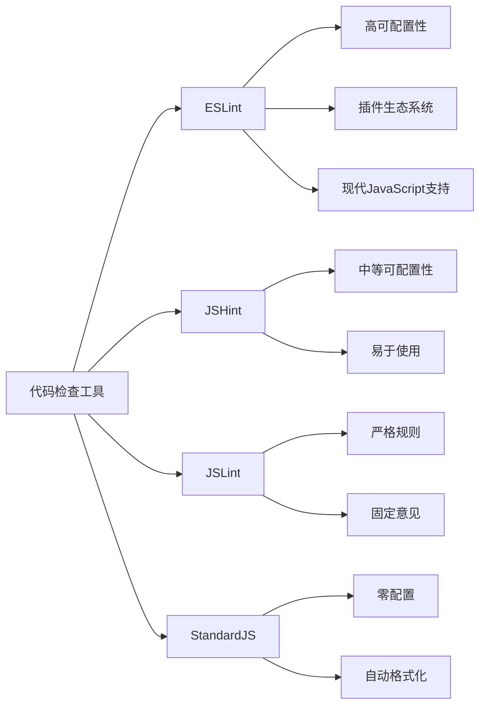

# JavaScript 代码检查

在JavaScript开发过程中，编写高质量、一致性强且没有明显错误的代码是非常重要的。这就是代码检查（或称为"代码静态分析"）发挥作用的地方。本文将为你介绍JavaScript代码检查的概念，流行的工具，以及如何在你的项目中实施它们。

## 什么是代码检查？

代码检查是一种静态代码分析过程，它可以在不实际运行代码的情况下，识别出编程错误、代码风格问题、可疑结构和不遵循最佳实践的代码。

:::tip
代码检查是提前发现并解决问题的重要工具，可以大大降低调试时间和项目维护成本！
:::

## 为什么需要代码检查？

1. **提前发现错误** - 在代码执行前识别潜在问题
2. **保持代码风格一致** - 特别是在团队项目中
3. **提高代码质量** - 强制执行最佳实践
4. **加速开发过程** - 减少调试和修复时间
5. **教育开发者** - 帮助学习更好的编码习惯

## 主流JavaScript代码检查工具

### 1. ESLint

ESLint是当前最流行的JavaScript代码检查工具，它具有高度的可配置性和可扩展性。

#### 安装ESLint

```bash
# 使用npm安装
npm install eslint --save-dev

# 初始化配置
npx eslint --init
```

#### 基本配置示例

创建一个`.eslintrc.js`文件：

```javascript
module.exports = {
  "env": {
    "browser": true,
    "es2021": true
  },
  "extends": "eslint:recommended",
  "parserOptions": {
    "ecmaVersion": 12,
    "sourceType": "module"
  },
  "rules": {
    "indent": ["error", 2],
    "linebreak-style": ["error", "unix"],
    "quotes": ["error", "single"],
    "semi": ["error", "always"]
  }
};
```

#### 运行ESLint

```bash
# 检查单个文件
npx eslint yourfile.js

# 检查整个目录
npx eslint src/
```

### 2. JSLint

JSLint是最早的JavaScript代码质量工具之一，由Douglas Crockford创建。它比较严格，对代码质量的要求很高。

### 3. JSHint

JSHint是JSLint的一个分支，提供了更多的配置选项，使其更加灵活。

### 4. StandardJS

StandardJS是一个零配置工具，它实施了一组预定义的规则，无需配置文件。

```bash
# 安装
npm install standard --save-dev

# 运行
npx standard
```

## 代码检查的实际案例

让我们看一个实际例子，演示ESLint如何帮助我们改进代码。

### 问题代码

```javascript
function calculateTotal(items) {
  var total = 0;
  
  for (var i = 0; i < items.length; i++) {
    total += items[i].price
  }
  
  return total
}

console.log(calculateTotal([{price: 10}, {price: 20}]));
```

### ESLint输出

当我们运行`npx eslint yourfile.js`时，将得到类似这样的输出：

```
yourfile.js
  5:32: Missing semicolon.
  8:14: Missing semicolon.
  3:3: 'total' is never reassigned. Use 'const' instead.
  5:3: 'i' is declared in the for loop. Use 'let' instead.
```

### 修正后的代码

```javascript
function calculateTotal(items) {
  const total = 0;
  
  for (let i = 0; i < items.length; i++) {
    total += items[i].price;
  }
  
  return total;
}

console.log(calculateTotal([{price: 10}, {price: 20}]));
```

## 将代码检查集成到开发流程

### 编辑器集成

大多数现代代码编辑器都支持ESLint集成：

- **VS Code**: 安装ESLint扩展
- **WebStorm**: 内置ESLint支持
- **Atom**: 安装linter-eslint包

### Git钩子集成

使用husky可以在git操作前运行代码检查：

```bash
# 安装husky和lint-staged
npm install husky lint-staged --save-dev
```

在`package.json`中配置：

```json
{
  "husky": {
    "hooks": {
      "pre-commit": "lint-staged"
    }
  },
  "lint-staged": {
    "*.js": "eslint --fix"
  }
}
```

### CI/CD集成

在持续集成流程中也应该包含代码检查步骤，例如在GitHub Actions中：

```yaml
name: Lint

on: [push, pull_request]

jobs:
  eslint:
    runs-on: ubuntu-latest
    steps:
      - uses: actions/checkout@v2
      - uses: actions/setup-node@v2
        with:
          node-version: '14'
      - run: npm install
      - run: npm run lint
```

## 代码检查最佳实践

1. **渐进式采用规则** - 一次引入太多规则可能会让团队不堪重负
2. **保持规则的一致性** - 在整个项目或组织中使用相同的规则
3. **记录例外情况** - 使用注释禁用特定行的规则（如`// eslint-disable-line no-console`）
4. **自动修复** - 尽可能使用`--fix`选项自动修复问题
5. **定期审查和更新规则** - 随着项目的发展和技术的变化调整规则

## 代码检查工具比较



## 总结

JavaScript代码检查是提高代码质量、保持风格一致性以及提前发现潜在问题的强大工具。通过使用ESLint等工具，可以显著改善开发体验，同时提高应用程序的可维护性。代码检查不仅仅是发现错误的工具，更是帮助开发者培养良好编码习惯的教育手段。

## 练习

1. 安装ESLint并为一个现有的JavaScript项目创建基本配置。
2. 尝试在多个规则配置下运行ESLint，观察不同规则如何影响检查结果。
3. 将ESLint集成到你的代码编辑器中，体验实时代码检查。
4. 为一个小型项目配置Git钩子，使用husky和lint-staged在每次提交前运行ESLint。

## 附加资源

- [ESLint官方文档](https://eslint.org/)
- [Airbnb JavaScript风格指南](https://github.com/airbnb/javascript)
- [JavaScript代码整洁之道](https://github.com/ryanmcdermott/clean-code-javascript)
- [StandardJS官方网站](https://standardjs.com/)

:::caution
代码检查是提高代码质量的工具，但不能完全替代代码审查和测试。最好的做法是将代码检查作为更全面质量保证策略的一部分。
:::