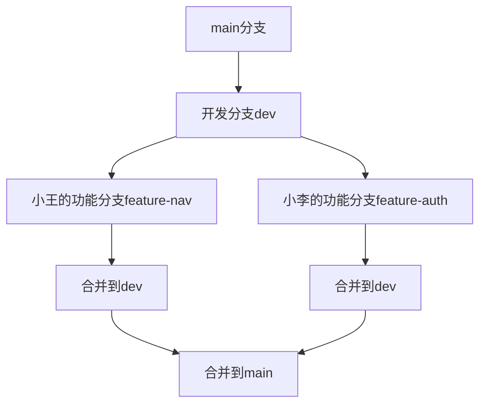

# JavaScript 版本控制

---
title: JavaScript 版本控制
description: 学习如何在JavaScript开发中使用版本控制，了解Git的基本用法和团队协作工作流。
---

## 什么是版本控制？

版本控制是一种跟踪和管理项目文件变化的系统。当你开发JavaScript应用时，版本控制允许你：

- 保存代码的不同版本
- 查看项目的历史修改
- 在不同版本之间切换
- 多人协作开发而不互相干扰
- 安全地尝试新功能而不破坏现有代码

:::note
版本控制就像是给你的项目创建"保存点"，让你可以随时回到之前的状态。就像玩游戏时的存档功能一样！
:::

## 为什么JavaScript开发需要版本控制？

作为JavaScript开发者，版本控制对你来说尤为重要：

1. **代码管理**：管理日益复杂的前端代码库
2. **协作开发**：多人同时开发同一项目
3. **错误追踪**：快速定位引入错误的代码变更
4. **部署管理**：区分开发、测试和生产环境的代码版本

## Git：最流行的版本控制系统

Git是当今最流行的版本控制系统，由Linux之父Linus Torvalds创建。大多数JavaScript项目都使用Git进行版本控制。

### Git的基本概念


- **仓库（Repository）**：存储项目所有版本信息的数据库
- **提交（Commit）**：保存项目在特定时间点的快照
- **分支（Branch）**：代码的独立开发线，默认是main或master
- **合并（Merge）**：将一个分支的修改应用到另一个分支
- **克隆（Clone）**：复制远程仓库到本地
- **拉取（Pull）**：从远程仓库获取最新代码
- **推送（Push）**：将本地更改上传到远程仓库

## JavaScript 项目的Git基本操作

### 1. 安装Git

根据你的操作系统，下载并安装Git：
- Windows：下载Git官方安装程序
- macOS：通过Homebrew安装：`brew install git`
- Linux：使用包管理器，如`apt-get install git`（Ubuntu）

### 2. 配置Git

```bash
git config --global user.name "你的名字"
git config --global user.email "你的邮箱"
```

### 3. 创建新仓库

对于新的JavaScript项目：

```bash
mkdir my-js-project
cd my-js-project
git init
```

### 4. 克隆现有仓库

```bash
git clone https://github.com/username/javascript-project.git
```

### 5. 基本的Git工作流

创建一个简单的JavaScript文件：

```bash
echo "function sayHello() { console.log('Hello, Git!'); }" > app.js
```

添加文件到暂存区：

```bash
git add app.js
```

提交更改：

```bash
git commit -m "添加打招呼功能"
```

查看状态：

```bash
git status
```

查看历史：

```bash
git log
```

## 分支管理与JavaScript开发

分支是Git最强大的特性之一，特别适合JavaScript的迭代开发。

### 创建与切换分支

```bash
# 创建新分支
git branch feature-login

# 切换到该分支
git checkout feature-login

# 或者一步完成创建并切换
git checkout -b feature-login
```

### 在分支中开发新功能

修改我们的JavaScript文件：

```javascript
function sayHello(name) {
  return `Hello, ${name}!`;
}

function login(username, password) {
  // 登录逻辑
  return username && password ? true : false;
}
```

提交新功能：

```bash
git add app.js
git commit -m "添加登录功能"
```

### 合并分支

完成功能开发后，合并回主分支：

```bash
git checkout main
git merge feature-login
```

## 实际案例：版本控制在JavaScript项目中的应用

### 案例1：管理前端库的版本

假设你正在开发一个JavaScript库，并需要维护不同版本：

```bash
# 为当前稳定版本创建标签
git tag -a v1.0.0 -m "第一个稳定版本"

# 开始开发新功能
git checkout -b v1.1-development

# 完成后合并并标记新版本
git checkout main
git merge v1.1-development
git tag -a v1.1.0 -m "添加新特性"
```

### 案例2：多人协作开发React应用



- 小王负责导航组件
- 小李负责用户认证
- 每个人在各自的分支工作，然后合并到开发分支
- 测试通过后，再合并到主分支

### 案例3：使用Git解决冲突

当两个开发者修改了同一个文件时，合并时可能会产生冲突：

```javascript
// 小王的版本
function formatUser(user) {
  return `${user.firstName} ${user.lastName}`;
}

// 小李的版本
function formatUser(user) {
  return {
    fullName: `${user.firstName} ${user.lastName}`,
    email: user.email
  };
}
```

解决冲突：

1. Git会标记冲突区域
2. 手动编辑文件选择最终版本
3. 添加修改后的文件并完成合并

```bash
git add app.js
git commit -m "解决formatUser函数的冲突"
```

## 与GitHub集成

GitHub是一个基于Git的代码托管平台，非常适合JavaScript项目：

1. 创建GitHub账户
2. 创建新仓库
3. 将本地仓库连接到GitHub：

```bash
git remote add origin https://github.com/username/repo-name.git
git push -u origin main
```

### 通过Pull Request协作

1. Fork别人的仓库
2. 克隆到本地，做出修改
3. 推送到你的Fork
4. 创建Pull Request
5. 等待仓库所有者审核并合并

## JavaScript 项目的.gitignore文件

`.gitignore`文件指定Git应忽略的文件：

```
# 依赖目录
node_modules/

# 构建输出
dist/
build/

# 环境变量
.env
.env.local

# 编辑器配置
.vscode/
.idea/

# 日志
npm-debug.log*
yarn-debug.log*
yarn-error.log*

# 缓存
.cache/
```

## 版本控制最佳实践

1. **提交小而频繁的变更**：每个提交专注于一个逻辑变更
2. **写有意义的提交信息**：简洁描述变更内容和原因
3. **使用分支进行功能开发**：每个新功能或bug修复使用单独分支
4. **定期拉取更新**：避免大型合并冲突
5. **使用语义化版本号**：遵循[semver](https://semver.org/)规范

:::tip
遵循约定式提交（Conventional Commits）规范可以使提交信息更加规范和有用，比如：
- `feat: 添加用户登录功能`
- `fix: 修复IE11兼容性问题`
- `docs: 更新README文档`
:::

## 总结

版本控制是现代JavaScript开发不可或缺的一部分。掌握Git将帮助你：
- 更有条理地管理代码
- 与团队成员高效协作
- 安全地尝试新功能
- 追踪问题并恢复到稳定版本
- 更好地管理项目的整个生命周期

通过持续使用版本控制，你会发现它不仅是一个工具，更是提高代码质量和开发效率的关键因素。

## 额外资源和练习

### 学习资源
- [Git官方文档](https://git-scm.com/doc)
- [GitHub Learning Lab](https://lab.github.com/)
- [Pro Git书籍](https://git-scm.com/book/zh/v2)

### 练习
1. 创建一个简单的JavaScript项目并初始化Git仓库
2. 添加几个JavaScript文件，进行多次提交
3. 创建一个新分支，实现一个新功能
4. 合并分支回主分支
5. 创建GitHub仓库并推送你的项目
6. 模拟解决合并冲突的场景

掌握版本控制将是你成为专业JavaScript开发者的重要一步！