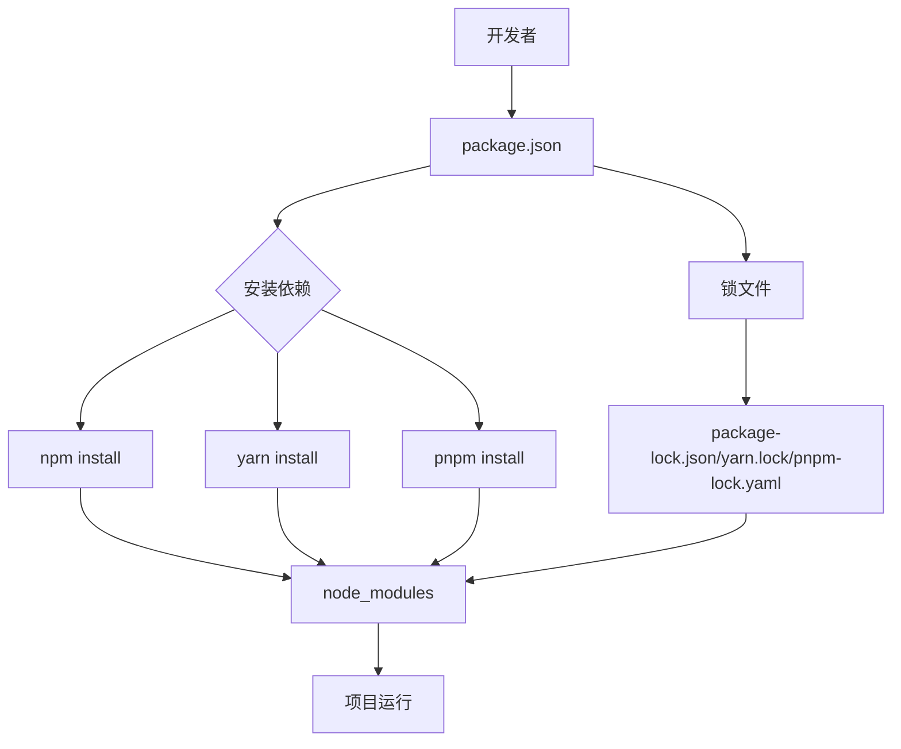

# JavaScript 包管理器

## 什么是包管理器？

包管理器是一种工具，它帮助开发者安装、更新、配置和移除代码包（也称为依赖项或模块）。在JavaScript生态系统中，这些代码包可以是任何人创建的可重用代码库，从简单的工具函数到完整的框架都有。

包管理器解决了以下问题：
- 自动下载和安装第三方库
- 管理不同库之间的依赖关系
- 更新已安装的库
- 确保代码在不同环境中能一致运行

:::tip
想象一下，包管理器就像是一个高效的图书馆管理员，它知道你需要哪些书，哪些书相互依赖，并能自动帮你整理好所有内容。
:::

## 主流JavaScript包管理器

### npm (Node Package Manager)

npm是最广泛使用的JavaScript包管理器，它随Node.js一起安装。

#### 基本使用

初始化新项目：

```bash
npm init
```

安装依赖包：

```bash
# 安装依赖并添加到package.json
npm install lodash

# 安装开发依赖
npm install jest --save-dev
```

#### package.json文件

npm使用`package.json`文件管理项目依赖，这是一个项目的核心配置文件：

```json
{
  "name": "my-awesome-project",
  "version": "1.0.0",
  "description": "A sample project for learning",
  "main": "index.js",
  "scripts": {
    "test": "jest",
    "start": "node index.js"
  },
  "dependencies": {
    "lodash": "^4.17.21"
  },
  "devDependencies": {
    "jest": "^27.0.0"
  }
}
```

### Yarn

Yarn是Facebook开发的替代npm的包管理器，它提供了更快的安装速度和更好的依赖锁定机制。

#### 基本使用

初始化新项目：

```bash
yarn init
```

安装依赖包：

```bash
# 安装依赖
yarn add lodash

# 安装开发依赖
yarn add jest --dev
```

### pnpm

pnpm是较新的包管理器，主要特点是高效的磁盘空间利用率和更快的安装速度。

```bash
# 安装依赖
pnpm add lodash

# 安装开发依赖
pnpm add jest --save-dev
```

## 依赖类型

在JavaScript项目中，依赖主要分为两类：

### 项目依赖(dependencies)

这些是应用在生产环境中运行所需的包。

```bash
npm install react --save
# 或
yarn add react
```

### 开发依赖(devDependencies)

这些是只在开发过程中需要的包，如测试框架、构建工具等。

```bash
npm install jest --save-dev
# 或
yarn add jest --dev
```

## 语义化版本控制

包管理器使用语义化版本控制（Semantic Versioning）来管理依赖版本：

```
主版本号.次版本号.修订号 (例如：2.7.1)
```

- **主版本号**：不兼容的API变更
- **次版本号**：向后兼容的功能新增
- **修订号**：向后兼容的问题修复

在`package.json`中，可以使用特殊符号指定版本范围：

- `^1.2.3`：兼容1.x.x版本，但不低于1.2.3
- `~1.2.3`：兼容1.2.x版本，但不低于1.2.3
- `1.2.3`：精确匹配1.2.3版本

## 锁文件

包管理器使用锁文件确保在不同环境中安装相同版本的依赖：

- npm使用`package-lock.json`
- Yarn使用`yarn.lock`
- pnpm使用`pnpm-lock.yaml`

:::caution
永远不要手动修改锁文件，让包管理器自行管理它！
:::

## 实际应用案例

### 案例1：创建React应用

使用npm创建一个React应用：

```bash
# 使用Create React App
npx create-react-app my-app

cd my-app

# 添加路由库
npm install react-router-dom

# 启动开发服务器
npm start
```

### 案例2：使用Yarn管理一个Node.js后端项目

```bash
# 初始化项目
mkdir my-backend && cd my-backend
yarn init -y

# 安装Express框架
yarn add express

# 安装开发依赖
yarn add nodemon --dev

# 在package.json中添加脚本
# 脚本内容："scripts": { "dev": "nodemon index.js" }

# 运行开发服务器
yarn dev
```

### 案例3：使用npm scripts自动化任务

修改`package.json`添加自定义脚本：

```json
{
  "scripts": {
    "start": "node server.js",
    "dev": "nodemon server.js",
    "build": "webpack --mode production",
    "test": "jest",
    "lint": "eslint src/**/*.js"
  }
}
```

运行脚本：

```bash
npm run build
npm run lint
```

## 包管理的最佳实践

1. **始终使用锁文件**：确保团队成员和生产环境使用相同版本的依赖。

2. **定期更新依赖**：使用`npm outdated`或`yarn outdated`检查过时的依赖。

3. **使用精确的版本号**：对关键依赖使用精确版本号以避免意外破坏。

4. **审计依赖安全性**：
   ```bash
   npm audit
   # 或
   yarn audit
   ```

5. **避免全局安装**：尽量将依赖安装为项目的本地依赖，而非全局安装。

## 包管理工作流程图



## 总结

JavaScript包管理器是现代前端开发工作流的核心组件，它们帮助开发者有效地管理项目依赖，提高开发效率。npm是最广泛使用的包管理器，但Yarn和pnpm等替代方案也提供了更好的性能和额外的特性。

无论你选择哪种包管理器，了解其核心概念如依赖管理、语义化版本控制和锁文件都是非常重要的。熟练使用包管理器，将帮助你更高效地进行JavaScript开发。

## 学习练习

1. 创建一个新的Node.js项目，并使用npm添加至少3个依赖。
2. 尝试切换到不同的包管理器（例如从npm到Yarn），体验它们的差异。
3. 创建自定义npm脚本来自动化项目中的常见任务。
4. 查看一个大型开源项目的`package.json`文件，分析它的依赖结构。
5. 使用`npm audit`或`yarn audit`检查项目中的安全漏洞。

## 进一步阅读

- [npm官方文档](https://docs.npmjs.com/)
- [Yarn官方文档](https://yarnpkg.com/)
- [pnpm官方文档](https://pnpm.io/)
- 《语义化版本控制》规范：[semver.org](https://semver.org/)
- 关于包管理最佳实践的更多信息