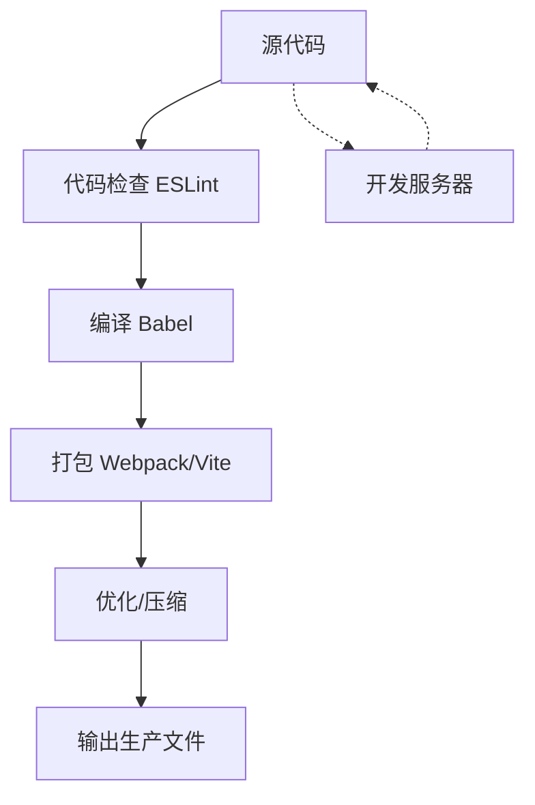

# JavaScript 构建工具

## 什么是JavaScript构建工具？

当你开始学习JavaScript时，可能只是编写一些简单的脚本并直接在浏览器中运行它们。但随着你的项目变得越来越复杂，你会面临各种挑战：代码量增加、依赖管理困难、性能优化问题等。这时，构建工具就派上用场了。

JavaScript构建工具是一系列帮助开发者自动化重复任务、优化代码、管理依赖的工具，它们使现代前端开发更加高效和规范。

:::note 构建工具的作用
- 自动化开发流程
- 转换代码（如ES6转ES5）
- 优化和压缩代码
- 管理依赖
- 提升开发体验
:::

## 为什么需要构建工具？

想象一下，如果没有构建工具，前端开发会是什么样子：

1. 手动管理所有JavaScript文件的引入顺序
2. 无法使用最新的JavaScript语法（浏览器兼容性问题）
3. 代码冗长，没有经过压缩和优化
4. 开发过程中需要手动刷新浏览器查看变化
5. 难以管理第三方依赖库

构建工具解决了这些问题，让开发者可以专注于编写代码，而不是这些繁琐的任务。

## 常见的JavaScript构建工具

### 1. npm - 包管理工具

npm (Node Package Manager) 是JavaScript生态系统中最基础的工具之一，它帮助我们管理项目依赖。

**基本使用示例**：

```bash
# 初始化一个新项目
npm init -y

# 安装依赖
npm install lodash

# 安装开发依赖
npm install --save-dev webpack
```

初始化后，会在项目根目录生成一个`package.json`文件：

```json
{
  "name": "my-project",
  "version": "1.0.0",
  "description": "",
  "main": "index.js",
  "scripts": {
    "test": "echo \"Error: no test specified\" && exit 1"
  },
  "keywords": [],
  "author": "",
  "license": "ISC",
  "dependencies": {
    "lodash": "^4.17.21"
  },
  "devDependencies": {
    "webpack": "^5.74.0"
  }
}
```

### 2. Webpack - 模块打包工具

Webpack是现代JavaScript应用的静态模块打包工具，它将项目所需的所有模块打包成一个或多个bundle。

**基本配置示例**：

```javascript
// webpack.config.js
const path = require('path');

module.exports = {
  entry: './src/index.js',
  output: {
    filename: 'bundle.js',
    path: path.resolve(__dirname, 'dist'),
  },
};
```

**使用Webpack**：

```bash
# 安装webpack及其CLI工具
npm install --save-dev webpack webpack-cli

# 在package.json中添加构建脚本
# "scripts": {
#   "build": "webpack"
# }

# 运行构建
npm run build
```

### 3. Babel - JavaScript编译器

Babel让我们能够使用最新的JavaScript语法，而不用担心浏览器兼容性问题。

**基本配置示例**：

```javascript
// babel.config.js
module.exports = {
  presets: [
    ['@babel/preset-env', {
      targets: {
        browsers: ['last 2 versions']
      }
    }]
  ]
};
```

**使用Babel与Webpack结合**：

```bash
# 安装必要依赖
npm install --save-dev @babel/core @babel/preset-env babel-loader
```

```javascript
// webpack.config.js 配置Babel loader
module.exports = {
  // ...其他配置
  module: {
    rules: [
      {
        test: /\.js$/,
        exclude: /node_modules/,
        use: {
          loader: 'babel-loader',
        }
      }
    ]
  }
};
```

### 4. ESLint - 代码质量工具

ESLint帮助我们检查代码中的问题和强制代码风格一致性。

**基本配置示例**：

```javascript
// .eslintrc.js
module.exports = {
  env: {
    browser: true,
    es2021: true,
  },
  extends: 'eslint:recommended',
  parserOptions: {
    ecmaVersion: 12,
    sourceType: 'module',
  },
  rules: {
    'no-console': 'warn',
    'semi': ['error', 'always'],
  },
};
```

**使用ESLint**：

```bash
# 安装ESLint
npm install --save-dev eslint

# 在package.json中添加脚本
# "scripts": {
#   "lint": "eslint src/"
# }

# 运行检查
npm run lint
```

### 5. Vite - 新一代构建工具

Vite是一个更新、更快的构建工具，特别适合现代前端开发。与Webpack相比，它提供了更快的开发服务器启动和热更新体验。

**基本使用**：

```bash
# 创建一个Vite项目
npm create vite@latest my-vite-app -- --template vanilla

# 进入项目目录并安装依赖
cd my-vite-app
npm install

# 启动开发服务器
npm run dev
```

## 构建工具的工作流程

现代JavaScript项目的构建流程通常包含以下步骤：



## 实际案例：一个简单的项目构建流程

让我们创建一个简单的项目，并使用现代构建工具来管理它：

### 步骤1：初始化项目

```bash
# 创建项目目录
mkdir simple-js-project
cd simple-js-project

# 初始化npm项目
npm init -y

# 创建基本目录结构
mkdir src dist
touch src/index.js src/utils.js
```

### 步骤2：编写基础代码

```javascript
// src/utils.js
export function sum(a, b) {
  return a + b;
}

export function multiply(a, b) {
  return a * b;
}
```

```javascript
// src/index.js
import { sum, multiply } from './utils';

document.addEventListener('DOMContentLoaded', () => {
  const result1 = sum(5, 3);
  const result2 = multiply(5, 3);
  
  const app = document.getElementById('app');
  app.innerHTML = `
    <h1>JavaScript构建工具演示</h1>
    <p>5 + 3 = ${result1}</p>
    <p>5 × 3 = ${result2}</p>
  `;
});
```

### 步骤3：添加HTML文件

```html
<!-- dist/index.html -->
<!DOCTYPE html>
<html lang="en">
<head>
  <meta charset="UTF-8">
  <meta name="viewport" content="width=device-width, initial-scale=1.0">
  <title>JS构建工具演示</title>
</head>
<body>
  <div id="app"></div>
  <script src="bundle.js"></script>
</body>
</html>
```

### 步骤4：设置Webpack和Babel

```bash
# 安装Webpack和相关工具
npm install --save-dev webpack webpack-cli webpack-dev-server

# 安装Babel
npm install --save-dev @babel/core @babel/preset-env babel-loader
```

创建Webpack配置文件：

```javascript
// webpack.config.js
const path = require('path');

module.exports = {
  mode: 'development',
  entry: './src/index.js',
  output: {
    filename: 'bundle.js',
    path: path.resolve(__dirname, 'dist'),
  },
  module: {
    rules: [
      {
        test: /\.js$/,
        exclude: /node_modules/,
        use: {
          loader: 'babel-loader',
          options: {
            presets: ['@babel/preset-env']
          }
        }
      }
    ]
  },
  devServer: {
    static: {
      directory: path.join(__dirname, 'dist'),
    },
    compress: true,
    port: 9000,
  },
};
```

### 步骤5：更新package.json脚本

```json
{
  "scripts": {
    "build": "webpack",
    "start": "webpack serve"
  }
}
```

### 步骤6：运行项目

```bash
# 启动开发服务器
npm start

# 或构建生产版本
npm run build
```

运行`npm start`后，可以在浏览器中访问`http://localhost:9000`查看结果。

:::tip
开发过程中，对源文件的任何更改都会触发自动重新编译，并刷新浏览器，让你立即看到变化！
:::

## 如何选择合适的构建工具？

选择构建工具时，可以考虑以下几点：

1. **项目规模**：小项目可能只需要简单的工具如Vite，大型项目可能需要Webpack的高度可配置性
2. **开发体验**：考虑启动速度、热更新效率等
3. **团队经验**：选择团队熟悉的工具可以减少学习成本
4. **特殊需求**：某些项目可能有特殊的构建需求，需要特定工具支持

## 最佳实践

1. **保持简单**：只引入真正需要的构建工具和配置
2. **利用模板**：使用成熟的项目模板如Create React App、Vue CLI等
3. **关注性能**：定期检查和优化构建性能
4. **版本锁定**：锁定依赖版本，确保构建的一致性
5. **文档化**：记录特殊的构建配置，帮助团队成员理解

## 总结

JavaScript构建工具是现代前端开发不可或缺的一部分。它们帮助我们自动化重复的任务，提高开发效率，优化代码质量和性能。作为初学者，理解这些工具的基本概念和用途对于将来深入学习前端开发非常重要。

随着你的技能提升，可以逐步深入了解每个工具的更多高级特性，构建更复杂、更高效的前端应用。

## 附加资源

- [Webpack官方文档](https://webpack.js.org/)
- [Babel官方文档](https://babeljs.io/)
- [ESLint官方文档](https://eslint.org/)
- [Vite官方文档](https://vitejs.dev/)

## 练习

1. 创建一个简单的HTML/CSS/JS项目，并使用Webpack进行打包
2. 在项目中添加Babel，实验使用ES6+特性并确保它能在旧浏览器中运行
3. 添加ESLint并修复它报告的代码问题
4. 尝试使用Vite创建一个新项目，对比与Webpack的开发体验差异
5. 在构建配置中添加CSS处理功能，如SASS编译和自动添加浏览器前缀