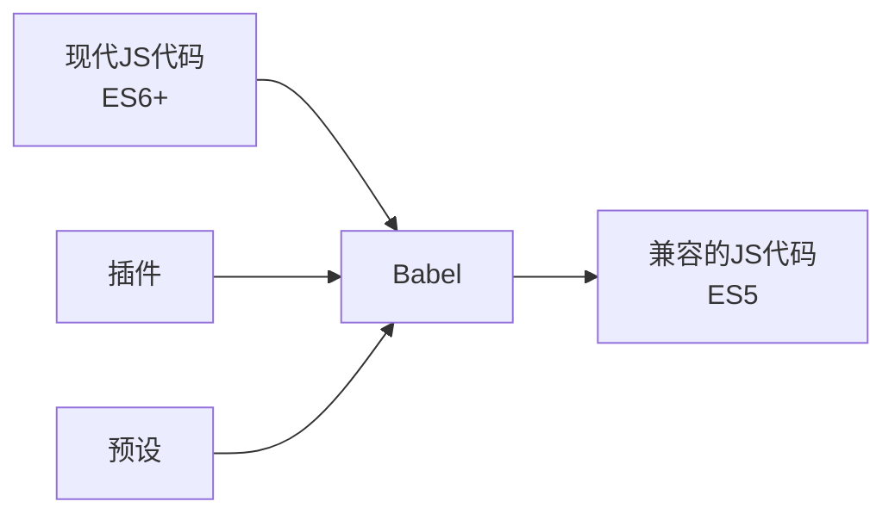

# JavaScript 转译器

## 什么是JavaScript转译器？

JavaScript转译器是一种将新版本的JavaScript代码（如ES6+）转换成向后兼容的旧版本JavaScript代码（通常是ES5）的工具，使得代码可以在不支持最新特性的旧浏览器或环境中运行。

:::note
"转译"(Transpilation)是"源对源编译"的简称，指的是从一种高级语言到另一种高级语言的转换，不同于编译(Compilation)，后者是将高级语言转换为低级语言（如机器代码）。
:::

## 为什么需要JavaScript转译器？

JavaScript作为一种不断发展的语言，每年都会添加新的特性和语法。然而，并不是所有用户的浏览器都能及时更新以支持这些新特性。这就导致了一个两难局面：

1. 使用新特性可以提高开发效率和代码质量
2. 但使用新特性可能会导致代码在旧浏览器中无法运行

转译器解决了这个问题，让开发者能够：

- 使用现代JavaScript语法和特性进行开发
- 确保生成的代码可以在目标环境（如旧版浏览器）中正常工作

## 主流JavaScript转译器

### Babel

Babel是目前最流行的JavaScript转译器，它允许开发者使用最新的JavaScript语法进行开发，然后将代码转译为向后兼容的版本。



#### Babel的基本工作流程：

1. **解析(Parse)**: 将代码字符串解析成抽象语法树(AST)
2. **转换(Transform)**: 通过插件修改AST
3. **生成(Generate)**: 将修改后的AST转换回代码字符串

### SWC

SWC是一个用Rust编写的高性能JavaScript/TypeScript转译器，比Babel快得多。它被Next.js等框架采用，用于加速开发和构建过程。

### TypeScript编译器(tsc)

虽然主要用于将TypeScript转换为JavaScript，但TypeScript编译器也可以作为ES6+到ES5的转译器使用。

## Babel的基本使用

### 安装

要在项目中使用Babel，首先需要安装必要的依赖：

```bash
# 安装核心库和命令行工具
npm install --save-dev @babel/core @babel/cli

# 安装预设（预配置的插件集合）
npm install --save-dev @babel/preset-env
```

### 配置

在项目根目录创建一个名为`.babelrc`或`babel.config.json`的配置文件：

```json
{
  "presets": [
    [
      "@babel/preset-env",
      {
        "targets": {
          "browsers": ["> 1%", "last 2 versions", "not dead"]
        }
      }
    ]
  ]
}
```

这个配置使用了`@babel/preset-env`预设，它会根据指定的目标浏览器自动确定需要进行哪些转换。

### 使用示例

假设我们有一个使用现代JavaScript特性的源文件`app.js`：

```javascript
// 使用ES6箭头函数
const greet = name => {
  return `Hello, ${name}!`; // 模板字符串
};

// 使用ES6类语法
class Person {
  constructor(name) {
    this.name = name;
  }
  
  sayHello() {
    console.log(greet(this.name));
  }
}

// 使用ES6 let和const
let people = [new Person('Alice'), new Person('Bob')];

// 使用ES6数组方法
people.forEach(person => person.sayHello());
```

使用Babel转译：

```bash
npx babel app.js --out-file app.compiled.js
```

转译后的`app.compiled.js`可能如下所示：

```javascript
"use strict";

function _defineProperties(target, props) { /* ... */ }
function _createClass(Constructor, protoProps, staticProps) { /* ... */ }
function _classCallCheck(instance, Constructor) { /* ... */ }

// 箭头函数被转换为普通函数
var greet = function greet(name) {
  // 模板字符串被转换为字符串连接
  return "Hello, ".concat(name, "!");
};

// ES6类被转换为构造函数和原型方法
var Person = /*#__PURE__*/function () {
  function Person(name) {
    _classCallCheck(this, Person);
    this.name = name;
  }

  _createClass(Person, [{
    key: "sayHello",
    value: function sayHello() {
      console.log(greet(this.name));
    }
  }]);

  return Person;
}();

// let被转换为var
var people = [new Person('Alice'), new Person('Bob')];

// 箭头函数被转换为普通函数
people.forEach(function (person) {
  return person.sayHello();
});
```

## 与构建工具集成

在实际开发中，转译器通常与构建工具一起使用，而不是单独运行。

### Babel与Webpack集成

```javascript
// webpack.config.js
module.exports = {
  // ...
  module: {
    rules: [
      {
        test: /\.js$/,
        exclude: /node_modules/,
        use: {
          loader: 'babel-loader',
          options: {
            presets: ['@babel/preset-env']
          }
        }
      }
    ]
  }
  // ...
};
```

### Babel与Vite集成

```javascript
// vite.config.js
import { defineConfig } from 'vite';

export default defineConfig({
  // ...
  plugins: [
    // ...
  ],
  build: {
    target: 'es2015' // 指定转译目标
  }
  // ...
});
```

## 实际应用场景

### 场景1: 使用最新的JavaScript特性

假设你想要使用可选链操作符(`?.`)，这是ES2020引入的特性，但需要支持旧浏览器。

**源代码:**

```javascript
// 使用可选链操作符
function getUserName(user) {
  return user?.profile?.name || 'Anonymous';
}

const user = {
  profile: {
    name: 'John Doe'
  }
};

console.log(getUserName(user)); // "John Doe"
console.log(getUserName(null)); // "Anonymous"
```

**Babel转译后:**

```javascript
// 转译后的代码
function getUserName(user) {
  var _user$profile;
  return (user === null || user === void 0 ? void 0 : (_user$profile = user.profile) === null || _user$profile === void 0 ? void 0 : _user$profile.name) || 'Anonymous';
}

var user = {
  profile: {
    name: 'John Doe'
  }
};

console.log(getUserName(user)); // "John Doe"
console.log(getUserName(null)); // "Anonymous"
```

### 场景2: 使用实验性JavaScript特性

某些提案中的JavaScript特性还未成为标准，但你可以通过Babel插件提前使用它们。

例如，使用装饰器(decorators)：

```bash
npm install --save-dev @babel/plugin-proposal-decorators
```

更新Babel配置：

```json
{
  "presets": ["@babel/preset-env"],
  "plugins": [
    ["@babel/plugin-proposal-decorators", { "legacy": true }]
  ]
}
```

**源代码:**

```javascript
// 使用实验性的装饰器语法
function readonly(target, name, descriptor) {
  descriptor.writable = false;
  return descriptor;
}

class Example {
  @readonly
  test() {
    console.log('test method has been called');
  }
}

const e = new Example();
e.test();
// 尝试修改方法会抛出错误
e.test = () => console.log('modified'); // TypeError: Cannot assign to read only property
```

## Polyfill与转译的区别

转译器只能转换语法(如箭头函数、类语法)，但不能添加缺失的API或方法(如`Promise`或`Array.prototype.includes`)。

为了解决这个问题，我们需要使用polyfill：

```bash
npm install --save core-js regenerator-runtime
```

更新Babel配置：

```json
{
  "presets": [
    ["@babel/preset-env", {
      "useBuiltIns": "usage",
      "corejs": 3
    }]
  ]
}
```

此配置会自动根据代码需要引入必要的polyfill。

## 浏览器兼容性设置

Babel可以根据目标浏览器自动确定需要哪些转换和polyfill。可以在`.browserslistrc`文件或`package.json`的`browserslist`字段中指定：

```
# .browserslistrc
> 1%
last 2 versions
not dead
not ie <= 11
```

这表示支持全球使用量超过1%的浏览器、每个浏览器的最新两个版本、仍在维护的浏览器，且不包括IE11及更早版本。

## 总结

JavaScript转译器是现代Web开发的重要工具，它们让开发者能够：

1. 使用最新的JavaScript语法和特性
2. 确保代码在各种浏览器和环境中兼容
3. 实现更加高效和现代化的代码组织方式

虽然Babel是最常用的转译器，但SWC等新兴工具也在提供更快的转译速度。了解转译器的工作原理和配置方法，对于任何JavaScript开发者来说都是必不可少的技能。

## 练习

1. 安装并配置Babel，将一个使用ES6+特性的JavaScript文件转译为ES5兼容版本
2. 试着使用不同的Babel预设和插件，观察转译结果的变化
3. 集成Babel到Webpack或Vite项目中，设置不同的浏览器兼容性目标
4. 比较使用转译器前后的代码性能和文件大小

## 附加资源

- [Babel官方文档](https://babeljs.io/docs/)
- [SWC官方网站](https://swc.rs/)
- [JavaScript兼容性表](https://kangax.github.io/compat-table/es6/)
- [Browserslist配置指南](https://github.com/browserslist/browserslist)