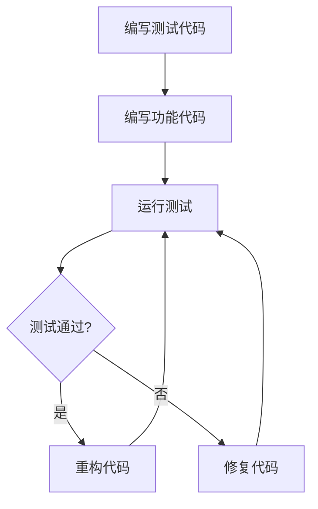

# JavaScript 测试工具

## 什么是JavaScript测试

在软件开发中，测试是确保代码质量的重要环节。JavaScript测试是通过编写测试代码来验证你的JavaScript应用程序按预期工作的过程。良好的测试可以帮助你：

- 发现并修复bug
- 确保代码在更改后仍然按预期工作
- 提高代码质量
- 作为代码的文档，展示如何正确使用代码

:::tip
测试驱动开发(TDD)是一种流行的开发方法，它要求在编写实际代码前先编写测试。这种方法可以帮助你设计更好的代码结构。
:::

## 测试类型

在JavaScript中，常见的测试类型包括：

1. **单元测试**：测试独立的代码单元（通常是函数或类）
2. **集成测试**：测试多个单元组合在一起的功能
3. **端到端测试**：测试整个应用程序流程，模拟真实用户交互

## 常用JavaScript测试工具

### 1. Jest

Jest是Facebook开发的一个流行的JavaScript测试框架，适用于React、Vue、Angular等项目。

**特点：**
- 零配置即可使用
- 内置覆盖率报告
- 快照测试
- 内置模拟功能
- 并行测试运行

**安装：**

```bash
npm install --save-dev jest
```

**简单示例：**

```javascript
// math.js
function sum(a, b) {
  return a + b;
}
module.exports = { sum };

// math.test.js
const { sum } = require('./math');

test('adds 1 + 2 to equal 3', () => {
  expect(sum(1, 2)).toBe(3);
});
```

运行测试：

```bash
npx jest
```

输出结果：

```
PASS  ./math.test.js
✓ adds 1 + 2 to equal 3 (2 ms)

Test Suites: 1 passed, 1 total
Tests:       1 passed, 1 total
Snapshots:   0 total
Time:        0.5 s
```

### 2. Mocha

Mocha是一个灵活的JavaScript测试框架，可以在浏览器和Node.js环境中运行。

**特点：**
- 高度灵活可配置
- 支持多种断言库（如Chai）
- 支持异步测试
- 支持多种报告格式

**安装：**

```bash
npm install --save-dev mocha chai
```

**示例（与Chai一起使用）：**

```javascript
// calculator.js
class Calculator {
  add(a, b) { return a + b; }
  subtract(a, b) { return a - b; }
}
module.exports = Calculator;

// calculator.test.js
const { expect } = require('chai');
const Calculator = require('./calculator');

describe('Calculator', function() {
  let calculator;
  
  beforeEach(function() {
    calculator = new Calculator();
  });
  
  describe('add', function() {
    it('should add two numbers correctly', function() {
      expect(calculator.add(5, 3)).to.equal(8);
    });
  });
  
  describe('subtract', function() {
    it('should subtract second number from first', function() {
      expect(calculator.subtract(5, 3)).to.equal(2);
    });
  });
});
```

### 3. Jasmine

Jasmine是一个行为驱动开发框架，适用于测试JavaScript代码。

**特点：**
- 不依赖于其他JavaScript框架
- 不需要DOM
- 清晰、简单的语法

**安装：**

```bash
npm install --save-dev jasmine
```

**示例：**

```javascript
// player.js
function Player() {
  this.health = 100;
}

Player.prototype.damage = function(points) {
  this.health -= points;
};

// player.spec.js
describe("Player", function() {
  let player;

  beforeEach(function() {
    player = new Player();
  });

  it("should have 100 health when created", function() {
    expect(player.health).toEqual(100);
  });

  it("should take damage", function() {
    player.damage(20);
    expect(player.health).toEqual(80);
  });
});
```

### 4. Cypress

Cypress是一个现代的端到端测试工具，专为现代Web应用设计。

**特点：**
- 实时重载
- 时间旅行（可以看到测试的每个步骤）
- 自动等待
- 调试简单
- 真实浏览器测试

**安装：**

```bash
npm install --save-dev cypress
```

**示例：**

```javascript
// cypress/integration/login.spec.js
describe('Login Form', () => {
  beforeEach(() => {
    cy.visit('/login');
  });

  it('should login with correct credentials', () => {
    cy.get('#username').type('testuser');
    cy.get('#password').type('password123');
    cy.get('#login-button').click();
    
    // 验证登录成功后的页面元素
    cy.url().should('include', '/dashboard');
    cy.get('.welcome-message').should('contain', 'Welcome, testuser');
  });

  it('should show error with incorrect credentials', () => {
    cy.get('#username').type('wronguser');
    cy.get('#password').type('wrongpass');
    cy.get('#login-button').click();
    
    // 验证错误消息
    cy.get('.error-message').should('be.visible');
    cy.get('.error-message').should('contain', 'Invalid username or password');
  });
});
```

## 如何选择测试工具

选择测试工具时，可以考虑以下因素：

1. **项目类型**：React项目可能更适合Jest，而通用JavaScript项目可能更适合Mocha或Jasmine
2. **团队经验**：团队已有的经验会影响工具选择
3. **集成需求**：考虑与CI/CD系统的集成
4. **测试类型**：单元测试、集成测试、端到端测试的需求

## 测试最佳实践

1. **测试独立性**：每个测试应该独立于其他测试
2. **测试一个概念**：每个测试应该只测试一个概念
3. **使用描述性命名**：测试名称应清晰表达测试内容
4. **设置与拆卸**：正确使用`beforeEach`和`afterEach`等钩子
5. **避免测试私有实现细节**：测试应该关注公共接口
6. **保持测试简单**：复杂测试难以维护
7. **测试覆盖率**：尽量提高覆盖率，但不要为了覆盖率而覆盖

## 实际案例：测试一个购物车模块

让我们看一个实际案例，使用Jest测试一个简单的购物车模块：

```javascript
// cart.js
class Cart {
  constructor() {
    this.items = [];
  }

  addItem(item) {
    const existingItem = this.items.find(i => i.id === item.id);
    if (existingItem) {
      existingItem.quantity += item.quantity;
    } else {
      this.items.push({ ...item });
    }
  }

  removeItem(id) {
    this.items = this.items.filter(item => item.id !== id);
  }

  getTotal() {
    return this.items.reduce((total, item) => total + (item.price * item.quantity), 0);
  }
}

module.exports = Cart;

// cart.test.js
const Cart = require('./cart');

describe('Shopping Cart', () => {
  let cart;

  beforeEach(() => {
    cart = new Cart();
  });

  test('should start empty', () => {
    expect(cart.items.length).toBe(0);
  });

  test('should add a new item to the cart', () => {
    const item = { id: 1, name: 'Product 1', price: 10, quantity: 1 };
    cart.addItem(item);
    
    expect(cart.items.length).toBe(1);
    expect(cart.items[0]).toEqual(item);
  });

  test('should increase quantity when adding existing item', () => {
    const item = { id: 1, name: 'Product 1', price: 10, quantity: 1 };
    cart.addItem(item);
    cart.addItem({ ...item, quantity: 2 });
    
    expect(cart.items.length).toBe(1);
    expect(cart.items[0].quantity).toBe(3);
  });

  test('should remove item from cart', () => {
    cart.addItem({ id: 1, name: 'Product 1', price: 10, quantity: 1 });
    cart.addItem({ id: 2, name: 'Product 2', price: 20, quantity: 1 });
    
    cart.removeItem(1);
    
    expect(cart.items.length).toBe(1);
    expect(cart.items[0].id).toBe(2);
  });

  test('should calculate total correctly', () => {
    cart.addItem({ id: 1, name: 'Product 1', price: 10, quantity: 2 }); // 20
    cart.addItem({ id: 2, name: 'Product 2', price: 15, quantity: 3 }); // 45
    
    expect(cart.getTotal()).toBe(65);
  });
});
```

## 测试流程图

以下是一个简单的测试流程图，展示了测试在开发流程中的位置：



## 总结

JavaScript测试工具对于确保代码质量至关重要。通过学习和使用这些工具，你可以：

- 确保代码按预期工作
- 提高代码质量并减少bug
- 增强重构代码的信心
- 为代码提供活的文档

随着项目规模的增长，良好的测试实践将变得更加重要。从简单的单元测试开始，逐步扩展到集成测试和端到端测试，将帮助你建立稳固的项目基础。

## 进一步学习的资源

- Jest官方文档：https://jestjs.io/docs/getting-started
- Mocha官方文档：https://mochajs.org/
- Cypress官方文档：https://docs.cypress.io/

## 练习

1. 为一个简单的计算器函数编写Jest测试，实现加、减、乘、除功能。
2. 使用Cypress创建一个简单的登录表单测试，包括成功和失败的情况。
3. 为以下函数编写测试，考虑边界情况：
   ```javascript
   function filterPositiveNumbers(array) {
     return array.filter(num => typeof num === 'number' && num > 0);
   }
   ```