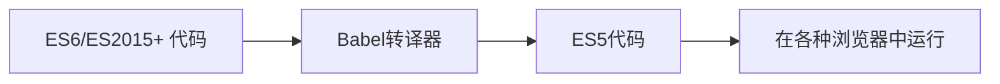

# JavaScript ES6概述

## 什么是ES6？

ES6，全称 ECMAScript 2015，是JavaScript语言的一个重要版本更新，于2015年发布。它引入了许多新特性和语法改进，使JavaScript的开发体验更加现代化和强大。这些新特性极大地改善了代码的可读性、简洁性和功能性，成为了现代JavaScript开发的基础。

:::note
**ECMA**Script是JavaScript的标准规范。ES6是该规范的第6个版本，正式名称是ECMAScript 2015。之后的版本按年份命名，如ES2016、ES2017等。
:::

## ES6的主要特性

让我们来了解ES6引入的一些重要特性：

### 1. let 和 const 关键字

ES6引入了`let`和`const`来声明变量，它们提供了比`var`更好的作用域控制。

- `let`声明的变量可以重新赋值，但不能在同一作用域内重复声明
- `const`声明的是常量，一旦赋值就不能更改（对于对象和数组，不能改变引用，但可以修改其内容）

```javascript
// 使用var的问题
var x = 1;
{
  var x = 2;  // 同一个变量
}
console.log(x);  // 输出: 2

// 使用let
let y = 1;
{
  let y = 2;  // 不同的变量，块级作用域
}
console.log(y);  // 输出: 1

// 使用const
const PI = 3.14159;
// PI = 3;  // 错误：不能重新赋值给常量
```

### 2. 箭头函数

箭头函数提供了一种更简洁的函数语法，并且自动绑定了`this`值。

```javascript
// 传统函数
function add(a, b) {
  return a + b;
}

// 箭头函数
const add = (a, b) => a + b;

// 带有this的例子
const person = {
  name: 'Alice',
  greetTraditional: function() {
    setTimeout(function() {
      console.log('Hello, ' + this.name); // this不指向person
    }, 1000);
  },
  greetArrow: function() {
    setTimeout(() => {
      console.log('Hello, ' + this.name); // this正确指向person
    }, 1000);
  }
};

person.greetTraditional(); // 输出: "Hello, undefined"
person.greetArrow(); // 输出: "Hello, Alice"
```

### 3. 模板字符串

模板字符串使用反引号（`` ` ``）定义，它允许多行字符串和嵌入表达式。

```javascript
const name = 'Alice';
const age = 25;

// 传统字符串拼接
const greeting1 = 'Hello, my name is ' + name + ' and I am ' + age + ' years old.';

// 模板字符串
const greeting2 = `Hello, my name is ${name} and I am ${age} years old.`;

// 多行字符串
const multiLine = `这是第一行
这是第二行
这是第三行`;

console.log(greeting2);
console.log(multiLine);
```

### 4. 解构赋值

解构赋值允许我们从数组或对象中提取值并赋给变量。

```javascript
// 数组解构
const [first, second, ...rest] = [1, 2, 3, 4, 5];
console.log(first);  // 输出: 1
console.log(second); // 输出: 2
console.log(rest);   // 输出: [3, 4, 5]

// 对象解构
const person = {
  name: 'Bob',
  age: 30,
  city: 'New York'
};

const { name, age, city = 'Unknown' } = person;
console.log(name); // 输出: "Bob"
console.log(age);  // 输出: 30
console.log(city); // 输出: "New York"

// 函数参数解构
function printPersonInfo({ name, age }) {
  console.log(`${name} is ${age} years old.`);
}

printPersonInfo(person); // 输出: "Bob is 30 years old."
```

### 5. 默认参数

ES6允许为函数参数设置默认值。

```javascript
function greet(name = 'Guest', greeting = 'Hello') {
  return `${greeting}, ${name}!`;
}

console.log(greet());                   // 输出: "Hello, Guest!"
console.log(greet('Alice'));           // 输出: "Hello, Alice!"
console.log(greet('Bob', 'Welcome'));  // 输出: "Welcome, Bob!"
```

### 6. 扩展运算符

扩展运算符（`...`）可以展开数组或对象。

```javascript
// 数组合并
const arr1 = [1, 2, 3];
const arr2 = [4, 5, 6];
const combined = [...arr1, ...arr2];
console.log(combined); // 输出: [1, 2, 3, 4, 5, 6]

// 复制数组
const original = [1, 2, 3];
const copy = [...original];
copy.push(4);
console.log(original); // 输出: [1, 2, 3]
console.log(copy);     // 输出: [1, 2, 3, 4]

// 对象合并
const obj1 = { a: 1, b: 2 };
const obj2 = { c: 3, d: 4 };
const mergedObj = { ...obj1, ...obj2 };
console.log(mergedObj); // 输出: {a: 1, b: 2, c: 3, d: 4}
```

### 7. 类(Class)

ES6引入了类语法，使面向对象编程更加简洁。

```javascript
class Person {
  constructor(name, age) {
    this.name = name;
    this.age = age;
  }
  
  sayHello() {
    return `Hello, my name is ${this.name}`;
  }
  
  get info() {
    return `${this.name}, ${this.age} years old`;
  }
  
  static create(name, age) {
    return new Person(name, age);
  }
}

class Student extends Person {
  constructor(name, age, grade) {
    super(name, age);
    this.grade = grade;
  }
  
  sayHello() {
    return `${super.sayHello()} and I'm in grade ${this.grade}`;
  }
}

const alice = new Person('Alice', 25);
console.log(alice.sayHello()); // 输出: "Hello, my name is Alice"
console.log(alice.info);       // 输出: "Alice, 25 years old"

const bob = Student.create('Bob', 15, 9);
console.log(bob.sayHello());   // 输出: "Hello, my name is Bob and I'm in grade 9"
```

### 8. Promise

Promise 提供了一种处理异步操作的更优雅方式，避免了回调地狱。

```javascript
// 创建一个Promise
const fetchData = () => {
  return new Promise((resolve, reject) => {
    setTimeout(() => {
      const success = Math.random() > 0.3; // 模拟70%成功率
      
      if (success) {
        resolve({ id: 1, name: 'Data Item' });
      } else {
        reject('Failed to fetch data');
      }
    }, 1000);
  });
};

// 使用Promise
fetchData()
  .then(data => {
    console.log('Success:', data);
    return data.id; 
  })
  .then(id => {
    console.log('ID:', id);
  })
  .catch(error => {
    console.error('Error:', error);
  })
  .finally(() => {
    console.log('Operation completed');
  });
```

### 9. 模块(Modules)

ES6引入了官方的模块系统，使用`import`和`export`来共享代码。

```javascript
// math.js
export const PI = 3.14159;

export function add(a, b) {
  return a + b;
}

export function multiply(a, b) {
  return a * b;
}

const subtract = (a, b) => a - b;
export default subtract;

// app.js
import subtract, { PI, add, multiply as mult } from './math.js';

console.log(PI);              // 输出: 3.14159
console.log(add(2, 3));       // 输出: 5
console.log(mult(2, 3));      // 输出: 6
console.log(subtract(5, 2));  // 输出: 3
```

## 实际应用案例

### 案例1：用户管理系统

这个例子展示了如何使用ES6特性构建一个简单的用户管理系统：

```javascript
class UserManager {
  constructor() {
    this.users = [];
  }
  
  addUser({ name, email, role = 'user' }) {
    const id = Date.now();
    const newUser = { id, name, email, role };
    this.users = [...this.users, newUser];
    return newUser;
  }
  
  deleteUser(id) {
    this.users = this.users.filter(user => user.id !== id);
  }
  
  updateUser(id, updates) {
    this.users = this.users.map(user => 
      user.id === id ? { ...user, ...updates } : user
    );
  }
  
  findUserByEmail(email) {
    return this.users.find(user => user.email === email);
  }
  
  get administrators() {
    return this.users.filter(user => user.role === 'admin');
  }
}

// 使用
const manager = new UserManager();

manager.addUser({ name: 'Alice', email: 'alice@example.com' });
manager.addUser({ name: 'Bob', email: 'bob@example.com', role: 'admin' });

const bob = manager.findUserByEmail('bob@example.com');
console.log(bob); // {id: ..., name: 'Bob', email: 'bob@example.com', role: 'admin'}

manager.updateUser(bob.id, { name: 'Robert' });

console.log(manager.administrators); // [{id: ..., name: 'Robert', email: 'bob@example.com', role: 'admin'}]
```

### 案例2：异步数据获取与处理

这个例子展示如何使用Promise和async/await处理异步操作：

```javascript
// 模拟API调用
function fetchUserData(userId) {
  return new Promise((resolve, reject) => {
    setTimeout(() => {
      if (userId > 0) {
        resolve({
          id: userId,
          name: `User ${userId}`,
          email: `user${userId}@example.com`
        });
      } else {
        reject(new Error('Invalid user ID'));
      }
    }, 1000);
  });
}

function fetchUserPosts(userId) {
  return new Promise((resolve) => {
    setTimeout(() => {
      resolve([
        { id: 1, title: `Post 1 by User ${userId}` },
        { id: 2, title: `Post 2 by User ${userId}` }
      ]);
    }, 800);
  });
}

// 使用Promise链
function getUserData(userId) {
  return fetchUserData(userId)
    .then(user => {
      return fetchUserPosts(user.id)
        .then(posts => {
          return { ...user, posts };
        });
    });
}

// 使用async/await (ES2017, 但通常与ES6一起讨论)
async function getUserDataAsync(userId) {
  try {
    const user = await fetchUserData(userId);
    const posts = await fetchUserPosts(user.id);
    return { ...user, posts };
  } catch (error) {
    console.error('Error fetching data:', error);
    throw error;
  }
}

// 使用
getUserData(1)
  .then(data => console.log('Promise chain result:', data))
  .catch(error => console.error('Error:', error));

getUserDataAsync(2)
  .then(data => console.log('Async/await result:', data))
  .catch(error => console.error('Error:', error));
```

## ES6兼容性与转译

并非所有浏览器都完全支持ES6特性，特别是旧版浏览器。为了确保代码在各种环境中运行，开发者通常使用Babel等工具将ES6代码转译为ES5。



## 总结

ES6是JavaScript的一个重大更新，它引入了许多强大的特性，使JavaScript开发变得更加现代化和高效：

- `let`和`const`提供了更好的变量声明方式
- 箭头函数简化了函数定义并解决了`this`绑定问题
- 模板字符串使字符串操作更加灵活
- 解构赋值使数据提取更简洁
- 类语法提供了更清晰的面向对象编程方式
- Promise改进了异步编程体验
- 模块系统使代码组织更加规范

掌握ES6特性是成为现代JavaScript开发者的必备技能，这些知识将帮助你更高效地编写代码并理解现代JavaScript库和框架。

## 练习与进一步学习

### 练习：

1. 使用箭头函数、模板字符串和默认参数重写以下函数：
   ```javascript
   function formatName(firstName, lastName, title) {
     if (!title) title = "Ms./Mr.";
     return title + " " + firstName + " " + lastName;
   }
   ```

2. 使用解构赋值从以下对象中提取name和courses数据：
   ```javascript
   const student = {
     id: 101,
     name: 'John Doe',
     age: 20,
     courses: ['Math', 'Physics', 'English']
   };
   ```

3. 创建一个名为`Counter`的类，它可以计数、重置计数器，并且有一个显示当前计数的方法。

### 推荐资源：

- [MDN Web Docs](https://developer.mozilla.org/en-US/docs/Web/JavaScript/Reference) - 详尽的JavaScript参考文档
- [ES6 Features](https://es6-features.org/) - ES6特性列表和示例
- [Babel文档](https://babeljs.io/docs/) - 了解如何转译ES6代码
- [JavaScript.info](https://javascript.info/) - 现代JavaScript教程

:::tip
实践是掌握ES6的最佳方式！尝试在你的项目中应用这些特性，先从小型项目开始，逐步在更复杂的应用中使用更多ES6特性。
:::