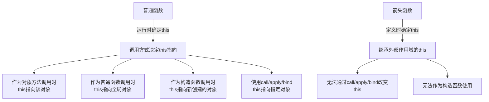

# JavaScript 箭头函数详解

## 什么是箭头函数？

箭头函数（Arrow Function）是ECMAScript 6（ES6）引入的一种更为简洁的函数定义语法，使用 `=>` 箭头符号来定义函数。它不仅使代码更加简洁，还解决了JavaScript中常见的与`this`关键字相关的一些问题。

对于频繁使用匿名函数的场景（如回调函数、数组方法等），箭头函数提供了一种更为优雅的编写方式。

## 基本语法

下面是箭头函数的基本语法：

```javascript
// 传统函数表达式
const traditionalFunc = function(param) {
  return param * 2;
};

// 箭头函数 
const arrowFunc = (param) => {
  return param * 2;
};

// 更简洁的箭头函数（单一参数可省略括号）
const simpleArrowFunc = param => {
  return param * 2;
};

// 函数体只有一条返回语句时，可以省略大括号和return
const simplestArrowFunc = param => param * 2;

console.log(traditionalFunc(5)); // 输出: 10
console.log(arrowFunc(5)); // 输出: 10
console.log(simpleArrowFunc(5)); // 输出: 10
console.log(simplestArrowFunc(5)); // 输出: 10
```

## 箭头函数的简化规则

箭头函数相比传统函数提供了多种简化写法：

### 1. 参数简化

```javascript
// 无参数时，需要使用空括号
const sayHello = () => {
  console.log("Hello!");
};

// 单个参数时，可以省略括号
const double = x => x * 2;

// 多个参数时，必须使用括号
const add = (x, y) => x + y;
```

### 2. 函数体简化

```javascript
// 单行函数体，可以省略大括号和return
const square = x => x * x;

// 等价于
const squareLong = x => {
  return x * x;
};

// 多行函数体必须使用大括号和explicit return
const complexCalc = x => {
  const step1 = x * 2;
  const step2 = step1 + 3;
  return step2;
};
```

### 3. 返回对象字面量

当我们要返回一个对象字面量时，需要用括号将对象字面量括起来，以避免与函数体的大括号混淆：

```javascript
// 错误写法 - JavaScript会把花括号当作函数体
const getPerson = name => { name: name };  // Syntax Error!

// 正确写法 - 用括号包裹对象字面量
const getPerson = name => ({ name: name });

console.log(getPerson("Alice"));  // 输出: { name: "Alice" }
```

## 箭头函数的特性

箭头函数不只是传统函数的语法糖，它在行为上也有一些重要的区别：

### 1. 没有自己的`this`

箭头函数不绑定自己的`this`值，而是继承自外围作用域的`this`值。这解决了传统函数中`this`指向经常变化的问题。

```javascript
// 传统函数中的this问题
const person = {
  name: "Alice",
  hobbies: ["reading", "swimming", "coding"],
  showHobbies: function() {
    this.hobbies.forEach(function(hobby) {
      // 这里的this不再指向person
      console.log(this.name + " likes " + hobby);  // this.name是undefined
    });
  }
};

// 使用箭头函数解决
const betterPerson = {
  name: "Bob",
  hobbies: ["gaming", "cooking", "traveling"],
  showHobbies: function() {
    this.hobbies.forEach(hobby => {
      // 箭头函数中的this继承自showHobbies中的this(指向betterPerson)
      console.log(this.name + " likes " + hobby);  // 正确输出
    });
  }
};

person.showHobbies();  // 输出三次: "undefined likes [hobby]"
betterPerson.showHobbies();  // 输出: "Bob likes gaming", "Bob likes cooking", "Bob likes traveling"
```

:::note
箭头函数中的`this`是词法作用域的，它在定义时就确定了，而不是在运行时确定。
:::

### 2. 不能用作构造函数

箭头函数不能用作构造函数，因为它没有自己的`this`，无法通过`new`关键字调用：

```javascript
const Person = (name) => {
  this.name = name;  // 这里的this不会指向新创建的对象
};

// 以下代码会报错
// const alice = new Person("Alice");  // TypeError: Person is not a constructor
```

### 3. 没有arguments对象

箭头函数没有自己的`arguments`对象，但可以访问外围函数的`arguments`对象：

```javascript
function outer() {
  // 传统函数有arguments对象
  console.log("Outer arguments:", arguments);
  
  const inner = () => {
    // 箭头函数没有自己的arguments
    // 但可以访问外围函数的arguments
    console.log("Inner arguments from outer:", arguments);
  };
  
  inner();
}

outer(1, 2, 3);  
// 输出:
// Outer arguments: [1, 2, 3]
// Inner arguments from outer: [1, 2, 3]
```

如果需要在箭头函数中访问参数，可以使用剩余参数（rest parameters）:

```javascript
const sum = (...args) => {
  return args.reduce((total, num) => total + num, 0);
};

console.log(sum(1, 2, 3, 4));  // 输出: 10
```

### 4. 不能使用yield命令

箭头函数不能用作Generator函数，不能使用`yield`关键字。

## 实际应用场景

### 1. 数组方法回调

箭头函数最常见的应用场景是作为数组方法的回调函数：

```javascript
const numbers = [1, 2, 3, 4, 5];

// 使用map转换数组
const doubled = numbers.map(num => num * 2);
console.log(doubled);  // 输出: [2, 4, 6, 8, 10]

// 使用filter过滤数组
const evenNumbers = numbers.filter(num => num % 2 === 0);
console.log(evenNumbers);  // 输出: [2, 4]

// 使用reduce累加计算
const sum = numbers.reduce((total, num) => total + num, 0);
console.log(sum);  // 输出: 15
```

### 2. 解决回调函数中的this问题

```javascript
// 计时器中保持正确的this指向
class Timer {
  constructor(seconds) {
    this.seconds = seconds;
    this.remainingTime = seconds;
  }
  
  start() {
    console.log(`Starting countdown from ${this.seconds} seconds...`);
    
    // 使用箭头函数保持this指向Timer实例
    const countdown = setInterval(() => {
      this.remainingTime--;
      console.log(`${this.remainingTime} seconds remaining`);
      
      if (this.remainingTime <= 0) {
        console.log("Time's up!");
        clearInterval(countdown);
      }
    }, 1000);
  }
}

const timer = new Timer(5);
timer.start();
```

### 3. 简化Promise链

箭头函数可以让Promise链更清晰：

```javascript
// 不使用箭头函数
fetchUserData("user123")
  .then(function(userData) {
    return processUserData(userData);
  })
  .then(function(processedData) {
    return renderUserProfile(processedData);
  })
  .catch(function(error) {
    console.error("Error:", error);
  });

// 使用箭头函数
fetchUserData("user123")
  .then(userData => processUserData(userData))
  .then(processedData => renderUserProfile(processedData))
  .catch(error => console.error("Error:", error));

// 进一步简化
fetchUserData("user123")
  .then(userData => processUserData(userData))
  .then(renderUserProfile)
  .catch(error => console.error("Error:", error));
```

### 4. 即时调用函数表达式(IIFE)

```javascript
// 传统IIFE
(function(message) {
  console.log(message);
})("Hello from IIFE!");

// 箭头函数IIFE
((message) => {
  console.log(message);
})("Hello from Arrow IIFE!");
```

## 何时不该使用箭头函数

虽然箭头函数很强大，但并不是所有场合都适合使用：

1. **对象方法**: 当方法需要通过`this`引用其所属对象时，不应使用箭头函数：

```javascript
// 错误用法
const person = {
  name: "Alice",
  greet: () => {
    console.log(`Hello, my name is ${this.name}`);  // this不指向person
  }
};
person.greet();  // 输出: Hello, my name is undefined

// 正确用法
const betterPerson = {
  name: "Alice",
  greet() {  // 简写语法，等同于greet: function() {}
    console.log(`Hello, my name is ${this.name}`);
  }
};
betterPerson.greet();  // 输出: Hello, my name is Alice
```

2. **构造函数**：如前所述，箭头函数不能作为构造函数使用。

3. **事件处理器**：有些事件处理器需要访问`this`指向的DOM元素：

```javascript
// 错误用法 - this不会指向按钮
button.addEventListener('click', () => {
  this.classList.toggle('active');  // 这里的this不是button
});

// 正确用法
button.addEventListener('click', function() {
  this.classList.toggle('active');  // 这里的this是button
});
```

:::caution
当函数需要动态的`this`绑定（如对象方法、DOM事件处理器等）时，不要使用箭头函数！
:::

## 箭头函数与this的图解



## 总结

箭头函数是ES6引入的重要特性之一，它提供了更简洁的语法，同时解决了JavaScript中`this`关键字的一些常见问题。箭头函数的主要优点包括：

1. **简洁的语法**：省略了function关键字，在参数和函数体方面都有简化规则。
2. **词法作用域的this**：箭头函数不绑定自己的this，而是继承自外围作用域。
3. **特别适合用作回调函数**：尤其是在数组方法、Promise链和事件处理中。

但要注意箭头函数也有一些限制：
1. 没有自己的`this`绑定（这既是优点也是限制）
2. 不能用作构造函数
3. 没有`arguments`对象
4. 不能用作对象方法（当需要引用对象自身时）

了解箭头函数的这些特性和限制，可以帮助我们在适当的场景中使用它，从而编写更简洁、更易维护的JavaScript代码。

## 练习

1. 将下列传统函数转换为箭头函数：
   ```javascript
   function double(x) {
     return x * 2;
   }
   
   const numbers = [1, 2, 3];
   const doubledNumbers = numbers.map(function(num) {
     return num * 2;
   });
   ```

2. 修复下面有this问题的代码，使用箭头函数：
   ```javascript
   const counter = {
     count: 0,
     start: function() {
       setInterval(function() {
         this.count++;  // 这里的this不指向counter
         console.log(this.count);
       }, 1000);
     }
   };
   ```

3. 尝试创建一个能够正确工作的购物车对象，使用箭头函数处理数组操作：
   ```javascript
   const shoppingCart = {
     items: [],
     total: 0,
     addItem(name, price, quantity) {
       // 使用箭头函数实现
     },
     calculateTotal() {
       // 使用箭头函数实现
     },
     displayCart() {
       // 使用箭头函数实现
     }
   };
   ```

## 进一步学习资源

- MDN Web文档: [箭头函数](https://developer.mozilla.org/zh-CN/docs/Web/JavaScript/Reference/Functions/Arrow_functions)
- ES6 标准: [箭头函数](https://262.ecma-international.org/6.0/#sec-arrow-function-definitions)
- 现代 JavaScript 教程: [箭头函数](https://zh.javascript.info/arrow-functions)

通过掌握箭头函数，你已经向成为现代JavaScript开发者迈进了一大步！继续练习和应用这些概念，很快你就会发现箭头函数已成为你日常编程的得力助手。