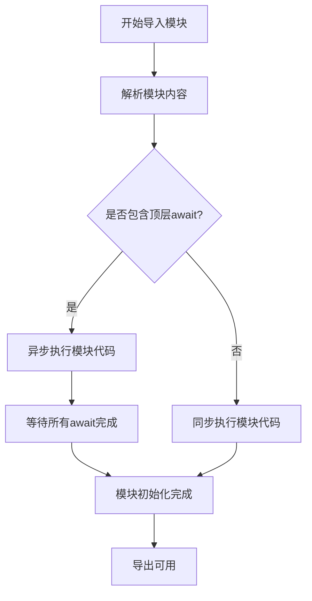

# JavaScript 顶层Await

## 什么是顶层Await？

顶层await（Top-level await）是JavaScript的一项现代特性，允许在ES模块的**顶层作用域**中直接使用`await`关键字，而不必将其包裹在`async`函数中。这一特性于ES2022正式纳入JavaScript语言规范，为处理模块导入和初始化中的异步操作提供了更优雅的解决方案。

在顶层await出现之前，`await`关键字只能在标记为`async`的函数内部使用：

```javascript
// 旧方式：必须在async函数中使用await
async function initialize() {
  const response = await fetch('https://api.example.com/data');
  const data = await response.json();
  return data;
}

// 然后调用这个函数
initialize().then(data => {
  // 使用数据
  console.log(data);
});
```

而有了顶层await，我们可以在模块顶层直接使用`await`：

```javascript
// 直接在模块顶层使用await
const response = await fetch('https://api.example.com/data');
const data = await response.json();
console.log(data);

// 可以导出这些数据供其他模块使用
export { data };
```

:::note
重要提示：顶层await仅在ES模块中可用，不能在常规脚本或CommonJS模块中使用。
:::

## 顶层Await的工作原理

要理解顶层await，我们需要先了解模块系统的工作方式。当JavaScript引擎导入一个模块时：

1. 首先解析模块的内容
2. 执行模块代码
3. 在代码执行完毕后，模块被认为已初始化完成，其导出可供其他模块使用

当模块中包含顶层await时，整个过程发生了变化：



关键点是：**含有顶层await的模块会导致导入该模块的其他模块等待，直到顶层await执行完毕**。

## 顶层Await的使用场景

### 1. 动态依赖导入

使用顶层await可以基于条件动态导入模块：

```javascript
// 根据用户配置或运行环境动态决定加载哪个模块
let translator;
if (navigator.language.startsWith('zh')) {
  translator = await import('./translations/zh.js');
} else {
  translator = await import('./translations/en.js');
}

export const translate = translator.translate;
```

### 2. 资源初始化

可以在模块初始化时异步加载必要资源：

```javascript
// 初始化数据库连接
const dbConnection = await initializeDatabaseConnection();
export { dbConnection };

// 在其他模块中使用时，已确保连接已建立
// import { dbConnection } from './database.js';
```

### 3. 条件导出

根据异步操作结果决定导出不同的内容：

```javascript
// 检查用户权限
const userPermissions = await fetchUserPermissions();

// 基于权限导出不同的功能
export const features = userPermissions.isAdmin
  ? { admin: true, edit: true, view: true }
  : { admin: false, edit: false, view: true };
```

### 4. 加载初始配置

从远程服务器或本地存储加载配置：

```javascript
// 从配置服务器加载应用配置
const response = await fetch('/api/config');
const config = await response.json();

// 导出配置供整个应用使用
export const apiEndpoint = config.apiEndpoint;
export const featureFlags = config.features;
export const theme = config.theme;
```

## 实际案例分析

### 案例一：数据可视化应用

假设我们正在构建一个数据可视化应用，需要在应用启动时加载初始数据：

```javascript
// dataModule.js - 使用顶层await加载数据
const response = await fetch('https://api.example.com/initialData');

if (!response.ok) {
  throw new Error(`Failed to load initial data: ${response.status}`);
}

export const initialData = await response.json();
export const lastUpdated = new Date().toISOString();

// 对数据进行预处理
export const processedData = initialData.map(item => ({
  ...item,
  value: item.value * 1.5, // 应用某些转换
  category: item.score > 75 ? 'High' : 'Low'
}));
```

在另一个模块中使用这些数据：

```javascript
// visualizer.js
import { processedData, lastUpdated } from './dataModule.js';

// 当该模块执行时，dataModule.js中的所有await已完成
console.log(`Displaying data last updated at: ${lastUpdated}`);
renderCharts(processedData); // 直接使用已准备好的数据

function renderCharts(data) {
  // 渲染图表的代码...
  console.log(`Rendering charts with ${data.length} data points`);
}
```

### 案例二：认证模块

创建一个身份验证模块，在模块加载时检查用户是否已登录：

```javascript
// auth.js
// 检查本地存储中的认证令牌
const token = localStorage.getItem('authToken');
let currentUser = null;

if (token) {
  try {
    // 验证令牌有效性
    const response = await fetch('/api/validateToken', {
      headers: { 'Authorization': `Bearer ${token}` }
    });
    
    if (response.ok) {
      currentUser = await response.json();
      console.log('用户已验证:', currentUser.username);
    } else {
      // 令牌无效，清除本地存储
      localStorage.removeItem('authToken');
      console.warn('无效的认证令牌，已移除');
    }
  } catch (error) {
    console.error('验证令牌时出错:', error);
  }
}

export const isAuthenticated = !!currentUser;
export const user = currentUser;

export async function login(username, password) {
  // 登录逻辑...
}

export async function logout() {
  // 登出逻辑...
}
```

在应用的主模块中：

```javascript
// app.js
import { isAuthenticated, user } from './auth.js';

// 根据认证状态渲染不同内容
if (isAuthenticated) {
  renderDashboard(user);
} else {
  renderLoginScreen();
}
```

## 注意事项与最佳实践

使用顶层await时应注意以下几点：

### 1. 模块导入阻塞

当一个模块使用顶层await时，导入该模块的所有其他模块将等待异步操作完成后才能执行。这可能会导致应用启动变慢。

```javascript
// 这种模式可能导致性能问题
import { data } from './module-with-top-level-await.js';
// 这里的代码要等待上面的模块完全初始化后才会执行
```

:::caution
在应用的关键路径上过度使用顶层await可能会导致性能下降。只在确实需要等待的场景使用它。
:::

### 2. 错误处理

使用顶层await时，错误处理非常重要：

```javascript
// 推荐的错误处理方式
let config;
try {
  const response = await fetch('/api/config');
  if (!response.ok) {
    throw new Error(`Failed to load config: ${response.status}`);
  }
  config = await response.json();
} catch (error) {
  console.error('Config loading failed, using defaults:', error);
  config = { theme: 'light', apiUrl: 'https://fallback-api.example.com' };
}

export { config };
```

### 3. 替代方案

在某些场景下，可以考虑替代顶层await的方案：

```javascript
// 不阻塞模块初始化的替代方案
// 导出一个promise，而不是直接等待其完成
export const dataPromise = fetch('/api/data').then(r => r.json());

// 使用时
// import { dataPromise } from './data.js';
// dataPromise.then(data => {
//   // 使用数据
// });
```

### 4. 浏览器兼容性

顶层await是比较新的JavaScript特性，较旧的浏览器可能不支持。使用前应考虑目标环境的兼容性。

## 浏览器和Node.js支持

顶层await支持情况：

- **Node.js**: 从v14.8.0开始支持，但需要使用ESM模块（使用`.mjs`扩展名或在最近的`package.json`中设置`"type": "module"`）
- **浏览器**: 所有现代浏览器都支持
  - Chrome 89+
  - Firefox 89+
  - Safari 15+
  - Edge 89+

## 总结

顶层await是JavaScript模块系统的强大补充，它允许我们在模块级别直接处理异步操作，而无需额外的包装函数。这种特性在以下场景特别有用：

1. 动态导入模块
2. 资源初始化
3. 基于条件的模块导出
4. 配置加载和预处理

虽然顶层await提供了优雅的异步处理方式，但使用时需谨慎考虑性能影响，尤其在应用的关键路径上。合理使用错误处理，并为较旧的环境准备兼容性方案，将帮助你充分利用这一现代JavaScript特性。

## 练习与挑战

1. 创建一个使用顶层await从JSON文件加载配置的模块
2. 实现一个图片预加载模块，使用顶层await加载关键图片资源
3. 编写一个使用顶层await动态决定加载哪个本地化模块的示例
4. 比较使用顶层await与使用Promise.then()处理相同场景的代码差异

## 延伸阅读

- [MDN Web Docs: JavaScript modules](https://developer.mozilla.org/en-US/docs/Web/JavaScript/Guide/Modules)
- [V8 blog: Understanding top-level await](https://v8.dev/features/top-level-await)
- [TC39 Proposal: ECMAScript Top-level await](https://github.com/tc39/proposal-top-level-await)

通过掌握顶层await，你将能够编写更简洁、更易读的异步模块代码，这是现代JavaScript开发中的一项关键技能。