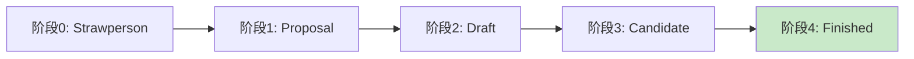

# JavaScript 最新提案介绍

## JavaScript 语言的进化历程

JavaScript作为网络的通用语言，一直在不断发展和进化。TC39委员会(Technical Committee 39)负责管理JavaScript的标准化过程，他们通过一系列提案(Proposals)来推动语言的发展。

:::info TC39委员会
TC39是ECMA国际组织下负责JavaScript(ECMAScript)标准化的技术委员会，由各大浏览器厂商、技术公司和独立专家组成。
:::

## TC39提案流程

每个JavaScript新特性必须经过严格的审核流程才能成为语言的一部分。TC39提案流程分为5个阶段:



- **Stage 0 (Strawperson)**: 初步想法，尚未正式提交
- **Stage 1 (Proposal)**: 正式提案，提出初步API
- **Stage 2 (Draft)**: 初始规范草案，预计将被包含在标准中
- **Stage 3 (Candidate)**: 完成规范，等待实现和用户反馈
- **Stage 4 (Finished)**: 准备纳入ECMAScript标准的下一个版本

## 值得关注的JavaScript最新提案

让我们看看一些最令人兴奋的提案，它们很可能在不远的将来成为JavaScript的一部分。

### 1. 管道运算符 (Pipeline Operator) - Stage 2

管道运算符 `|>` 允许我们将一个表达式的结果传递给下一个函数，使代码更具可读性。

#### 示例:

```javascript
// 不使用管道运算符
const result = h(g(f(x)));

// 使用管道运算符
const result = x |> f |> g |> h;

// 等价于
const result = h(g(f(x)));
```

这使得代码阅读顺序与执行顺序一致，更加直观。

#### 实际应用场景:

处理数据转换链时特别有用:

```javascript
const getTopRatedBooks = books => 
  books
  |> filter(book => book.rating > 4)
  |> sort((a, b) => b.rating - a.rating)
  |> take(10)
  |> map(book => book.title);
```

### 2. Record & Tuple - Stage 2

Record & Tuple提案引入了两种新的不可变数据结构:

- `Record`(记录): 类似于不可变对象 `#{}`
- `Tuple`(元组): 类似于不可变数组 `#[]`

#### 示例:

```javascript
// Record
const user = #{
  name: "Alice",
  age: 30
};

// Tuple
const coordinates = #[1, 2, 3];

// 不能修改内部属性
user.age = 31; // 错误!
coordinates[0] = 5; // 错误!

// 创建新实例
const updatedUser = #{...user, age: 31}; // 正确
```

#### 实际应用场景:

Record和Tuple在React等需要比较数据变化的场景中非常有用:

```javascript
function ProfileCard(props) {
  // 不需要深比较，直接比较引用即可
  React.useEffect(() => {
    // 只有当数据真正变化时才会执行
    console.log("User data changed");
  }, [props.userData]); // userData是一个Record

  return <div>{props.userData.name}</div>;
}
```

### 3. 可选链操作符 (Optional Chaining) - 已加入ES2020

:::note 已实现的特性
可选链操作符已经在ES2020中被标准化，现代浏览器都已支持。但作为近期重要的语言特性，我们仍然将其纳入介绍。
:::

可选链操作符 `?.` 允许读取位于连接对象链深处的属性的值，而不必验证链中的每个引用是否有效。

#### 示例:

```javascript
// 传统方式
let streetName;
if (user && user.address && user.address.street) {
  streetName = user.address.street.name;
}

// 使用可选链
const streetName = user?.address?.street?.name;
```

还可以与函数调用和数组索引一起使用:

```javascript
// 函数调用
const result = obj.method?.();

// 数组索引
const item = arr?.[0];
```

#### 实际应用场景:

处理API返回的嵌套数据结构:

```javascript
function displayUserLocation(user) {
  const city = user?.address?.city ?? "Unknown";
  const country = user?.address?.country ?? "Unknown";
  
  console.log(`User is from ${city}, ${country}`);
}
```

### 4. 顶层await (Top-level await) - 已加入ES2022

顶层await允许我们在异步模块的顶层使用await关键字，不需要将其包装在async函数中。

#### 示例:

```javascript
// 在模块顶层使用await
import { data } from './data.js';

// 等待数据加载
const response = await fetch('https://api.example.com/data');
const serverData = await response.json();

// 将数据与服务器数据合并
export const completeData = {...data, ...serverData};
```

#### 实际应用场景:

动态加载配置或资源:

```javascript
// config.js
const response = await fetch('/api/config');
const config = await response.json();

export default config;
```

然后在其他模块中使用:

```javascript
// app.js
import config from './config.js';

// 这里的代码只会在config加载完成后执行
console.log(`App running with ${config.version}`);
```

### 5. 装饰器 (Decorators) - Stage 3

装饰器提供了一种声明式的语法，用于修改类和类的成员。

#### 示例:

```javascript
// 定义装饰器
function logged(value, { kind, name }) {
  if (kind === "method") {
    return function(...args) {
      console.log(`Calling ${name} with`, args);
      const result = value.call(this, ...args);
      console.log(`Called ${name}, result:`, result);
      return result;
    };
  }
}

// 使用装饰器
class Person {
  @logged
  greet(message) {
    return `${message}, I'm ${this.name}`;
  }
  
  constructor(name) {
    this.name = name;
  }
}

const person = new Person("Alice");
person.greet("Hello"); 
// 输出:
// Calling greet with ["Hello"]
// Called greet, result: "Hello, I'm Alice"
```

#### 实际应用场景:

装饰器常用于实现横切关注点，比如日志记录、权限检查等:

```javascript
class UserService {
  @authorize('admin')
  deleteUser(userId) {
    // 删除用户的代码
  }
  
  @measure
  computeStatistics() {
    // 执行耗时计算
  }
}
```

### 6. 空值合并运算符 (Nullish Coalescing) - 已加入ES2020

空值合并运算符 `??` 是一个逻辑运算符，当左侧的操作数为 null 或 undefined 时，返回右侧的操作数，否则返回左侧的操作数。

#### 示例:

```javascript
// 传统方式使用 || 运算符
const name = username || "Guest";  // 当 username 为空字符串时也会返回 "Guest"

// 使用 ?? 运算符
const name = username ?? "Guest";  // 只有当 username 为 null 或 undefined 时才返回 "Guest"
```

#### 实际应用场景:

当处理用户输入或API返回值时:

```javascript
function createUser(userData) {
  return {
    name: userData.name ?? "Anonymous",
    posts: userData.posts ?? [],
    preferences: {
      theme: userData.preferences?.theme ?? "light",
      fontSize: userData.preferences?.fontSize ?? "medium"
    }
  };
}
```

## 如何尝试这些提案

许多最新的JavaScript提案可以通过Babel等转译工具进行尝试:

```bash
# 安装Babel及相关插件
npm install --save-dev @babel/core @babel/cli @babel/preset-env
npm install --save-dev @babel/plugin-proposal-pipeline-operator
```

配置Babel:

```javascript
// babel.config.js
module.exports = {
  presets: ["@babel/preset-env"],
  plugins: [
    ["@babel/plugin-proposal-pipeline-operator", { proposal: "minimal" }]
  ]
};
```

## 密切关注JavaScript的发展

要跟踪JavaScript提案的最新进展，你可以:

1. 关注[TC39 GitHub仓库](https://github.com/tc39/proposals)
2. 阅读相关博客和技术网站对新提案的解析
3. 尝试使用Babel等工具提前体验新特性

## 总结

JavaScript作为一门持续发展的语言，不断通过新提案引入现代化特性，使开发者能够编写更简洁、更安全、更具表达力的代码。虽然有些提案可能最终不会成为标准的一部分，但了解这些提案可以帮助我们洞察语言的发展方向，并为未来的变化做好准备。

:::tip 保持学习
JavaScript生态系统发展迅速。作为开发者，持续学习和实践新特性是保持竞争力的关键。
:::

## 练习与挑战

1. 尝试使用可选链和空值合并运算符重构一段复杂的数据访问代码。
2. 使用Babel配置管道运算符，并尝试将一些嵌套函数调用重写为管道形式。
3. 想象Record和Tuple被正式采纳后，你的代码库中哪些部分会受益最大？
4. 研究一个处于Stage 1或Stage 2的提案，预测它可能对你的开发工作带来的影响。

## 扩展阅读

- [TC39 提案流程](https://tc39.es/process-document/)
- [Babel文档 - 如何使用实验性JavaScript特性](https://babeljs.io/docs/en/plugins/)
- [现代JavaScript教程](https://javascript.info/)

Happy coding! 🚀