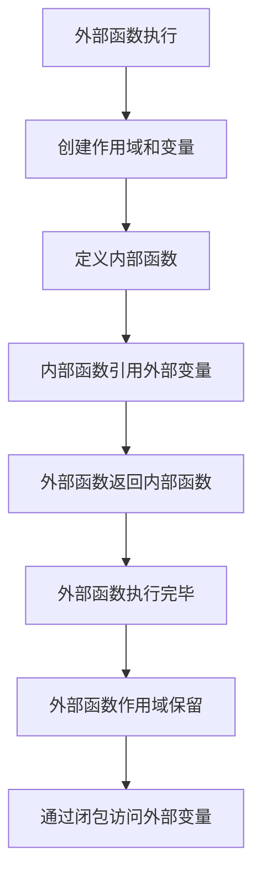

# JavaScript 闭包

## 什么是闭包？

闭包是JavaScript中一个强大而常见的概念，但对初学者来说可能有点难以理解。简单来说，**闭包是一个函数能够记住并访问它的词法作用域，即使当该函数在其作用域之外执行时**。

换句话说，闭包让你可以从一个函数内部访问另一个函数的作用域。闭包是由函数以及声明该函数的词法环境组合而成的。

## 闭包的基本结构

闭包最常见的形式是一个函数内部返回另一个函数。让我们来看一个简单的例子：

```javascript
function createGreeting(greeting) {
  // 外部函数
  return function(name) {
    // 内部函数（闭包）
    console.log(`${greeting}, ${name}!`);
  };
}

const sayHello = createGreeting("Hello");
const sayHowdy = createGreeting("Howdy");

sayHello("John"); // 输出: Hello, John!
sayHowdy("Jane"); // 输出: Howdy, Jane!
```

在上面的例子中：

1. `createGreeting`是外部函数，它接受一个`greeting`参数。
2. 内部有一个匿名函数作为返回值，这个匿名函数就是一个闭包。
3. 返回的闭包函数"记住"了`greeting`参数的值，即使在`createGreeting`函数执行完后。
4. 当我们调用`sayHello`或`sayHowdy`时，它们仍然能访问到各自的`greeting`值。

## 闭包如何工作？

为了理解闭包的工作原理，我们需要先了解JavaScript的作用域和垃圾回收机制。

通常情况下，当函数执行完毕后，其内部变量会被垃圾回收机制清除，不再可访问。但是，如果函数返回了一个内部函数，而这个内部函数引用了外部函数的变量，那么这些变量不会被回收，因为它们仍然被内部函数（闭包）引用着。



## 闭包的实际应用

### 1. 数据隐私

闭包可以用来创建私有变量和方法，模拟面向对象编程中的封装概念：

```javascript
function createCounter() {
  let count = 0; // 私有变量
  
  return {
    increment: function() {
      count += 1;
      return count;
    },
    decrement: function() {
      count -= 1;
      return count;
    },
    getValue: function() {
      return count;
    }
  };
}

const counter = createCounter();
console.log(counter.getValue()); // 输出: 0
console.log(counter.increment()); // 输出: 1
console.log(counter.increment()); // 输出: 2
console.log(counter.decrement()); // 输出: 1
console.log(counter.count); // 输出: undefined (无法直接访问私有变量)
```

在上面的例子中，`count`变量对外部作用域是不可见的，只能通过返回的对象方法来操作。

### 2. 回调函数

闭包在事件处理和回调函数中非常有用：

```javascript
function setupButtonClick(buttonId, message) {
  // 捕获message参数
  document.getElementById(buttonId).addEventListener('click', function() {
    alert(message); // 闭包访问message变量
  });
}

// 设置两个不同的按钮
setupButtonClick('btn1', '你点击了第一个按钮！');
setupButtonClick('btn2', '你点击了第二个按钮！');
```

### 3. 函数工厂

闭包可以用来创建定制化的函数：

```javascript
function multiplier(factor) {
  return function(number) {
    return number * factor;
  };
}

const double = multiplier(2);
const triple = multiplier(3);

console.log(double(5)); // 输出: 10
console.log(triple(5)); // 输出: 15
```

### 4. 模块模式

闭包是实现模块模式的基础，可以创建有私有状态的模块：

```javascript
const calculator = (function() {
  // 私有变量
  let result = 0;
  
  // 公共API
  return {
    add: function(x) {
      result += x;
      return this;
    },
    subtract: function(x) {
      result -= x;
      return this;
    },
    multiply: function(x) {
      result *= x;
      return this;
    },
    getResult: function() {
      return result;
    }
  };
})();

console.log(calculator.add(5).multiply(2).subtract(3).getResult()); // 输出: 7
```

## 闭包的潜在问题

### 内存泄漏

由于闭包会保留对外部变量的引用，如果使用不当，可能导致内存泄漏：

```javascript
function createLargeArray() {
  const largeArray = new Array(1000000).fill('potential memory leak');
  
  return function() {
    // 这个闭包引用了largeArray，即使只用了一个元素
    console.log(largeArray[0]);
  };
}

const printFirst = createLargeArray(); // largeArray会被保留在内存中
```

:::caution
在使用闭包时，要注意不要在闭包中保留对大型数据结构的引用，除非确实需要。
:::

### 循环中的闭包

在循环中创建闭包时需要特别注意：

```javascript
// 问题示例
function createFunctions() {
  const funcs = [];
  
  for (var i = 0; i < 3; i++) {
    funcs.push(function() {
      console.log(i); // 闭包引用的是同一个i
    });
  }
  
  return funcs;
}

const functions = createFunctions();
functions[0](); // 输出: 3 (不是预期的0)
functions[1](); // 输出: 3 (不是预期的1)
functions[2](); // 输出: 3 (不是预期的2)
```

解决方法是使用立即执行函数表达式(IIFE)或者ES6中的`let`关键字：

```javascript
// 使用let解决
function createFunctionsFixed() {
  const funcs = [];
  
  for (let i = 0; i < 3; i++) {
    funcs.push(function() {
      console.log(i); // 每次循环创建新的i变量
    });
  }
  
  return funcs;
}

const fixedFunctions = createFunctionsFixed();
fixedFunctions[0](); // 输出: 0
fixedFunctions[1](); // 输出: 1
fixedFunctions[2](); // 输出: 2
```

## 理解闭包的实际例子

让我们来看一个稍微复杂但实用的例子 - 一个简单的购物车实现：

```javascript
function createShoppingCart() {
  // 私有变量 - 购物车数组和总价
  const items = [];
  let total = 0;
  
  // 返回购物车API
  return {
    addItem: function(name, price, quantity = 1) {
      items.push({name, price, quantity});
      total += price * quantity;
      console.log(`${quantity}x ${name} 添加到购物车`);
      return this;
    },
    removeItem: function(name) {
      const index = items.findIndex(item => item.name === name);
      if (index !== -1) {
        total -= items[index].price * items[index].quantity;
        console.log(`${items[index].name} 从购物车移除`);
        items.splice(index, 1);
      }
      return this;
    },
    getTotal: function() {
      return total.toFixed(2);
    },
    getItemCount: function() {
      return items.reduce((count, item) => count + item.quantity, 0);
    },
    listItems: function() {
      if (items.length === 0) {
        console.log("购物车是空的");
        return;
      }
      
      console.log("购物车物品:");
      items.forEach(item => {
        console.log(`- ${item.quantity}x ${item.name}: $${(item.price * item.quantity).toFixed(2)}`);
      });
    }
  };
}

// 使用例子
const cart = createShoppingCart();
cart.addItem("笔记本电脑", 999.99)
   .addItem("鼠标", 29.99, 2)
   .addItem("键盘", 59.99);

cart.listItems();
// 输出:
// 购物车物品:
// - 1x 笔记本电脑: $999.99
// - 2x 鼠标: $59.98
// - 1x 键盘: $59.99

console.log(`总金额: $${cart.getTotal()}`); // 输出: 总金额: $1119.96
console.log(`物品总数: ${cart.getItemCount()}`); // 输出: 物品总数: 4

cart.removeItem("鼠标");
console.log(`更新后的总金额: $${cart.getTotal()}`); // 输出: 更新后的总金额: $1059.98
```

这个购物车例子展示了闭包如何创建一个带有私有状态的模块，提供了添加物品、移除物品、计算总价等功能，同时保持内部数据（购物车物品和总价）对外部代码的隐藏。

## 总结

闭包是JavaScript中一个强大的特性，它允许函数"记住"并访问其词法作用域，即使在该函数在其他地方执行时。

主要特点和用途：

- 可以创建私有变量和函数，实现数据封装
- 在函数工厂模式中创建可定制的函数
- 在事件处理和回调中保存状态
- 实现模块模式

要点：

- 闭包是由函数及其词法环境组成的
- 闭包可以访问三个作用域：自己的作用域、外部函数的作用域和全局作用域
- 使用不当可能导致内存泄漏
- 在循环中创建闭包需要特别注意变量作用域问题

通过理解和掌握闭包，你将能够编写更加强大、灵活和优雅的JavaScript代码。

## 练习题

1. 创建一个计数器函数，每次调用时返回递增的数字。
2. 实现一个函数，可以创建任何底数的幂函数（如平方函数、立方函数等）。
3. 使用闭包创建一个简单的待办事项列表，具有添加、完成和查看功能。
4. 创建一个函数，使用闭包实现一个简单的缓存系统，避免重复计算。

## 进一步学习资源

:::tip
如果你想进一步了解JavaScript闭包，可以查看以下资源：

- MDN Web文档：[闭包](https://developer.mozilla.org/zh-CN/docs/Web/JavaScript/Closures)
- JavaScript.info：[变量作用域，闭包](https://zh.javascript.info/closure)
- 《你不知道的JavaScript》上卷 - 第5章：作用域闭包
:::

现在你已经了解了JavaScript闭包的基础和实际应用，继续尝试使用它们来增强你的代码吧！