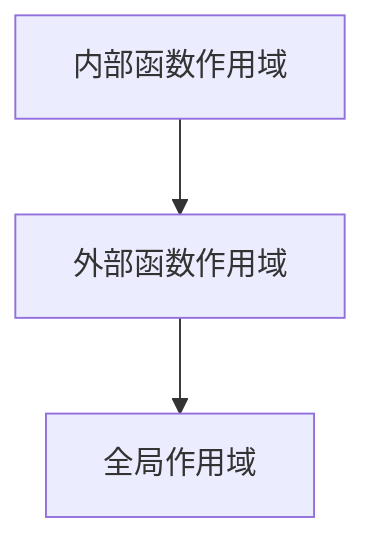

# JavaScript 函数作用域

在JavaScript中，函数作用域是一个核心概念，它决定了变量的可访问范围。正确理解作用域对编写可维护、无bug的代码至关重要。本文将深入探讨JavaScript函数作用域的工作原理、类型以及实际应用。

## 什么是作用域？

作用域是指程序中定义变量的区域，它规定了变量的可访问性和生命周期。简单来说，作用域决定了变量在代码中的"可见性"。

在JavaScript中，有几种主要的作用域类型：

1. 全局作用域
2. 函数作用域
3. 块级作用域（ES6引入）

## 全局作用域

在函数外部定义的变量属于全局作用域，可以在代码的任何地方访问。

```javascript
// 全局作用域变量
const globalVariable = "我是全局变量";

function showGlobal() {
  console.log(globalVariable); // 可以访问全局变量
}

showGlobal(); // 输出: "我是全局变量"
console.log(globalVariable); // 输出: "我是全局变量"
```

:::caution 注意
过度使用全局变量可能导致命名冲突和代码维护问题，应尽量减少使用。
:::

## 函数作用域

在JavaScript中，每个函数都创建了自己的作用域。在函数内部定义的变量只能在该函数内部访问，外部无法直接访问。

```javascript
function myFunction() {
  // 函数作用域变量
  const localVariable = "我是局部变量";
  console.log(localVariable); // 可以访问
}

myFunction(); // 输出: "我是局部变量"
// console.log(localVariable); // 错误: localVariable未定义
```

### 作用域嵌套

函数可以嵌套在其他函数中，形成作用域链：

```javascript
function outerFunction() {
  const outerVar = "外部函数变量";
  
  function innerFunction() {
    const innerVar = "内部函数变量";
    console.log(outerVar); // 可以访问外部函数变量
    console.log(innerVar); // 可以访问内部函数变量
  }
  
  innerFunction();
  console.log(outerVar); // 可以访问外部函数变量
  // console.log(innerVar); // 错误: innerVar未定义
}

outerFunction();
```

### 作用域链

当JavaScript尝试访问一个变量时，它会首先在当前作用域中查找。如果找不到，就会向外层作用域查找，一直到全局作用域。这个查找过程形成了作用域链。



```javascript
const globalVar = "全局变量";

function outer() {
  const outerVar = "外部函数变量";
  
  function inner() {
    const innerVar = "内部函数变量";
    console.log(innerVar); // 首先在inner函数作用域中查找
    console.log(outerVar); // 然后在outer函数作用域中查找
    console.log(globalVar); // 最后在全局作用域中查找
  }
  
  inner();
}

outer();
// 输出:
// "内部函数变量"
// "外部函数变量"
// "全局变量"
```

## 块级作用域

ES6引入了`let`和`const`关键字，它们支持块级作用域。块级作用域由花括号`{}`界定，例如在`if`语句、`for`循环或单独的代码块中。

```javascript
function blockScopeExample() {
  if (true) {
    var varVariable = "使用var声明";
    let letVariable = "使用let声明";
    const constVariable = "使用const声明";
  }
  
  console.log(varVariable); // 输出: "使用var声明" (函数作用域)
  // console.log(letVariable); // 错误: letVariable未定义 (块级作用域)
  // console.log(constVariable); // 错误: constVariable未定义 (块级作用域)
}

blockScopeExample();
```

:::tip 最佳实践
优先使用`let`和`const`而不是`var`，以避免变量提升和作用域混淆的问题。
:::

## 变量提升

JavaScript在执行代码之前会将变量声明（使用`var`）和函数声明"提升"到所在作用域的顶部。这就是所谓的"变量提升"(hoisting)。

```javascript
function hoistingExample() {
  console.log(hoistedVar); // 输出: undefined (而不是错误)
  var hoistedVar = "我被提升了";
  
  // 上面的代码等同于:
  // var hoistedVar;
  // console.log(hoistedVar);
  // hoistedVar = "我被提升了";
}

hoistingExample();
```

:::note
`let`和`const`声明的变量也会提升，但不会被初始化，在声明之前访问会导致"暂时性死区"错误。
:::

## 闭包

闭包是JavaScript中的一个强大概念，它是基于函数作用域的一个特性。当一个内部函数引用了其外部函数的变量，并且内部函数在外部函数执行完毕后仍然存在，就形成了闭包。

```javascript
function createCounter() {
  let count = 0; // 私有变量
  
  return function() {
    count++; // 访问外部函数的变量
    return count;
  };
}

const counter = createCounter();
console.log(counter()); // 输出: 1
console.log(counter()); // 输出: 2
console.log(counter()); // 输出: 3
```

在上面的例子中，`counter`是一个闭包，它"记住"了`createCounter`函数中的`count`变量，即使`createCounter`函数已经执行完毕。

### 实际应用场景

闭包在实际开发中有很多应用场景：

1. **数据私有化**：创建私有变量和方法，避免全局污染

```javascript
function createPerson(name) {
  // 私有变量
  let age = 0;
  
  return {
    getName: function() {
      return name;
    },
    getAge: function() {
      return age;
    },
    setAge: function(newAge) {
      if (newAge > 0 && newAge < 120) {
        age = newAge;
      }
    }
  };
}

const person = createPerson("张三");
person.setAge(25);
console.log(person.getName()); // 输出: "张三"
console.log(person.getAge()); // 输出: 25
// 无法直接访问或修改私有变量name和age
```

2. **事件处理和回调函数**：保留函数执行环境

```javascript
function setupButton(buttonId, message) {
  const button = document.getElementById(buttonId);
  
  button.addEventListener("click", function() {
    // 闭包记住了message变量
    alert(message);
  });
}

// 创建两个按钮，每个有自己的消息
setupButton("btn1", "按钮1被点击了");
setupButton("btn2", "按钮2被点击了");
```

## 常见问题与最佳实践

### 避免作用域混淆

```javascript
// 不好的做法
function badScope() {
  for (var i = 0; i < 5; i++) {
    setTimeout(function() {
      console.log(i);
    }, 100);
  }
}
badScope(); // 输出五次: 5

// 好的做法
function goodScope() {
  for (let i = 0; i < 5; i++) {
    setTimeout(function() {
      console.log(i);
    }, 100);
  }
}
goodScope(); // 输出: 0, 1, 2, 3, 4
```

### 避免全局变量污染

使用立即执行函数表达式(IIFE)创建独立作用域：

```javascript
// 不好的做法
var name = "全局名称";
// 可能会与其他脚本冲突

// 好的做法
(function() {
  var name = "局部名称";
  console.log(name); // "局部名称"
})();

console.log(name); // "全局名称"
```

### 模块模式

利用闭包创建模块化代码：

```javascript
const calculator = (function() {
  // 私有变量
  let result = 0;
  
  // 返回公共API
  return {
    add: function(x) {
      result += x;
      return this;
    },
    subtract: function(x) {
      result -= x;
      return this;
    },
    getResult: function() {
      return result;
    }
  };
})();

calculator.add(5).subtract(2).add(10);
console.log(calculator.getResult()); // 输出: 13
```

## 总结

JavaScript的函数作用域是理解和掌握JavaScript的核心概念之一。正确理解作用域可以帮助你：

- 避免命名冲突
- 减少全局变量污染
- 编写更安全、可维护的代码
- 利用闭包实现数据私有化和函数工厂

记住以下关键点：
1. 全局作用域中的变量可以在任何地方访问
2. 函数作用域中的变量仅在函数内部可见
3. 使用`let`和`const`可以创建块级作用域
4. 闭包允许函数访问已经退出的函数作用域中的变量

## 练习

为加深理解，尝试完成以下练习：

1. 创建一个计数器函数，可以增加、减少和重置计数值，但计数值本身应该是私有的。
2. 编写一个函数，生成不同的问候语，每个问候语都应有自己的作用域。
3. 修改一个使用`var`的循环，使其能够正确地在setTimeout回调中按顺序输出循环索引。

## 扩展阅读

- JavaScript的词法作用域
- this关键字与作用域的关系
- 闭包高级应用
- ES6模块与作用域

掌握函数作用域将帮助你更好地理解JavaScript代码的运行方式，并能够编写更优雅、高效的代码。