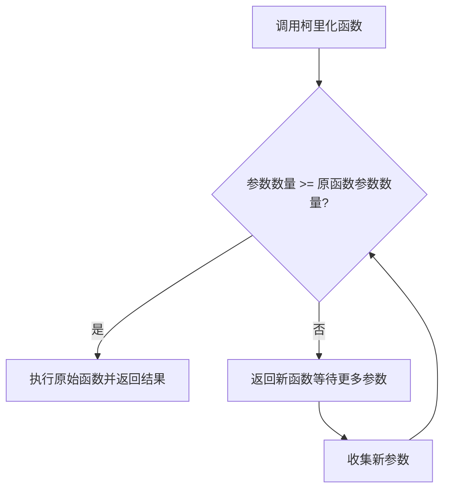

# JavaScript 函数柯里化

## 什么是函数柯里化？

函数柯里化(Currying)是一种函数式编程的技术，它将一个接受多个参数的函数转换成一系列使用一个参数的函数。这种转换让我们能够更灵活地使用函数，提高代码的复用性，同时保持代码的简洁和可读性。

柯里化的命名来源于数学家和逻辑学家哈斯凯尔·柯里(Haskell Curry)，他在数学领域的工作对函数式编程产生了深远影响。

## 柯里化的基本概念

普通函数与柯里化函数的区别：

**普通函数：**
```javascript
function add(x, y, z) {
  return x + y + z;
}
const result = add(1, 2, 3); // 6
```

**柯里化函数：**
```javascript
function curryAdd(x) {
  return function(y) {
    return function(z) {
      return x + y + z;
    }
  }
}

const result = curryAdd(1)(2)(3); // 6
```

注意到区别了吗？柯里化后的函数不再一次接收所有参数，而是通过嵌套的方式，每次接收一个参数并返回一个新的函数，直到接收完所有参数，最后返回计算结果。

## 手动实现柯里化函数

让我们来看看如何手动实现一个柯里化函数：

```javascript
// 原始函数
function add(x, y, z) {
  return x + y + z;
}

// 手动柯里化
function curriedAdd(x) {
  return function(y) {
    return function(z) {
      return x + y + z;
    }
  }
}

console.log(add(1, 2, 3));        // 输出: 6
console.log(curriedAdd(1)(2)(3)); // 输出: 6
```

## 通用柯里化函数

手动柯里化每个函数有些繁琐，我们可以创建一个通用的柯里化工具函数：

```javascript
function curry(fn) {
  return function curried(...args) {
    // 如果提供的参数数量与原始函数所需的参数数量一致或更多
    if (args.length >= fn.length) {
      return fn.apply(this, args);
    } else {
      // 否则返回一个函数，等待更多的参数
      return function(...args2) {
        return curried.apply(this, args.concat(args2));
      }
    }
  };
}

// 测试通用柯里化函数
function add(x, y, z) {
  return x + y + z;
}

const curriedAdd = curry(add);

console.log(curriedAdd(1, 2, 3));  // 输出: 6
console.log(curriedAdd(1)(2, 3));  // 输出: 6
console.log(curriedAdd(1)(2)(3));  // 输出: 6
```

:::note
`curry`函数通过检查传入的参数数量与原始函数所需参数数量，来决定是立即执行原函数还是返回一个新的等待更多参数的函数。
:::

## 柯里化的实际应用场景

### 1. 参数复用

柯里化使我们能够固定某些参数，创建具有特定功能的新函数：

```javascript
// 计算折扣的函数
function discount(discountPercent, price) {
  return price * (1 - discountPercent / 100);
}

const tenPercentDiscount = curry(discount)(10);
const twentyPercentDiscount = curry(discount)(20);

console.log(tenPercentDiscount(100));    // 输出: 90
console.log(twentyPercentDiscount(100)); // 输出: 80
```

### 2. 函数组合

柯里化与函数组合结合，可以创建更灵活的数据处理管道：

```javascript
// 处理数据的各个步骤
const processData = curry(function(transformer, validator, data) {
  return validator(transformer(data));
});

// 具体的转换和验证函数
const convertToNumber = str => Number(str);
const isPositive = num => num > 0;

// 创建特定的数据处理器
const processPositiveNumber = processData(convertToNumber)(isPositive);

console.log(processPositiveNumber("42"));  // 输出: true
console.log(processPositiveNumber("-42")); // 输出: false
```

### 3. 事件处理

利用柯里化可以更容易地创建针对特定事件的处理函数：

```javascript
const handleEvent = curry(function(element, eventType, callback) {
  element.addEventListener(eventType, callback);
  return function() {
    element.removeEventListener(eventType, callback);
  };
});

// 可以为特定元素创建专用的事件处理器
const handleButtonClick = handleEvent(document.getElementById('button'))('click');

// 使用处理器绑定具体事件
const removeClickHandler = handleButtonClick(function(e) {
  console.log('Button clicked!', e);
});

// 需要时可以解绑事件
// removeClickHandler();
```

### 4. 日志记录

创建针对不同日志级别的记录函数：

```javascript
const log = curry(function(level, message) {
  console.log(`[${level}]: ${message}`);
});

const errorLog = log('ERROR');
const warnLog = log('WARN');
const infoLog = log('INFO');

errorLog('Server connection failed');  // 输出: [ERROR]: Server connection failed
warnLog('Disk space low');            // 输出: [WARN]: Disk space low
infoLog('User logged in');            // 输出: [INFO]: User logged in
```

## 柯里化的优缺点

### 优点

1. **参数复用**：可以预设部分参数，创建更具体的函数
2. **代码组织**：帮助我们按照单一职责原则组织代码
3. **惰性求值**：可以延迟计算，直到获取所有必要参数
4. **可读性**：在某些情况下，柯里化可以提高代码的可读性

### 缺点

1. **调试难度**：嵌套函数使得调试更加困难
2. **性能开销**：多个函数调用会带来一定的性能损耗
3. **学习曲线**：对于不熟悉函数式编程的开发者有一定学习门槛
4. **代码冗长**：某些场景下会导致代码变得更冗长

## 柯里化的内部原理

下面的流程图展示了柯里化函数的执行过程：



## 实践练习

:::tip 练习任务
尝试实现以下功能，加深对柯里化的理解：
1. 创建一个`formatString`函数，可以按照指定格式格式化字符串，然后使用柯里化为常用格式创建专用函数
2. 实现一个过滤器函数`filter`，可以柯里化来创建特定的过滤条件函数
:::

**练习1解答示例:**

```javascript
const formatString = curry(function(template, value) {
  return template.replace('%s', value);
});

const formatGreeting = formatString('Hello, %s!');
const formatError = formatString('Error: %s');

console.log(formatGreeting('John'));  // 输出: Hello, John!
console.log(formatError('Not found')); // 输出: Error: Not found
```

**练习2解答示例:**

```javascript
const filter = curry(function(predicate, array) {
  return array.filter(predicate);
});

const filterPositive = filter(x => x > 0);
const filterEven = filter(x => x % 2 === 0);

console.log(filterPositive([-3, -2, -1, 0, 1, 2, 3])); // 输出: [1, 2, 3]
console.log(filterEven([1, 2, 3, 4, 5, 6]));           // 输出: [2, 4, 6]
```

## 总结

柯里化是JavaScript函数式编程中的一个重要概念，通过将接受多个参数的函数转换为一系列接受单个参数的函数，提供了更灵活的函数组合和复用方式。

柯里化主要有以下几个优势：
- 参数复用，创建更专用的函数
- 提高代码的模块化和组合能力
- 增强代码的可读性和可维护性

虽然柯里化可能会增加一些初始学习成本和代码复杂度，但在适当的场景下，它能显著提高代码质量和开发效率。

## 扩展资源

想要深入了解函数柯里化，可以参考以下资源：

1. [MDN Web Docs上的函数式编程介绍](https://developer.mozilla.org/zh-CN/docs/Glossary/Functional_programming)
2. [JavaScript函数式编程指南](https://github.com/MostlyAdequate/mostly-adequate-guide/blob/master/ch4.md)
3. 推荐的函数式编程库：Ramda、Lodash/fp 等

实践是掌握柯里化的最佳方式，尝试在你的项目中找到适合柯里化的场景并加以应用，你会逐渐理解和欣赏这种编程技术的美妙之处。