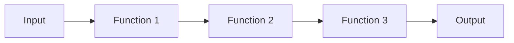
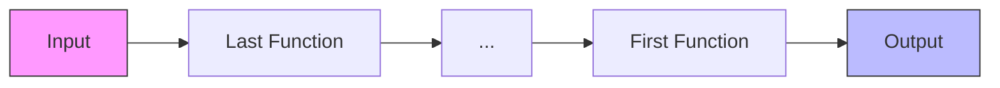
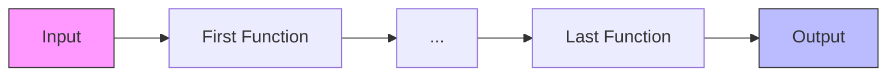

# JavaScript 函数组合

函数组合是函数式编程中的一个核心概念，它允许我们将多个函数组合成一个新函数，从而创建一个数据处理管道。在JavaScript中，函数组合可以让我们的代码更加简洁、可读且易于测试。本文将介绍函数组合的基本概念、实现方法以及在实际项目中的应用。

## 什么是函数组合？

函数组合是将两个或多个函数结合起来，创建一个新函数的过程。当我们通过函数组合创建的新函数被调用时，它会从右向左（或从内到外）依次执行组合中的函数，每个函数的输出作为下一个函数的输入。

简单来说，如果有函数`f`和函数`g`，函数组合`compose(f, g)(x)`等同于`f(g(x))`。

## 为什么需要函数组合？

函数组合有以下几个优点：

1. **可读性**：通过组合小型、单一功能的函数，代码更易于理解
2. **可维护性**：小函数更容易测试和修改
3. **可复用性**：组合的各个函数可以在其他地方重复使用
4. **减少中间变量**：避免创建临时变量来存储中间结果

## 基本函数组合实现

让我们先实现一个简单的`compose`函数：

```javascript
function compose(f, g) {
  return function(x) {
    return f(g(x));
  };
}

// 使用示例
function addOne(x) {
  return x + 1;
}

function double(x) {
  return x * 2;
}

const doubleAndAddOne = compose(addOne, double);

console.log(doubleAndAddOne(3)); // 输出: 7
// 解释: double(3) = 6, 然后 addOne(6) = 7
```

## 支持多个函数的组合

上面的实现只支持两个函数的组合。我们可以扩展它来支持任意数量的函数：

```javascript
function compose(...functions) {
  return function(input) {
    return functions.reduceRight((acc, fn) => fn(acc), input);
  };
}

// 使用示例
function addOne(x) {
  return x + 1;
}

function double(x) {
  return x * 2;
}

function square(x) {
  return x * x;
}

const calculation = compose(square, addOne, double);

console.log(calculation(3)); // 输出: 49
// 解释: double(3) = 6, 然后 addOne(6) = 7, 然后 square(7) = 49
```

:::tip
`reduceRight` 方法从右向左处理数组，这对函数组合很重要，因为我们希望函数从右向左（或从内到外）执行。
:::

## 函数管道 (Pipe)

与 `compose` 相反，`pipe` 函数从左到右执行函数：

```javascript
function pipe(...functions) {
  return function(input) {
    return functions.reduce((acc, fn) => fn(acc), input);
  };
}

// 使用示例
const calculation = pipe(double, addOne, square);

console.log(calculation(3)); // 输出: 49
// 解释: double(3) = 6, 然后 addOne(6) = 7, 然后 square(7) = 49
```

`pipe` 和 `compose` 的区别仅在于执行顺序，`pipe` 对一些人来说可能更直观，因为它按照从左到右的阅读顺序执行函数。

## 使用箭头函数简化

使用ES6箭头函数可以使我们的代码更加简洁：

```javascript
const compose = (...fns) => x => fns.reduceRight((acc, fn) => fn(acc), x);
const pipe = (...fns) => x => fns.reduce((acc, fn) => fn(acc), x);
```

## 处理多参数函数

上面的实现假设所有函数都只接受一个参数。如果需要处理多参数函数，我们可以使用柯里化（Currying）技术：

```javascript
// 简单的柯里化函数
function curry(fn) {
  return function curried(...args) {
    if (args.length >= fn.length) {
      return fn.apply(this, args);
    } else {
      return function(...args2) {
        return curried.apply(this, args.concat(args2));
      };
    }
  };
}

// 使用示例
function add(a, b) {
  return a + b;
}

const curriedAdd = curry(add);
const add5 = curriedAdd(5);

const pipeline = pipe(add5, double, square);
console.log(pipeline(3)); // 输出: 64
// 解释: add5(3) = 8, 然后 double(8) = 16, 然后 square(16) = 256
```

## 实际应用场景

### 数据转换管道

函数组合在数据处理流水线中非常有用：

```javascript
// 假设我们从API获取用户数据并需要处理它
const getUserData = id => {
  // 模拟API调用
  return {
    id: id,
    name: 'User ' + id,
    email: `user${id}@example.com`,
    active: id % 2 === 0 // 偶数ID的用户是活跃的
  };
};

const filterActiveUsers = users => users.filter(user => user.active);
const extractEmails = users => users.map(user => user.email);
const formatEmails = emails => emails.join(', ');

// 创建处理管道
const getActiveUserEmails = pipe(
  ids => ids.map(getUserData),
  filterActiveUsers,
  extractEmails,
  formatEmails
);

// 使用处理管道
const userIds = [1, 2, 3, 4, 5];
console.log(getActiveUserEmails(userIds));
// 输出: "user2@example.com, user4@example.com"
```

### 表单验证

函数组合也可以用于构建验证逻辑：

```javascript
// 验证函数
const isNotEmpty = value => value.trim() !== '' ? { valid: true, value } : { valid: false, error: '字段不能为空' };
const isEmail = input => {
  if (!input.valid) return input; // 如果之前的验证失败，直接返回
  const value = input.value;
  const emailRegex = /^[^\s@]+@[^\s@]+\.[^\s@]+$/;
  return emailRegex.test(value) ? { valid: true, value } : { valid: false, error: '无效的邮箱格式' };
};
const isLengthValid = max => input => {
  if (!input.valid) return input;
  const value = input.value;
  return value.length <= max ? { valid: true, value } : { valid: false, error: `不能超过${max}个字符` };
};

// 创建验证管道
const validateEmail = pipe(
  value => ({ valid: true, value }), // 初始化
  isNotEmpty,
  isEmail,
  isLengthValid(50)
);

// 使用验证管道
console.log(validateEmail(''));  
// 输出: { valid: false, error: '字段不能为空' }

console.log(validateEmail('not-an-email'));  
// 输出: { valid: false, error: '无效的邮箱格式' }

console.log(validateEmail('user@example.com'));  
// 输出: { valid: true, value: 'user@example.com' }
```

## 理解函数组合的执行流程

函数组合的执行流程可以通过以下图表表示：



函数组合（compose）的执行顺序是从右到左：



而函数管道（pipe）的执行顺序是从左到右：



## 使用第三方库

你不必自己实现函数组合，有许多优秀的库提供了这些功能：

- [Ramda](https://ramdajs.com/)：提供了`compose`和`pipe`函数
- [Lodash/FP](https://github.com/lodash/lodash/wiki/FP-Guide)：Lodash的函数式编程版本
- [fp-ts](https://gcanti.github.io/fp-ts/)：TypeScript的函数式编程库

:::caution
使用第三方库时，务必查阅其文档了解具体的使用方法，因为实现细节可能与本文所述不同。
:::

## 总结

函数组合是一种强大的编程技术，它可以帮助我们：

1. 构建小而纯粹的函数
2. 消除中间变量
3. 创建清晰的数据转换管道
4. 提高代码的可读性和可维护性

函数组合是函数式编程的核心概念之一，掌握它将帮助你编写更简洁、更模块化的JavaScript代码。通过将复杂操作分解为简单函数，然后组合这些函数，我们可以构建出既强大又易于理解的程序。

## 练习

1. 实现一个`compose`函数，支持异步函数的组合
2. 创建一个数据处理管道，从数组中筛选出奇数，然后将它们加倍，最后计算总和
3. 使用函数组合实现一个简单的字符串处理管道，将输入的字符串转换为小写，去除空格，然后获取前5个字符

## 延伸阅读

- 了解更多关于柯里化（Currying）的知识
- 探索函数式编程中的其他概念，如纯函数、不可变性和高阶函数
- 学习如何在React等框架中应用函数组合

通过理解和应用函数组合，你将能够编写更为简洁、可复用和易于测试的JavaScript代码。这是迈向函数式编程世界的重要一步！