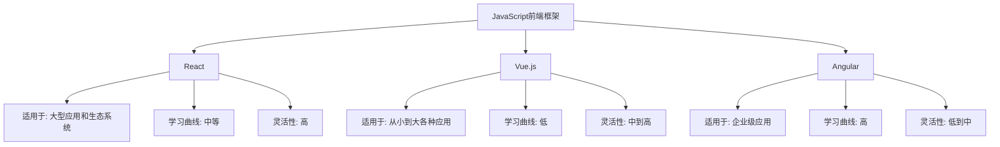

# JavaScript 前端框架概述

## 什么是前端框架？

前端框架是一套预先编写好的JavaScript代码库，它为构建Web应用程序提供了基础架构和功能组件，以便开发者能更高效地创建用户界面和处理前端逻辑。框架通常提供组件系统、路由管理、状态管理等功能，大大简化了现代Web应用的开发过程。

:::note
前端框架≠JavaScript库。库（如jQuery）提供一组可调用的函数，由开发者控制何时调用；而框架则"控制反转"，框架决定何时调用开发者的代码。
:::

## 为什么需要前端框架？

在没有框架的情况下，构建复杂的Web应用会面临许多挑战：

1. **代码组织问题**：随着项目规模增长，维护纯JavaScript代码变得困难
2. **DOM操作效率低**：频繁直接操作DOM会导致性能问题
3. **数据同步困难**：保持UI和数据状态同步需要大量重复代码
4. **开发效率低**：需要编写大量样板代码处理常见任务

前端框架通过提供结构化的解决方案解决了这些问题。

## 主流JavaScript前端框架

### React

由Facebook开发的UI库，专注于构建用户界面。

**核心特点：**
- 基于组件的架构
- 虚拟DOM提高渲染性能
- JSX语法扩展
- 单向数据流

**简单示例：**

```jsx
import React from 'react';
import ReactDOM from 'react-dom';

function HelloWorld() {
  return <h1>Hello, World!</h1>;
}

ReactDOM.render(<HelloWorld />, document.getElementById('root'));
```

### Vue.js

渐进式JavaScript框架，易于上手且灵活。

**核心特点：**
- 模板系统
- 响应式数据绑定
- 组件化系统
- 指令系统

**简单示例：**

```html
<div id="app">
  {{ message }}
</div>

<script>
const { createApp } = Vue

createApp({
  data() {
    return {
      message: 'Hello Vue!'
    }
  }
}).mount('#app')
</script>
```

### Angular

由Google开发的完整MVC框架，适合企业级应用开发。

**核心特点：**
- TypeScript集成
- 完整的MVC架构
- 依赖注入系统
- 双向数据绑定

**简单示例：**

```typescript
import { Component } from '@angular/core';

@Component({
  selector: 'app-root',
  template: `<h1>Hello, {{ title }}!</h1>`
})
export class AppComponent {
  title = 'Angular World';
}
```

## 框架对比

让我们从多个维度比较这三个主流框架：



### 性能比较

| 框架 | 渲染性能 | 内存使用 | 加载时间 |
|------|---------|---------|---------|
| React | 良好 | 中等 | 中等 |
| Vue.js | 优秀 | 低 | 快 |
| Angular | 良好 | 高 | 慢 |

## 其他重要框架

除了三大主流框架外，还有一些值得关注的框架：

### Svelte

编译型框架，将组件编译为高效的命令式代码。

**特点：**
- 零运行时依赖
- 更少的代码
- 真正的响应式

**示例：**
```html
<script>
  let name = 'world';
</script>

<h1>Hello {name}!</h1>
```

### Preact

React的轻量级替代品，API几乎完全兼容。

**特点：**
- 体积小（约3KB）
- 与React API兼容
- 速度快

## 如何选择适合的框架？

选择框架时应考虑以下因素：

1. **项目复杂度**：简单项目可能不需要重型框架
2. **团队经验**：选择团队熟悉的技术栈
3. **学习资源**：流行框架通常有更多学习资源
4. **社区支持**：活跃社区意味着更好的生态系统和长期支持
5. **性能需求**：根据应用性能需求选择合适框架
6. **就业市场**：考虑当地就业市场对特定框架的需求

:::tip 初学者建议
对于初学者，Vue.js通常是入门的最佳选择，因为其学习曲线较为平缓。但如果你考虑就业市场，React目前有更多的就业机会。
:::

## 实际案例：使用框架构建待办事项应用

以下是使用Vue.js构建简单待办事项应用的例子：

```html
<div id="todo-app">
  <h1>待办事项列表</h1>
  
  <div class="input-container">
    <input v-model="newTodo" @keyup.enter="addTodo" placeholder="添加新任务...">
    <button @click="addTodo">添加</button>
  </div>
  
  <ul class="todo-list">
    <li v-for="(todo, index) in todos" :key="index" :class="{ completed: todo.done }">
      <input type="checkbox" v-model="todo.done">
      <span>{{ todo.text }}</span>
      <button @click="removeTodo(index)">删除</button>
    </li>
  </ul>
  
  <div class="footer" v-if="todos.length > 0">
    <span>{{ remainingTodos }}个待完成任务</span>
    <button @click="clearCompleted">清除已完成</button>
  </div>
</div>

<script>
const { createApp } = Vue

createApp({
  data() {
    return {
      newTodo: '',
      todos: []
    }
  },
  computed: {
    remainingTodos() {
      return this.todos.filter(todo => !todo.done).length
    }
  },
  methods: {
    addTodo() {
      if (this.newTodo.trim()) {
        this.todos.push({ text: this.newTodo, done: false })
        this.newTodo = ''
      }
    },
    removeTodo(index) {
      this.todos.splice(index, 1)
    },
    clearCompleted() {
      this.todos = this.todos.filter(todo => !todo.done)
    }
  }
}).mount('#todo-app')
</script>
```

## 前端框架的未来趋势

前端框架领域不断演进，当前的趋势包括：

1. **更小的包体积**：优化框架体积是主要趋势
2. **编译时优化**：像Svelte这样的编译型框架受到关注
3. **服务器组件**：React Server Components等技术将渲染工作前移到服务器
4. **Islands Architecture**：只在需要的地方使用JavaScript
5. **Web Components集成**：与Web标准更好地集成

## 总结

JavaScript前端框架为构建现代Web应用提供了强大的工具。选择框架时，考虑项目需求、团队经验和个人偏好非常重要。无论选择哪种框架，理解JavaScript基础知识始终是最重要的。

主流框架各有优势：
- **React**：灵活性高，适合大型应用
- **Vue**：易学易用，渐进式采用
- **Angular**：全面解决方案，适合企业级应用

作为初学者，建议首先掌握一个框架的核心概念，然后再探索其他框架。框架只是工具，真正的目标是构建出色的用户体验。

## 学习资源与练习

### 学习资源
- React官方文档: [https://reactjs.org/docs/getting-started.html](https://reactjs.org/docs/getting-started.html)
- Vue.js官方指南: [https://vuejs.org/guide/introduction.html](https://vuejs.org/guide/introduction.html)
- Angular官方教程: [https://angular.io/tutorial](https://angular.io/tutorial)

### 练习项目
1. **待办事项应用**：使用你选择的框架构建一个待办事项应用
2. **天气应用**：创建一个显示不同城市天气的应用
3. **个人博客**：构建一个简单的博客系统，展示和过滤文章

:::caution 实践建议
学习框架最好的方式是边学边做。从小项目开始，逐步应用新学到的概念，是掌握前端框架的最有效途径。
:::