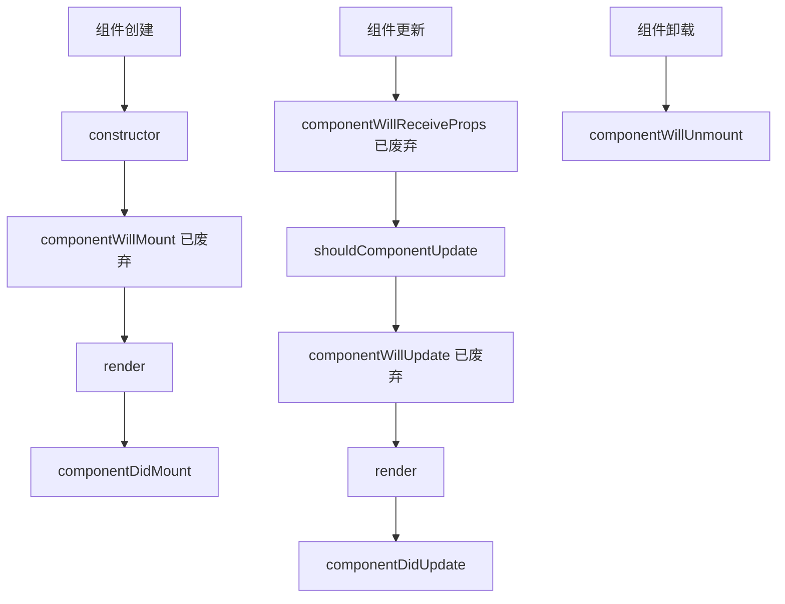

# JavaScript React基础

## React简介

React是由Facebook（现Meta）开发并于2013年开源的JavaScript库，用于构建用户界面，尤其是单页应用程序。它允许开发者使用可复用的组件创建复杂的用户界面，大大简化了前端开发流程。

:::note
React不是一个完整的框架，而是一个专注于构建用户界面的库。它通常与其他库一起使用，如React Router处理路由，Redux或Context API管理状态。
:::

React的核心优势：

1. **组件化思想**：将UI拆分为独立、可复用的组件
2. **单向数据流**：数据自上而下流动，使应用更可预测
3. **虚拟DOM**：提高渲染性能
4. **声明式编程**：告诉程序做什么，而不是怎么做
5. **丰富的生态系统**：拥有大量可用的第三方库和工具

## 环境搭建

要开始使用React，你可以使用Create React App工具快速搭建开发环境：

```bash
npx create-react-app my-app
cd my-app
npm start
```

这将创建一个基本的React项目结构并启动开发服务器。

## React核心概念

### JSX

JSX是React的语法糖，它看起来像HTML，但实际上是JavaScript的扩展。

```jsx
const element = <h1>Hello, React!</h1>;
```

JSX实际上会被编译为React.createElement()调用：

```javascript
const element = React.createElement(
  'h1',
  null,
  'Hello, React!'
);
```

JSX的基本规则：

- 标签必须闭合，如``
- 组件名必须以大写字母开头
- 可以使用花括号`{}`嵌入JavaScript表达式
- 使用`className`代替`class`属性
- 内联样式使用对象语法，如`style={{color: 'red'}}`

### 组件

React应用由组件构建。组件可以是函数组件或类组件：

**函数组件**：

```jsx
function Welcome(props) {
  return <h1>Hello, {props.name}</h1>;
}
```

**类组件**：

```jsx
class Welcome extends React.Component {
  render() {
    return <h1>Hello, {this.props.name}</h1>;
  }
}
```

使用组件：

```jsx
function App() {
  return (
    <div>
      <Welcome name="Alice" />
      <Welcome name="Bob" />
    </div>
  );
}
```

:::tip
现代React开发更倾向于使用函数组件和Hooks，而不是类组件。
:::

### Props

Props（属性）是从父组件传递到子组件的数据：

```jsx
function Welcome(props) {
  return <h1>Hello, {props.name}</h1>;
}

function App() {
  return <Welcome name="React Beginner" />;
}
```

Props的特性：
- 只读的，不应被修改
- 可以是任何JavaScript值（字符串、数字、对象、函数等）
- 可以设置默认值

### State

State用于管理组件内部数据，当State改变时，组件会重新渲染：

使用useState Hook（函数组件）：

```jsx
import React, { useState } from 'react';

function Counter() {
  // 声明一个名为count的state变量，初始值为0
  const [count, setCount] = useState(0);
  
  return (
    <div>
      <p>You clicked {count} times</p>
      <button onClick={() => setCount(count + 1)}>
        Click me
      </button>
    </div>
  );
}
```

在类组件中使用State：

```jsx
class Counter extends React.Component {
  constructor(props) {
    super(props);
    this.state = { count: 0 };
  }
  
  render() {
    return (
      <div>
        <p>You clicked {this.state.count} times</p>
        <button onClick={() => this.setState({ count: this.state.count + 1 })}>
          Click me
        </button>
      </div>
    );
  }
}
```

:::caution
不要直接修改State，应使用setState()或useState Hook提供的更新函数。
:::

### 生命周期与Hooks

**React类组件生命周期**：



**React Hooks**是React 16.8引入的特性，允许在函数组件中使用状态和其他React特性：

常用的Hooks：

1. **useState**：管理状态
2. **useEffect**：处理副作用，如数据获取、订阅或DOM操作

```jsx
import React, { useState, useEffect } from 'react';

function Example() {
  const [count, setCount] = useState(0);
  
  // 类似于componentDidMount和componentDidUpdate
  useEffect(() => {
    // 更新文档标题
    document.title = `You clicked ${count} times`;
    
    // 返回清理函数（类似componentWillUnmount）
    return () => {
      document.title = 'React App';
    };
  }, [count]); // 只有count改变时才会执行
  
  return (
    <div>
      <p>You clicked {count} times</p>
      <button onClick={() => setCount(count + 1)}>
        Click me
      </button>
    </div>
  );
}
```

其他常用Hooks：
- **useContext**：访问React上下文
- **useReducer**：管理复杂状态逻辑
- **useRef**：访问DOM元素或保存任何可变值
- **useMemo**：记忆计算结果以优化性能
- **useCallback**：记忆回调函数以避免不必要的渲染

## 事件处理

React事件处理与DOM事件类似，但有一些语法差异：

```jsx
function Button() {
  function handleClick() {
    alert('Button was clicked!');
  }
  
  return (
    <button onClick={handleClick}>
      Click me
    </button>
  );
}
```

注意事项：
- React事件使用驼峰命名（如onClick，而不是onclick）
- JSX中传入一个函数作为事件处理器，而不是字符串
- 在类组件中，通常需要绑定this以访问组件实例

## 条件渲染

React中可以使用JavaScript的条件表达式进行条件渲染：

**使用if语句**：

```jsx
function Greeting(props) {
  if (props.isLoggedIn) {
    return <h1>Welcome back!</h1>;
  }
  return <h1>Please sign in</h1>;
}
```

**使用三元运算符**：

```jsx
function Greeting(props) {
  return (
    <h1>
      {props.isLoggedIn ? 'Welcome back!' : 'Please sign in'}
    </h1>
  );
}
```

**使用&&运算符**：

```jsx
function Mailbox(props) {
  const unreadMessages = props.unreadMessages;
  return (
    <div>
      <h1>Hello!</h1>
      {unreadMessages.length > 0 &&
        <h2>
          You have {unreadMessages.length} unread messages.
        </h2>
      }
    </div>
  );
}
```

## 列表渲染

使用map()方法渲染列表：

```jsx
function NumberList(props) {
  const numbers = props.numbers;
  const listItems = numbers.map((number) =>
    <li key={number.toString()}>
      {number}
    </li>
  );
  
  return (
    <ul>{listItems}</ul>
  );
}
```

:::warning
渲染列表时，每个元素都应该有一个唯一的"key"属性，这帮助React识别哪些项已更改、添加或删除，提高渲染性能。
:::

## 表单处理

在React中，HTML表单元素与其他DOM元素有所不同，因为它们默认保留内部状态。通常使用"受控组件"模式：

```jsx
import React, { useState } from 'react';

function Form() {
  const [name, setName] = useState('');
  
  function handleSubmit(event) {
    event.preventDefault();
    alert('A name was submitted: ' + name);
  }
  
  return (
    <form onSubmit={handleSubmit}>
      <label>
        Name:
        <input 
          type="text" 
          value={name}
          onChange={(e) => setName(e.target.value)} 
        />
      </label>
      <button type="submit">Submit</button>
    </form>
  );
}
```

## 实际案例：待办事项应用

下面是一个简单的待办事项应用，展示了React的多个核心概念：

```jsx
import React, { useState } from 'react';
import './TodoApp.css';

function TodoApp() {
  const [todos, setTodos] = useState([]);
  const [input, setInput] = useState('');
  
  // 添加新任务
  const addTodo = () => {
    if (input.trim() !== '') {
      setTodos([...todos, { id: Date.now(), text: input, completed: false }]);
      setInput('');
    }
  };
  
  // 切换任务完成状态
  const toggleTodo = (id) => {
    setTodos(
      todos.map(todo => 
        todo.id === id ? { ...todo, completed: !todo.completed } : todo
      )
    );
  };
  
  // 删除任务
  const deleteTodo = (id) => {
    setTodos(todos.filter(todo => todo.id !== id));
  };
  
  return (
    <div className="todo-app">
      <h1>Todo List</h1>
      
      <div className="add-todo">
        <input
          type="text"
          value={input}
          onChange={(e) => setInput(e.target.value)}
          placeholder="Add a new task"
        />
        <button onClick={addTodo}>Add</button>
      </div>
      
      <ul className="todo-list">
        {todos.length === 0 ? (
          <p>No tasks yet! Add one above.</p>
        ) : (
          todos.map(todo => (
            <li
              key={todo.id}
              className={todo.completed ? 'completed' : ''}
            >
              <span onClick={() => toggleTodo(todo.id)}>
                {todo.text}
              </span>
              <button onClick={() => deleteTodo(todo.id)}>Delete</button>
            </li>
          ))
        )}
      </ul>
    </div>
  );
}

export default TodoApp;
```

这个例子展示了：
- 使用useState管理状态
- 事件处理
- 列表渲染
- 条件渲染
- 函数组件

## 总结

React是一个强大而灵活的前端库，通过组件化思想和声明式编程大大简化了UI开发。本文介绍了React的核心概念，包括：

1. JSX语法
2. 组件和Props
3. State和生命周期
4. Hooks
5. 事件处理
6. 条件渲染和列表渲染
7. 表单处理

这些基础知识为进一步学习React的高级特性和相关生态系统打下了坚实基础。

## 进阶学习资源

要继续深入学习React，可以参考以下资源：

1. [React官方文档](https://reactjs.org/docs/getting-started.html) - 最权威的学习资源
2. [React Hooks完全指南](https://reactjs.org/docs/hooks-intro.html) - 深入理解Hooks
3. [React Router](https://reactrouter.com/) - 学习React应用中的路由
4. [Redux](https://redux.js.org/) - 学习复杂应用的状态管理

## 练习挑战

1. **计数器应用**：创建一个带有增加、减少和重置按钮的计数器
2. **扩展待办事项应用**：添加编辑功能和过滤选项（全部/已完成/未完成）
3. **电影列表**：创建一个显示电影列表的应用，支持搜索和筛选功能
4. **天气应用**：使用公共API创建一个显示城市天气的简单应用

通过这些练习，你将巩固React基础知识并提升实战开发能力。

祝你学习愉快！