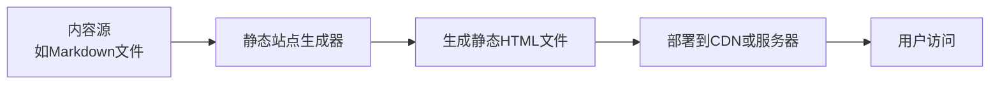
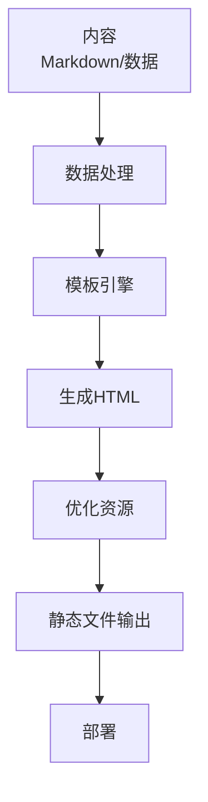

# JavaScript 静态站点生成

## 什么是静态站点生成？

静态站点生成（Static Site Generation，简称SSG）是一种在构建时预先渲染网页内容的技术。与动态网站在每次用户请求时生成HTML不同，静态站点生成器会提前生成所有HTML页面，然后将它们部署到服务器或CDN上。

:::note 关键特点
静态站点生成的网站由纯HTML、CSS和JavaScript文件组成，不需要服务器端渲染，这带来了更快的加载速度和更好的性能。
:::



## 为什么需要静态站点生成？

静态站点生成解决了现代网站开发中的几个关键问题：

1. **性能优化** - 预渲染的HTML文件加载速度极快
2. **安全性提升** - 没有动态生成内容，减少了安全漏洞
3. **部署简便** - 只需静态文件托管，不需要运行服务器
4. **SEO友好** - 搜索引擎更容易抓取完整的HTML内容
5. **降低成本** - 静态托管通常比动态服务器托管便宜

## 主流JavaScript静态站点生成器

### 1. Next.js

Next.js是一个React框架，提供了多种渲染方式，包括静态站点生成。

```javascript
// pages/blog/[slug].js
export async function getStaticPaths() {
  // 返回所有可能的路径
  const posts = await getAllPosts();
  
  return {
    paths: posts.map(post => ({
      params: { slug: post.slug }
    })),
    fallback: false // 404页面处理
  };
}

export async function getStaticProps({ params }) {
  // 获取特定页面的数据
  const post = await getPostBySlug(params.slug);
  
  return {
    props: { post }
  };
}

function BlogPost({ post }) {
  return (
    <article>
      <h1>{post.title}</h1>
      <div dangerouslySetInnerHTML={{ __html: post.content }} />
    </article>
  );
}

export default BlogPost;
```

### 2. Gatsby

Gatsby是一个基于React和GraphQL的强大静态站点生成器，特别擅长处理各种数据源。

```javascript
// gatsby-node.js
exports.createPages = async ({ graphql, actions }) => {
  const { createPage } = actions;
  
  const result = await graphql(`
    query {
      allMarkdownRemark {
        edges {
          node {
            frontmatter {
              slug
            }
          }
        }
      }
    }
  `);
  
  result.data.allMarkdownRemark.edges.forEach(({ node }) => {
    createPage({
      path: node.frontmatter.slug,
      component: path.resolve(`./src/templates/blog-post.js`),
      context: {
        slug: node.frontmatter.slug,
      },
    });
  });
};
```

### 3. 11ty (Eleventy)

11ty是一个更简单的JavaScript静态站点生成器，可以处理多种模板语言。

```javascript
// .eleventy.js
module.exports = function(eleventyConfig) {
  eleventyConfig.addPassthroughCopy("css");
  
  return {
    dir: {
      input: "src",
      output: "_site"
    }
  };
};
```

### 4. Docusaurus

Docusaurus是专为文档站点设计的静态站点生成器，由Facebook开发。

```javascript
// docusaurus.config.js
module.exports = {
  title: '我的项目文档',
  tagline: '简单易用的文档系统',
  url: 'https://mywebsite.com',
  baseUrl: '/',
  onBrokenLinks: 'throw',
  onBrokenMarkdownLinks: 'warn',
  organizationName: 'facebook',
  projectName: 'docusaurus',
  themeConfig: {
    navbar: {
      title: '我的项目',
      logo: {
        alt: 'Logo',
        src: 'img/logo.svg',
      },
      items: [
        {to: 'docs/intro', label: '文档', position: 'left'},
        {to: 'blog', label: '博客', position: 'left'},
      ],
    },
    footer: {
      style: 'dark',
      copyright: `Copyright © ${new Date().getFullYear()} 我的项目`,
    },
  },
  presets: [
    [
      '@docusaurus/preset-classic',
      {
        docs: {
          sidebarPath: require.resolve('./sidebars.js'),
        },
        blog: {
          showReadingTime: true,
        },
      },
    ],
  ],
};
```

## 静态站点生成的工作原理

静态站点生成的一般工作流程如下：

1. **内容创建** - 创建Markdown、MDX等格式的内容
2. **数据获取** - 从API、CMS或本地文件获取数据
3. **模板应用** - 将数据应用到预定义的模板
4. **预渲染** - 生成所有可能的HTML页面
5. **资源优化** - 压缩CSS、JavaScript和图像
6. **输出** - 生成最终的静态文件集
7. **部署** - 将静态文件部署到服务器或CDN



## 静态站点生成与其他渲染方式的比较

| 渲染方式 | 优点 | 缺点 | 适用场景 |
|---------|------|------|---------|
| 静态站点生成 (SSG) | 极快的加载速度、SEO友好、安全性高 | 内容更新需要重新构建 | 博客、文档、营销网站 |
| 服务器端渲染 (SSR) | 动态内容、SEO友好 | 服务器负载高、TTFB较长 | 动态内容频繁更新的应用 |
| 客户端渲染 (CSR) | 交互体验好、减轻服务器负担 | SEO较差、首屏加载慢 | 重交互的Web应用 |
| 增量静态再生成 (ISR) | 静态+动态的结合 | 实现复杂 | 内容定期更新的网站 |

## 实际案例：创建一个简单的博客

让我们使用11ty创建一个简单的博客站点：

### 步骤1：设置项目

```bash
mkdir my-static-blog
cd my-static-blog
npm init -y
npm install --save-dev @11ty/eleventy
```

### 步骤2：创建内容

```markdown
// posts/first-post.md
---
title: 我的第一篇博客
date: 2023-01-01
---

# 这是我的第一篇博客

欢迎访问我的静态博客。这个页面是通过静态站点生成器创建的。
```

### 步骤3：创建模板

```html
// _includes/layout.njk
<!DOCTYPE html>
<html lang="zh">
<head>
  <meta charset="UTF-8">
  <title>{{ title }}</title>
  <link rel="stylesheet" href="/css/style.css">
</head>
<body>
  <header>
    <h1>我的博客</h1>
    <nav>
      <a href="/">主页</a>
    </nav>
  </header>
  <main>
    {{ content | safe }}
  </main>
  <footer>
    <p>&copy; {{ new Date().getFullYear() }} 我的博客</p>
  </footer>
</body>
</html>
```

### 步骤4：配置11ty

```javascript
// .eleventy.js
module.exports = function(eleventyConfig) {
  eleventyConfig.addPassthroughCopy("css");
  
  return {
    dir: {
      input: ".",
      output: "_site",
      includes: "_includes"
    }
  };
};
```

### 步骤5：创建首页模板

```html
// index.njk
---
layout: layout.njk
title: 我的博客首页
---

<h2>最新文章</h2>
<ul>

  <li>
    <a href="{{ post.url }}">{{ post.data.title }}</a>
    <small>{{ post.date | date: "%Y-%m-%d" }}</small>
  </li>

</ul>
```

### 步骤6：构建并部署

```bash
npx @11ty/eleventy --serve
```

这将启动本地开发服务器，你可以在浏览器中预览你的静态博客。

:::tip 部署提示
对于实际部署，你可以使用Netlify、Vercel或GitHub Pages等静态托管服务。大多数服务都支持直接从Git仓库自动构建和部署你的静态网站。
:::

## 静态站点生成的最佳实践

1. **内容组织** - 使用清晰的文件夹结构组织内容
2. **按需加载** - 对大型站点使用代码分割和懒加载
3. **图像优化** - 使用现代图像格式和自动优化工具
4. **增量构建** - 只重新生成已更改内容的页面
5. **预加载关键资源** - 使用`<link rel="preload">`加速关键资源加载
6. **缓存策略** - 实施有效的浏览器缓存策略
7. **持续集成** - 设置自动构建和部署流程

## 静态站点生成的未来发展

静态站点生成技术正在不断发展，下面是几个值得关注的趋势：

1. **增量静态再生成** - 结合静态生成的速度和动态更新的灵活性
2. **分布式内容网络** - 基于内容寻址的分布式网络部署
3. **无头CMS集成** - 更紧密地集成内容管理系统
4. **边缘计算渲染** - 在CDN边缘节点进行部分动态渲染
5. **AI内容生成** - 集成AI自动生成部分网站内容

## 总结

静态站点生成是现代前端开发中的重要技术，特别适合内容为主的网站，如博客、文档和营销网站。通过预先生成HTML页面，SSG提供了卓越的性能、安全性和SEO优势。随着工具的不断发展，JavaScript静态站点生成器正变得越来越强大，为开发者提供了构建快速、安全和可扩展网站的绝佳选择。

## 进一步学习资源

- 尝试创建一个个人博客，使用本文介绍的任一静态站点生成器
- 将现有的动态网站转换为静态网站，比较性能差异
- 探索使用无头CMS (如Contentful、Sanity.io)与静态站点生成器的集成
- 学习如何为静态生成的网站添加动态功能，如评论系统或搜索功能

:::caution 学习建议
静态站点生成是前端开发中的中级概念，建议先掌握HTML、CSS和JavaScript基础知识，再深入学习这一技术。
:::