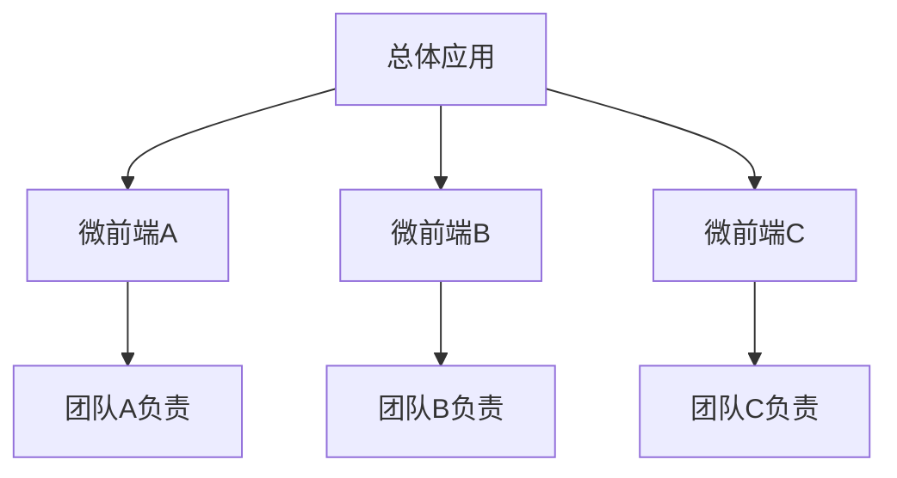

# JavaScript 微前端架构

## 什么是微前端架构？

微前端架构是一种前端开发方法，它将前端应用拆分成更小、更易管理的独立部分，这些部分可以由不同的团队开发、测试和部署。这种架构借鉴了微服务的理念，将其应用到前端开发中，旨在解决大型单体前端应用带来的复杂性和团队协作问题。

:::note 定义
微前端是一种架构风格，其中前端应用被分解为更小、更可管理的片段，这些片段可以独立开发、测试、部署，并在运行时组合成一个完整的应用。
:::



## 为什么需要微前端架构？

随着Web应用的复杂性不断增加，传统的单体前端应用面临着以下挑战：

1. **规模问题**：代码库越来越大，难以管理和维护
2. **技术栈更新**：难以逐步升级技术栈或采用新技术
3. **团队协作**：多团队协作开发同一应用时出现冲突
4. **部署风险**：整体应用部署风险高，bug影响范围大

微前端架构通过模块化和分治的方式解决了这些问题，使前端开发更加灵活和可扩展。

## 微前端的核心原则

要成功实施微前端架构，需要遵循以下核心原则：

1. **团队自治**：每个微前端由一个团队从头到尾负责
2. **技术栈无关**：各团队可以选择自己擅长的技术栈
3. **独立部署**：微前端可以独立构建和部署，不影响其他部分
4. **状态隔离**：各微前端之间状态不共享，减少耦合
5. **运行时整合**：在用户浏览器中动态组合各个微前端

## 微前端的实现方式

微前端有多种实现方式，下面介绍几种常见的方法：

### 1. 基于路由的分发集成

最简单的方式是使用前端路由将不同路径分配给不同的微前端应用。

```javascript
// 主应用中的路由配置
const routes = [
  {
    path: '/app1',
    component: () => loadRemoteApp('app1')
  },
  {
    path: '/app2',
    component: () => loadRemoteApp('app2')
  }
]

function loadRemoteApp(name) {
  // 加载远程微前端应用
  return System.import(name).then(module => {
    return module.default;
  });
}
```

### 2. 使用Web Components

Web Components提供了一种标准机制来创建自定义元素，这使得不同团队可以开发互不干扰的组件。

```javascript
// 定义一个微前端组件
class MicroAppOne extends HTMLElement {
  connectedCallback() {
    this.innerHTML = '<div>这是微前端应用一</div>';
    this.mountApp();
  }
  
  mountApp() {
    // 加载并挂载应用的逻辑
  }
}

// 注册自定义元素
customElements.define('micro-app-one', MicroAppOne);
```

在主应用中使用：

```html
<div id="container">
  <micro-app-one></micro-app-one>
  <micro-app-two></micro-app-two>
</div>
```

### 3. 使用Module Federation (Webpack 5)

Webpack 5引入的Module Federation允许JavaScript应用在运行时动态加载来自其他构建的代码。

```javascript
// webpack.config.js (微前端应用)
module.exports = {
  plugins: [
    new ModuleFederationPlugin({
      name: 'microApp',
      filename: 'remoteEntry.js',
      exposes: {
        './Counter': './src/components/Counter'
      },
      shared: ['react', 'react-dom']
    })
  ]
};

// webpack.config.js (主应用)
module.exports = {
  plugins: [
    new ModuleFederationPlugin({
      name: 'host',
      remotes: {
        microApp: 'microApp@http://localhost:3001/remoteEntry.js'
      },
      shared: ['react', 'react-dom']
    })
  ]
};
```

在主应用中使用：

```javascript
// 动态加载微前端组件
const Counter = React.lazy(() => import('microApp/Counter'));

function App() {
  return (
    <div>
      <h1>主应用</h1>
      <React.Suspense fallback={<div>Loading...</div>}>
        <Counter />
      </React.Suspense>
    </div>
  );
}
```

### 4. 使用专门的微前端框架

目前市场上有一些专门的微前端框架，如single-spa、qiankun等，这些框架提供了成熟的解决方案。

以qiankun为例：

```javascript
// 在主应用中注册微应用
import { registerMicroApps, start } from 'qiankun';

registerMicroApps([
  {
    name: 'reactApp',
    entry: '//localhost:3001',
    container: '#react-container',
    activeRule: '/react-app',
  },
  {
    name: 'vueApp',
    entry: '//localhost:3002',
    container: '#vue-container',
    activeRule: '/vue-app',
  }
]);

// 启动应用
start();
```

## 微前端架构的优势与挑战

### 优势

1. **增量升级**：可以逐步更新应用的部分而不是整体重构
2. **独立部署**：减少部署风险，提高发布频率
3. **团队自主权**：每个团队可以选择最适合的技术栈
4. **代码隔离**：减少应用间的耦合
5. **可伸缩的开发**：支持多团队并行开发

### 挑战

1. **性能开销**：多个应用之间的加载可能导致性能问题
2. **一致性问题**：UI组件、样式和用户体验需要保持一致
3. **调试困难**：跨应用调试比单体应用更复杂
4. **初始设置复杂**：搭建微前端架构需要额外的工作

:::caution 注意事项
实施微前端架构前，请评估项目规模和团队情况。对于小型项目，微前端可能会增加不必要的复杂性。
:::

## 实际案例：电子商务平台

以电子商务平台为例，我们可以将其拆分为多个微前端：

1. **首页应用**：展示推荐商品和促销信息
2. **商品搜索应用**：负责商品搜索和筛选功能
3. **商品详情应用**：展示商品详情和评价
4. **购物车应用**：管理用户购物车
5. **结账应用**：处理支付流程
6. **个人中心应用**：管理用户信息和订单

每个应用由不同的团队负责，可以使用不同的技术栈开发。最终，它们在运行时被组合成一个无缝的用户体验。

让我们看看如何使用Module Federation实现这个案例：

```javascript
// webpack.config.js (商品详情微前端)
module.exports = {
  plugins: [
    new ModuleFederationPlugin({
      name: 'productDetail',
      filename: 'remoteEntry.js',
      exposes: {
        './ProductDetail': './src/components/ProductDetail'
      },
      shared: ['react', 'react-dom']
    })
  ]
};

// webpack.config.js (购物车微前端)
module.exports = {
  plugins: [
    new ModuleFederationPlugin({
      name: 'cart',
      filename: 'remoteEntry.js',
      exposes: {
        './Cart': './src/components/Cart',
        './AddToCart': './src/components/AddToCart'
      },
      shared: ['react', 'react-dom']
    })
  ]
};

// 主应用中使用这些微前端
const ProductDetail = React.lazy(() => import('productDetail/ProductDetail'));
const AddToCart = React.lazy(() => import('cart/AddToCart'));

function App() {
  return (
    <div>
      <Header />
      <React.Suspense fallback={<div>加载中...</div>}>
        <ProductDetail id={productId} />
        <AddToCart productId={productId} />
      </React.Suspense>
      <Footer />
    </div>
  );
}
```

## 微前端通信

微前端之间需要进行通信来协调工作。常用的通信方式包括：

### 1. 基于URL的通信

```javascript
// 微前端A：导航到另一个微前端并传递参数
window.history.pushState(null, null, '/app2?param=value');

// 微前端B：接收参数
const urlParams = new URLSearchParams(window.location.search);
const param = urlParams.get('param'); // 'value'
```

### 2. 自定义事件

```javascript
// 微前端A：发布事件
window.dispatchEvent(new CustomEvent('addToCart', { 
  detail: { productId: '123', quantity: 1 } 
}));

// 微前端B：订阅事件
window.addEventListener('addToCart', (event) => {
  console.log(`添加商品${event.detail.productId}到购物车`);
  // 处理添加到购物车的逻辑
});
```

### 3. 共享状态

可以使用全局状态管理或本地存储在微前端之间共享状态：

```javascript
// 使用localStorage共享数据
// 微前端A
localStorage.setItem('cart', JSON.stringify({ items: [{ id: '123', quantity: 1 }] }));

// 微前端B
const cart = JSON.parse(localStorage.getItem('cart'));
console.log(cart.items); // [{id: '123', quantity: 1}]
```

## 总结

微前端架构是一种有效的解决大型前端应用复杂性的方法，它通过将应用拆分为更小、独立的部分，使得多团队可以并行工作，各自使用最适合的技术栈。虽然微前端架构带来了许多好处，但也带来了新的复杂性和挑战。

在决定采用微前端架构之前，需要根据项目规模、团队结构和业务需求进行权衡。对于大型企业级应用和多团队协作的场景，微前端可能是一个理想的选择；而对于较小的项目，传统的前端架构可能更为简单和高效。

:::tip 建议
从小规模开始尝试微前端架构，例如先将一个非关键功能模块抽取为微前端，然后再逐步扩展到更多模块。
:::

## 练习与进一步学习

1. **练习题**：尝试使用不同的微前端实现方式（如Web Components或Module Federation）创建一个简单的示例应用。
2. **实践项目**：将现有的单体前端应用重构为微前端架构，观察和记录过程中遇到的挑战。
3. **进阶学习**：探索更多微前端框架，如single-spa、qiankun、Piral等，比较它们的优缺点。

## 推荐资源

- 微前端相关框架文档：single-spa、qiankun、Piral
- 深入了解Module Federation的工作原理
- Web Components标准和最佳实践
- 微服务架构设计模式
- 前端构建工具和部署策略

通过深入理解和实践微前端架构，你将能够更好地应对大型前端应用开发中的挑战，为用户提供更好的体验，同时提高开发效率和代码质量。