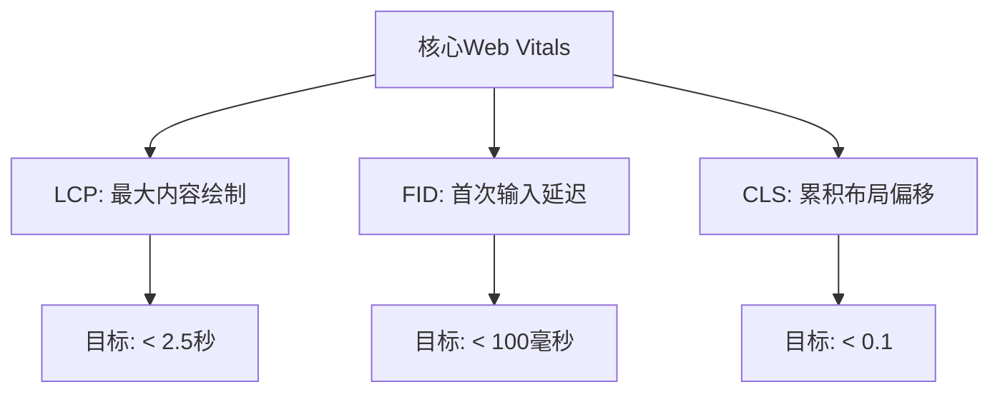

# JavaScript 渐进式Web应用

---
title: JavaScript 渐进式Web应用
description: 了解什么是渐进式Web应用(PWA)，如何构建它们，以及它们为何成为现代Web开发的重要组成部分
---

## 什么是渐进式Web应用 (PWA)?

渐进式Web应用（Progressive Web Applications，简称PWA）是一种结合了最佳Web和原生应用特性的现代Web应用程序。PWA允许开发者创建能够在各种平台上运行的应用程序，提供近似原生应用的用户体验。

:::tip 要点
PWA的核心理念是"渐进式增强"—从基本功能开始，根据用户设备和浏览器的能力逐步添加更高级的功能。
:::

## PWA的关键特性

渐进式Web应用具备以下几个关键特性：

1. **可靠性** - 即使在不稳定或离线的网络条件下也能加载
2. **快速** - 响应用户交互迅速，动画流畅
3. **引人入胜** - 感觉像设备上的原生应用
4. **可安装** - 允许用户将应用添加到主屏幕
5. **可链接** - 可通过URL轻松分享
6. **响应式** - 适应任何屏幕尺寸：桌面、移动设备或平板电脑
7. **安全** - 通过HTTPS提供服务

## PWA的核心技术

要构建PWA，你需要了解几项关键技术：

### 1. Service Workers

Service Workers是PWA背后的核心技术，它们是在浏览器后台运行的JavaScript文件，与网页分开。它们充当网络请求的代理，使开发者能够缓存资源并提供离线体验。

```javascript
// 注册Service Worker
if ('serviceWorker' in navigator) {
  window.addEventListener('load', () => {
    navigator.serviceWorker.register('/service-worker.js')
      .then(registration => {
        console.log('Service Worker注册成功:', registration.scope);
      })
      .catch(error => {
        console.log('Service Worker注册失败:', error);
      });
  });
}
```

### 2. Web App Manifest

Web应用清单(Manifest)是一个简单的JSON文件，它使开发者能够控制应用在用户安装到设备时的显示方式。

```json
{
  "name": "我的PWA应用",
  "short_name": "PWA应用",
  "start_url": "/index.html",
  "display": "standalone",
  "background_color": "#ffffff",
  "theme_color": "#2196f3",
  "icons": [
    {
      "src": "/images/icon-192x192.png",
      "sizes": "192x192",
      "type": "image/png"
    },
    {
      "src": "/images/icon-512x512.png",
      "sizes": "512x512",
      "type": "image/png"
    }
  ]
}
```

在HTML页面中链接清单文件：

```html
<link rel="manifest" href="/manifest.json" />
```

### 3. HTTPS

PWA必须通过安全连接（HTTPS）提供服务，以确保内容未被篡改。这是使用Service Worker的要求。

## 如何构建简单的PWA

让我们通过一个基本示例来了解如何构建PWA：

### 步骤1：创建基本的Web应用

```html
<!DOCTYPE html>
<html lang="zh">
<head>
  <meta charset="UTF-8">
  <meta name="viewport" content="width=device-width, initial-scale=1.0">
  <title>我的PWA应用</title>
  <link rel="stylesheet" href="styles.css">
  <link rel="manifest" href="manifest.json">
</head>
<body>
  <header>
    <h1>PWA示例应用</h1>
  </header>
  <main>
    <p>这是一个简单的渐进式Web应用示例。</p>
    <button id="installBtn" style="display: none;">安装应用</button>
  </main>
  <script src="app.js"></script>
</body>
</html>
```

### 步骤2：创建Web应用清单

```json
{
  "name": "PWA示例应用",
  "short_name": "PWA示例",
  "start_url": "/index.html",
  "display": "standalone",
  "background_color": "#ffffff",
  "theme_color": "#4285f4",
  "icons": [
    {
      "src": "/images/icon-192x192.png",
      "sizes": "192x192",
      "type": "image/png"
    },
    {
      "src": "/images/icon-512x512.png",
      "sizes": "512x512",
      "type": "image/png"
    }
  ]
}
```

### 步骤3：创建Service Worker

**service-worker.js:**

```javascript
// 缓存名称
const CACHE_NAME = 'pwa-cache-v1';
// 要缓存的资源
const urlsToCache = [
  '/',
  '/index.html',
  '/styles.css',
  '/app.js'
];

// 安装Service Worker并缓存资源
self.addEventListener('install', event => {
  event.waitUntil(
    caches.open(CACHE_NAME)
      .then(cache => {
        console.log('资源缓存中');
        return cache.addAll(urlsToCache);
      })
  );
});

// 从缓存中获取资源
self.addEventListener('fetch', event => {
  event.respondWith(
    caches.match(event.request)
      .then(response => {
        // 如果找到缓存的响应，则返回它
        if (response) {
          return response;
        }
        
        // 否则，从网络获取资源
        return fetch(event.request)
          .then(response => {
            // 检查是否收到有效响应
            if (!response || response.status !== 200 || response.type !== 'basic') {
              return response;
            }
            
            // 克隆响应，因为响应是数据流，只能使用一次
            const responseToCache = response.clone();
            
            caches.open(CACHE_NAME)
              .then(cache => {
                // 将资源添加到缓存
                cache.put(event.request, responseToCache);
              });
              
            return response;
          });
      })
  );
});

// 清理旧缓存
self.addEventListener('activate', event => {
  const cacheWhitelist = [CACHE_NAME];
  
  event.waitUntil(
    caches.keys().then(cacheNames => {
      return Promise.all(
        cacheNames.map(cacheName => {
          if (cacheWhitelist.indexOf(cacheName) === -1) {
            // 删除不在白名单中的缓存
            return caches.delete(cacheName);
          }
        })
      );
    })
  );
});
```

### 步骤4：在应用中注册Service Worker

**app.js:**

```javascript
// 注册Service Worker
if ('serviceWorker' in navigator) {
  window.addEventListener('load', () => {
    navigator.serviceWorker.register('/service-worker.js')
      .then(registration => {
        console.log('Service Worker注册成功:', registration.scope);
      })
      .catch(error => {
        console.log('Service Worker注册失败:', error);
      });
  });
}

// 处理"添加到主屏幕"功能
let deferredPrompt;
const installBtn = document.getElementById('installBtn');

window.addEventListener('beforeinstallprompt', (e) => {
  // 阻止Chrome 67及更早版本自动显示安装提示
  e.preventDefault();
  // 存储事件以便稍后触发
  deferredPrompt = e;
  // 显示安装按钮
  installBtn.style.display = 'block';
  
  installBtn.addEventListener('click', () => {
    // 隐藏按钮
    installBtn.style.display = 'none';
    // 显示安装提示
    deferredPrompt.prompt();
    // 等待用户响应提示
    deferredPrompt.userChoice.then((choiceResult) => {
      if (choiceResult.outcome === 'accepted') {
        console.log('用户接受了安装');
      } else {
        console.log('用户拒绝了安装');
      }
      deferredPrompt = null;
    });
  });
});
```

## PWA的关键性能指标

Google定义了一些核心Web Vitals，对于PWA来说尤为重要：



## 实际案例：离线待办事项应用

以下是一个简单的离线待办事项应用的基本逻辑：

```javascript
// 待办事项数组
let todos = [];

// DOM元素
const todoForm = document.getElementById('todo-form');
const todoInput = document.getElementById('todo-input');
const todoList = document.getElementById('todo-list');
const offlineStatus = document.getElementById('offline-status');

// 检查在线状态
function updateOnlineStatus() {
  if (navigator.onLine) {
    offlineStatus.style.display = 'none';
    // 尝试同步到服务器
    syncToServer();
  } else {
    offlineStatus.style.display = 'block';
    offlineStatus.textContent = '你处于离线状态，待办事项将在恢复连接后同步';
  }
}

// 加载待办事项
function loadTodos() {
  // 从localStorage加载
  const storedTodos = localStorage.getItem('pwa-todos');
  if (storedTodos) {
    todos = JSON.parse(storedTodos);
    renderTodos();
  }
}

// 保存待办事项
function saveTodos() {
  localStorage.setItem('pwa-todos', JSON.stringify(todos));
  // 尝试同步
  updateOnlineStatus();
}

// 渲染待办事项
function renderTodos() {
  todoList.innerHTML = '';
  
  todos.forEach((todo, index) => {
    const li = document.createElement('li');
    li.textContent = todo.text;
    
    if (todo.completed) {
      li.classList.add('completed');
    }
    
    // 添加完成切换按钮
    const toggleBtn = document.createElement('button');
    toggleBtn.textContent = todo.completed ? '取消完成' : '完成';
    toggleBtn.addEventListener('click', () => toggleTodo(index));
    
    // 添加删除按钮
    const deleteBtn = document.createElement('button');
    deleteBtn.textContent = '删除';
    deleteBtn.addEventListener('click', () => deleteTodo(index));
    
    li.appendChild(toggleBtn);
    li.appendChild(deleteBtn);
    todoList.appendChild(li);
  });
}

// 添加新待办事项
function addTodo(text) {
  todos.push({ text, completed: false, synced: false });
  saveTodos();
  renderTodos();
}

// 切换待办事项状态
function toggleTodo(index) {
  todos[index].completed = !todos[index].completed;
  todos[index].synced = false;
  saveTodos();
  renderTodos();
}

// 删除待办事项
function deleteTodo(index) {
  todos.splice(index, 1);
  saveTodos();
  renderTodos();
}

// 同步到服务器（示例，实际情况下会连接到后端API）
function syncToServer() {
  // 仅在在线时进行同步
  if (!navigator.onLine) return;
  
  // 过滤未同步的待办事项
  const unsynced = todos.filter(todo => !todo.synced);
  
  if (unsynced.length === 0) return;
  
  // 在实际应用中，这会是一个fetch请求到后端API
  console.log('正在同步待办事项:', unsynced);
  
  // 模拟同步成功
  todos = todos.map(todo => ({ ...todo, synced: true }));
  localStorage.setItem('pwa-todos', JSON.stringify(todos));
}

// 事件监听器
todoForm.addEventListener('submit', (e) => {
  e.preventDefault();
  const text = todoInput.value.trim();
  if (text) {
    addTodo(text);
    todoInput.value = '';
  }
});

// 监听在线状态变化
window.addEventListener('online', updateOnlineStatus);
window.addEventListener('offline', updateOnlineStatus);

// 初始化
loadTodos();
updateOnlineStatus();
```

:::note
实际应用程序还需要HTML和CSS来完成界面，上面的代码只展示了核心JavaScript逻辑。
:::

## PWA的优势与挑战

### 优势

1. **多平台兼容性** - 一次开发，跨平台运行
2. **无需应用商店审核** - 可以直接更新，无需等待审核
3. **较低的开发成本** - 相比开发多个原生应用更经济
4. **离线功能** - 即使没有网络连接也能工作
5. **更小的占用空间** - 相比原生应用通常需要更少的存储空间
6. **无需安装即可使用** - 用户可以先尝试再决定是否安装

### 挑战

1. **浏览器支持** - 不同浏览器对PWA功能的支持程度不同
2. **硬件功能限制** - 对某些高级设备功能的访问可能受限
3. **发现性** - 没有集中式应用商店，用户可能不容易发现
4. **性能** - 虽然越来越好，但仍可能不如原生应用流畅

## PWA审核工具

Google提供了Lighthouse工具，它集成在Chrome开发者工具中，可以评估你的PWA并提供改进建议。

Lighthouse检查以下几个方面：

1. 性能
2. 可访问性
3. 最佳实践
4. SEO
5. PWA特定功能

## PWA框架和库

构建PWA时，可以利用以下一些流行的框架和库：

1. **Workbox** - Google的一套库，简化Service Worker开发
2. **Angular** - 内置PWA支持
3. **React** - 可以与Create React App的PWA模板一起使用
4. **Vue** - Vue CLI提供PWA插件
5. **Ionic** - 专注于移动PWA的框架
6. **Preact** - 轻量级React替代品，非常适合PWA

## 总结

渐进式Web应用代表了现代Web开发的重要趋势，它们结合了Web的可访问性和原生应用的功能。通过Service Workers、Web App Manifest和HTTPS，开发者可以创建快速、可靠且引人入胜的应用体验。

PWA不仅提供了出色的用户体验，还为企业提供了潜在的成本节约和更广泛的用户覆盖。虽然PWA存在一些限制，但随着Web平台的不断发展，这些限制正在逐渐减少。

### 下一步学习

要继续深入了解PWA，可以尝试以下练习：

1. 将现有的简单网站转换为PWA
2. 实现一个使用缓存策略的离线应用
3. 使用IndexedDB存储和同步数据
4. 使用Lighthouse审核你的PWA并优化性能

### 推荐资源

- Google的PWA培训: [web.dev/progressive-web-apps](https://web.dev/progressive-web-apps/)
- Mozilla的PWA文档: [MDN Web Docs](https://developer.mozilla.org/zh-CN/docs/Web/Progressive_web_apps)
- Workbox文档: [developers.google.com/web/tools/workbox](https://developers.google.com/web/tools/workbox)

通过掌握PWA，你将能够构建更快速、更可靠且更具吸引力的Web应用，使你的用户无论使用何种设备或网络条件都能获得出色的体验。