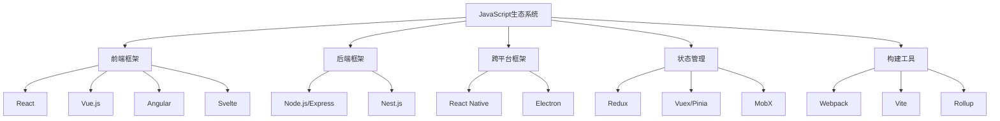

# JavaScript 框架生态系统

## 什么是JavaScript框架？

JavaScript框架是一套预先写好的JavaScript代码库，它提供了一种结构化的方式来构建Web应用程序。框架通常包含各种工具和功能，如DOM操作、事件处理、状态管理等，让开发者能够更快速、更高效地构建复杂的应用程序。

:::note
框架和库的区别：库是你调用的代码，而框架是调用你的代码。框架提供了应用程序的结构和基础设施，而库则提供了特定功能的实现。
:::



## 主流前端框架对比

### React

由Facebook（现Meta）开发的React是目前市场上最流行的JavaScript库之一。它以组件化开发和虚拟DOM为核心概念。

**核心特点：**
- 组件化架构
- 虚拟DOM
- 单向数据流
- JSX语法
- 丰富的生态系统

**简单示例：**

```jsx
import React from 'react';

function HelloWorld() {
  return (
    <div>
      <h1>Hello, React!</h1>
      <p>Welcome to the React world.</p>
    </div>
  );
}

export default HelloWorld;
```

**适用场景：**
- 大型、复杂的单页应用（SPA）
- 需要高度定制化的UI界面
- 对性能要求较高的应用
- 有较大开发团队的项目

### Vue.js

Vue.js是一个渐进式JavaScript框架，由尤雨溪开发。它的设计意图是尽可能地简化前端开发，使开发者能够快速上手。

**核心特点：**
- 渐进式采用
- 响应式数据绑定
- 模板系统
- 组件化
- 轻量级

**简单示例：**

```vue
<template>
  <div>
    <h1>Hello, Vue!</h1>
    <p>Count: {{ count }}</p>
    <button @click="increment">Increment</button>
  </div>
</template>

<script>
export default {
  data() {
    return {
      count: 0
    }
  },
  methods: {
    increment() {
      this.count++
    }
  }
}
</script>
```

**适用场景：**
- 需要快速开发的项目
- 小到中型应用
- 希望有较低学习曲线的团队
- 渐进式升级老项目

### Angular

Angular是由Google维护的全功能前端框架，基于TypeScript开发，适合构建企业级应用。

**核心特点：**
- 基于TypeScript
- 双向数据绑定
- 依赖注入
- 完整的MVC架构
- 内置表单验证、路由等功能

**简单示例：**

```typescript
import { Component } from '@angular/core';

@Component({
  selector: 'app-hello-world',
  template: `
    <h1>Hello, Angular!</h1>
    <p>This is an Angular component.</p>
  `
})
export class HelloWorldComponent {
  constructor() { }
}
```

**适用场景：**
- 大型企业应用
- 需要严格类型检查的项目
- 大型团队协作开发
- 需要全面框架功能的项目

### Svelte

Svelte是一个较新的前端框架，它采用了编译时优化而非运行时解释的方式，使应用体积更小、性能更高。

**核心特点：**
- 编译时框架
- 无虚拟DOM
- 更少的样板代码
- 真正的反应性
- 内置动画系统

**简单示例：**

```svelte
<script>
  let count = 0;
  
  function increment() {
    count += 1;
  }
</script>

<h1>Hello, Svelte!</h1>
<p>Count: {count}</p>
<button on:click={increment}>Increment</button>
```

**适用场景：**
- 对性能和加载时间要求严格的应用
- 小型到中型项目
- 对简洁代码有偏好的开发团队
- 嵌入式组件或微前端架构

## 状态管理工具

随着前端应用变得越来越复杂，状态管理工具成为了不可或缺的一部分。

### Redux

Redux是React生态系统中最流行的状态管理库，基于Flux架构。

**核心概念：**
- Store（单一数据源）
- Action（描述发生的事件）
- Reducer（响应Action并更新状态）
- 不可变状态

**简单示例：**

```javascript
// Actions
const INCREMENT = 'INCREMENT';

// Action creators
function increment() {
  return { type: INCREMENT };
}

// Reducer
function counterReducer(state = { count: 0 }, action) {
  switch (action.type) {
    case INCREMENT:
      return { count: state.count + 1 };
    default:
      return state;
  }
}

// Store
import { createStore } from 'redux';
const store = createStore(counterReducer);

// 使用
store.dispatch(increment());
console.log(store.getState()); // { count: 1 }
```

### Vuex/Pinia

Vuex是Vue生态系统中的状态管理库，而Pinia是其新一代替代品。

**Vuex核心概念：**
- State（状态）
- Mutations（同步更改状态）
- Actions（异步操作）
- Getters（计算属性）

**Pinia示例：**

```javascript
// 定义store
import { defineStore } from 'pinia';

export const useCounterStore = defineStore('counter', {
  state: () => ({ count: 0 }),
  actions: {
    increment() {
      this.count++;
    }
  }
});

// 使用store
import { useCounterStore } from './stores/counter';

export default {
  setup() {
    const counter = useCounterStore();
    
    function incrementAndPrint() {
      counter.increment();
      console.log(counter.count);
    }
    
    return { counter, incrementAndPrint };
  }
};
```

## 构建工具与打包器

构建工具是现代JavaScript开发不可或缺的一部分，它们帮助开发者处理模块化、转译、压缩等任务。

### Webpack

Webpack是目前最广泛使用的打包工具，具有强大的模块打包能力。

**核心功能：**
- 模块打包
- 代码分割
- 热模块替换
- 资源处理（图片、CSS等）
- 开发服务器

### Vite

Vite是新一代前端构建工具，由Vue.js的作者开发，以快速的冷启动和即时的热模块替换著称。

**核心功能：**
- 基于ES模块的开发服务器
- 快速的热模块替换
- 优化的构建过程
- 开箱即用的支持

**简单配置示例：**

```javascript
// vite.config.js
import { defineConfig } from 'vite';
import react from '@vitejs/plugin-react';

export default defineConfig({
  plugins: [react()],
  server: {
    port: 3000
  },
  build: {
    outDir: 'dist'
  }
});
```

## 测试框架

JavaScript生态系统中有多种测试工具可供选择：

- **Jest**：Facebook开发的零配置测试框架
- **Mocha**：灵活的JavaScript测试框架
- **Cypress**：现代化的端到端测试框架
- **Testing Library**：以用户视角进行测试的库

**Jest测试示例：**

```javascript
// sum.js
export function sum(a, b) {
  return a + b;
}

// sum.test.js
import { sum } from './sum';

test('adds 1 + 2 to equal 3', () => {
  expect(sum(1, 2)).toBe(3);
});
```

## 实际案例分析：如何选择框架

让我们通过一个实际案例来探讨如何选择适合你的项目的JavaScript框架。

### 场景：开发一个在线电商网站

**考虑因素：**
1. **团队规模和经验**：中型团队，大部分开发者有JavaScript基础但框架经验有限
2. **项目复杂度**：中高复杂度，包含商品列表、购物车、支付系统等
3. **性能要求**：页面加载速度要求高，特别是商品列表页
4. **开发时间**：6个月内需要上线

**分析：**
- **React** 提供了强大的组件模型和丰富的生态系统，但学习曲线较陡
- **Vue.js** 有更平缓的学习曲线，适合团队快速上手
- **Angular** 提供了完整的解决方案，但可能过于重量级
- **Svelte** 性能优异，但生态系统相对不够成熟

**推荐选择：**
基于团队经验和项目需求，Vue.js可能是最佳选择，因为：
- 学习曲线较平缓，团队可以快速上手
- 性能足够满足需求
- 有完善的生态系统支持电商应用开发
- 官方文档清晰完整，有助于新手学习

:::tip 框架选择建议
选择框架时，不要只看流行度，而要考虑：
1. 团队的技术栈和学习能力
2. 项目的具体需求和复杂度
3. 框架的生态系统和社区支持
4. 长期维护的便利性
:::

## 全栈JavaScript解决方案

JavaScript不仅能用于前端，还能用于后端开发，形成全栈JavaScript解决方案。

### MERN栈
- **M**ongoDB (数据库)
- **E**xpress.js (后端框架)
- **R**eact (前端库)
- **N**ode.js (运行环境)

### MEAN栈
- **M**ongoDB
- **E**xpress.js
- **A**ngular
- **N**ode.js

### Jamstack
- **J**avaScript
- **A**PIs
- **M**arkup

## 总结

JavaScript框架生态系统非常丰富多样，每个框架都有其独特的优势和适用场景：

- **React** 适合构建大型、复杂的应用，拥有最大的社区支持
- **Vue.js** 易于学习和使用，适合快速开发和渐进式升级
- **Angular** 提供全面的解决方案，适合大型企业应用
- **Svelte** 提供卓越的性能，适合注重速度的项目

作为初学者，建议先深入学习一个框架，掌握其核心概念和最佳实践，然后再逐步了解其他框架。无论选择哪个框架，理解JavaScript基础知识永远是最重要的。

## 学习资源与练习

### 推荐学习资源

1. **官方文档**：
   - React: [reactjs.org](https://reactjs.org/)
   - Vue: [vuejs.org](https://vuejs.org/)
   - Angular: [angular.io](https://angular.io/)

2. **在线课程平台**：
   - Codecademy
   - Udemy
   - freeCodeCamp

### 练习项目

1. **初级**：创建一个待办事项应用（Todo List）
2. **中级**：构建一个天气应用，使用公开API获取数据
3. **高级**：开发一个具有用户认证和数据持久化的博客系统

:::caution 学习建议
不要陷入"框架选择困难症"。选择一个框架深入学习，构建真实项目是提高技能的最佳方式。技术在不断发展，但学习编程的基本思维和解决问题的能力是永恒的。
:::