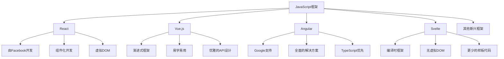

# JavaScript 框架选择指南

## 框架的意义

在开始学习具体框架前，你可能会问：为什么需要JavaScript框架？直接使用原生JavaScript不就可以了吗？

:::note
框架是一套预先规划好的解决方案，它通过提供结构化的代码组织方式、优化的性能处理机制以及丰富的功能模块，使开发人员能够更高效地构建复杂的Web应用。
:::

现代Web应用变得越来越复杂，使用原生JavaScript开发会面临以下挑战：

- **代码组织难度增加**：随着项目规模扩大，维护原生JavaScript代码变得困难
- **DOM操作繁琐**：频繁手动操作DOM既耗时又容易出错
- **状态管理复杂**：在大型应用中跟踪和更新数据状态变得极具挑战性
- **跨浏览器兼容**：处理不同浏览器的兼容问题需要大量额外代码

框架通过提供统一的开发范式和工具，优雅地解决了这些问题。

## 主流JavaScript框架概览

以下是目前市场上最受欢迎的几个JavaScript框架：



### React

**简介**：由Facebook开发和维护的声明式UI库，专注于构建用户界面组件。

**特点**：
- 基于组件的架构
- 虚拟DOM技术提高渲染性能
- JSX语法使组件编写直观
- 单向数据流
- 大型社区和生态系统

**适用场景**：中大型Web应用、需要高性能的复杂UI、跨平台开发（通过React Native）

**简单示例**：

```jsx
import React from 'react';

function Welcome() {
  return <h1>Hello, React!</h1>;
}

// 使用组件
function App() {
  return (
    <div>
      <Welcome />
      <p>这是我的第一个React组件</p>
    </div>
  );
}

export default App;
```

:::tip React的学习曲线
虽然React的核心概念相对简单，但掌握它的生态系统（如Redux、React Router等）可能需要一些时间。
:::

### Vue.js

**简介**：渐进式JavaScript框架，由前Google工程师尤雨溪创建。

**特点**：
- 易于学习和集成
- 直观的模板语法
- 双向数据绑定
- 组件化开发
- 优秀的文档和友好的社区

**适用场景**：初学者的第一个框架、中小型项目、需要快速开发的项目、逐步迁移的旧项目

**简单示例**：

```html
<div id="app">
  <h1>{{ message }}</h1>
</div>

<script>
const app = Vue.createApp({
  data() {
    return {
      message: 'Hello, Vue!'
    }
  }
});
app.mount('#app');
</script>
```

:::tip
Vue 3 提供了Composition API，使代码复用和组织更加灵活，同时保留了Options API的简洁性。
:::

### Angular

**简介**：由Google维护的完整前端框架，提供了一整套工具和功能。

**特点**：
- 基于TypeScript
- 完整的MVC架构
- 依赖注入系统
- 双向数据绑定
- 集成了路由、表单、HTTP客户端等功能

**适用场景**：企业级应用、大型团队项目、需要严格类型系统的项目

**简单示例**：

```typescript
import { Component } from '@angular/core';

@Component({
  selector: 'app-root',
  template: `
    <h1>{{ title }}</h1>
    <p>欢迎使用 Angular!</p>
  `
})
export class AppComponent {
  title = 'Angular 应用';
}
```

:::caution
Angular的学习曲线较陡峭，对初学者来说可能具有挑战性，但它在企业级应用中表现出色。
:::

### Svelte

**简介**：相对较新的框架，采用编译时而非运行时方法。

**特点**：
- 无虚拟DOM
- 编译时优化
- 更少的样板代码
- 真正的反应式
- 较小的包体积

**适用场景**：性能关键型应用、小型到中型项目、对包大小敏感的场景

**简单示例**：

```svelte
<script>
  let name = 'Svelte';
</script>

<h1>Hello {name}!</h1>
<style>
  h1 {
    color: #ff3e00;
  }
</style>
```

:::note
Svelte不同于其他框架，它在构建时将你的代码转换为高效的命令式代码，而不是在浏览器中解释框架代码。
:::

## 如何选择适合你的框架

选择合适的框架取决于多种因素：

### 项目需求考量

| 因素 | 考虑点 |
|------|--------|
| 项目规模 | 小型项目可能Vue或Svelte更合适；大型项目React或Angular可能更好 |
| 性能要求 | 需要极致性能优化？考虑React或Svelte |
| 开发时间 | 需要快速开发原型？Vue可能是更好的选择 |
| 团队经验 | 团队已熟悉某框架？可能继续使用更有效率 |

### 学习曲线比较

从易到难排序：
1. **Vue.js** - 对初学者最友好
2. **Svelte** - 概念简单，语法直观
3. **React** - 核心概念不复杂，但生态系统庞大
4. **Angular** - 学习曲线最陡峭，概念较多

### 社区和生态系统

评估以下方面：
- 社区活跃度和规模
- 第三方库和插件的可用性
- 就业市场需求
- 长期维护和支持前景

## 实际案例分析

### 案例1：电子商务平台

**需求**：
- 复杂的产品目录
- 用户购物车和结账流程
- 用户账户管理
- SEO优化

**推荐框架**：React + Next.js

**理由**：
- Next.js提供服务器端渲染，有利于SEO
- React的组件模型适合管理复杂UI状态
- React生态系统中有成熟的状态管理解决方案
- 大量电商相关的组件库可用

### 案例2：公司内部管理系统

**需求**：
- 复杂的表单处理
- 数据可视化
- 严格的类型检查
- 多人协作开发

**推荐框架**：Angular

**理由**：
- 内置表单验证和处理功能
- TypeScript支持有助于大型团队协作
- 完整的工具链和标准化架构
- 适合长期维护的企业级应用

### 案例3：内容密集型网站

**需求**：
- 快速加载时间
- 内容优先的展示
- 较简单的交互
- 渐进式增强

**推荐框架**：Vue.js 或 Svelte

**理由**：
- 较小的库体积有助于快速加载
- 简单直观的模板系统
- 可以逐步集成到现有网站
- 对内容密集型网站的开销较小

## 入门学习路径

无论你选择哪个框架，以下是一个通用的学习路径：

1. **掌握JavaScript基础**
   - 变量、函数、对象
   - ES6+特性（箭头函数、解构、模块等）
   - 异步编程（Promise、async/await）

2. **学习框架核心概念**
   - 组件模型
   - 数据绑定和渲染
   - 状态管理
   - 生命周期

3. **构建小型项目**
   - 待办事项应用
   - 简单的博客或内容展示页面
   - 数据可视化实验

4. **深入学习生态系统**
   - 路由（React Router、Vue Router等）
   - 状态管理（Redux、Vuex、Context API等）
   - API集成和数据获取

5. **学习相关工具**
   - 构建工具（Webpack、Vite等）
   - 测试框架（Jest、Testing Library等）
   - TypeScript（类型安全）

## 总结

选择JavaScript框架是开发生涯的重要决定，需要考虑多方面因素：

- **React**: 适合构建复杂、高性能的UI，拥有庞大的社区支持
- **Vue.js**: 易学易用，适合从小项目开始，渐进式采用
- **Angular**: 全面而严格的框架，适合大型企业级应用
- **Svelte**: 创新的编译时框架，优化性能和开发体验

:::tip 初学者建议
如果你是完全的初学者，Vue.js可能是入门的最佳选择，因为它的学习曲线相对平缓。一旦理解了基本概念，可以根据职业目标和个人喜好探索其他框架。
:::

记住，了解一个框架的核心思想后，学习其他框架会变得容易得多。框架只是工具，真正重要的是解决问题的能力和良好的编程实践。

## 延伸资源

### 学习资料
- React官方文档: [https://reactjs.org/docs/getting-started.html](https://reactjs.org/docs/getting-started.html)
- Vue.js指南: [https://vuejs.org/guide/introduction.html](https://vuejs.org/guide/introduction.html)
- Angular入门: [https://angular.io/start](https://angular.io/start)
- Svelte教程: [https://svelte.dev/tutorial](https://svelte.dev/tutorial)

### 练习项目
1. 创建一个简单的待办事项应用
2. 构建一个天气查询应用（使用公共API）
3. 开发一个简易博客系统
4. 实现一个购物车功能

选择你感兴趣的框架，尝试用它来实现这些项目，这是掌握框架最有效的方法！