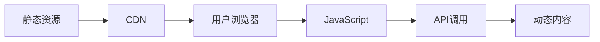

# JavaScript 前端趋势

## 引言

前端开发领域日新月异，各种JavaScript框架、库和工具不断涌现，让初学者常常感到眼花缭乱。本文将为你梳理当前JavaScript前端开发的主要趋势，帮助你了解这个充满活力的技术生态系统，为你的学习之旅提供方向。

:::note
了解前端趋势不仅能帮助你做出更明智的技术选择，还能让你的技能更加符合市场需求。
:::

## 主流框架概览

### React: 组件化UI库的王者

[React](https://reactjs.org/) 由Facebook开发并于2013年开源，目前仍保持着前端框架的主导地位。

**主要特点：**
- 组件化架构
- 虚拟DOM提高渲染效率
- JSX语法
- 单向数据流
- 丰富的生态系统

**简单示例：**

```jsx
import React, { useState } from 'react';

function Counter() {
  const [count, setCount] = useState(0);
  
  return (
    <div>
      <h1>计数器: {count}</h1>
      <button onClick={() => setCount(count + 1)}>
        增加
      </button>
    </div>
  );
}

export default Counter;
```

### Vue: 渐进式JavaScript框架

[Vue](https://vuejs.org/) 由尤雨溪创建，以其简单易学和灵活性受到广泛欢迎，特别在中国开发者社区极为流行。

**主要特点：**
- 渐进式框架设计
- 响应式数据绑定
- 模板语法简洁直观
- 组件系统
- 易于集成

**简单示例：**

```vue
<template>
  <div>
    <h1>计数器: {{ count }}</h1>
    <button @click="increment">增加</button>
  </div>
</template>

<script>
export default {
  data() {
    return {
      count: 0
    }
  },
  methods: {
    increment() {
      this.count += 1
    }
  }
}
</script>
```

### Angular: 完整的前端MVC框架

[Angular](https://angular.io/) 由Google维护，是一个完整的前端框架，适合构建企业级应用。

**主要特点：**
- TypeScript原生支持
- 完整的MVC架构
- 依赖注入
- RxJS集成
- 强大的表单处理

**简单示例：**

```typescript
import { Component } from '@angular/core';

@Component({
  selector: 'app-counter',
  template: `
    <div>
      <h1>计数器: {{ count }}</h1>
      <button (click)="increment()">增加</button>
    </div>
  `
})
export class CounterComponent {
  count = 0;
  
  increment(): void {
    this.count++;
  }
}
```

## 前端架构趋势

### JAMstack

JAMstack代表JavaScript、API和Markup的组合，强调前端与后端的解耦，提倡静态站点生成。



**流行工具：**
- Next.js (React)
- Nuxt.js (Vue)
- Gatsby
- Astro

### 微前端架构

微前端是一种将前端应用拆分成更小、独立部署的子应用的架构方式，每个团队可以独立开发、测试和部署其负责的部分。

**主要优势：**
- 增量升级
- 独立部署
- 技术栈灵活
- 团队自主性

**实现方式：**

```js
// 主应用
import { registerApplication, start } from 'single-spa';

registerApplication(
  'app1',
  () => import('./app1/main.js'),
  location => location.pathname.startsWith('/app1')
);

registerApplication(
  'app2',
  () => import('./app2/main.js'),
  location => location.pathname.startsWith('/app2')
);

start();
```

## 最新技术趋势

### 服务端组件 (Server Components)

React 18引入的服务端组件允许开发者在服务器上渲染组件，减少客户端JavaScript包的大小，提高性能。

```jsx
// 服务端组件示例 (React 18+)
// 文件: ProductDetails.server.jsx
import { db } from './database';

async function ProductDetails({ id }) {
  const product = await db.query(`SELECT * FROM products WHERE id = ${id}`);
  
  return (
    <div>
      <h1>{product.name}</h1>
      <p>{product.description}</p>
      <span>¥{product.price}</span>
    </div>
  );
}
```

### 状态管理新趋势

状态管理正在变得更简单、更轻量级：

- **Zustand** - 简单、小型的状态管理库
- **Jotai** - 原子化状态管理
- **Recoil** - Facebook推出的实验性状态管理库

```jsx
// Zustand示例
import create from 'zustand';

const useStore = create(set => ({
  count: 0,
  increment: () => set(state => ({ count: state.count + 1 })),
  reset: () => set({ count: 0 })
}));

function Counter() {
  const { count, increment } = useStore();
  return (
    <div>
      <h1>计数: {count}</h1>
      <button onClick={increment}>增加</button>
    </div>
  );
}
```

### TypeScript普及

TypeScript在前端开发中的采用率持续上升，提供了类型安全和更好的开发体验。

```typescript
// TypeScript示例
interface User {
  id: number;
  name: string;
  email: string;
  age?: number; // 可选属性
}

function greetUser(user: User): string {
  return `你好，${user.name}！`;
}

// 正确用法
const john: User = { id: 1, name: "John", email: "john@example.com" };
console.log(greetUser(john)); // 输出: 你好，John！

// 错误用法 - 缺少必需属性
// const invalidUser: User = { id: 2, name: "Alice" }; 
// 类型检查会失败，因为缺少email属性
```

### Web组件和自定义元素

浏览器原生支持的组件化方案正在获得更多关注。

```js
// 定义自定义元素
class UserCard extends HTMLElement {
  constructor() {
    super();
    this.attachShadow({ mode: 'open' });
  }
  
  connectedCallback() {
    const name = this.getAttribute('name');
    const avatar = this.getAttribute('avatar');
    
    this.shadowRoot.innerHTML = `
      <style>
        .card { border: 1px solid #ccc; padding: 10px; }
        img { width: 50px; border-radius: 50%; }
      </style>
      <div class="card">
        
        <h3>${name}</h3>
        <slot></slot>
      </div>
    `;
  }
}

// 注册自定义元素
customElements.define('user-card', UserCard);
```

```html
<!-- 使用自定义元素 -->
<user-card name="张三" avatar="avatar.jpg">
  <p>前端开发工程师</p>
</user-card>
```

## 性能优化趋势

### 构建工具革新

构建工具正朝着更快、更轻量级的方向发展：

- **Vite** - 基于ESM的极速开发服务器和构建工具
- **esbuild** - 极速的JavaScript打包器
- **Turbopack** - Vercel推出的Webpack继任者

```bash
# 使用Vite创建React项目
npm create vite@latest my-app -- --template react
cd my-app
npm install
npm run dev
```

### 性能指标关注

Web Vitals等核心性能指标越来越受关注：

- **LCP (Largest Contentful Paint)** - 最大内容绘制时间
- **FID (First Input Delay)** - 首次输入延迟
- **CLS (Cumulative Layout Shift)** - 累积布局偏移

```js
// 测量核心Web Vitals
import {getLCP, getFID, getCLS} from 'web-vitals';

function sendToAnalytics(metric) {
  const body = JSON.stringify(metric);
  // 使用Beacon API发送数据
  navigator.sendBeacon('/analytics', body);
}

getLCP(sendToAnalytics);
getFID(sendToAnalytics);
getCLS(sendToAnalytics);
```

## 实际应用案例

### 案例1: 电商网站改版

**背景:** 一家中型电商平台需要对其老旧的JQuery网站进行现代化改造。

**技术选择:**
- **框架:** React (选择理由: 强大的组件生态系统和大量现成解决方案)
- **状态管理:** Redux Toolkit (简化Redux使用体验)
- **构建工具:** Vite (提供更快的开发体验)
- **样式方案:** Tailwind CSS (提高开发效率)

**成果:**
- 页面加载速度提高了65%
- 移动端转化率提高了23%
- 开发效率提高，新特性上线时间缩短50%

### 案例2: SaaS管理平台

**背景:** 一家SaaS创业公司需要构建复杂的企业管理平台，包含大量表单和数据可视化。

**技术选择:**
- **框架:** Vue 3 + TypeScript (选择理由: TypeScript提供类型安全，Vue的简洁性适合快速开发)
- **状态管理:** Pinia (Vue 3的推荐状态管理方案)
- **UI组件:** Element Plus
- **架构:** 微前端 (qiankun)，允许不同团队负责不同模块

**成果:**
- 模块化开发使团队协作更加高效
- TypeScript减少了35%的运行时错误
- 微前端架构允许增量升级，无需一次性重写整个系统

## 未来趋势展望

### 框架进化方向

- **零配置** - 框架越来越倾向于提供零配置体验
- **混合渲染** - 服务端渲染(SSR)、静态生成(SSG)和客户端渲染的混合使用
- **Islands架构** - 优先渲染静态内容，仅在需要交互的"孤岛"中使用JavaScript

### WebAssembly (WASM) 发展

WebAssembly允许其他语言(如Rust、C++)编写的代码在浏览器中以接近原生的速度运行，为前端带来全新可能。

```js
// 使用WebAssembly示例
async function loadAndRunWasm() {
  // 加载编译好的WebAssembly模块
  const response = await fetch('complex_calculation.wasm');
  const buffer = await response.arrayBuffer();
  const wasmModule = await WebAssembly.instantiate(buffer);
  
  // 调用WebAssembly函数
  const result = wasmModule.instance.exports.calculateFibonacci(40);
  console.log(`第40个斐波那契数是: ${result}`);
}

loadAndRunWasm();
```

### Web3和区块链集成

随着Web3生态系统的发展，前端开发者需要了解如何与区块链交互并构建去中心化应用(DApps)。

```js
// 使用ethers.js与以太坊区块链交互
import { ethers } from 'ethers';

async function connectWallet() {
  if (window.ethereum) {
    try {
      // 请求用户连接钱包
      const accounts = await window.ethereum.request({ 
        method: 'eth_requestAccounts' 
      });
      
      const provider = new ethers.providers.Web3Provider(window.ethereum);
      const signer = provider.getSigner();
      const address = await signer.getAddress();
      
      console.log(`已连接钱包: ${address}`);
      return signer;
    } catch (error) {
      console.error('用户拒绝连接钱包:', error);
    }
  } else {
    console.error('请安装MetaMask插件');
  }
}
```

## 总结

JavaScript前端开发领域充满活力和创新，各种框架和技术不断演进。作为初学者，关键是理解核心概念，而不是追逐每一个新潮流。

**建议学习路径：**

1. 先掌握HTML、CSS和原生JavaScript基础
2. 学习一个主流框架(React或Vue)的核心概念
3. 了解构建工具和开发工作流
4. 实践中学习性能优化和最佳实践
5. 保持关注行业动态，但不要被"闪亮的新事物"分散注意力

:::tip
前端学习是一场马拉松，不是短跑。专注于打牢基础，然后逐步拓展知识面，才是可持续的学习策略。
:::

## 练习与资源

### 练习题

1. 比较React、Vue和Angular的关键差异，并思考它们各自适合的场景。
2. 使用Vite创建一个小型应用，体验其快速开发环境。
3. 尝试将一个简单的jQuery应用重构为使用现代框架的版本。

### 推荐资源

- **官方文档**:
  - [React 文档](https://reactjs.org/docs/getting-started.html)
  - [Vue 文档](https://vuejs.org/guide/introduction.html)
  - [Angular 文档](https://angular.io/docs)

- **学习平台**:
  - [MDN Web文档](https://developer.mozilla.org/zh-CN/)
  - [freeCodeCamp](https://www.freecodecamp.org/)
  - [Frontend Masters](https://frontendmasters.com/)

- **技术博客**:
  - [CSS Tricks](https://css-tricks.com/)
  - [Smashing Magazine](https://www.smashingmagazine.com/)
  - [V8博客](https://v8.dev/blog)

持续学习，跟上技术发展，但始终记住：技术只是实现目标的工具，理解问题和解决用户需求才是最终目的。