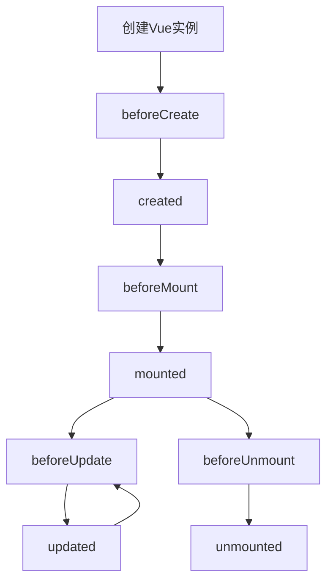

# JavaScript Vue基础

## Vue.js简介

Vue.js是一个渐进式JavaScript框架，专注于构建用户界面。它的设计理念是"易学易用"，相比于其他大型框架(如Angular、React)，Vue更容易上手。Vue的核心库只关注视图层，这使得它非常适合与其他库或已有项目进行整合。

### Vue的主要特点

- **渐进式框架**：可以逐步采用，从简单应用到复杂单页应用都适用
- **响应式数据绑定**：自动更新视图，无需手动操作DOM
- **组件化开发**：将UI拆分成可重用的独立组件
- **轻量高效**：运行时体积小，渲染性能高

:::tip
Vue 3是目前的最新稳定版本，本教程主要基于Vue 3进行讲解，但也会提到一些Vue 2的关键差异。
:::

## 开始使用Vue

### 安装Vue

有多种方式可以安装Vue：

1. **使用CDN**

```html
<!-- 开发环境版本，包含完整警告和调试模式 -->
<script src="https://unpkg.com/vue@3/dist/vue.global.js"></script>

<!-- 生产环境版本，优化过的大小和速度 -->
<script src="https://unpkg.com/vue@3/dist/vue.global.prod.js"></script>
```

2. **使用npm**

```bash
npm install vue@next
```

3. **使用Vue CLI**

```bash
npm install -g @vue/cli
vue create my-vue-project
```

### 创建第一个Vue应用

下面是一个简单的Vue应用示例：

```html
<!DOCTYPE html>
<html>
<head>
  <title>我的第一个Vue应用</title>
  <script src="https://unpkg.com/vue@3/dist/vue.global.js"></script>
</head>
<body>
  <div id="app">
    <h1>{{ message }}</h1>
    <button @click="reverseMessage">反转消息</button>
  </div>

  <script>
    const { createApp } = Vue
    
    createApp({
      data() {
        return {
          message: '你好，Vue!'
        }
      },
      methods: {
        reverseMessage() {
          this.message = this.message.split('').reverse().join('')
        }
      }
    }).mount('#app')
  </script>
</body>
</html>
```

**输出结果**：
- 页面显示"你好，Vue!"标题
- 点击按钮后，文本变为"!euV，好你"

## Vue实例和生命周期

### Vue实例

在Vue 3中，我们使用`createApp`函数创建一个Vue应用实例：

```js
const app = Vue.createApp({
  // 选项
})
```

主要选项包括：

- `data`：存储组件数据
- `methods`：定义组件方法
- `computed`：计算属性
- `watch`：侦听器
- `mounted`、`created`等：生命周期钩子

### Vue生命周期

Vue组件有一个完整的生命周期，从创建到销毁，我们可以在不同阶段添加自己的代码：



示例代码：

```js
const app = Vue.createApp({
  data() {
    return {
      message: '你好，Vue!'
    }
  },
  created() {
    console.log('组件已创建')
  },
  mounted() {
    console.log('组件已挂载到DOM')
  },
  updated() {
    console.log('组件已更新')
  },
  unmounted() {
    console.log('组件已卸载')
  }
})
```

## Vue模板语法

Vue使用基于HTML的模板语法，让你可以声明式地将DOM与Vue实例的数据绑定。

### 文本插值

```html
<div>{{ message }}</div>
```

### 绑定HTML属性

```html
<div v-bind:id="dynamicId">动态ID</div>
<!-- 缩写形式 -->
<div :id="dynamicId">动态ID</div>
```

### 条件渲染

```html
<div v-if="seen">现在你看到我了</div>
<div v-else-if="condition">另一个条件</div>
<div v-else>其他情况</div>

<!-- v-show只是切换元素的display属性 -->
<div v-show="seen">使用v-show控制显示/隐藏</div>
```

### 列表渲染

```html
<ul>
  <li v-for="(item, index) in items" :key="item.id">
    {{ index }}: {{ item.text }}
  </li>
</ul>
```

:::caution
在使用v-for时，始终提供`:key`属性以帮助Vue高效更新DOM。
:::

### 事件处理

```html
<button v-on:click="sayHello">点击我</button>
<!-- 缩写形式 -->
<button @click="sayHello">点击我</button>

<!-- 带参数的事件处理 -->
<button @click="greet('World')">问候</button>
```

## Vue指令详解

指令是带有`v-`前缀的特殊属性，用于在表达式的值变化时响应式地作用于DOM。

### v-model：双向绑定

`v-model`指令实现表单输入和应用状态之间的双向绑定：

```html
<input v-model="message">
<p>消息是: {{ message }}</p>
```

支持多种表单元素：

```html
<!-- 文本框 -->
<input v-model="message" type="text">

<!-- 多行文本 -->
<textarea v-model="message"></textarea>

<!-- 复选框 -->
<input type="checkbox" id="checkbox" v-model="checked">
<label for="checkbox">{{ checked }}</label>

<!-- 单选按钮 -->
<input type="radio" id="one" value="One" v-model="picked">
<input type="radio" id="two" value="Two" v-model="picked">

<!-- 选择框 -->
<select v-model="selected">
  <option disabled value="">请选择</option>
  <option>A</option>
  <option>B</option>
</select>
```

### v-bind：属性绑定

```html
<div v-bind:class="{ active: isActive }">动态类</div>
<div v-bind:style="{ color: activeColor }">动态样式</div>
```

### v-on：事件监听

```html
<!-- 方法处理器 -->
<button v-on:click="doThis"></button>

<!-- 内联语句 -->
<button v-on:click="count++"></button>

<!-- 事件修饰符 -->
<form v-on:submit.prevent="onSubmit"></form>

<!-- 按键修饰符 -->
<input v-on:keyup.enter="submit">
```

## 计算属性和侦听器

### 计算属性

计算属性是基于依赖进行缓存的，只有依赖发生变化时才会重新计算：

```js
const app = Vue.createApp({
  data() {
    return {
      firstName: 'John',
      lastName: 'Doe'
    }
  },
  computed: {
    fullName() {
      return this.firstName + ' ' + this.lastName
    },
    // 可写的计算属性
    fullName2: {
      get() {
        return this.firstName + ' ' + this.lastName
      },
      set(newValue) {
        const names = newValue.split(' ')
        this.firstName = names[0]
        this.lastName = names[names.length - 1]
      }
    }
  }
})
```

### 侦听器

侦听器用于响应数据的变化并执行异步或复杂操作：

```js
const app = Vue.createApp({
  data() {
    return {
      question: '',
      answer: '问题通常包含问号 ?'
    }
  },
  watch: {
    question(newQuestion, oldQuestion) {
      if (newQuestion.includes('?')) {
        this.getAnswer()
      }
    }
  },
  methods: {
    getAnswer() {
      this.answer = '思考中...'
      // 模拟API调用
      setTimeout(() => {
        this.answer = '这是回答！'
      }, 1000)
    }
  }
})
```

## Vue组件

组件是Vue中最强大的功能之一，用于创建可复用的代码块。

### 全局组件

```js
const app = Vue.createApp({})

app.component('my-component', {
  data() {
    return {
      count: 0
    }
  },
  template: `
    <button @click="count++">
      你点击了我 {{ count }} 次
    </button>
  `
})
```

### 局部组件

```js
const app = Vue.createApp({
  components: {
    'my-component': {
      data() {
        return {
          count: 0
        }
      },
      template: `
        <button @click="count++">
          你点击了我 {{ count }} 次
        </button>
      `
    }
  }
})
```

### 组件通信

#### Props向下传递

```js
// 父组件
app.component('parent-component', {
  data() {
    return {
      message: '来自父组件的消息'
    }
  },
  template: `
    <div>
      <child-component :msg="message"></child-component>
    </div>
  `
})

// 子组件
app.component('child-component', {
  props: ['msg'],
  template: `
    <div>子组件收到: {{ msg }}</div>
  `
})
```

#### 自定义事件向上传递

```js
// 子组件
app.component('child-component', {
  template: `
    <button @click="$emit('custom-event', '这是传递的数据')">点击发送事件</button>
  `
})

// 父组件
app.component('parent-component', {
  methods: {
    handleEvent(data) {
      console.log('收到事件数据：', data)
    }
  },
  template: `
    <child-component @custom-event="handleEvent"></child-component>
  `
})
```

## 实际案例：待办事项应用

让我们构建一个简单的待办事项应用来综合展示Vue的核心概念：

```html
<!DOCTYPE html>
<html>
<head>
  <title>Vue待办事项</title>
  <script src="https://unpkg.com/vue@3/dist/vue.global.js"></script>
  <style>
    .done {
      text-decoration: line-through;
      color: gray;
    }
    .todo-item {
      margin-bottom: 10px;
    }
  </style>
</head>
<body>
  <div id="todo-app">
    <h1>我的待办事项</h1>
    
    <!-- 添加新任务 -->
    <div>
      <input 
        v-model="newTodo" 
        @keyup.enter="addTodo" 
        placeholder="添加新任务..."
      />
      <button @click="addTodo">添加</button>
    </div>
    
    <!-- 任务过滤 -->
    <div>
      <button @click="filter = 'all'">所有</button>
      <button @click="filter = 'active'">未完成</button>
      <button @click="filter = 'completed'">已完成</button>
    </div>
    
    <!-- 任务列表 -->
    <ul>
      <li 
        v-for="todo in filteredTodos" 
        :key="todo.id"
        class="todo-item"
      >
        <input 
          type="checkbox" 
          v-model="todo.completed"
        />
        <span :class="{ done: todo.completed }">{{ todo.text }}</span>
        <button @click="removeTodo(todo.id)">删除</button>
      </li>
    </ul>
    
    <!-- 统计信息 -->
    <div>
      <span>{{ activeCount }} 个待完成</span>
      <button 
        v-if="completedCount > 0" 
        @click="removeCompleted"
      >
        清除已完成
      </button>
    </div>
  </div>

  <script>
    const { createApp } = Vue
    
    createApp({
      data() {
        return {
          newTodo: '',
          todos: [
            { id: 1, text: '学习Vue基础', completed: false },
            { id: 2, text: '完成项目', completed: false },
            { id: 3, text: '准备面试', completed: false }
          ],
          filter: 'all',
          nextTodoId: 4
        }
      },
      computed: {
        filteredTodos() {
          if (this.filter === 'active') {
            return this.todos.filter(todo => !todo.completed)
          } else if (this.filter === 'completed') {
            return this.todos.filter(todo => todo.completed)
          } else {
            return this.todos
          }
        },
        activeCount() {
          return this.todos.filter(todo => !todo.completed).length
        },
        completedCount() {
          return this.todos.filter(todo => todo.completed).length
        }
      },
      methods: {
        addTodo() {
          if (!this.newTodo.trim()) return
          this.todos.push({
            id: this.nextTodoId++,
            text: this.newTodo.trim(),
            completed: false
          })
          this.newTodo = ''
        },
        removeTodo(id) {
          this.todos = this.todos.filter(todo => todo.id !== id)
        },
        removeCompleted() {
          this.todos = this.todos.filter(todo => !todo.completed)
        }
      }
    }).mount('#todo-app')
  </script>
</body>
</html>
```

这个例子展示了Vue的许多重要特性：
- 数据绑定与渲染
- 事件处理
- 计算属性
- 条件渲染
- 列表渲染
- 样式绑定

## 总结

Vue.js作为一个渐进式框架，提供了构建现代Web应用所需的核心功能：

- **简单易上手**：通过熟悉的模板语法和简单API快速开发
- **响应式系统**：自动跟踪依赖关系，高效更新DOM
- **组件化**：通过可复用、可组合的组件构建复杂界面
- **工具链**：丰富的开发工具和生态系统支持

Vue的设计理念是"尽可能简单"，这使它成为前端开发者的理想选择，无论是简单应用还是复杂项目。

## 练习与资源

### 练习
1. 创建一个简单的Vue计数器应用
2. 为待办事项应用添加编辑功能
3. 创建一个包含多个组件的更复杂应用
4. 尝试使用Vue CLI创建一个单页应用

### 进阶学习资源
- [Vue.js官方文档](https://vuejs.org/)
- [Vue Router](https://router.vuejs.org/)（官方路由库）
- [Vuex](https://vuex.vuejs.org/)（状态管理）
- [Vue DevTools](https://github.com/vuejs/devtools)（浏览器开发工具）
- [Vue Mastery](https://www.vuemastery.com/)（视频课程）

:::tip
记住，学习编程最好的方式是实践！尝试构建自己的小项目，逐步应用所学知识。不要害怕出错，每一个bug都是学习的机会。
:::