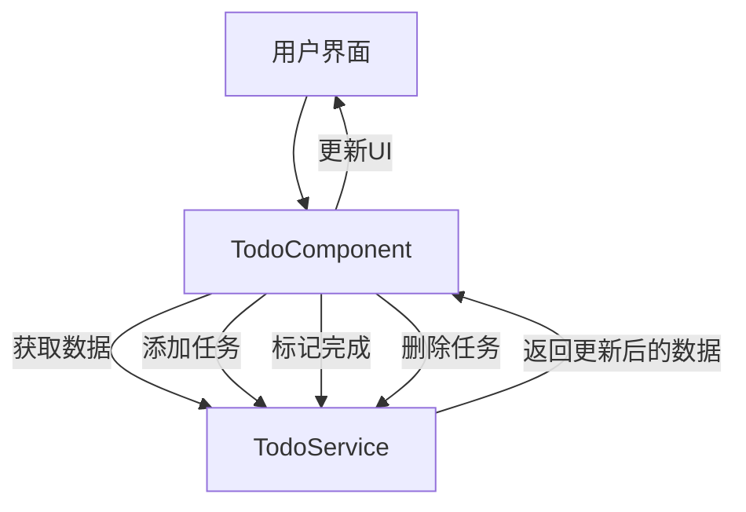

# JavaScript Angular基础

## 什么是Angular？

Angular是由Google维护的开源前端框架，用于构建单页面应用程序(SPA)和动态网页应用。它是一个完整的开发平台，提供了从组件化架构、模板系统到路由管理、表单处理和HTTP通信等全套解决方案。

:::note
Angular与AngularJS（也称为Angular 1.x）是不同的框架。Angular（2+）是对原始框架的完全重写，基于TypeScript构建，提供了更好的性能和更现代的架构。本教程将专注于现代Angular（2+）。
:::

## Angular的特点

Angular拥有多种使其成为强大前端解决方案的特点：

1. **组件化架构**：应用被拆分成可重用的组件
2. **TypeScript支持**：提供强类型系统，提高代码质量
3. **双向数据绑定**：视图与模型自动同步
4. **依赖注入**：便于测试和组件复用
5. **模板系统**：使用增强的HTML创建UI
6. **路由系统**：允许创建单页面应用
7. **RxJS集成**：采用响应式编程方法处理异步操作

## 开始使用Angular

### 安装Angular CLI

Angular CLI（命令行界面）是开发Angular应用的标准工具。它提供了创建项目、生成代码、测试和部署等功能。

```bash
npm install -g @angular/cli
```

### 创建第一个应用

使用CLI创建新的Angular项目：

```bash
ng new my-first-app
```

CLI将询问几个配置问题，如是否包含路由模块和使用哪种样式表格式。

### 启动开发服务器

```bash
cd my-first-app
ng serve
```

现在你可以在浏览器中访问`http://localhost:4200/`查看你的应用。

## Angular核心概念

### 1. 组件(Component)

组件是Angular应用的基本构建块。每个组件包含以下部分：

- **模板**：定义UI（HTML）
- **类**：包含数据和方法（TypeScript）
- **样式**：组件特定的样式（CSS）
- **元数据**：通过装饰器提供额外信息

基本组件示例：

```typescript
import { Component } from '@angular/core';

@Component({
  selector: 'app-hello',
  template: `<h1>Hello, {{name}}!</h1>`,
  styles: [`h1 { color: blue; }`]
})
export class HelloComponent {
  name = 'World';
}
```

### 2. 模块(Module)

模块是相关组件、指令、服务等的集合。每个Angular应用至少有一个根模块（AppModule）。

```typescript
import { NgModule } from '@angular/core';
import { BrowserModule } from '@angular/platform-browser';
import { AppComponent } from './app.component';
import { HelloComponent } from './hello.component';

@NgModule({
  imports: [BrowserModule],
  declarations: [AppComponent, HelloComponent],
  bootstrap: [AppComponent]
})
export class AppModule { }
```

### 3. 数据绑定

Angular提供多种数据绑定方式：

- **插值表达式**：`{{expression}}`
- **属性绑定**：`[property]="expression"`
- **事件绑定**：`(event)="handler"`
- **双向绑定**：`[(ngModel)]="property"`

```typescript
// 组件类
export class UserProfileComponent {
  userName = 'Guest';
  updateName(event) {
    this.userName = event.target.value;
  }
}
```

```html
<!-- 模板 -->
<div>
  <!-- 插值表达式 -->
  <h2>Welcome, {{userName}}!</h2>
  
  <!-- 属性绑定 -->
  
  
  <!-- 事件绑定 -->
  <button (click)="updateName($event)">Update</button>
  
  <!-- 双向绑定 (需要导入FormsModule) -->
  <input [(ngModel)]="userName">
</div>
```

### 4. 指令(Directive)

指令是给DOM元素添加额外行为的类。Angular有三种类型的指令：

1. **组件**：带有模板的指令
2. **结构型指令**：改变DOM结构，如`*ngIf`、`*ngFor`
3. **属性型指令**：改变元素外观或行为，如`[ngStyle]`、`[ngClass]`

```html
<!-- 结构型指令示例 -->
<div *ngIf="isLoggedIn">Welcome back!</div>

<ul>
  <li *ngFor="let item of items">{{item.name}}</li>
</ul>

<!-- 属性型指令示例 -->
<div [ngStyle]="{'color': isActive ? 'green' : 'red'}">
  Status indicator
</div>

<button [ngClass]="{'primary': isPrimary, 'disabled': !isEnabled}">
  Submit
</button>
```

### 5. 服务与依赖注入

服务是一种共享逻辑或数据的方式，避免在组件中重复代码。依赖注入是Angular的核心特性，允许组件获取服务实例。

**创建服务**:

```typescript
import { Injectable } from '@angular/core';

@Injectable({
  providedIn: 'root'
})
export class UserService {
  getUsers() {
    return [
      { id: 1, name: 'Alice' },
      { id: 2, name: 'Bob' },
      { id: 3, name: 'Charlie' }
    ];
  }
}
```

**使用服务**:

```typescript
import { Component, OnInit } from '@angular/core';
import { UserService } from './user.service';

@Component({
  selector: 'app-user-list',
  template: `
    <h2>User List</h2>
    <ul>
      <li *ngFor="let user of users">{{user.name}}</li>
    </ul>
  `
})
export class UserListComponent implements OnInit {
  users: any[] = [];

  constructor(private userService: UserService) { }

  ngOnInit() {
    this.users = this.userService.getUsers();
  }
}
```

## 实际案例：待办事项应用

让我们创建一个简单的待办事项应用程序，展示Angular的核心概念。

### 步骤1：生成组件

```bash
ng generate component todo
```

### 步骤2：创建待办事项服务

```bash
ng generate service todo
```

### 步骤3：实现服务

```typescript
// todo.service.ts
import { Injectable } from '@angular/core';

export interface Todo {
  id: number;
  title: string;
  completed: boolean;
}

@Injectable({
  providedIn: 'root'
})
export class TodoService {
  private todos: Todo[] = [
    { id: 1, title: '学习Angular基础', completed: false },
    { id: 2, title: '创建第一个组件', completed: true },
    { id: 3, title: '理解服务与依赖注入', completed: false }
  ];

  getTodos(): Todo[] {
    return this.todos;
  }

  addTodo(title: string): void {
    const id = this.todos.length > 0 ? Math.max(...this.todos.map(t => t.id)) + 1 : 1;
    this.todos.push({ id, title, completed: false });
  }

  toggleComplete(id: number): void {
    const todo = this.todos.find(t => t.id === id);
    if (todo) {
      todo.completed = !todo.completed;
    }
  }

  deleteTodo(id: number): void {
    const index = this.todos.findIndex(t => t.id === id);
    if (index !== -1) {
      this.todos.splice(index, 1);
    }
  }
}
```

### 步骤4：实现Todo组件

```typescript
// todo.component.ts
import { Component, OnInit } from '@angular/core';
import { TodoService, Todo } from '../todo.service';

@Component({
  selector: 'app-todo',
  templateUrl: './todo.component.html',
  styleUrls: ['./todo.component.css']
})
export class TodoComponent implements OnInit {
  todos: Todo[] = [];
  newTodoTitle = '';

  constructor(private todoService: TodoService) { }

  ngOnInit(): void {
    this.todos = this.todoService.getTodos();
  }

  addTodo(): void {
    if (this.newTodoTitle.trim()) {
      this.todoService.addTodo(this.newTodoTitle);
      this.newTodoTitle = '';
    }
  }

  toggleComplete(id: number): void {
    this.todoService.toggleComplete(id);
  }

  deleteTodo(id: number): void {
    this.todoService.deleteTodo(id);
  }
}
```

### 步骤5：创建组件模板

```html
<!-- todo.component.html -->
<div class="todo-app">
  <h2>待办事项列表</h2>

  <div class="add-todo">
    <input 
      [(ngModel)]="newTodoTitle" 
      placeholder="添加新待办事项..."
      (keyup.enter)="addTodo()">
    <button (click)="addTodo()">添加</button>
  </div>

  <ul class="todo-list">
    <li *ngFor="let todo of todos" [class.completed]="todo.completed">
      <input 
        type="checkbox" 
        [checked]="todo.completed"
        (change)="toggleComplete(todo.id)">
      <span>{{ todo.title }}</span>
      <button (click)="deleteTodo(todo.id)">删除</button>
    </li>
  </ul>
</div>
```

### 步骤6：添加样式

```css
/* todo.component.css */
.todo-app {
  max-width: 500px;
  margin: 0 auto;
  padding: 20px;
  font-family: Arial, sans-serif;
}

.add-todo {
  display: flex;
  margin-bottom: 20px;
}

.add-todo input {
  flex: 1;
  padding: 8px;
  font-size: 16px;
  border: 1px solid #ddd;
}

.add-todo button {
  padding: 8px 16px;
  background-color: #4CAF50;
  color: white;
  border: none;
  cursor: pointer;
}

.todo-list {
  list-style: none;
  padding: 0;
}

.todo-list li {
  padding: 10px;
  border-bottom: 1px solid #eee;
  display: flex;
  align-items: center;
}

.todo-list li.completed span {
  text-decoration: line-through;
  color: #888;
}

.todo-list li span {
  flex: 1;
  margin-left: 10px;
}

.todo-list li button {
  padding: 5px 10px;
  background-color: #f44336;
  color: white;
  border: none;
  cursor: pointer;
}
```

### 步骤7：更新AppModule

确保导入必要的模块：

```typescript
// app.module.ts
import { NgModule } from '@angular/core';
import { BrowserModule } from '@angular/platform-browser';
import { FormsModule } from '@angular/forms';

import { AppComponent } from './app.component';
import { TodoComponent } from './todo/todo.component';

@NgModule({
  declarations: [
    AppComponent,
    TodoComponent
  ],
  imports: [
    BrowserModule,
    FormsModule  // 添加FormsModule以支持[(ngModel)]
  ],
  providers: [],
  bootstrap: [AppComponent]
})
export class AppModule { }
```

### 步骤8：在主应用中使用Todo组件

```html
<!-- app.component.html -->
<div>
  <h1>Angular待办事项应用</h1>
  <app-todo></app-todo>
</div>
```

## 应用程序流程图



## 总结

在本教程中，我们学习了Angular的基础知识：

1. 什么是Angular及其主要特点
2. 如何使用Angular CLI创建和运行应用
3. Angular的核心概念：组件、模块、数据绑定、指令、服务与依赖注入
4. 通过创建待办事项应用将这些概念付诸实践

Angular是一个功能强大且全面的框架，适合构建从简单到复杂的各种Web应用。随着对这些基础概念的掌握，你可以继续学习Angular的更高级功能，如路由、表单、HTTP客户端等。

## 练习与进阶学习

1. **练习**：扩展待办事项应用，添加以下功能：
   - 任务编辑功能
   - 按完成状态筛选任务
   - 使用本地存储保存任务

2. **进阶主题**：
   - Angular路由与导航
   - 响应式表单
   - HTTP客户端与后端通信
   - RxJS与Observable
   - 状态管理（NgRx）

## 有用的资源

- [Angular官方文档](https://angular.io/docs)
- [Angular CLI文档](https://angular.io/cli)
- [TypeScript官方网站](https://www.typescriptlang.org/)
- [RxJS文档](https://rxjs.dev/)

:::tip
学习Angular时，建议先掌握TypeScript基础。Angular与TypeScript紧密结合，理解TypeScript将帮助你更好地理解Angular代码。
:::