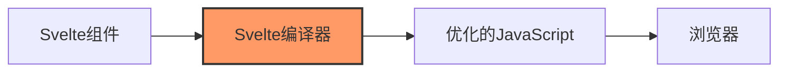

# JavaScript Svelte基础

## 什么是Svelte？

Svelte是一种构建用户界面的全新方法。传统的框架如React和Vue在浏览器中执行大部分工作，而Svelte将这些工作转移到编译阶段——在构建应用程序时完成。

:::note
Svelte不是一个库，而是一个编译器！它将你的组件转换为高效的原生JavaScript代码。
:::

Svelte的三个主要优势：

1. **更少的代码**：编写的代码更少，更容易维护
2. **无虚拟DOM**：直接操作DOM，性能更优
3. **真正的反应性**：不需要额外的状态管理库



## Svelte环境设置

要开始使用Svelte，我们可以通过以下命令创建一个新项目：

```bash
npx degit sveltejs/template my-svelte-project
cd my-svelte-project
npm install
npm run dev
```

这将创建一个基本的Svelte项目结构并在本地启动开发服务器，通常在`http://localhost:8080`。

## Svelte组件基础

Svelte组件是具有`.svelte`扩展名的文件，包含三个部分：

1. **脚本(Script)**：JavaScript逻辑
2. **样式(Style)**：CSS样式
3. **标记(Markup)**：HTML模板

### 一个简单的Svelte组件

```svelte
<script>
  // JavaScript逻辑部分
  let name = 'world';
  
  function handleClick() {
    name = 'Svelte learner';
  }
</script>

<style>
  /* CSS样式部分 */
  h1 {
    color: #ff3e00;
  }
  
  button {
    background: #ff3e00;
    color: white;
    border: none;
    padding: 8px 12px;
    border-radius: 4px;
  }
</style>

<!-- HTML标记部分 -->
<h1>Hello {name}!</h1>
<button on:click={handleClick}>
  Change name
</button>
```

## Svelte的反应性

Svelte的反应性系统非常简单直观。当你修改一个变量时，任何引用该变量的DOM都会自动更新。

### 声明式反应性

```svelte
<script>
  let count = 0;
  
  // 这是一个反应式声明
  $: doubled = count * 2;
  
  function increment() {
    count += 1;
  }
</script>

<button on:click={increment}>
  Count: {count}
</button>

<p>Doubled: {doubled}</p>
```

当`count`变量更新时，`doubled`会自动重新计算，不需要任何额外的代码。

:::tip
Svelte使用`$:`标记反应式声明，这是JavaScript的一个较少使用的标签语句特性。
:::

## 条件渲染与循环

### 条件渲染

Svelte使用`{#if}`, `{:else if}`, `{:else}`和`{/if}`来控制条件渲染：

```svelte
<script>
  let user = { loggedIn: false };

  function toggle() {
    user.loggedIn = !user.loggedIn;
  }
</script>

{#if user.loggedIn}
  <button on:click={toggle}>
    退出
  </button>
{:else}
  <button on:click={toggle}>
    登录
  </button>
{/if}
```

### 列表渲染

使用`{#each}...{/each}`指令来渲染列表：

```svelte
<script>
  let fruits = [
    { id: 1, name: '苹果' },
    { id: 2, name: '香蕉' },
    { id: 3, name: '橙子' }
  ];
</script>

<h2>水果列表</h2>
<ul>
  {#each fruits as fruit, index (fruit.id)}
    <li>{index + 1}: {fruit.name}</li>
  {/each}
</ul>
```

## 组件通信

### Props传递

父组件向子组件传递数据：

**父组件 App.svelte**:
```svelte
<script>
  import Greeting from './Greeting.svelte';
  
  let name = "小明";
</script>

<Greeting name={name} />
```

**子组件 Greeting.svelte**:
```svelte
<script>
  // 使用export声明props
  export let name;
</script>

<h1>你好，{name}！</h1>
```

### 事件处理

子组件可以使用`createEventDispatcher`向父组件发送事件：

**子组件 Button.svelte**:
```svelte
<script>
  import { createEventDispatcher } from 'svelte';
  
  const dispatch = createEventDispatcher();
  
  function handleClick() {
    dispatch('buttonclick', {
      text: '按钮被点击了!'
    });
  }
</script>

<button on:click={handleClick}>
  点击我
</button>
```

**父组件 App.svelte**:
```svelte
<script>
  import Button from './Button.svelte';
  
  function handleButtonClick(event) {
    alert(event.detail.text);
  }
</script>

<Button on:buttonclick={handleButtonClick} />
```

## 生命周期函数

Svelte提供了几个生命周期函数来控制组件的不同阶段：

```svelte
<script>
  import { onMount, onDestroy, beforeUpdate, afterUpdate } from 'svelte';
  
  let count = 0;
  
  onMount(() => {
    console.log('组件已挂载到DOM');
    // 常用于初始化数据、设置定时器等
    const interval = setInterval(() => count++, 1000);
    
    // 返回一个清理函数（可选）
    return () => clearInterval(interval);
  });
  
  beforeUpdate(() => {
    console.log('DOM即将更新');
  });
  
  afterUpdate(() => {
    console.log('DOM已经更新');
  });
  
  onDestroy(() => {
    console.log('组件即将销毁');
    // 清理资源、取消订阅等
  });
</script>

<p>Count: {count}</p>
```

## 实际应用案例：待办事项列表

让我们创建一个简单的待办事项应用程序，展示Svelte的实际应用：

```svelte
<script>
  // 待办事项数据
  let todos = [
    { id: 1, text: '学习Svelte基础', done: true },
    { id: 2, text: '创建Svelte组件', done: false },
    { id: 3, text: '构建Todo应用', done: false }
  ];
  
  let newTodoText = '';
  
  // 添加新的待办事项
  function addTodo() {
    if (newTodoText.trim()) {
      const newTodo = {
        id: Date.now(),
        text: newTodoText,
        done: false
      };
      
      todos = [...todos, newTodo]; // 创建新数组触发更新
      newTodoText = ''; // 清空输入框
    }
  }
  
  // 切换待办事项状态
  function toggleTodo(id) {
    todos = todos.map(todo => {
      if (todo.id === id) {
        return { ...todo, done: !todo.done };
      }
      return todo;
    });
  }
  
  // 删除待办事项
  function deleteTodo(id) {
    todos = todos.filter(todo => todo.id !== id);
  }
  
  // 统计完成的待办事项
  $: completedTodos = todos.filter(todo => todo.done).length;
  $: totalTodos = todos.length;
</script>

<style>
  .todo-app {
    max-width: 500px;
    margin: 0 auto;
    padding: 20px;
    font-family: Arial, sans-serif;
  }
  
  .todo-form {
    display: flex;
    margin-bottom: 20px;
  }
  
  .todo-input {
    flex-grow: 1;
    padding: 8px;
    font-size: 16px;
    border: 1px solid #ddd;
    border-radius: 4px 0 0 4px;
  }
  
  .add-button {
    padding: 8px 16px;
    background-color: #4CAF50;
    color: white;
    border: none;
    border-radius: 0 4px 4px 0;
    cursor: pointer;
  }
  
  .todo-item {
    display: flex;
    align-items: center;
    padding: 10px;
    margin-bottom: 5px;
    background-color: #f9f9f9;
    border-radius: 4px;
  }
  
  .todo-item.done {
    text-decoration: line-through;
    opacity: 0.7;
  }
  
  .delete-button {
    margin-left: auto;
    background-color: #f44336;
    color: white;
    border: none;
    border-radius: 4px;
    padding: 5px 10px;
    cursor: pointer;
  }
  
  .todo-stats {
    margin-top: 20px;
    text-align: center;
    color: #666;
  }
</style>

<div class="todo-app">
  <h1>Svelte 待办事项</h1>
  
  <!-- 添加待办事项表单 -->
  <form class="todo-form" on:submit|preventDefault={addTodo}>
    <input 
      class="todo-input"
      type="text" 
      placeholder="添加新的待办事项..."
      bind:value={newTodoText}
    />
    <button class="add-button" type="submit">添加</button>
  </form>
  
  <!-- 待办事项列表 -->
  {#if todos.length > 0}
    <ul class="todo-list">
      {#each todos as todo (todo.id)}
        <li class="todo-item" class:done={todo.done}>
          <input 
            type="checkbox" 
            checked={todo.done} 
            on:change={() => toggleTodo(todo.id)}
          />
          <span>{todo.text}</span>
          <button 
            class="delete-button" 
            on:click={() => deleteTodo(todo.id)}
          >
            删除
          </button>
        </li>
      {/each}
    </ul>
    
    <!-- 统计信息 -->
    <div class="todo-stats">
      已完成 {completedTodos} / {totalTodos} 项任务
    </div>
  {:else}
    <p>没有待办事项，请添加一些！</p>
  {/if}
</div>
```

这个待办事项应用展示了Svelte的多个核心特性，包括状态管理、事件处理、条件渲染、列表渲染以及反应式声明等。

## Svelte的状态管理

对于大型应用，Svelte提供了内置的存储（stores）机制来管理应用状态：

### 可写存储（Writable stores）

```svelte
<script>
  import { writable } from 'svelte/store';
  
  // 创建一个可写存储
  const count = writable(0);
  
  function increment() {
    // 使用update方法更新存储
    count.update(n => n + 1);
  }
  
  function reset() {
    // 使用set方法设置存储值
    count.set(0);
  }
</script>

<button on:click={increment}>
  增加
</button>

<button on:click={reset}>
  重置
</button>

<!-- 使用$前缀自动订阅存储 -->
<p>当前计数: {$count}</p>
```

:::caution
`$`前缀是Svelte的特殊语法，用于自动订阅存储并在值变化时更新UI。
:::

## 总结

Svelte提供了一种全新的前端开发方式，它的主要优势在于：

1. **编译时优化**：减少运行时开销，提高应用性能
2. **简洁的代码**：不需要大量样板代码
3. **直观的反应性系统**：简单易用的状态管理
4. **原生CSS支持**：无需额外的CSS-in-JS解决方案
5. **无虚拟DOM**：直接操作DOM节点，提高效率

Svelte是一个相对较新的框架，但其创新的编译方法和出色的开发体验使它迅速获得了开发者的青睐。对于希望构建高性能、体积小的前端应用的开发者来说，Svelte是一个极佳的选择。

## 学习资源与练习

- **官方教程**：[Svelte官方交互式教程](https://svelte.dev/tutorial)
- **官方文档**：[Svelte官方文档](https://svelte.dev/docs)

### 练习建议：

1. 创建一个简单的计数器应用，练习状态管理
2. 扩展待办事项应用，添加过滤和排序功能
3. 尝试使用Svelte的动画和过渡效果
4. 创建一个包含多个组件的小型应用程序，练习组件通信

通过实践这些练习，你将能够更好地理解和掌握Svelte的核心概念，为构建更复杂的应用打下坚实的基础。