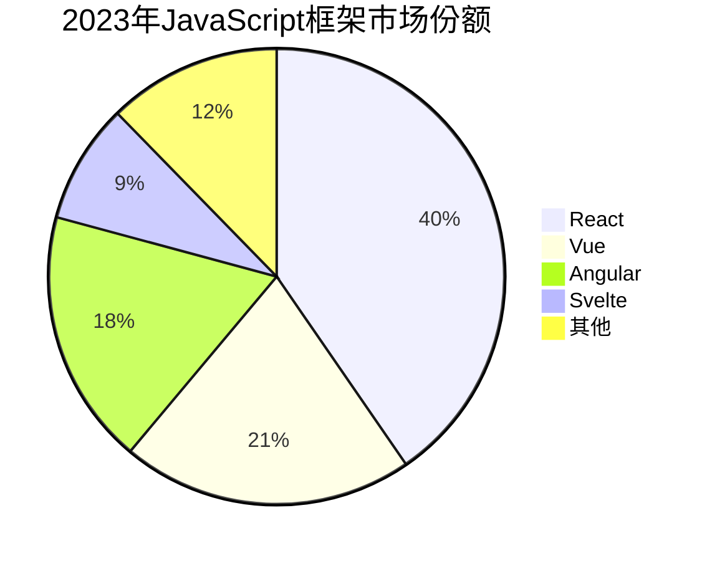

# JavaScript 框架对比

---
title: JavaScript 框架对比
description: 全面解析当前流行的JavaScript框架（React、Vue、Angular、Svelte等），帮助初学者了解各框架的优缺点、适用场景和基本用法，以便选择适合自己项目的框架。
---

## JavaScript 框架简介

在现代Web开发中，JavaScript框架已成为前端开发的基石。框架为开发者提供了结构化的代码组织方式，简化了复杂应用的开发过程，并解决了许多前端开发中常见的挑战。

:::tip 什么是JavaScript框架？
JavaScript框架是一套预先写好的JavaScript代码库，提供了基础结构和工具，使开发者能够更轻松地构建动态Web应用。它们通常遵循特定的设计模式，如MVC（模型-视图-控制器）或MVVM（模型-视图-视图模型）。
:::

## 为什么需要JavaScript框架？

在深入比较各个框架之前，让我们先了解为什么需要使用框架：

1. **提高开发效率** - 框架提供了预设的结构和功能
2. **代码组织** - 鼓励使用良好的架构模式
3. **社区支持** - 活跃的社区提供了丰富的资源和插件
4. **解决常见问题** - 例如状态管理、路由控制等
5. **提高可维护性** - 统一的代码规范和结构

## 主流JavaScript框架概览

让我们通过一个图表来概览当前主流的JavaScript框架及其市场份额：



现在，让我们详细对比这些流行的框架。

## React

由Facebook开发并维护的React是目前市场占有率最高的前端库。

### 核心特点

- **组件化开发** - 鼓励将UI拆分为可重用的组件
- **虚拟DOM** - 提高渲染性能
- **JSX语法** - 将HTML与JavaScript混合
- **单向数据流** - 使状态管理更可预测
- **大型生态系统** - 有丰富的第三方库和工具

### 基本示例

```jsx
import React, { useState } from 'react';

function Counter() {
  const [count, setCount] = useState(0);

  return (
    <div>
      <p>你点击了 {count} 次</p>
      <button onClick={() => setCount(count + 1)}>
        点击我
      </button>
    </div>
  );
}

export default Counter;
```

### 适用场景

- 大型复杂的单页面应用
- 需要高度定制化UI组件的项目
- 有大量状态管理需求的应用
- 企业级应用

## Vue.js

Vue由尤雨溪创建，以其渐进式特性和简单的学习曲线著称。

### 核心特点

- **渐进式框架** - 可以逐步采用
- **双向数据绑定** - 简化表单处理
- **模板语法** - 基于HTML的模板系统
- **响应式系统** - 自动追踪依赖关系
- **单文件组件** - 将HTML、CSS、JS封装在一起

### 基本示例

```vue
<template>
  <div>
    <p>你点击了 {{ count }} 次</p>
    <button @click="increment">点击我</button>
  </div>
</template>

<script>
export default {
  data() {
    return {
      count: 0
    }
  },
  methods: {
    increment() {
      this.count += 1
    }
  }
}
</script>
```

### 适用场景

- 初创项目和快速原型开发
- 需要平滑学习曲线的团队
- 希望逐步从传统网站迁移到SPA
- 轻量级应用

## Angular

Angular是由Google维护的全功能框架，特别适合企业级应用。

### 核心特点

- **完整的MVC框架** - 提供全面的解决方案
- **TypeScript集成** - 带来类型安全
- **依赖注入** - 便于测试和模块化
- **双向数据绑定** - 简化表单处理
- **RxJS集成** - 优秀的异步编程模型

### 基本示例

```typescript
import { Component } from '@angular/core';

@Component({
  selector: 'app-counter',
  template: `
    <div>
      <p>你点击了 {{ count }} 次</p>
      <button (click)="increment()">点击我</button>
    </div>
  `
})
export class CounterComponent {
  count = 0;

  increment() {
    this.count += 1;
  }
}
```

### 适用场景

- 企业级大型应用
- 需要严格类型系统的项目
- 大型团队协作开发
- 需要全面框架支持的项目

## Svelte

Svelte是一个新兴的编译型框架，以其性能和简洁的代码而闻名。

### 核心特点

- **无虚拟DOM** - 编译时优化
- **真正的反应性** - 简单的状态管理
- **更少的样板代码** - 更简洁的语法
- **无运行时开销** - 更小的包体积
- **内置过渡动画** - 简化动画实现

### 基本示例

```svelte
<script>
  let count = 0;

  function increment() {
    count += 1;
  }
</script>

<div>
  <p>你点击了 {count} 次</p>
  <button on:click={increment}>点击我</button>
</div>
```

### 适用场景

- 需要高性能的应用
- 对包大小敏感的项目
- 小型到中型应用
- 希望减少样板代码的开发者

## 框架对比表

让我们通过一个表格来全面对比这些框架：

| 框架 | 学习曲线 | 性能 | 生态系统 | 社区规模 | 适用项目规模 | 特色 |
|------|----------|------|---------|---------|-------------|------|
| React | 中等 | 良好 | 非常丰富 | 非常大 | 小型到大型 | JSX、虚拟DOM |
| Vue | 低 | 良好 | 丰富 | 大 | 小型到中型 | 渐进式、模板语法 |
| Angular | 高 | 良好 | 丰富 | 大 | 中型到大型 | TypeScript、全功能框架 |
| Svelte | 低 | 优秀 | 成长中 | 中等 | 小型到中型 | 编译时优化、低代码量 |

## 实际应用场景分析

### 场景一：电子商务网站

**推荐框架**：Vue.js

**原因**：
- 易于集成到现有网站
- 良好的性能对SEO友好
- 简单的学习曲线利于快速开发
- 双向绑定简化表单处理

### 场景二：企业内部管理系统

**推荐框架**：Angular

**原因**：
- TypeScript提供类型安全
- 完整的框架适合大型应用
- 依赖注入方便测试
- 内置表单验证和HTTP客户端

### 场景三：社交媒体应用

**推荐框架**：React

**原因**：
- 虚拟DOM高效处理频繁更新
- 丰富的生态系统提供解决方案
- 组件化结构适合复杂UI
- Redux等状态管理工具成熟

### 场景四：交互性博客或文档网站

**推荐框架**：Svelte

**原因**：
- 高性能且包体积小
- 简洁的代码提高可维护性
- 内置动画系统
- 编译时优化提供良好用户体验

## 如何选择适合你的框架？

选择框架时，请考虑以下因素：

1. **项目规模和复杂度** - 大型项目可能受益于Angular或React的架构
2. **团队经验** - 考虑你的团队已有的技能集
3. **性能需求** - 特别关注性能可以考虑Svelte
4. **开发时间** - 短期项目可能更适合Vue的快速开发
5. **长期维护** - 考虑社区活跃度和生态系统
6. **特定需求** - 如移动应用、服务器渲染等特殊需求

:::caution 避免盲目追随趋势
选择框架应基于项目需求和团队能力，而不仅仅是市场流行度或个人偏好。最流行的框架不一定是你项目的最佳选择。
:::

## 学习路径建议

无论选择哪个框架，以下是建议的学习路径：

1. **掌握JavaScript基础** - 所有框架都建立在JS之上
2. **了解基本概念** - 组件、状态管理、路由等
3. **完成官方教程** - 每个框架都有优秀的官方文档
4. **构建小项目** - 应用所学知识
5. **学习生态系统** - 探索状态管理、路由等配套工具
6. **深入高级概念** - 性能优化、测试等

## 总结

每个JavaScript框架都有其独特的优势和适用场景：

- **React**: 组件化、灵活性高、生态系统丰富，适合复杂应用
- **Vue**: 渐进式、易学易用、文档优秀，适合快速开发
- **Angular**: 全面、结构严谨、TypeScript支持，适合企业应用
- **Svelte**: 高性能、代码简洁、编译时优化，适合追求性能的项目

最重要的是，选择适合你项目需求、团队技能和未来发展方向的框架。技术选型应该是一个深思熟虑的过程，而不是简单地追随趋势。

## 资源推荐

### React学习资源
- [React官方文档](https://react.dev/)
- [React入门指南](https://react.dev/learn)
- [Create React App](https://create-react-app.dev/)

### Vue学习资源
- [Vue官方文档](https://vuejs.org/)
- [Vue Mastery教程](https://www.vuemastery.com/)
- [Vue CLI工具](https://cli.vuejs.org/)

### Angular学习资源
- [Angular官方文档](https://angular.io/docs)
- [Angular University](https://angular-university.io/)
- [Angular CLI工具](https://angular.io/cli)

### Svelte学习资源
- [Svelte官方文档](https://svelte.dev/docs)
- [Svelte教程](https://svelte.dev/tutorial/basics)
- [SvelteKit框架](https://kit.svelte.dev/)

## 练习题

1. 为一个简单的待办事项应用选择框架，并解释你的选择原因。
2. 对比React和Vue的组件系统，列出三个主要区别。
3. 描述一个Angular的依赖注入如何帮助大型应用开发的场景。
4. 尝试实现同一个简单功能（如计数器）在不同框架中的代码，并比较代码量和复杂度。
5. 讨论在什么情况下你会选择迁移现有项目到一个新框架，以及如何评估迁移成本。

记住，框架只是工具，真正重要的是解决问题的能力和良好的编程实践。选择适合项目的框架，并不断学习新技术，才能在前端开发领域保持竞争力。