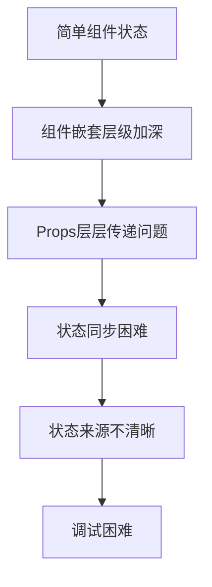
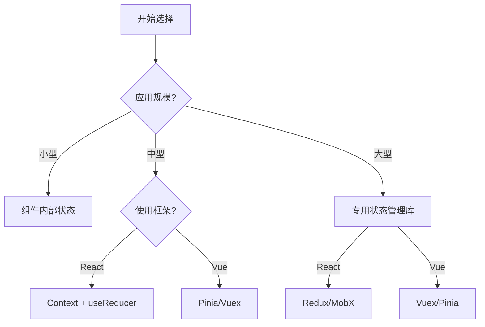

# JavaScript 状态管理

## 什么是状态管理？

在Web应用程序中，"状态"指的是应用在特定时间点的数据快照。这些数据可能包括用户信息、UI显示状态、API返回的数据等。随着应用规模的扩大，管理这些状态变得越来越复杂，尤其是当多个组件需要共享和修改同一数据时。

状态管理就是对应用程序状态进行有效组织和控制的方法，它解决了以下问题：

- 数据如何在组件之间共享
- 如何保持状态的一致性
- 如何处理状态变化
- 如何追踪状态变更

:::note
良好的状态管理是构建可维护、可预测的前端应用的关键。
:::

## 为什么需要状态管理？

想象一下，当你开发一个简单的Todo应用时，你可能只需要使用组件内部的状态。但随着应用功能的增加，你可能会遇到这些挑战：



通过引入合适的状态管理解决方案，可以:

1. **集中管理数据**：在一个地方维护应用状态
2. **简化数据流**：建立清晰的数据流动方向
3. **提高开发效率**：减少组件间的直接通信
4. **增强可维护性**：使状态变化更可预测

## 基础状态管理方式

### 1. 组件内部状态

最简单的状态管理是在组件内部使用变量或框架提供的状态机制。

**React示例：**

```jsx
import React, { useState } from 'react';

function Counter() {
  // 使用useState钩子管理计数器状态
  const [count, setCount] = useState(0);

  return (
    <div>
      <p>当前计数: {count}</p>
      <button onClick={() => setCount(count + 1)}>
        增加
      </button>
    </div>
  );
}
```

**Vue示例：**

```js
export default {
  data() {
    return {
      count: 0
    }
  },
  methods: {
    increment() {
      this.count += 1;
    }
  },
  template: `
    <div>
      <p>当前计数: {{ count }}</p>
      <button @click="increment">增加</button>
    </div>
  `
}
```

### 2. 组件通信

当需要在组件间共享状态时，可以使用props（属性）传递和事件触发机制。

**React中的父子组件通信：**

```jsx
function Parent() {
  const [count, setCount] = useState(0);
  
  // 传递给子组件的回调函数
  const handleIncrement = () => setCount(count + 1);
  
  return (
    <div>
      <p>当前计数: {count}</p>
      <Child onIncrement={handleIncrement} />
    </div>
  );
}

function Child({ onIncrement }) {
  return <button onClick={onIncrement}>在父组件中增加计数</button>;
}
```

## 常见的状态管理库

随着应用复杂度增加，专门的状态管理库成为必要。以下是几种流行的状态管理解决方案。

### 1. Redux

Redux是React生态系统中最流行的状态管理库之一，基于Flux架构。

**核心概念：**

- **Store**：应用的唯一数据源
- **Action**：描述发生的事件
- **Reducer**：指定状态如何变化的纯函数
- **Dispatch**：发送action的方法

**简单示例：**

```jsx
// 1. 定义action
const INCREMENT = 'INCREMENT';
const increment = () => ({ type: INCREMENT });

// 2. 创建reducer
const counterReducer = (state = { count: 0 }, action) => {
  switch (action.type) {
    case INCREMENT:
      return { count: state.count + 1 };
    default:
      return state;
  }
};

// 3. 创建store
import { createStore } from 'redux';
const store = createStore(counterReducer);

// 4. 使用dispatch发送action
store.dispatch(increment());
console.log(store.getState()); // { count: 1 }

// 5. 在React组件中使用
import { Provider, useSelector, useDispatch } from 'react-redux';

function App() {
  return (
    <Provider store={store}>
      <Counter />
    </Provider>
  );
}

function Counter() {
  const count = useSelector(state => state.count);
  const dispatch = useDispatch();

  return (
    <div>
      <p>计数: {count}</p>
      <button onClick={() => dispatch(increment())}>增加</button>
    </div>
  );
}
```

:::tip
Redux使用单一数据源原则，所有状态都存储在一个对象中，这使得状态变化更可预测。
:::

### 2. MobX

MobX采用响应式编程模式，比Redux更加灵活。

**核心概念：**

- **Observable**：可观察的状态
- **Action**：修改状态的方法
- **Computed**：派生自状态的值
- **Reaction**：响应状态变化的副作用

**简单示例：**

```jsx
import { makeObservable, observable, action, computed } from 'mobx';
import { observer } from 'mobx-react';

// 1. 创建Store
class CounterStore {
  count = 0;
  
  constructor() {
    makeObservable(this, {
      count: observable,
      increment: action,
      doubleCount: computed
    });
  }
  
  increment() {
    this.count += 1;
  }
  
  get doubleCount() {
    return this.count * 2;
  }
}

const counterStore = new CounterStore();

// 2. 在React组件中使用
const Counter = observer(() => {
  return (
    <div>
      <p>计数: {counterStore.count}</p>
      <p>双倍: {counterStore.doubleCount}</p>
      <button onClick={() => counterStore.increment()}>增加</button>
    </div>
  );
});
```

### 3. Vuex (Vue专用)

Vuex是Vue专门的状态管理库，设计理念与Redux相似。

**核心概念：**

- **State**：应用状态
- **Getters**：从状态派生的值
- **Mutations**：同步修改状态的方法
- **Actions**：可包含异步操作的方法
- **Modules**：将状态分割成模块

**简单示例：**

```js
import Vue from 'vue';
import Vuex from 'vuex';

Vue.use(Vuex);

// 1. 创建store
const store = new Vuex.Store({
  state: {
    count: 0
  },
  mutations: {
    increment(state) {
      state.count++;
    }
  },
  actions: {
    incrementAsync({ commit }) {
      setTimeout(() => {
        commit('increment');
      }, 1000);
    }
  },
  getters: {
    doubleCount: state => state.count * 2
  }
});

// 2. 在组件中使用
new Vue({
  store,
  template: `
    <div>
      <p>计数: {{ $store.state.count }}</p>
      <p>双倍: {{ $store.getters.doubleCount }}</p>
      <button @click="$store.commit('increment')">同步增加</button>
      <button @click="$store.dispatch('incrementAsync')">异步增加</button>
    </div>
  `
});
```

### 4. Context API + useReducer (React内置)

对于中小型应用，React的内置功能可能已经足够用于状态管理。

```jsx
import React, { createContext, useContext, useReducer } from 'react';

// 1. 创建上下文
const CounterContext = createContext();

// 2. 定义reducer
const reducer = (state, action) => {
  switch (action.type) {
    case 'INCREMENT':
      return { count: state.count + 1 };
    default:
      return state;
  }
};

// 3. 提供Context Provider
function CounterProvider({ children }) {
  const [state, dispatch] = useReducer(reducer, { count: 0 });
  
  return (
    <CounterContext.Provider value={{ state, dispatch }}>
      {children}
    </CounterContext.Provider>
  );
}

// 4. 在组件中使用
function Counter() {
  const { state, dispatch } = useContext(CounterContext);
  
  return (
    <div>
      <p>计数: {state.count}</p>
      <button onClick={() => dispatch({ type: 'INCREMENT' })}>
        增加
      </button>
    </div>
  );
}

// 5. 在应用中提供Context
function App() {
  return (
    <CounterProvider>
      <Counter />
    </CounterProvider>
  );
}
```

## 状态管理最佳实践

无论选择哪种状态管理解决方案，都应遵循以下最佳实践：

1. **分离关注点**：将UI逻辑与状态管理逻辑分离
2. **不可变性**：不直接修改状态，而是创建新的状态对象
3. **单向数据流**：保持清晰的数据流动方向
4. **状态规范化**：避免状态嵌套过深和数据重复
5. **合理拆分状态**：并非所有状态都需要全局管理

:::caution
过早引入复杂的状态管理会增加项目的复杂度。对于小型应用，通常组件内部状态就足够了。
:::

## 实际案例：购物车功能

下面是一个使用Redux实现购物车功能的简化例子：

```jsx
// 1. 定义Action Types
const ADD_TO_CART = 'ADD_TO_CART';
const REMOVE_FROM_CART = 'REMOVE_FROM_CART';
const UPDATE_QUANTITY = 'UPDATE_QUANTITY';

// 2. 定义Action Creators
const addToCart = (product) => ({
  type: ADD_TO_CART,
  payload: product
});

const removeFromCart = (productId) => ({
  type: REMOVE_FROM_CART,
  payload: { id: productId }
});

const updateQuantity = (productId, quantity) => ({
  type: UPDATE_QUANTITY,
  payload: { id: productId, quantity }
});

// 3. 定义Reducer
const initialState = {
  items: [],
  total: 0
};

function cartReducer(state = initialState, action) {
  switch (action.type) {
    case ADD_TO_CART:
      // 检查商品是否已存在
      const existingItem = state.items.find(item => item.id === action.payload.id);
      
      if (existingItem) {
        // 如果已存在，增加数量
        return {
          ...state,
          items: state.items.map(item => 
            item.id === action.payload.id 
              ? { ...item, quantity: item.quantity + 1 } 
              : item
          ),
          total: state.total + action.payload.price
        };
      } else {
        // 如果不存在，添加新商品
        return {
          ...state,
          items: [...state.items, { ...action.payload, quantity: 1 }],
          total: state.total + action.payload.price
        };
      }
    
    case REMOVE_FROM_CART:
      const itemToRemove = state.items.find(item => item.id === action.payload.id);
      return {
        ...state,
        items: state.items.filter(item => item.id !== action.payload.id),
        total: state.total - (itemToRemove.price * itemToRemove.quantity)
      };
    
    case UPDATE_QUANTITY:
      const itemToUpdate = state.items.find(item => item.id === action.payload.id);
      const quantityDiff = action.payload.quantity - itemToUpdate.quantity;
      
      return {
        ...state,
        items: state.items.map(item => 
          item.id === action.payload.id 
            ? { ...item, quantity: action.payload.quantity } 
            : item
        ),
        total: state.total + (itemToUpdate.price * quantityDiff)
      };
    
    default:
      return state;
  }
}

// 4. 在组件中使用
function Product({ product }) {
  const dispatch = useDispatch();
  
  return (
    <div className="product">
      <h3>{product.name}</h3>
      <p>${product.price}</p>
      <button onClick={() => dispatch(addToCart(product))}>
        添加到购物车
      </button>
    </div>
  );
}

function Cart() {
  const cartItems = useSelector(state => state.cart.items);
  const total = useSelector(state => state.cart.total);
  const dispatch = useDispatch();
  
  return (
    <div className="cart">
      <h2>购物车</h2>
      {cartItems.length === 0 ? (
        <p>购物车为空</p>
      ) : (
        <>
          <ul>
            {cartItems.map(item => (
              <li key={item.id}>
                <span>{item.name} x {item.quantity} = ${item.price * item.quantity}</span>
                <button onClick={() => dispatch(removeFromCart(item.id))}>删除</button>
                <div>
                  <button onClick={() => item.quantity > 1 && 
                    dispatch(updateQuantity(item.id, item.quantity - 1))}>-</button>
                  <span>{item.quantity}</span>
                  <button onClick={() => 
                    dispatch(updateQuantity(item.id, item.quantity + 1))}>+</button>
                </div>
              </li>
            ))}
          </ul>
          <p>总计: ${total.toFixed(2)}</p>
        </>
      )}
    </div>
  );
}
```

在这个例子中，我们看到了：

1. 如何定义清晰的action来描述购物车操作
2. 如何使用reducer处理各种状态变更
3. 如何在组件中连接和使用这些状态

## 选择合适的状态管理方案

选择状态管理解决方案时，请考虑以下因素：



- **小型应用**：使用组件内部状态，如React的useState或Vue的data
- **中型应用**：考虑使用框架内置的状态管理，如React的Context API或Vue的Provide/Inject
- **大型应用**：使用专门的状态管理库，如Redux、MobX或Vuex
- **特定需求**：根据具体需求选择，如需要时间旅行调试可选择Redux

## 总结

状态管理是现代前端开发的核心挑战之一。随着应用复杂度的增加，选择合适的状态管理方案变得愈发重要。本文介绍了：

- 什么是状态管理以及为什么需要它
- 基础的状态管理方式
- 常见的状态管理库及其核心概念
- 状态管理最佳实践
- 一个实际的购物车功能实现

随着你的应用成长，状态管理策略也需要相应调整。从简单的组件状态开始，在需要时逐步引入更复杂的解决方案，这是一种明智的策略。

## 进一步学习资源

- 官方文档：
  - [Redux](https://redux.js.org/)
  - [MobX](https://mobx.js.org/)
  - [Vuex](https://vuex.vuejs.org/)
  - [React Context API](https://reactjs.org/docs/context.html)

- 练习项目：
  1. 创建一个Todo应用，使用不同的状态管理方式实现
  2. 实现一个带有筛选和排序功能的产品列表
  3. 开发一个多步骤表单，需要在各步骤间保持状态

通过实践这些项目，你将更好地理解何时以及如何使用不同的状态管理方案。