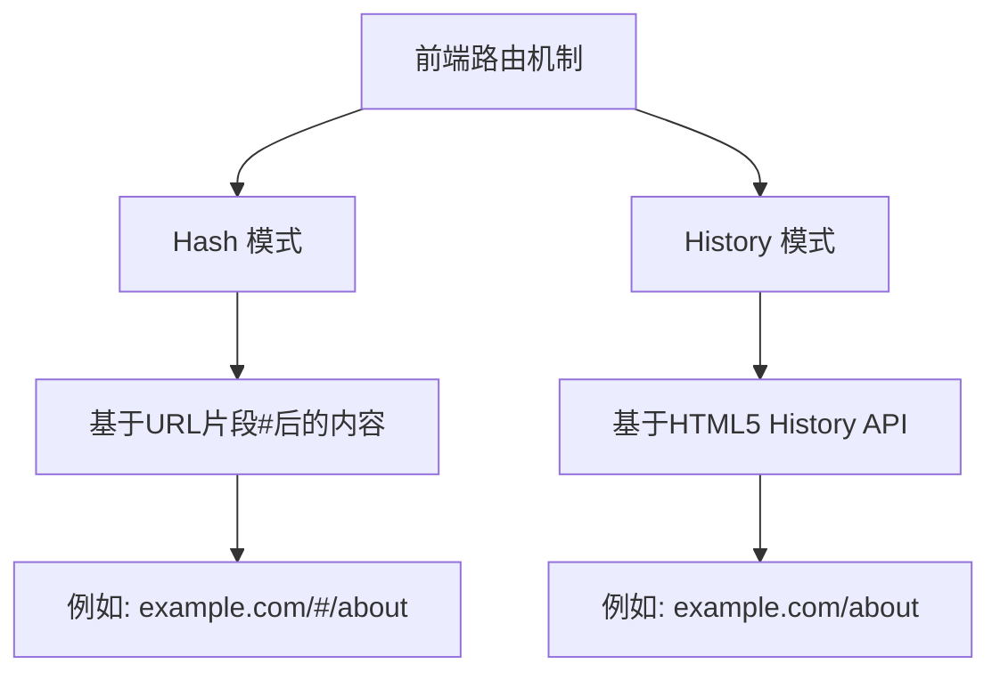

# JavaScript 路由管理

## 什么是路由管理？

在Web开发中，**路由管理**是指根据URL的变化来展示不同的页面内容，而无需刷新整个页面。这是单页面应用程序(SPA)的核心特性之一，使用户体验更加流畅。

路由管理可以让我们：
- 在不同"页面"间切换，不需要刷新浏览器
- 维护页面状态
- 提供前进后退功能
- 使URL与页面内容同步

:::tip 小知识
传统网站每次点击链接都会向服务器请求新页面，而SPA应用只加载一次，然后通过JavaScript动态更改内容！
:::

## 前端路由的工作原理

前端路由主要依靠两种机制实现：



### Hash模式

Hash模式利用URL中的锚点（#）后面的部分，当锚点改变时，页面不会重新加载。

```javascript
// 监听hash变化
window.addEventListener('hashchange', function() {
  // 根据hash变化渲染不同内容
  const hash = window.location.hash.slice(1); // 移除#
  renderContent(hash);
});

// 设置hash
function navigateTo(path) {
  window.location.hash = path;
}
```

### History模式

History模式利用HTML5 History API，让URL看起来像传统网站路径，但实际上是在前端进行控制。

```javascript
// 使用History API导航
function navigateTo(path) {
  history.pushState({}, '', path);
  renderContent(path);
}

// 监听浏览器前进/后退按钮
window.addEventListener('popstate', function() {
  const path = window.location.pathname;
  renderContent(path);
});
```

:::caution 注意
使用History模式时，需要服务器配置支持，否则用户刷新页面或直接访问URL会报404错误！
:::

## 从零实现简单路由

现在，让我们实现一个简单的路由系统：

```javascript
class SimpleRouter {
  constructor(routes) {
    this.routes = routes; // 路由配置
    
    // 页面加载时初始化路由
    window.addEventListener('load', () => this.resolve());
    
    // 监听hash变化
    window.addEventListener('hashchange', () => this.resolve());
  }
  
  resolve() {
    // 获取当前hash（去掉#号）
    const currentPath = window.location.hash.slice(1) || '/';
    
    // 查找匹配的路由
    const route = this.routes.find(route => route.path === currentPath);
    
    if (route) {
      // 将组件内容渲染到指定DOM元素
      document.getElementById('app').innerHTML = route.component();
    } else {
      // 路由不存在时显示404
      document.getElementById('app').innerHTML = '<h1>404 - 页面不存在</h1>';
    }
  }
  
  navigate(path) {
    window.location.hash = path;
  }
}

// 使用示例
const router = new SimpleRouter([
  {
    path: '/',
    component: () => '<h1>首页</h1><p>欢迎来到首页</p>'
  },
  {
    path: '/about',
    component: () => '<h1>关于我们</h1><p>这是关于页面</p>'
  },
  {
    path: '/contact',
    component: () => '<h1>联系我们</h1><p>邮箱: example@example.com</p>'
  }
]);
```

对应的HTML代码：

```html
<!DOCTYPE html>
<html>
<head>
  <title>简单路由实现</title>
</head>
<body>
  <nav>
    <a href="#/">首页</a>
    <a href="#/about">关于</a>
    <a href="#/contact">联系</a>
  </nav>
  
  <div id="app"></div>
  
  <script src="router.js"></script>
</body>
</html>
```

## 流行的JavaScript路由库

现代前端开发中，我们通常会使用成熟的路由库，下面介绍几个主流框架的路由解决方案：

### 1. React Router

React Router是React生态系统中最流行的路由库。

```javascript
import { BrowserRouter, Routes, Route, Link } from 'react-router-dom';

function App() {
  return (
    <BrowserRouter>
      <nav>
        <Link to="/">首页</Link>
        <Link to="/about">关于</Link>
      </nav>
      
      <Routes>
        <Route path="/" element={<Home />} />
        <Route path="/about" element={<About />} />
        <Route path="*" element={<NotFound />} />
      </Routes>
    </BrowserRouter>
  );
}

function Home() {
  return <h1>首页</h1>;
}

function About() {
  return <h1>关于</h1>;
}

function NotFound() {
  return <h1>404 - 页面不存在</h1>;
}
```

### 2. Vue Router

Vue Router是Vue.js的官方路由管理器。

```javascript
// router.js
import { createRouter, createWebHistory } from 'vue-router';
import Home from './components/Home.vue';
import About from './components/About.vue';

const routes = [
  { path: '/', component: Home },
  { path: '/about', component: About },
  { path: '/:pathMatch(.*)*', name: 'NotFound', component: NotFound }
];

const router = createRouter({
  history: createWebHistory(),
  routes
});

export default router;

// main.js
import { createApp } from 'vue';
import App from './App.vue';
import router from './router';

const app = createApp(App);
app.use(router);
app.mount('#app');
```

```html
<!-- App.vue -->
<template>
  <nav>
    <router-link to="/">首页</router-link>
    <router-link to="/about">关于</router-link>
  </nav>
  <router-view></router-view>
</template>
```

## 高级路由功能

随着应用复杂度增加，路由系统提供了更多高级功能：

### 1. 嵌套路由

嵌套路由允许在一个"页面"内部还有子路由，适合复杂界面布局。

```javascript
// React Router示例
<Route path="/settings" element={<Settings />}>
  <Route path="profile" element={<Profile />} />
  <Route path="account" element={<Account />} />
</Route>
```

### 2. 路由参数

路由参数允许我们在URL中包含变量部分：

```javascript
// 定义带参数的路由
<Route path="/users/:userId" element={<UserProfile />} />

// 在组件中获取参数
function UserProfile() {
  const { userId } = useParams();
  return <h1>用户个人资料: {userId}</h1>;
}
```

### 3. 路由守卫

路由守卫可以控制导航行为，常用于权限验证。

```javascript
// Vue Router示例
router.beforeEach((to, from) => {
  // 检查用户是否已登录
  if (to.meta.requiresAuth && !isAuthenticated) {
    // 未登录时重定向到登录页
    return {
      path: '/login',
      query: { redirect: to.fullPath }
    }
  }
})
```

### 4. 懒加载路由

懒加载可以提高应用性能，只在需要时才加载组件代码。

```javascript
// React示例
import { lazy, Suspense } from 'react';

const About = lazy(() => import('./pages/About'));

function App() {
  return (
    <Routes>
      <Route path="/" element={<Home />} />
      <Route 
        path="/about" 
        element={
          <Suspense fallback={<div>加载中...</div>}>
            <About />
          </Suspense>
        } 
      />
    </Routes>
  );
}
```

## 实际案例：构建一个博客应用

让我们通过构建一个简单的博客应用来综合应用路由管理知识：

```javascript
// 使用React Router构建博客应用

import { BrowserRouter, Routes, Route, Link, useParams } from 'react-router-dom';

// 模拟博客数据
const blogPosts = [
  { id: 1, title: 'JavaScript基础', content: '这是关于JavaScript基础的文章...' },
  { id: 2, title: 'React入门', content: '这是关于React入门的文章...' },
  { id: 3, title: '路由管理', content: '这是关于路由管理的文章...' },
];

function App() {
  return (
    <BrowserRouter>
      <header>
        <h1>我的编程博客</h1>
        <nav>
          <Link to="/">首页</Link>
          <Link to="/posts">文章列表</Link>
          <Link to="/about">关于</Link>
        </nav>
      </header>
      
      <main>
        <Routes>
          <Route path="/" element={<Home />} />
          <Route path="/posts" element={<BlogList />} />
          <Route path="/posts/:postId" element={<BlogPost />} />
          <Route path="/about" element={<About />} />
          <Route path="*" element={<NotFound />} />
        </Routes>
      </main>
      
      <footer>© 2023 编程学习网站</footer>
    </BrowserRouter>
  );
}

function Home() {
  return (
    <div>
      <h2>欢迎来到编程学习博客!</h2>
      <p>这里有最新的编程教程和资讯</p>
      <Link to="/posts">查看所有文章</Link>
    </div>
  );
}

function BlogList() {
  return (
    <div>
      <h2>所有文章</h2>
      <ul>
        {blogPosts.map(post => (
          <li key={post.id}>
            <Link to={`/posts/${post.id}`}>{post.title}</Link>
          </li>
        ))}
      </ul>
    </div>
  );
}

function BlogPost() {
  const { postId } = useParams();
  const post = blogPosts.find(post => post.id === parseInt(postId));
  
  if (!post) {
    return <NotFound />;
  }
  
  return (
    <article>
      <h2>{post.title}</h2>
      <p>{post.content}</p>
      <Link to="/posts">返回文章列表</Link>
    </article>
  );
}

function About() {
  return (
    <div>
      <h2>关于我们</h2>
      <p>这是一个专注于前端技术分享的博客平台</p>
    </div>
  );
}

function NotFound() {
  return <h2>404 - 页面不存在</h2>;
}
```

这个例子展示了如何：
1. 设置基本路由结构
2. 使用路由参数（`:postId`）传递信息
3. 实现页面间的导航
4. 处理404页面

## 总结

路由管理是现代前端开发的核心部分，它让单页应用能够模拟传统多页面网站的行为，同时保持无刷新的良好用户体验。

我们学习了：
- 路由管理的基本概念和重要性
- 两种主要的路由实现方式：Hash模式和History模式
- 如何从零实现简单的路由系统
- 主流框架的路由库使用方法
- 高级路由特性，如嵌套路由、参数传递和路由守卫
- 通过实际案例将知识点融会贯通

### 练习题

1. 使用我们的简单路由实现，添加一个新页面并实现导航功能。
2. 尝试将简单路由改造成History模式。
3. 在React Router或Vue Router中实现一个带权限验证的路由系统。
4. 实现一个具有动态路由参数和查询参数的页面。

### 延伸阅读

- React Router官方文档：https://reactrouter.com/
- Vue Router官方文档：https://router.vuejs.org/
- MDN关于History API的文档：https://developer.mozilla.org/zh-CN/docs/Web/API/History_API

通过本文的学习，你应该已经掌握了JavaScript路由管理的基础知识，可以在自己的项目中实现基本的路由功能。随着实践的深入，你会发现路由管理是构建复杂单页应用的强大工具！