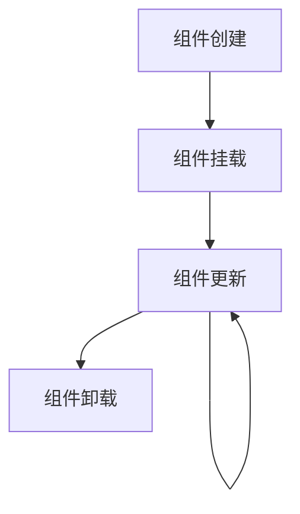

# JavaScript 组件设计

## 什么是组件设计？

组件设计是现代前端开发的核心概念之一，它允许开发者将用户界面拆分成独立、可复用的部分，每个部分都有自己的逻辑和功能。通过组件化设计，我们可以更加高效地构建复杂的Web应用程序，同时提高代码的可维护性和可测试性。

:::tip
组件可以被视为具有特定功能的独立模块，它封装了DOM结构、样式和交互逻辑。
:::

## 为什么要使用组件设计？

组件化开发带来了许多好处：

1. **代码复用** - 组件可以在应用的不同部分甚至不同项目中重复使用
2. **关注点分离** - 每个组件只负责自己的功能，使代码更易于理解
3. **易于维护** - 修改一个组件不会影响其他组件
4. **团队协作** - 不同开发者可以负责不同的组件
5. **测试友好** - 组件可以被单独测试

## 组件设计的基本原则

### 单一职责原则

每个组件应该只有一个职责，只做一件事情，并做好这件事情。

```js
// ❌ 不好的实践 - 一个组件做了太多事情
function UserDashboard() {
  // 处理用户认证
  // 获取用户数据
  // 渲染用户信息
  // 处理表单提交
  // 展示错误信息
}

// ✅ 好的实践 - 拆分成多个组件
function UserAuthentication() { /* ... */ }
function UserProfile() { /* ... */ }
function UserForm() { /* ... */ }
function ErrorDisplay() { /* ... */ }

function UserDashboard() {
  return (
    <>
      <UserAuthentication />
      <UserProfile />
      <UserForm />
      <ErrorDisplay />
    </>
  );
}
```

### 可复用性

设计组件时应考虑它的可复用性，避免硬编码依赖于特定上下文的逻辑。

```js
// ❌ 不好的实践 - 硬编码值
function Button() {
  return <button className="blue-button">提交</button>;
}

// ✅ 好的实践 - 通过props提供灵活性
function Button({ color = 'blue', children = '提交' }) {
  return <button className={`${color}-button`}>{children}</button>;
}
```

### 组件通信

组件之间的通信通常通过以下方式实现：

1. **Props** - 父组件向子组件传递数据
2. **回调函数** - 子组件通过回调函数向父组件传递数据
3. **上下文(Context)** - 跨多层级传递数据
4. **状态管理库** - 如Redux、MobX等用于复杂应用

## 实现一个简单组件

让我们实现一个简单的计数器组件：

```jsx
// Counter.js
import React, { useState } from 'react';

function Counter({ initialCount = 0, step = 1 }) {
  const [count, setCount] = useState(initialCount);
  
  const increment = () => {
    setCount(count + step);
  };
  
  const decrement = () => {
    setCount(count - step);
  };
  
  return (
    <div className="counter">
      <h2>计数器: {count}</h2>
      <button onClick={decrement}>-</button>
      <button onClick={increment}>+</button>
    </div>
  );
}

export default Counter;
```

使用这个组件：

```jsx
// App.js
import React from 'react';
import Counter from './Counter';

function App() {
  return (
    <div className="app">
      <h1>计数器示例</h1>
      <Counter initialCount={5} step={2} />
      <Counter /> {/* 使用默认值 */}
    </div>
  );
}
```

## 组件的生命周期

在React等框架中，组件有其生命周期，了解这些生命周期有助于我们更好地控制组件的行为。



### React中的生命周期钩子

```jsx
import React, { useEffect } from 'react';

function LifecycleComponent() {
  useEffect(() => {
    console.log('组件挂载完成');
    
    return () => {
      console.log('组件即将卸载');
    };
  }, []); // 空依赖数组表示只在挂载和卸载时执行
  
  useEffect(() => {
    console.log('数据已更新');
  }, [/* 依赖的数据 */]);
  
  return <div>生命周期示例</div>;
}
```

## 组件设计模式

### 容器组件与展示组件

将组件分为两类：

1. **容器组件** - 负责数据获取、状态管理和业务逻辑
2. **展示组件** - 负责UI渲染，通常是无状态的

```jsx
// 容器组件
function UserListContainer() {
  const [users, setUsers] = useState([]);
  
  useEffect(() => {
    // 获取用户数据
    fetch('/api/users')
      .then(response => response.json())
      .then(data => setUsers(data));
  }, []);
  
  return <UserList users={users} />;
}

// 展示组件
function UserList({ users }) {
  return (
    <ul>
      {users.map(user => (
        <li key={user.id}>{user.name}</li>
      ))}
    </ul>
  );
}
```

### 高阶组件(HOC)

高阶组件是一个函数，它接收一个组件并返回一个新组件，用于复用组件逻辑。

```jsx
// withLoading.js
function withLoading(WrappedComponent) {
  return function WithLoading({ isLoading, ...props }) {
    if (isLoading) {
      return <div>加载中...</div>;
    }
    return <WrappedComponent {...props} />;
  };
}

// 使用高阶组件
const UserListWithLoading = withLoading(UserList);

// 在应用中使用
function App() {
  const [isLoading, setIsLoading] = useState(true);
  const [users, setUsers] = useState([]);
  
  // ... 获取数据逻辑
  
  return <UserListWithLoading isLoading={isLoading} users={users} />;
}
```

### 渲染属性模式(Render Props)

渲染属性是一种将组件之间共享代码的技术，通过函数作为prop来实现。

```jsx
// Mouse.js
function Mouse({ render }) {
  const [position, setPosition] = useState({ x: 0, y: 0 });
  
  useEffect(() => {
    const handleMouseMove = (event) => {
      setPosition({ x: event.clientX, y: event.clientY });
    };
    
    window.addEventListener('mousemove', handleMouseMove);
    return () => {
      window.removeEventListener('mousemove', handleMouseMove);
    };
  }, []);
  
  return render(position);
}

// 使用渲染属性
function App() {
  return (
    <Mouse render={({ x, y }) => (
      <div>
        鼠标位置: {x}, {y}
      </div>
    )} />
  );
}
```

## 实际案例：构建一个可复用的模态对话框组件

下面是一个可复用的模态对话框组件示例：

```jsx
// Modal.js
import React, { useEffect } from 'react';
import './Modal.css';

function Modal({ isOpen, title, children, onClose }) {
  useEffect(() => {
    // 当模态框打开时，禁止背景滚动
    if (isOpen) {
      document.body.style.overflow = 'hidden';
    } else {
      document.body.style.overflow = 'unset';
    }
    
    // 清理函数
    return () => {
      document.body.style.overflow = 'unset';
    };
  }, [isOpen]);
  
  // 如果模态框未打开，则不渲染
  if (!isOpen) return null;
  
  return (
    <div className="modal-overlay" onClick={onClose}>
      <div className="modal-content" onClick={e => e.stopPropagation()}>
        <div className="modal-header">
          <h3>{title}</h3>
          <button className="close-button" onClick={onClose}>&times;</button>
        </div>
        <div className="modal-body">
          {children}
        </div>
        <div className="modal-footer">
          <button onClick={onClose}>关闭</button>
        </div>
      </div>
    </div>
  );
}

export default Modal;
```

CSS样式：

```css
/* Modal.css */
.modal-overlay {
  position: fixed;
  top: 0;
  left: 0;
  right: 0;
  bottom: 0;
  background-color: rgba(0, 0, 0, 0.5);
  display: flex;
  align-items: center;
  justify-content: center;
  z-index: 1000;
}

.modal-content {
  background-color: white;
  border-radius: 5px;
  max-width: 500px;
  min-width: 300px;
  padding: 20px;
  box-shadow: 0 3px 7px rgba(0, 0, 0, 0.3);
}

.modal-header {
  display: flex;
  justify-content: space-between;
  align-items: center;
  border-bottom: 1px solid #eee;
  padding-bottom: 10px;
}

.close-button {
  border: none;
  background: none;
  font-size: 1.5rem;
  cursor: pointer;
}

.modal-body {
  padding: 20px 0;
}

.modal-footer {
  border-top: 1px solid #eee;
  padding-top: 10px;
  text-align: right;
}
```

使用这个模态框组件：

```jsx
// App.js
import React, { useState } from 'react';
import Modal from './Modal';

function App() {
  const [isModalOpen, setModalOpen] = useState(false);
  
  const openModal = () => setModalOpen(true);
  const closeModal = () => setModalOpen(false);
  
  return (
    <div className="app">
      <h1>模态框示例</h1>
      <button onClick={openModal}>打开模态框</button>
      
      <Modal isOpen={isModalOpen} title="用户信息" onClose={closeModal}>
        <p>这是模态框的内容。可以放置任何内容，比如表单、图片或其他组件。</p>
        <form>
          <div>
            <label>姓名：</label>
            <input type="text" />
          </div>
          <div>
            <label>邮箱：</label>
            <input type="email" />
          </div>
        </form>
      </Modal>
    </div>
  );
}
```

## 组件性能优化

### React.memo

对于函数组件，使用`React.memo`可以避免不必要的重新渲染。

```jsx
import React from 'react';

const ExpensiveComponent = React.memo(function ExpensiveComponent({ data }) {
  console.log('Expensive component rendered');
  // 复杂的渲染逻辑...
  return <div>{/* 渲染结果 */}</div>;
});

export default ExpensiveComponent;
```

### useCallback & useMemo

使用`useCallback`和`useMemo`来缓存函数和计算结果。

```jsx
import React, { useState, useCallback, useMemo } from 'react';

function ParentComponent() {
  const [count, setCount] = useState(0);
  const [text, setText] = useState('');
  
  // 使用useCallback缓存函数
  const handleClick = useCallback(() => {
    setCount(count + 1);
  }, [count]);
  
  // 使用useMemo缓存计算结果
  const expensiveCalculation = useMemo(() => {
    console.log('Calculating...');
    // 假设这是一个复杂的计算
    return count * 2;
  }, [count]);
  
  return (
    <div>
      <input value={text} onChange={e => setText(e.target.value)} />
      <p>Count: {count}</p>
      <p>Calculated: {expensiveCalculation}</p>
      <ChildComponent onClick={handleClick} />
    </div>
  );
}

const ChildComponent = React.memo(function ChildComponent({ onClick }) {
  console.log('Child rendered');
  return <button onClick={onClick}>Increment</button>;
});
```

## 组件测试

组件测试是确保代码质量的重要环节。可以使用工具如Jest和React Testing Library进行测试。

```jsx
// Button.test.js
import { render, screen, fireEvent } from '@testing-library/react';
import Button from './Button';

test('按钮点击时应调用onClick处理函数', () => {
  const handleClick = jest.fn();
  render(<Button onClick={handleClick}>点击我</Button>);
  
  fireEvent.click(screen.getByText('点击我'));
  expect(handleClick).toHaveBeenCalledTimes(1);
});

test('按钮应根据传入的color属性显示不同的样式', () => {
  const { rerender } = render(<Button color="blue">蓝色按钮</Button>);
  expect(screen.getByText('蓝色按钮')).toHaveClass('blue-button');
  
  rerender(<Button color="red">红色按钮</Button>);
  expect(screen.getByText('红色按钮')).toHaveClass('red-button');
});
```

## 总结与最佳实践

组件设计是现代前端开发的基石，掌握组件化开发能极大提升开发效率和代码质量。以下是一些最佳实践：

1. **保持组件小而专注**：每个组件只做一件事
2. **设计可复用的API**：通过prop提供灵活性
3. **合理组织组件结构**：按照功能或页面划分组件
4. **遵循单向数据流**：数据流向应清晰明确
5. **组件应是自包含的**：避免对外部环境的过度依赖
6. **性能优化**：避免不必要的渲染
7. **编写测试**：确保组件行为符合预期

:::caution
过度组件化也可能导致项目结构复杂，需要在代码复用和可维护性之间找到平衡点。
:::

## 练习与进阶学习

### 练习
1. 创建一个可复用的表单输入组件，支持不同的输入类型（文本、数字、邮箱等）
2. 实现一个选项卡（Tab）组件，可以动态添加多个选项卡内容
3. 设计一个带分页功能的数据表格组件

### 进阶学习资源
- [React官方文档](https://reactjs.org/docs/components-and-props.html)
- [Vue组件系统](https://vuejs.org/guide/essentials/component-basics.html)
- [设计模式：可复用面向对象软件的基础](https://www.amazon.com/Design-Patterns-Elements-Reusable-Object-Oriented/dp/0201633612)
- [React设计模式与最佳实践](https://www.packtpub.com/product/react-design-patterns-and-best-practices-second-edition/9781800560444)

通过实践和学习，你将能够设计出更加健壮、可复用和易于维护的组件，为构建大型应用程序打下坚实的基础。