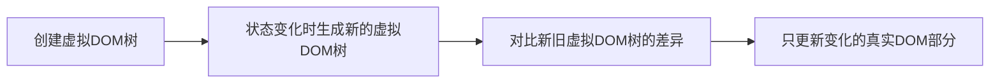

# JavaScript 虚拟DOM

## 什么是虚拟DOM？

虚拟DOM（Virtual DOM）是一种编程概念，其中UI的理想或"虚拟"表示保存在内存中，并通过类似ReactDOM等库与"真实"DOM同步。这个过程被称为协调（Reconciliation）。

虚拟DOM本质上是一个轻量级的JavaScript对象，它是真实DOM的一种抽象表示。当应用状态发生变化时，首先在虚拟DOM上进行操作，然后通过比较（Diffing）算法找出需要更新的部分，最后只将变化的部分应用到真实DOM上。

:::note 为什么需要虚拟DOM？
直接操作DOM是昂贵的（性能消耗大），而JavaScript对象的操作相对来说更轻量和高效。虚拟DOM提供了一个缓冲层，使得我们可以批量、高效地更新DOM。
:::

## 虚拟DOM的工作原理

虚拟DOM的工作流程可以分为三个主要步骤：



1. **创建虚拟DOM**：当我们编写React或Vue等组件时，我们实际上是在描述应该渲染什么内容，框架会根据这些描述创建一个虚拟DOM树。

2. **Diffing算法**：当组件的状态发生变化时，会创建一个新的虚拟DOM树。框架会使用差异比较算法（Diffing Algorithm）来确定新旧虚拟DOM树之间的差异。

3. **更新真实DOM**：一旦确定了差异，框架就会有选择地更新真实DOM，只改变那些真正需要改变的部分。

## 简单的虚拟DOM实现

让我们从头实现一个简单的虚拟DOM系统，以便更好地理解其工作原理：

```javascript
// 1. 创建虚拟DOM元素
function createElement(type, props, ...children) {
  return {
    type,
    props: props || {},
    children: children.flat()
  };
}

// 2. 将虚拟DOM转换为真实DOM
function render(vNode) {
  // 处理文本节点
  if (typeof vNode === 'string' || typeof vNode === 'number') {
    return document.createTextNode(vNode);
  }
  
  // 创建元素
  const element = document.createElement(vNode.type);
  
  // 设置属性
  Object.entries(vNode.props || {}).forEach(([name, value]) => {
    element.setAttribute(name, value);
  });
  
  // 递归处理子节点
  vNode.children.forEach(child => {
    element.appendChild(render(child));
  });
  
  return element;
}

// 3. 比较新旧虚拟DOM树（简化版本）
function diff(oldVNode, newVNode, parentElement, index = 0) {
  // 如果是首次渲染或节点被替换
  if (!oldVNode) {
    parentElement.appendChild(render(newVNode));
  } 
  // 如果节点被移除
  else if (!newVNode) {
    parentElement.removeChild(parentElement.childNodes[index]);
  } 
  // 如果节点类型改变
  else if (oldVNode.type !== newVNode.type) {
    parentElement.replaceChild(render(newVNode), parentElement.childNodes[index]);
  } 
  // 如果是文本节点且内容改变
  else if (typeof newVNode === 'string' && newVNode !== oldVNode) {
    parentElement.childNodes[index].nodeValue = newVNode;
  } 
  // 递归比较子节点
  else if (newVNode.type) {
    // 比较和更新属性...
    
    const maxLength = Math.max(
      oldVNode.children.length,
      newVNode.children.length
    );
    
    for (let i = 0; i < maxLength; i++) {
      diff(
        oldVNode.children[i],
        newVNode.children[i],
        parentElement.childNodes[index],
        i
      );
    }
  }
}
```

使用示例：

```javascript
// 创建初始虚拟DOM
const initialVDOM = createElement('div', { class: 'container' },
  createElement('h1', null, '虚拟DOM演示'),
  createElement('p', null, '这是初始内容')
);

// 渲染到真实DOM
const rootElement = document.getElementById('app');
rootElement.appendChild(render(initialVDOM));

// 状态变化后的虚拟DOM
const updatedVDOM = createElement('div', { class: 'container active' },
  createElement('h1', null, '虚拟DOM演示'),
  createElement('p', null, '内容已更新!')
);

// 使用diff算法更新DOM
setTimeout(() => {
  diff(initialVDOM, updatedVDOM, rootElement);
}, 2000);
```

## 虚拟DOM在主流框架中的应用

### React

React是最早将虚拟DOM引入主流的框架之一。在React中，我们定义组件，这些组件描述了UI应该如何呈现。React将这些描述转换为虚拟DOM，然后高效地将其同步到实际DOM。

```jsx
// React组件示例
function Counter() {
  const [count, setCount] = React.useState(0);
  
  return (
    <div>
      <h1>计数器: {count}</h1>
      <button onClick={() => setCount(count + 1)}>增加</button>
    </div>
  );
}
```

当`count`状态改变时，React会创建一个新的虚拟DOM树，使用差异算法确定需要更新的内容，然后只更新计数值部分，而不是重新渲染整个组件。

### Vue

Vue也采用了虚拟DOM技术，但其响应式系统能够更精确地跟踪依赖关系，从而减少不必要的渲染。

```vue
<!-- Vue组件示例 -->
<template>
  <div>
    <h1>计数器: {{ count }}</h1>
    <button @click="increment">增加</button>
  </div>
</template>

<script>
export default {
  data() {
    return {
      count: 0
    }
  },
  methods: {
    increment() {
      this.count++;
    }
  }
}
</script>
```

## 虚拟DOM的优势与局限性

### 优势

1. **性能优化**：通过最小化DOM操作，提高渲染性能。
2. **跨平台能力**：同一套虚拟DOM可以渲染到不同平台（如Web、Native应用）。
3. **开发体验**：让开发者专注于状态管理和UI描述，而不是DOM操作。
4. **组件化**：促进了基于组件的开发模式。

### 局限性

1. **额外的内存消耗**：需要在内存中维护额外的JavaScript对象。
2. **简单场景下可能不如直接DOM操作**：对于非常简单的UI更新，直接操作DOM可能更高效。
3. **初始渲染可能较慢**：首次渲染需要创建整个虚拟DOM树。

## 实际应用案例：待办事项列表

以下是一个使用React实现的简单待办事项应用，展示了虚拟DOM如何在实际应用中工作：

```jsx
function TodoApp() {
  const [todos, setTodos] = React.useState([]);
  const [input, setInput] = React.useState('');
  
  const addTodo = () => {
    if (input.trim()) {
      setTodos([...todos, { id: Date.now(), text: input, completed: false }]);
      setInput('');
    }
  };
  
  const toggleTodo = (id) => {
    setTodos(todos.map(todo => 
      todo.id === id ? { ...todo, completed: !todo.completed } : todo
    ));
  };
  
  return (
    <div className="todo-app">
      <h1>待办事项清单</h1>
      
      <div className="add-todo">
        <input 
          value={input} 
          onChange={e => setInput(e.target.value)} 
          placeholder="添加新任务..."
        />
        <button onClick={addTodo}>添加</button>
      </div>
      
      <ul className="todo-list">
        {todos.map(todo => (
          <li 
            key={todo.id}
            style={{ textDecoration: todo.completed ? 'line-through' : 'none' }}
            onClick={() => toggleTodo(todo.id)}
          >
            {todo.text}
          </li>
        ))}
      </ul>
    </div>
  );
}
```

在这个例子中，当我们添加或完成一个待办事项时，React会创建一个新的虚拟DOM树，确定需要更新的部分，然后只更新变化的元素，而不是重新渲染整个列表。

## 总结

虚拟DOM是现代前端框架的核心概念之一，它通过在内存中维护UI的轻量级表示，提供了一种高效更新实际DOM的方式。虽然它不是所有场景的最佳解决方案，但在构建复杂、动态的用户界面时，虚拟DOM的优势尤为明显。

理解虚拟DOM的工作原理不仅能帮助你更好地使用React、Vue等框架，还能让你在设计自己的应用时做出更明智的架构决策。

## 学习资源与练习

- 尝试扩展本文中的简化版虚拟DOM实现，增加更多功能，如事件处理。
- 使用React或Vue构建一个小应用，并使用开发者工具观察DOM的更新。
- 阅读React和Vue官方文档中关于渲染优化的部分，加深对虚拟DOM的理解。

:::tip 实践建议
使用React或Vue的开发者工具，可以帮助你观察组件的重新渲染过程，这是理解虚拟DOM工作方式的直观方法。
:::

Happy coding!