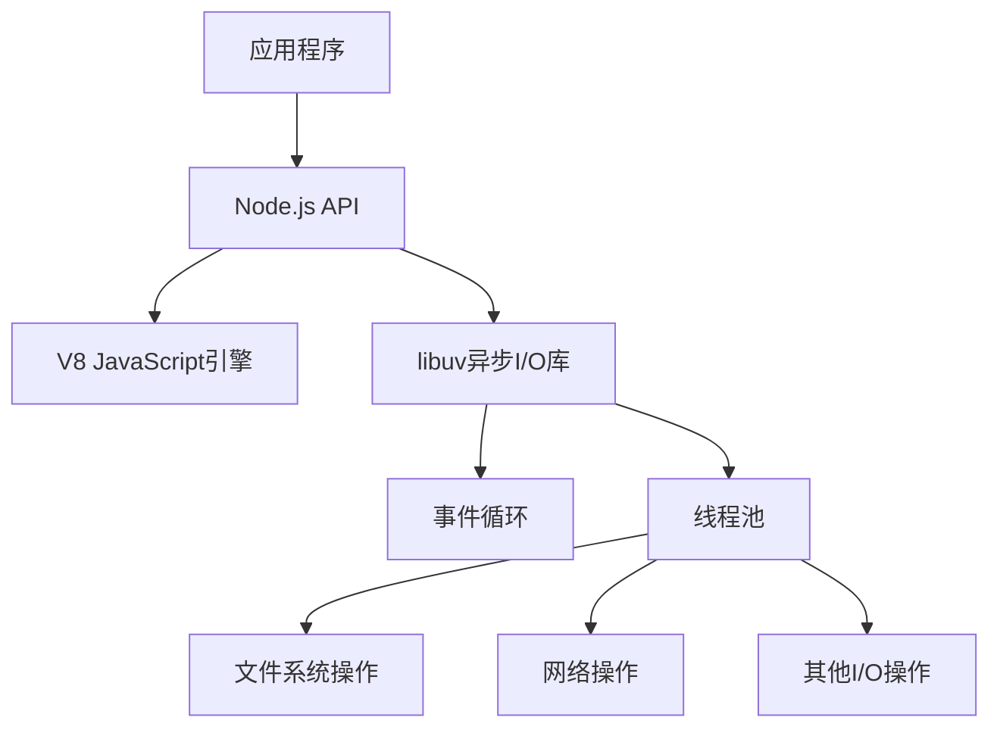

# JavaScript Node.js概述

## 什么是Node.js?

Node.js是一个基于Chrome V8 JavaScript引擎构建的开源、跨平台的JavaScript运行环境。它使开发者能够使用JavaScript来编写服务器端应用程序，这是一个革命性的突破，因为在Node.js出现之前，JavaScript主要被用于客户端浏览器环境。

:::note
Node.js诞生于2009年，由Ryan Dahl创建，最初的目的是为了构建可扩展的网络应用程序。
:::

## Node.js架构

Node.js采用"事件驱动、非阻塞I/O模型"，这使得它轻量高效，特别适合处理数据密集型的实时应用程序。



### 核心组件

1. **V8 JavaScript引擎**: Google开发的JavaScript引擎，将JavaScript代码编译为本地机器码
2. **libuv**: 跨平台的异步I/O库，处理事件循环和异步操作
3. **核心模块**: 提供基本功能的Node.js模块，如http、fs、path等
4. **npm**: Node.js的包管理器，世界上最大的软件注册表

## Node.js的特点

### 1. 单线程模型

虽然JavaScript是单线程的，但Node.js通过事件循环机制实现了高并发。当需要执行I/O操作时，Node.js会将这些操作委托给系统内核，然后继续执行其他代码，当I/O操作完成时，将回调函数放入事件队列中等待执行。

```javascript
console.log('开始执行');

// 异步操作，不会阻塞主线程
setTimeout(() => {
  console.log('异步操作完成');
}, 1000);

console.log('继续执行其他代码');
```

输出:

```
开始执行
继续执行其他代码
异步操作完成
```

### 2. 非阻塞I/O

Node.js的非阻塞I/O模型使得它能够同时处理多个请求，而不需要为每个连接创建新的线程。

```javascript
const fs = require('fs');

// 非阻塞式读取文件
fs.readFile('example.txt', 'utf8', (err, data) => {
  if (err) {
    console.error('读取文件失败:', err);
    return;
  }
  console.log('文件内容:', data);
});

console.log('读取文件的请求已发出，继续执行其他代码');
```

### 3. 事件驱动架构

Node.js大量使用事件，许多核心API都基于异步事件驱动架构构建。

```javascript
const EventEmitter = require('events');

// 创建事件发射器实例
const myEmitter = new EventEmitter();

// 注册事件监听器
myEmitter.on('event', () => {
  console.log('事件被触发了!');
});

// 触发事件
myEmitter.emit('event');
```

输出:

```
事件被触发了!
```

## 安装Node.js

在开始使用Node.js前，你需要先安装它。Node.js可以从[官方网站](https://nodejs.org/)下载并安装。安装后，你可以在命令行中验证安装是否成功：

```bash
node -v
npm -v
```

这两个命令将分别显示Node.js和npm的版本号。

## 创建第一个Node.js应用

让我们创建一个简单的HTTP服务器：

```javascript
// 引入http模块
const http = require('http');

// 定义主机名和端口
const hostname = '127.0.0.1';
const port = 3000;

// 创建HTTP服务器
const server = http.createServer((req, res) => {
  // 设置响应头
  res.statusCode = 200;
  res.setHeader('Content-Type', 'text/plain');
  // 发送响应数据
  res.end('Hello, World!\n');
});

// 启动服务器
server.listen(port, hostname, () => {
  console.log(`服务器运行在 http://${hostname}:${port}/`);
});
```

保存这段代码为`app.js`，然后在命令行中运行：

```bash
node app.js
```

你将看到输出：`服务器运行在 http://127.0.0.1:3000/`

现在打开浏览器访问`http://127.0.0.1:3000`，你会看到"Hello, World!"的输出。

## Node.js模块系统

Node.js使用CommonJS模块系统，允许代码按照模块进行组织和重用。

### 创建模块

```javascript
// math.js - 自定义模块
function add(a, b) {
  return a + b;
}

function subtract(a, b) {
  return a - b;
}

// 导出模块函数
module.exports = { add, subtract };
```

### 使用模块

```javascript
// app.js - 主程序
const math = require('./math'); // 引入自定义模块

console.log(math.add(5, 3));     // 输出: 8
console.log(math.subtract(5, 3)); // 输出: 2
```

## Node.js核心模块

Node.js提供了许多核心模块，这些模块无需安装即可使用：

### 文件系统(fs)

```javascript
const fs = require('fs');

// 同步读取文件
try {
  const data = fs.readFileSync('example.txt', 'utf8');
  console.log(data);
} catch (err) {
  console.error('读取文件出错:', err);
}

// 异步读取文件
fs.readFile('example.txt', 'utf8', (err, data) => {
  if (err) {
    console.error('读取文件出错:', err);
    return;
  }
  console.log(data);
});
```

### HTTP模块

```javascript
const http = require('http');

http.get('http://api.example.com/data', (res) => {
  let data = '';
  
  // 响应数据分片到达
  res.on('data', (chunk) => {
    data += chunk;
  });
  
  // 响应结束
  res.on('end', () => {
    console.log(JSON.parse(data));
  });
}).on('error', (err) => {
  console.error(`请求出错: ${err.message}`);
});
```

## 包管理器 npm

Node.js自带npm（Node Package Manager），它是世界上最大的软件注册表，包含超过一百万个代码包。

### 安装包

```bash
# 安装特定包
npm install express

# 安装并添加到package.json的dependencies
npm install express --save

# 安装并添加到package.json的devDependencies
npm install nodemon --save-dev
```

### package.json

`package.json`是Node.js项目的配置文件，包含项目信息、依赖项和脚本等。

```json
{
  "name": "my-nodejs-app",
  "version": "1.0.0",
  "description": "我的第一个Node.js应用",
  "main": "app.js",
  "scripts": {
    "start": "node app.js",
    "dev": "nodemon app.js"
  },
  "dependencies": {
    "express": "^4.17.1"
  },
  "devDependencies": {
    "nodemon": "^2.0.7"
  }
}
```

## 实际应用场景

Node.js适用于多种应用场景，以下是一些常见的应用：

### 1. Web服务器和API

使用Express.js框架构建RESTful API：

```javascript
const express = require('express');
const app = express();
const port = 3000;

// 中间件解析JSON请求体
app.use(express.json());

// 定义路由
app.get('/api/users', (req, res) => {
  const users = [
    { id: 1, name: '张三' },
    { id: 2, name: '李四' }
  ];
  res.json(users);
});

app.post('/api/users', (req, res) => {
  // 处理添加用户的逻辑
  console.log('接收到的数据:', req.body);
  res.status(201).json({ message: '用户创建成功', user: req.body });
});

// 启动服务器
app.listen(port, () => {
  console.log(`API服务器运行在 http://localhost:${port}`);
});
```

### 2. 实时应用

使用Socket.io创建聊天应用：

```javascript
const express = require('express');
const http = require('http');
const socketIo = require('socket.io');

const app = express();
const server = http.createServer(app);
const io = socketIo(server);

// 提供静态文件
app.use(express.static('public'));

// 处理WebSocket连接
io.on('connection', (socket) => {
  console.log('用户已连接');
  
  // 处理聊天消息
  socket.on('chat message', (msg) => {
    console.log('收到消息: ' + msg);
    // 广播消息给所有客户端
    io.emit('chat message', msg);
  });

  // 处理断开连接
  socket.on('disconnect', () => {
    console.log('用户已断开连接');
  });
});

server.listen(3000, () => {
  console.log('服务器运行在 http://localhost:3000');
});
```

### 3. 构建工具

Node.js常被用作前端构建工具，例如webpack、gulp等都是基于Node.js的：

```javascript
// gulpfile.js
const gulp = require('gulp');
const sass = require('gulp-sass')(require('sass'));
const minify = require('gulp-minify');

// 编译Sass任务
gulp.task('sass', function() {
  return gulp.src('./src/styles/*.scss')
    .pipe(sass({ outputStyle: 'compressed' }).on('error', sass.logError))
    .pipe(gulp.dest('./dist/css'));
});

// 压缩JavaScript任务
gulp.task('scripts', function() {
  return gulp.src('./src/js/*.js')
    .pipe(minify())
    .pipe(gulp.dest('./dist/js'));
});

// 监视文件变化
gulp.task('watch', function() {
  gulp.watch('./src/styles/*.scss', gulp.series('sass'));
  gulp.watch('./src/js/*.js', gulp.series('scripts'));
});

// 默认任务
gulp.task('default', gulp.series('sass', 'scripts', 'watch'));
```

## 总结

Node.js是一个强大的JavaScript运行环境，它的事件驱动、非阻塞I/O模型使其特别适合开发高性能的网络应用程序。主要特点包括：

- 使用JavaScript编写服务器端代码
- 基于Chrome V8引擎
- 事件驱动和非阻塞I/O
- 丰富的模块生态系统
- npm包管理器
- 适用于构建API、实时应用和工具等多种场景

通过学习Node.js，你可以使用已掌握的JavaScript知识开发全栈应用程序，从前端到后端统一使用一种语言。

## 练习与资源

### 练习

1. **创建简单的HTTP服务器**：尝试修改本文中的HTTP服务器示例，使其返回HTML内容而不是纯文本。
2. **文件读写操作**：创建一个程序，读取一个文本文件，将其内容转换为大写，然后保存到新文件中。
3. **构建API**：使用Express框架创建一个具有GET、POST、PUT和DELETE操作的简单REST API。

### 进一步学习资源

- [Node.js官方文档](https://nodejs.org/docs/latest/api/)
- [Express.js框架](https://expressjs.com/)
- [Node.js设计模式](https://github.com/nodejs/node/blob/master/doc/guides/simple-profiling.md)
- [了解Node.js事件循环](https://nodejs.org/en/docs/guides/event-loop-timers-and-nexttick/)

随着你对Node.js的深入学习，你将能够构建越来越复杂和强大的应用程序。祝你学习愉快！