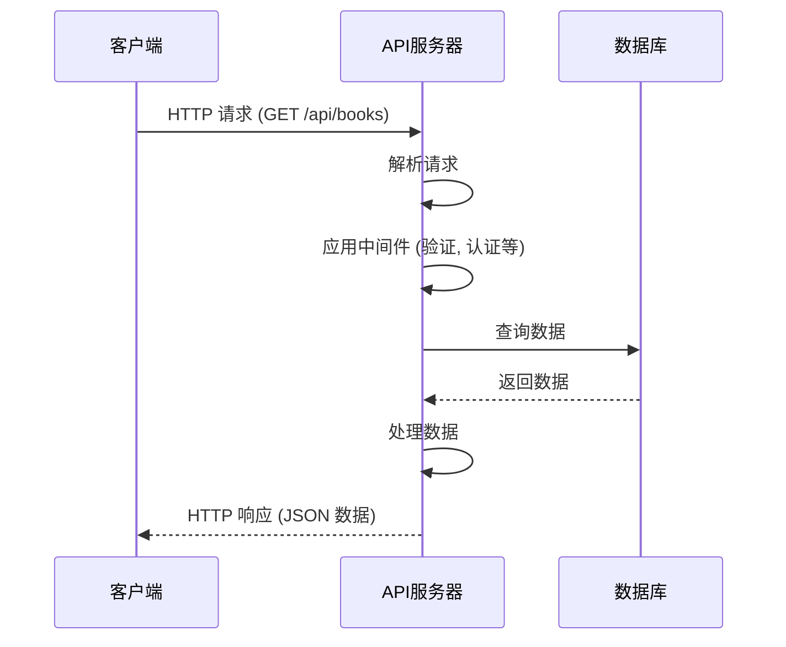

# JavaScript Node.js RESTful API

## 什么是 RESTful API？

REST (Representational State Transfer) 是一种软件架构风格，它定义了一组用于创建 Web 服务的约束条件。RESTful API 是遵循 REST 架构风格的应用程序编程接口（API）。在 Node.js 环境中，我们可以轻松地创建 RESTful API 来处理客户端请求，提供数据服务。

:::note
REST 由 Roy Fielding 在他 2000 年的博士论文中首次提出，现已成为设计网络应用程序接口的主流方法。
:::

## REST 的核心原则

在深入学习 Node.js RESTful API 开发之前，让我们先了解 REST 的几个核心原则：

1. **无状态** - 服务器不存储客户端状态，每个请求包含处理该请求所需的所有信息
2. **客户端-服务器架构** - 关注点分离，提高跨平台的可移植性
3. **可缓存** - 响应必须隐式或显式地标记为可缓存或不可缓存
4. **统一接口** - 简化整体架构，提高交互的可见性
5. **分层系统** - 层次化的架构约束有助于提高系统的可扩展性

## HTTP 方法与 CRUD 操作

RESTful API 使用 HTTP 方法来执行不同的操作：

| HTTP 方法 | CRUD 操作 | 描述 |
|---------|----------|------|
| GET     | 读取      | 获取资源 |
| POST    | 创建      | 创建新资源 |
| PUT     | 更新      | 更新现有资源 |
| DELETE  | 删除      | 删除资源 |
| PATCH   | 部分更新   | 部分更新资源 |

## 使用 Node.js 构建 RESTful API

现在，让我们使用 Node.js 和 Express 框架来构建一个简单的 RESTful API。

### 步骤 1: 设置项目

首先，我们需要创建一个新项目并安装必要的依赖：

```bash
# 创建项目目录
mkdir nodejs-restful-api
cd nodejs-restful-api

# 初始化项目
npm init -y

# 安装依赖
npm install express body-parser
```

### 步骤 2: 创建服务器

创建一个名为 `server.js` 的文件：

```javascript
const express = require('express');
const bodyParser = require('body-parser');

const app = express();
const PORT = process.env.PORT || 3000;

// 中间件
app.use(bodyParser.json());
app.use(bodyParser.urlencoded({ extended: true }));

// 基本路由
app.get('/', (req, res) => {
  res.json({ message: '欢迎访问我们的 RESTful API!' });
});

// 启动服务器
app.listen(PORT, () => {
  console.log(`服务器运行在 http://localhost:${PORT}`);
});
```

### 步骤 3: 实现 CRUD 功能

现在，让我们为用户资源创建 CRUD（创建、读取、更新、删除）操作。我们将使用内存数据存储来简化示例。

```javascript
// 模拟数据库
let users = [
  { id: 1, name: '张三', email: 'zhangsan@example.com' },
  { id: 2, name: '李四', email: 'lisi@example.com' }
];

// 获取所有用户
app.get('/api/users', (req, res) => {
  res.json(users);
});

// 获取单个用户
app.get('/api/users/:id', (req, res) => {
  const user = users.find(u => u.id === parseInt(req.params.id));
  if (!user) return res.status(404).json({ message: '用户未找到' });
  res.json(user);
});

// 创建用户
app.post('/api/users', (req, res) => {
  const newUser = {
    id: users.length + 1,
    name: req.body.name,
    email: req.body.email
  };
  users.push(newUser);
  res.status(201).json(newUser);
});

// 更新用户
app.put('/api/users/:id', (req, res) => {
  const user = users.find(u => u.id === parseInt(req.params.id));
  if (!user) return res.status(404).json({ message: '用户未找到' });
  
  user.name = req.body.name;
  user.email = req.body.email;
  
  res.json(user);
});

// 删除用户
app.delete('/api/users/:id', (req, res) => {
  const userIndex = users.findIndex(u => u.id === parseInt(req.params.id));
  if (userIndex === -1) return res.status(404).json({ message: '用户未找到' });
  
  const deletedUser = users.splice(userIndex, 1);
  res.json(deletedUser[0]);
});
```

### 步骤 4: 运行服务器

在终端运行：

```bash
node server.js
```

现在你的 RESTful API 已经运行在 `http://localhost:3000`。

## API 测试

你可以使用工具如 Postman 或 cURL 来测试你的 API：

### 使用 cURL 进行测试

**获取所有用户**:
```bash
curl -X GET http://localhost:3000/api/users
```
输出:
```json
[
  {"id":1,"name":"张三","email":"zhangsan@example.com"},
  {"id":2,"name":"李四","email":"lisi@example.com"}
]
```

**获取特定用户**:
```bash
curl -X GET http://localhost:3000/api/users/1
```
输出:
```json
{"id":1,"name":"张三","email":"zhangsan@example.com"}
```

**创建新用户**:
```bash
curl -X POST http://localhost:3000/api/users -H "Content-Type: application/json" -d '{"name":"王五","email":"wangwu@example.com"}'
```
输出:
```json
{"id":3,"name":"王五","email":"wangwu@example.com"}
```

## 改进 API

一个生产级的 RESTful API 通常需要更多功能。以下是一些常见的改进：

### 添加验证

使用 `express-validator` 来验证请求数据：

```bash
npm install express-validator
```

```javascript
const { body, validationResult } = require('express-validator');

// 用户创建验证
app.post('/api/users', [
  body('name').notEmpty().withMessage('名称不能为空'),
  body('email').isEmail().withMessage('请提供有效的邮箱')
], (req, res) => {
  const errors = validationResult(req);
  if (!errors.isEmpty()) {
    return res.status(400).json({ errors: errors.array() });
  }
  
  // 处理创建用户的逻辑...
});
```

### 使用路由模块化

随着 API 的增长，将路由分离到独立的模块中是一种好的实践：

```javascript
// routes/users.js
const express = require('express');
const router = express.Router();

// 用户路由处理...
router.get('/', (req, res) => { /* ... */ });
router.post('/', (req, res) => { /* ... */ });
// ...

module.exports = router;
```

```javascript
// server.js
const usersRoutes = require('./routes/users');
app.use('/api/users', usersRoutes);
```

### 添加错误处理

```javascript
// 中间件 - 全局错误处理器
app.use((err, req, res, next) => {
  console.error(err.stack);
  res.status(500).json({
    message: '服务器内部错误',
    error: process.env.NODE_ENV === 'production' ? {} : err
  });
});
```

## 实际应用案例：图书管理 API

让我们构建一个更实用的 RESTful API 示例：一个简单的图书管理系统。

### 项目结构

```
book-api/
├── server.js
├── routes/
│   └── books.js
└── models/
    └── book.js
```

### 实现

**models/book.js**:
```javascript
// 简化的内存数据库模型
class Book {
  constructor() {
    this.books = [
      { id: 1, title: 'Node.js实战', author: '张三', year: 2020 },
      { id: 2, title: 'Express入门', author: '李四', year: 2019 }
    ];
    this.nextId = 3;
  }

  findAll() {
    return this.books;
  }

  findById(id) {
    return this.books.find(book => book.id === id);
  }

  create(book) {
    const newBook = { id: this.nextId++, ...book };
    this.books.push(newBook);
    return newBook;
  }

  update(id, updatedBook) {
    const index = this.books.findIndex(book => book.id === id);
    if (index === -1) return null;
    
    this.books[index] = { ...this.books[index], ...updatedBook };
    return this.books[index];
  }

  delete(id) {
    const index = this.books.findIndex(book => book.id === id);
    if (index === -1) return null;
    
    const deletedBook = this.books[index];
    this.books.splice(index, 1);
    return deletedBook;
  }
}

module.exports = new Book();
```

**routes/books.js**:
```javascript
const express = require('express');
const router = express.Router();
const Book = require('../models/book');

// 获取所有图书
router.get('/', (req, res) => {
  res.json(Book.findAll());
});

// 获取单本图书
router.get('/:id', (req, res) => {
  const id = parseInt(req.params.id);
  const book = Book.findById(id);
  
  if (!book) {
    return res.status(404).json({ message: '图书未找到' });
  }
  
  res.json(book);
});

// 创建图书
router.post('/', (req, res) => {
  const { title, author, year } = req.body;
  
  if (!title || !author) {
    return res.status(400).json({ message: '标题和作者是必须的' });
  }
  
  const newBook = Book.create({ title, author, year: parseInt(year) || new Date().getFullYear() });
  res.status(201).json(newBook);
});

// 更新图书
router.put('/:id', (req, res) => {
  const id = parseInt(req.params.id);
  const { title, author, year } = req.body;
  
  const updatedBook = Book.update(id, { 
    title, 
    author, 
    year: year ? parseInt(year) : undefined 
  });
  
  if (!updatedBook) {
    return res.status(404).json({ message: '图书未找到' });
  }
  
  res.json(updatedBook);
});

// 删除图书
router.delete('/:id', (req, res) => {
  const id = parseInt(req.params.id);
  const deletedBook = Book.delete(id);
  
  if (!deletedBook) {
    return res.status(404).json({ message: '图书未找到' });
  }
  
  res.json(deletedBook);
});

module.exports = router;
```

**server.js**:
```javascript
const express = require('express');
const bodyParser = require('body-parser');
const booksRoutes = require('./routes/books');

const app = express();
const PORT = process.env.PORT || 3000;

// 中间件
app.use(bodyParser.json());
app.use(bodyParser.urlencoded({ extended: true }));

// 路由
app.use('/api/books', booksRoutes);

// 首页
app.get('/', (req, res) => {
  res.json({ message: '欢迎使用图书管理 API!' });
});

// 全局错误处理
app.use((err, req, res, next) => {
  console.error(err.stack);
  res.status(500).json({ message: '服务器错误', error: err.message });
});

// 启动服务器
app.listen(PORT, () => {
  console.log(`服务器运行在 http://localhost:${PORT}`);
});
```

## API 设计最佳实践

:::tip
优秀的 API 设计可以提高可用性、减少错误并改善开发体验。
:::

1. **使用名词而非动词** - 使用 `/api/users` 而非 `/api/getUsers`
2. **版本控制** - 例如 `/api/v1/users`
3. **分页支持** - 通过查询参数：`/api/users?page=2&limit=10`
4. **过滤与排序** - 通过查询参数：`/api/books?year=2020&sort=title`
5. **适当的 HTTP 状态码** - 例如 200、201、400、404、500 等
6. **一致的错误处理** - 标准格式的错误响应
7. **支持 CORS** - 启用跨域资源共享
8. **使用 HATEOAS** - 在响应中包含相关链接

```javascript
// 在响应中使用 HATEOAS 示例
app.get('/api/books/:id', (req, res) => {
  const id = parseInt(req.params.id);
  const book = Book.findById(id);
  
  if (!book) {
    return res.status(404).json({ message: '图书未找到' });
  }
  
  // 添加 HATEOAS 链接
  book._links = {
    self: { href: `/api/books/${id}` },
    collection: { href: '/api/books' }
  };
  
  res.json(book);
});
```

## RESTful API 架构流程

下面的流程图展示了 RESTful API 如何处理客户端请求：



## 总结

在本教程中，我们学习了：

1. RESTful API 的核心概念和设计原则
2. 如何使用 Node.js 和 Express 创建基本的 RESTful API
3. 实现 CRUD 操作来管理资源
4. 添加验证、路由模块化和错误处理来改进 API
5. 构建一个实际的图书管理 API
6. RESTful API 设计的最佳实践

Node.js 因其事件驱动和非阻塞 I/O 模型，特别适合构建高性能的 RESTful API。随着你的 API 发展，可以考虑添加更多功能，如认证、缓存、限流和文档等。

## 练习

1. 为图书管理 API 添加一个新的端点，允许按作者名称搜索图书
2. 实现分页功能，限制每页返回的结果数量
3. 添加中间件来记录每个 API 请求的详细信息
4. 为 API 添加基本的认证机制

## 延伸阅读

- [Express.js 官方文档](https://expressjs.com/)
- [MDN Web Docs: HTTP 请求方法](https://developer.mozilla.org/en-US/docs/Web/HTTP/Methods)
- [REST API 教程](https://restfulapi.net/)
- [Richardson 成熟度模型](https://martinfowler.com/articles/richardsonMaturityModel.html)

通过实践这些概念，你将能够构建健壮的、遵循行业标准的 RESTful API，为你的应用提供强大的后端支持。