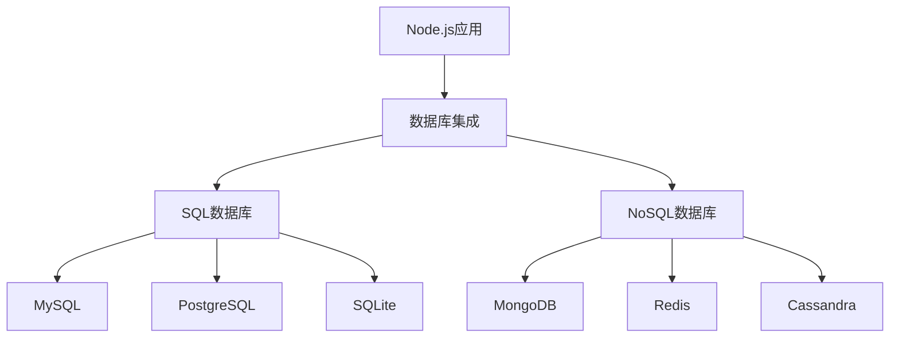

# JavaScript Node.js数据库集成

## 数据库集成概述

在现代Web应用开发中，数据库是不可或缺的组成部分。Node.js作为一个高效的服务器端JavaScript运行环境，提供了丰富的工具和模块来连接和操作各种类型的数据库。本文将介绍如何在Node.js应用中集成不同类型的数据库，帮助初学者了解数据库操作的基本概念和实践方法。

:::tip 学习目标
- 了解Node.js中数据库集成的基本概念
- 掌握SQL数据库(MySQL)和NoSQL数据库(MongoDB)的集成方法
- 学习使用ORM和ODM简化数据库操作
- 实现简单的数据库CRUD(创建、读取、更新、删除)操作
:::

## 数据库类型与Node.js

在Node.js应用中，我们通常会使用两大类数据库：

1. **SQL数据库**：如MySQL、PostgreSQL、SQLite等，基于表格模型存储结构化数据
2. **NoSQL数据库**：如MongoDB、Redis、Cassandra等，采用文档、键值、列族或图形等模型存储数据

选择哪种数据库取决于你的应用需求、数据结构复杂性、扩展性需求以及开发团队的经验。



## MySQL与Node.js集成

MySQL是最流行的开源关系型数据库之一，让我们看看如何在Node.js中使用它：

### 1. 安装MySQL驱动

首先，我们需要安装MySQL的Node.js驱动：

```bash
npm install mysql2
```

:::note 提示
推荐使用`mysql2`而非`mysql`模块，因为它提供了更好的性能和Promise支持。
:::

### 2. 建立连接

```javascript
const mysql = require('mysql2');

// 创建数据库连接
const connection = mysql.createConnection({
  host: 'localhost',
  user: 'root',
  password: 'your_password',
  database: 'your_database'
});

// 连接到数据库
connection.connect(err => {
  if (err) {
    console.error('连接数据库失败:', err);
    return;
  }
  console.log('成功连接到MySQL数据库!');
});
```

### 3. 执行基本查询

```javascript
// 执行简单查询
connection.query('SELECT * FROM users', (err, results, fields) => {
  if (err) {
    console.error('查询出错:', err);
    return;
  }
  
  console.log('查询结果:');
  console.log(results);
});

// 使用参数化查询(防止SQL注入)
const userId = 1;
connection.query(
  'SELECT * FROM users WHERE id = ?', 
  [userId], 
  (err, results) => {
    if (err) throw err;
    console.log('用户信息:', results[0]);
  }
);
```

### 4. 使用Promise与async/await

`mysql2`模块提供了Promise包装器，让我们可以使用现代JavaScript语法：

```javascript
const mysql = require('mysql2/promise');

async function getUserById(id) {
  try {
    // 创建连接
    const connection = await mysql.createConnection({
      host: 'localhost',
      user: 'root',
      password: 'your_password',
      database: 'your_database'
    });
    
    // 执行查询
    const [rows, fields] = await connection.query(
      'SELECT * FROM users WHERE id = ?', 
      [id]
    );
    
    // 关闭连接
    await connection.end();
    
    return rows[0];
  } catch (error) {
    console.error('数据库操作失败:', error);
    throw error;
  }
}

// 使用异步函数
getUserById(1)
  .then(user => console.log('找到用户:', user))
  .catch(err => console.error('获取用户失败:', err));
```

## MongoDB与Node.js集成

MongoDB是一个流行的NoSQL文档数据库，它使用JSON格式的文档存储数据，非常适合JavaScript开发者：

### 1. 安装MongoDB驱动

```bash
npm install mongodb
```

### 2. 连接到MongoDB

```javascript
const { MongoClient } = require('mongodb');

// 连接URL
const url = 'mongodb://localhost:27017';
// 数据库名称
const dbName = 'myproject';

async function connectToMongo() {
  try {
    // 创建客户端实例
    const client = new MongoClient(url);
    
    // 连接到服务器
    await client.connect();
    console.log('成功连接到MongoDB服务器');
    
    // 获取数据库引用
    const db = client.db(dbName);
    
    return { client, db };
  } catch (error) {
    console.error('MongoDB连接失败:', error);
    throw error;
  }
}
```

### 3. 基本CRUD操作

```javascript
async function performCrudOperations() {
  let client;
  
  try {
    // 连接数据库
    const { client: mongoClient, db } = await connectToMongo();
    client = mongoClient;
    
    // 获取集合(相当于SQL中的表)
    const collection = db.collection('users');
    
    // 创建(C): 插入文档
    const insertResult = await collection.insertOne({
      name: 'John Doe',
      email: 'john@example.com',
      age: 28,
      createdAt: new Date()
    });
    console.log('插入的文档ID:', insertResult.insertedId);
    
    // 读取(R): 查询文档
    const user = await collection.findOne({ name: 'John Doe' });
    console.log('找到的用户:', user);
    
    // 更新(U): 修改文档
    const updateResult = await collection.updateOne(
      { name: 'John Doe' },
      { $set: { age: 29 } }
    );
    console.log('更新的文档数:', updateResult.modifiedCount);
    
    // 删除(D): 移除文档
    const deleteResult = await collection.deleteOne({ name: 'John Doe' });
    console.log('删除的文档数:', deleteResult.deletedCount);
    
  } catch (error) {
    console.error('操作失败:', error);
  } finally {
    // 确保关闭客户端连接
    if (client) await client.close();
  }
}

performCrudOperations();
```

## 使用ORM/ODM简化数据库操作

在实际开发中，我们常常会使用对象关系映射(ORM)或对象文档映射(ODM)工具来简化数据库操作：

### Sequelize (MySQL ORM)

Sequelize是Node.js生态中最流行的ORM之一，支持多种SQL数据库：

```bash
npm install sequelize mysql2
```

#### 定义模型和执行操作：

```javascript
const { Sequelize, DataTypes } = require('sequelize');

// 创建Sequelize实例
const sequelize = new Sequelize('database', 'username', 'password', {
  host: 'localhost',
  dialect: 'mysql'
});

// 定义用户模型
const User = sequelize.define('User', {
  // 定义属性
  firstName: {
    type: DataTypes.STRING,
    allowNull: false
  },
  lastName: {
    type: DataTypes.STRING
  },
  email: {
    type: DataTypes.STRING,
    unique: true,
    validate: {
      isEmail: true
    }
  }
});

// 同步模型到数据库(创建表)
async function initDatabase() {
  try {
    await sequelize.sync();
    console.log('数据库已同步');
    
    // 创建用户
    const user = await User.create({
      firstName: 'John',
      lastName: 'Doe',
      email: 'john.doe@example.com'
    });
    
    console.log('创建的用户:', user.toJSON());
    
    // 查询用户
    const users = await User.findAll();
    console.log('所有用户:', JSON.stringify(users, null, 2));
    
  } catch (error) {
    console.error('数据库操作失败:', error);
  }
}

initDatabase();
```

### Mongoose (MongoDB ODM)

Mongoose是专为MongoDB设计的ODM，提供了模式验证、查询构建等功能：

```bash
npm install mongoose
```

#### 使用Mongoose定义模式和操作数据：

```javascript
const mongoose = require('mongoose');

// 连接MongoDB
mongoose.connect('mongodb://localhost:27017/myapp', {
  useNewUrlParser: true,
  useUnifiedTopology: true
}).then(() => console.log('MongoDB连接成功'))
  .catch(err => console.error('MongoDB连接失败', err));

// 定义用户模式
const userSchema = new mongoose.Schema({
  name: { type: String, required: true },
  email: { 
    type: String, 
    required: true, 
    unique: true,
    match: /^\S+@\S+\.\S+$/
  },
  age: { type: Number, min: 0 },
  createdAt: { type: Date, default: Date.now }
});

// 创建模型
const User = mongoose.model('User', userSchema);

// 创建新用户
async function createUser() {
  try {
    const newUser = new User({
      name: 'Jane Smith',
      email: 'jane@example.com',
      age: 25
    });
    
    const savedUser = await newUser.save();
    console.log('用户已保存:', savedUser);
    
    // 查找所有用户
    const users = await User.find({}).sort({ createdAt: -1 });
    console.log('所有用户:', users);
    
  } catch (error) {
    console.error('操作失败:', error);
  }
}

createUser();
```

## 实际案例：构建简单的API

下面我们将构建一个简单的REST API，使用Express和MongoDB来实现一个待办事项应用：

```javascript
const express = require('express');
const mongoose = require('mongoose');
const bodyParser = require('body-parser');

// 创建Express应用
const app = express();
app.use(bodyParser.json());

// 连接MongoDB
mongoose.connect('mongodb://localhost:27017/todo_app')
  .then(() => console.log('MongoDB连接成功'))
  .catch(err => console.error('MongoDB连接失败', err));

// 定义待办事项模式
const todoSchema = new mongoose.Schema({
  title: { type: String, required: true },
  completed: { type: Boolean, default: false },
  createdAt: { type: Date, default: Date.now }
});

// 创建模型
const Todo = mongoose.model('Todo', todoSchema);

// API路由
// 获取所有待办事项
app.get('/api/todos', async (req, res) => {
  try {
    const todos = await Todo.find({});
    res.json(todos);
  } catch (err) {
    res.status(500).json({ error: err.message });
  }
});

// 创建新待办事项
app.post('/api/todos', async (req, res) => {
  try {
    const newTodo = new Todo({
      title: req.body.title,
      completed: req.body.completed || false
    });
    
    const savedTodo = await newTodo.save();
    res.status(201).json(savedTodo);
  } catch (err) {
    res.status(400).json({ error: err.message });
  }
});

// 更新待办事项
app.put('/api/todos/:id', async (req, res) => {
  try {
    const todo = await Todo.findByIdAndUpdate(
      req.params.id,
      { 
        title: req.body.title, 
        completed: req.body.completed 
      },
      { new: true }
    );
    
    if (!todo) return res.status(404).json({ error: '待办事项未找到' });
    res.json(todo);
  } catch (err) {
    res.status(400).json({ error: err.message });
  }
});

// 删除待办事项
app.delete('/api/todos/:id', async (req, res) => {
  try {
    const todo = await Todo.findByIdAndDelete(req.params.id);
    if (!todo) return res.status(404).json({ error: '待办事项未找到' });
    res.json({ message: '待办事项已删除' });
  } catch (err) {
    res.status(500).json({ error: err.message });
  }
});

// 启动服务器
const PORT = process.env.PORT || 3000;
app.listen(PORT, () => {
  console.log(`服务器运行在端口 ${PORT}`);
});
```

## 数据库最佳实践

在实际开发中，遵循以下最佳实践可以提高应用的安全性和性能：

1. **使用连接池**：对于MySQL等数据库，使用连接池可以提高性能
   ```javascript
   const pool = mysql.createPool({
     host: 'localhost',
     user: 'root',
     password: 'password',
     database: 'mydb',
     waitForConnections: true,
     connectionLimit: 10,
     queueLimit: 0
   });
   ```

2. **参数化查询**：永远不要直接拼接SQL字符串，防止SQL注入攻击
   ```javascript
   // 错误方式
   connection.query(`SELECT * FROM users WHERE id = ${userId}`); // 危险!
   
   // 正确方式
   connection.query('SELECT * FROM users WHERE id = ?', [userId]);
   ```

3. **错误处理**：始终捕获并适当处理数据库操作可能产生的错误

4. **关闭连接**：在不需要时正确关闭数据库连接，防止资源泄漏

5. **数据验证**：在数据进入数据库前进行验证，确保数据完整性

6. **使用事务**：对于需要保证原子性的操作，使用数据库事务

7. **索引优化**：为经常查询的字段创建适当的索引，提高查询性能

## 总结

在本教程中，我们学习了：

1. 如何在Node.js应用中集成不同类型的数据库，包括MySQL和MongoDB
2. 使用原生驱动执行基本的数据库操作
3. 如何使用ORM/ODM工具(Sequelize和Mongoose)简化数据库交互
4. 构建一个实际的RESTful API应用，结合Express和MongoDB
5. 数据库操作的最佳实践和安全注意事项

数据库集成是几乎所有现代Web应用的核心部分。通过掌握这些基础知识，你已经具备了构建数据驱动应用的能力。随着实践的深入，你可以进一步探索更高级的数据库概念，如索引优化、复杂查询、数据关系设计等。

## 练习与进一步学习

### 练习任务：
1. 创建一个简单的用户管理系统，使用MySQL存储用户信息并实现CRUD操作
2. 构建一个博客API，使用MongoDB存储文章和评论，实现嵌套文档查询
3. 将上述Todo应用扩展，添加用户认证和授权功能

### 扩展学习资源：
- [Node.js官方文档](https://nodejs.org/en/docs/)
- [MySQL官方文档](https://dev.mysql.com/doc/)
- [MongoDB官方教程](https://docs.mongodb.com/manual/)
- [Sequelize文档](https://sequelize.org/master/)
- [Mongoose文档](https://mongoosejs.com/docs/)

:::caution 注意事项
开发环境使用的数据库凭证不应该直接硬编码在应用中，而应该使用环境变量或配置文件管理。实际部署时要特别注意数据库安全性，包括设置强密码、限制访问权限和定期备份数据。
:::

随着你的Node.js技能不断提升，数据库集成将成为你开发工具箱中的强大武器，帮助你构建功能丰富、数据驱动的应用程序。