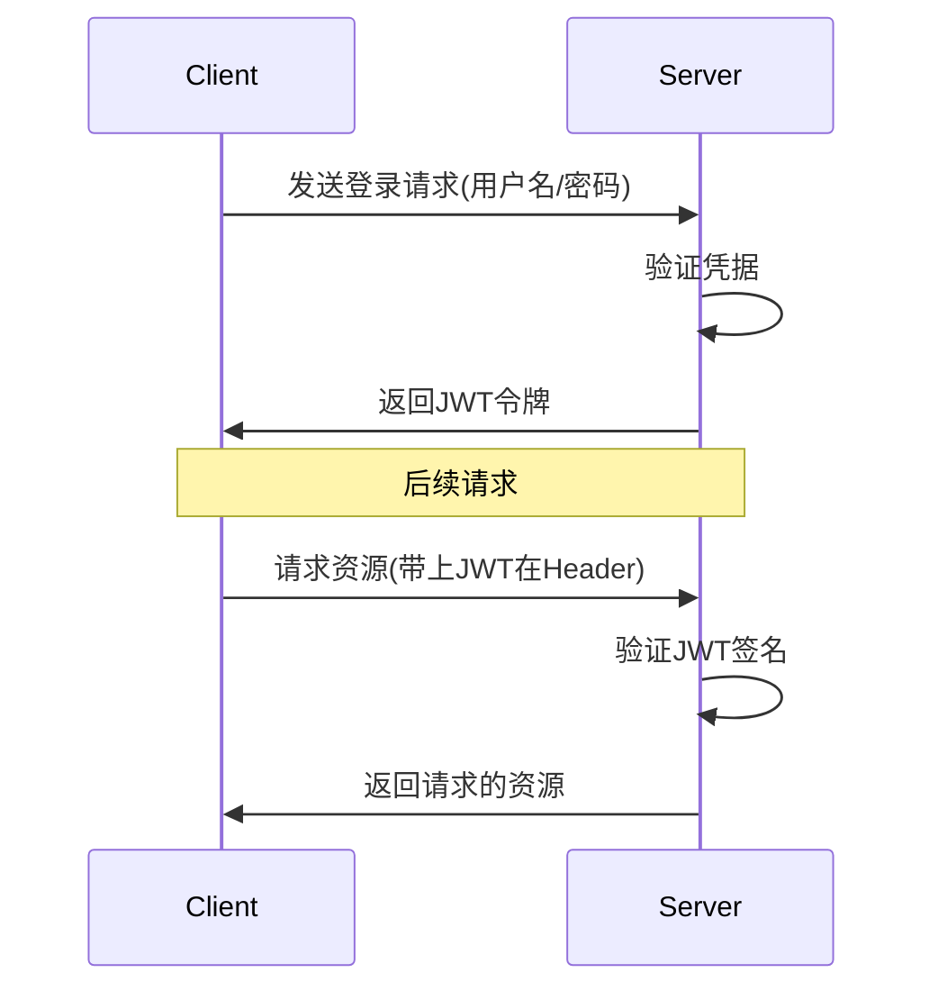

# JavaScript Node.js身份验证

## 引言

身份验证（Authentication）是几乎所有Web应用程序的核心组成部分，它确保用户是他们所声称的身份，并授权他们访问相应的资源。在本教程中，我们将学习如何在Node.js应用程序中实现稳健的身份验证系统，从基本的概念到实际应用。

:::note
身份验证与授权是不同的概念：
- **身份验证（Authentication）**：确认用户是谁
- **授权（Authorization）**：确定用户可以做什么
:::

## 身份验证基础知识

在深入代码之前，让我们先了解一些基本概念：

### 常见的身份验证方法

1. **基于会话的身份验证**：用户登录后服务器创建会话，并向客户端发送会话ID（通常存储在cookie中）
2. **基于令牌的身份验证**：服务器生成令牌（如JWT）而非维护会话状态
3. **OAuth**：允许第三方应用获取有限的访问权限
4. **多因素认证**：结合多种验证方式（如密码+手机验证码）

## 密码安全最佳实践

在处理用户密码时，必须遵循安全最佳实践：

### 密码哈希

永远不要以明文形式存储密码！使用哈希算法（如bcrypt）来存储密码：

```javascript
const bcrypt = require('bcrypt');
const saltRounds = 10;

// 哈希密码
async function hashPassword(plainPassword) {
  const hash = await bcrypt.hash(plainPassword, saltRounds);
  return hash;
}

// 验证密码
async function verifyPassword(plainPassword, hashedPassword) {
  const match = await bcrypt.compare(plainPassword, hashedPassword);
  return match;
}

// 使用示例
async function registerUser(email, password) {
  try {
    const hashedPassword = await hashPassword(password);
    // 将邮箱和哈希后的密码存入数据库
    console.log(`用户注册: ${email} 密码哈希: ${hashedPassword}`);
    return true;
  } catch (error) {
    console.error('注册失败:', error);
    return false;
  }
}
```

## 基于会话的认证

会话认证是最传统的身份验证方式之一，使用Express和express-session可以轻松实现：

### 设置会话中间件

```javascript
const express = require('express');
const session = require('express-session');
const app = express();

app.use(express.json());
app.use(session({
  secret: 'your-secret-key',  // 用于签名会话ID cookie的密钥
  resave: false,              // 强制将会话保存回会话存储
  saveUninitialized: false,   // 强制将"未初始化"的会话保存到存储中
  cookie: { 
    secure: process.env.NODE_ENV === 'production', // 在生产环境中仅通过HTTPS发送cookie
    maxAge: 1000 * 60 * 60 * 24 // 会话有效期为1天
  }
}));

// 后续路由代码...
```

### 实现登录和退出逻辑

```javascript
// 模拟一个用户数据库
const users = [
  { id: 1, email: 'user@example.com', password: '$2b$10$...' } // 使用bcrypt哈希过的密码
];

// 登录路由
app.post('/login', async (req, res) => {
  const { email, password } = req.body;
  
  // 查找用户
  const user = users.find(u => u.email === email);
  if (!user) {
    return res.status(401).json({ message: '用户名或密码错误' });
  }
  
  // 验证密码
  const isPasswordValid = await bcrypt.compare(password, user.password);
  if (!isPasswordValid) {
    return res.status(401).json({ message: '用户名或密码错误' });
  }
  
  // 创建会话
  req.session.userId = user.id;
  
  res.json({ message: '登录成功' });
});

// 检查认证状态的中间件
const requireAuth = (req, res, next) => {
  if (!req.session.userId) {
    return res.status(401).json({ message: '请先登录' });
  }
  next();
};

// 受保护的路由
app.get('/profile', requireAuth, (req, res) => {
  // 获取用户信息
  const user = users.find(u => u.id === req.session.userId);
  res.json({ email: user.email });
});

// 登出路由
app.post('/logout', (req, res) => {
  req.session.destroy();
  res.json({ message: '已成功登出' });
});
```

## 基于JWT的认证

JSON Web Token (JWT) 是一种流行的无状态认证机制，特别适用于API和单页应用程序。

### JWT的工作原理



### 实现JWT认证

首先安装所需的包：

```bash
npm install jsonwebtoken
```

然后实现JWT认证：

```javascript
const express = require('express');
const jwt = require('jsonwebtoken');
const bcrypt = require('bcrypt');
const app = express();

app.use(express.json());

// JWT密钥（在生产环境中应存储在环境变量中）
const JWT_SECRET = 'your-secret-key';

// 模拟用户数据库
const users = [
  { id: 1, email: 'user@example.com', password: '$2b$10$...' } // bcrypt哈希
];

// 登录路由 - 生成JWT
app.post('/api/login', async (req, res) => {
  const { email, password } = req.body;
  
  // 查找用户
  const user = users.find(u => u.email === email);
  if (!user) {
    return res.status(401).json({ message: '用户名或密码错误' });
  }
  
  // 验证密码
  const isPasswordValid = await bcrypt.compare(password, user.password);
  if (!isPasswordValid) {
    return res.status(401).json({ message: '用户名或密码错误' });
  }
  
  // 生成JWT
  const token = jwt.sign(
    { userId: user.id, email: user.email },
    JWT_SECRET,
    { expiresIn: '24h' }  // 令牌有效期
  );
  
  res.json({ token });
});

// JWT验证中间件
const authenticateJWT = (req, res, next) => {
  const authHeader = req.headers.authorization;
  
  if (!authHeader) {
    return res.status(401).json({ message: '未提供认证令牌' });
  }
  
  const token = authHeader.split(' ')[1]; // 获取Bearer token
  
  jwt.verify(token, JWT_SECRET, (err, user) => {
    if (err) {
      return res.status(403).json({ message: '令牌无效或已过期' });
    }
    
    req.user = user;
    next();
  });
};

// 受保护的路由
app.get('/api/profile', authenticateJWT, (req, res) => {
  res.json({ email: req.user.email });
});
```

:::tip
JWT令牌通常以`Authorization: Bearer <token>`的形式在HTTP请求头中发送。
:::

## 完整应用案例：使用MongoDB和Passport.js

现在让我们构建一个更完整的身份验证系统，使用流行的Passport.js库和MongoDB数据库。

### 安装所需包

```bash
npm install express mongoose passport passport-local passport-jwt bcrypt jsonwebtoken
```

### 设置MongoDB模型

```javascript
// models/User.js
const mongoose = require('mongoose');
const bcrypt = require('bcrypt');

const userSchema = new mongoose.Schema({
  email: { type: String, required: true, unique: true },
  password: { type: String, required: true },
  name: { type: String, required: true },
  createdAt: { type: Date, default: Date.now }
});

// 保存前哈希密码
userSchema.pre('save', async function(next) {
  if (!this.isModified('password')) return next();
  
  try {
    const salt = await bcrypt.genSalt(10);
    this.password = await bcrypt.hash(this.password, salt);
    next();
  } catch (error) {
    next(error);
  }
});

// 验证密码方法
userSchema.methods.comparePassword = async function(candidatePassword) {
  return bcrypt.compare(candidatePassword, this.password);
};

module.exports = mongoose.model('User', userSchema);
```

### 配置Passport策略

```javascript
// config/passport.js
const passport = require('passport');
const LocalStrategy = require('passport-local').Strategy;
const JwtStrategy = require('passport-jwt').Strategy;
const ExtractJwt = require('passport-jwt').ExtractJwt;
const User = require('../models/User');

// JWT配置选项
const jwtOptions = {
  jwtFromRequest: ExtractJwt.fromAuthHeaderAsBearerToken(),
  secretOrKey: process.env.JWT_SECRET || 'your-secret-key'
};

// 本地策略 - 用于登录
passport.use(new LocalStrategy(
  { usernameField: 'email' },
  async (email, password, done) => {
    try {
      const user = await User.findOne({ email });
      
      if (!user) {
        return done(null, false, { message: '用户不存在' });
      }
      
      const isMatch = await user.comparePassword(password);
      
      if (!isMatch) {
        return done(null, false, { message: '密码不正确' });
      }
      
      return done(null, user);
    } catch (error) {
      return done(error);
    }
  }
));

// JWT策略 - 用于验证令牌
passport.use(new JwtStrategy(jwtOptions, async (jwtPayload, done) => {
  try {
    const user = await User.findById(jwtPayload.userId);
    
    if (user) {
      return done(null, user);
    } else {
      return done(null, false);
    }
  } catch (error) {
    return done(error, false);
  }
}));

module.exports = passport;
```

### 主应用设置

```javascript
// app.js
const express = require('express');
const mongoose = require('mongoose');
const passport = require('./config/passport');
const jwt = require('jsonwebtoken');
const app = express();

// 连接MongoDB
mongoose.connect('mongodb://localhost:27017/auth_demo', {
  useNewUrlParser: true,
  useUnifiedTopology: true,
  useCreateIndex: true
})
.then(() => console.log('MongoDB连接成功'))
.catch(err => console.error('MongoDB连接失败:', err));

// 中间件
app.use(express.json());
app.use(passport.initialize());

// 注册路由
app.post('/api/register', async (req, res) => {
  try {
    const { name, email, password } = req.body;
    
    // 检查用户是否已存在
    const existingUser = await User.findOne({ email });
    if (existingUser) {
      return res.status(400).json({ message: '该邮箱已被注册' });
    }
    
    // 创建新用户
    const user = new User({ name, email, password });
    await user.save();
    
    res.status(201).json({ message: '注册成功' });
  } catch (error) {
    res.status(500).json({ message: '服务器错误', error: error.message });
  }
});

// 登录路由
app.post('/api/login', (req, res, next) => {
  passport.authenticate('local', { session: false }, (err, user, info) => {
    if (err) return next(err);
    
    if (!user) {
      return res.status(401).json({ message: info.message });
    }
    
    // 生成JWT
    const token = jwt.sign(
      { userId: user._id, email: user.email },
      process.env.JWT_SECRET || 'your-secret-key',
      { expiresIn: '1d' }
    );
    
    return res.json({ token, user: { id: user._id, email: user.email, name: user.name } });
  })(req, res, next);
});

// 受保护的路由
app.get('/api/profile', passport.authenticate('jwt', { session: false }), (req, res) => {
  res.json({ user: { id: req.user._id, email: req.user.email, name: req.user.name } });
});

// 启动服务器
const PORT = process.env.PORT || 3000;
app.listen(PORT, () => console.log(`服务器运行在端口 ${PORT}`));
```

## 身份验证最佳实践

以下是实现安全身份验证系统的一些最佳实践：

1. **永远加密密码**：始终使用bcrypt或Argon2等算法哈希存储密码。

2. **使用HTTPS**：所有认证过程都应在HTTPS上进行，以防止中间人攻击。

3. **实施速率限制**：限制登录尝试次数，以防止暴力攻击。

4. **注意令牌安全**：
   - 设置合理的过期时间
   - 使用安全的存储方式（如HttpOnly cookies）
   - 实现令牌刷新机制

5. **实现多因素认证**：为关键操作添加额外的验证层。

6. **正确处理错误消息**：不要透露太多信息（例如，使用"用户名或密码错误"而不是具体指明是哪一个错误）。

## 实际应用案例：电子商务网站身份验证

假设我们正在构建一个电子商务网站，需要处理用户账户和购物车功能。以下是我们如何实现身份验证系统：

1. 用户注册和登录系统（如上所示）
2. 购物车会话管理
3. 敏感操作（如支付）的额外验证

```javascript
// 购物车相关API端点
app.post('/api/cart/add', passport.authenticate('jwt', { session: false }), async (req, res) => {
  const { productId, quantity } = req.body;
  const userId = req.user._id;
  
  try {
    // 查找或创建用户的购物车
    let cart = await Cart.findOne({ userId });
    if (!cart) {
      cart = new Cart({ userId, items: [] });
    }
    
    // 添加商品
    const existingItem = cart.items.find(item => item.productId.equals(productId));
    if (existingItem) {
      existingItem.quantity += quantity;
    } else {
      cart.items.push({ productId, quantity });
    }
    
    await cart.save();
    res.json(cart);
  } catch (error) {
    res.status(500).json({ message: '添加到购物车失败', error: error.message });
  }
});

// 敏感操作 - 需要重新验证
app.post('/api/checkout', passport.authenticate('jwt', { session: false }), async (req, res) => {
  const { password } = req.body;
  const user = req.user;
  
  // 重新验证密码进行敏感操作
  const isValid = await user.comparePassword(password);
  if (!isValid) {
    return res.status(401).json({ message: '密码验证失败，无法处理结账' });
  }
  
  // 处理结账逻辑...
  res.json({ message: '结账成功' });
});
```

## 总结

在这篇教程中，我们学习了：

1. 身份验证的基本概念和方法
2. 安全地存储密码
3. 基于会话的认证
4. 基于JWT的认证
5. 使用Passport.js构建完整的身份验证系统
6. 身份验证的最佳实践
7. 实际应用案例

身份验证是Web应用程序安全的基础，掌握这些技能将帮助你构建更安全、更可靠的Node.js应用程序。

## 练习与进一步学习

为了巩固所学知识，请尝试以下练习：

1. **基础练习**：实现一个简单的注册、登录和受保护资源的API。
2. **中级练习**：添加密码重置功能，使用电子邮件发送重置链接。
3. **高级练习**：实现OAuth2.0集成，允许用户通过Google或GitHub账户登录。

### 推荐资源

- [OWASP身份验证备忘单](https://cheatsheetseries.owasp.org/cheatsheets/Authentication_Cheat_Sheet.html)
- [Passport.js官方文档](http://www.passportjs.org/)
- [JWT.io](https://jwt.io/) - 了解JWT结构和验证
- [Auth0博客](https://auth0.com/blog/) - 关于身份验证最佳实践的文章

:::caution
记住，身份验证是安全的第一道防线，但不是唯一的防线。完整的安全策略还应包括授权、输入验证、CSRF保护等多层次防御机制。
:::