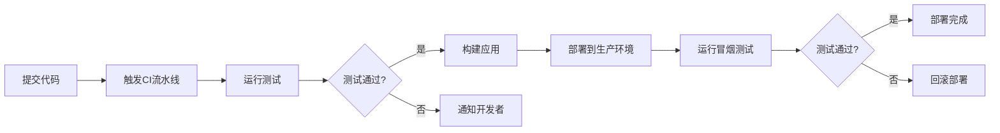

# JavaScript Node.js部署

---
title: JavaScript Node.js部署
description: 学习如何将Node.js应用部署到生产环境中，包括不同的部署策略、工具和最佳实践。
---

## 介绍

将Node.js应用从开发环境迁移到生产环境是每个开发者必须掌握的技能。部署不仅仅是将代码放到服务器上那么简单，它涉及到环境配置、性能优化、安全性考虑以及可靠性保障等多方面的内容。本文将全面介绍Node.js应用的部署流程和相关技术，帮助初学者了解如何将自己的应用安全、高效地部署到生产环境中。

## 部署前的准备工作

在部署Node.js应用之前，需要完成以下准备工作：

### 1. 环境变量配置

在实际生产环境中，敏感信息（如数据库密码、API密钥等）不应该硬编码在代码中，而应该通过环境变量来配置。

```javascript
// 不推荐的做法
const dbPassword = "mySecretPassword";

// 推荐的做法
const dbPassword = process.env.DB_PASSWORD;
```

可以使用`dotenv`包来管理环境变量：

```bash
npm install dotenv
```

```javascript
// 在应用的入口文件(如app.js)的顶部
require('dotenv').config();

// 现在可以通过process.env访问.env文件中定义的变量
const dbUrl = process.env.DATABASE_URL;
```

### 2. 错误处理

确保应用能够优雅地处理错误，不会因为未捕获的异常而崩溃。

```javascript
process.on('uncaughtException', (err) => {
  console.error('未捕获的异常:', err);
  // 在这里可以执行一些清理操作，如关闭数据库连接等
  process.exit(1); // 推荐的做法是优雅地退出
});

process.on('unhandledRejection', (reason, promise) => {
  console.error('未处理的Promise拒绝:', reason);
  // 同样可以执行一些清理操作
});
```

### 3. 日志配置

在生产环境中，合适的日志记录对于排查问题至关重要。可以使用像Winston或Morgan这样的日志库。

```bash
npm install winston
```

```javascript
const winston = require('winston');

const logger = winston.createLogger({
  level: 'info',
  format: winston.format.json(),
  defaultMeta: { service: 'user-service' },
  transports: [
    // 写入所有日志到combined.log
    new winston.transports.File({ filename: 'combined.log' }),
    // 写入错误日志到error.log
    new winston.transports.File({ filename: 'error.log', level: 'error' })
  ]
});

// 在非生产环境下，同时将日志打印到控制台
if (process.env.NODE_ENV !== 'production') {
  logger.add(new winston.transports.Console({
    format: winston.format.simple()
  }));
}

// 使用日志
logger.info('Hello, this is an informational message');
logger.error('Something went wrong', { error: new Error('Some error') });
```

## 部署策略

Node.js应用有多种部署策略，以下是几种常见的方式：

### 1. 基本的VPS部署

最直接的方式是在VPS(Virtual Private Server)上手动部署：

1. 连接到服务器
```bash
ssh username@your_server_ip
```

2. 安装Node.js和npm
```bash
curl -sL https://deb.nodesource.com/setup_14.x | sudo -E bash -
sudo apt-get install -y nodejs
```

3. 克隆代码仓库
```bash
git clone https://github.com/yourusername/your-repo.git
cd your-repo
```

4. 安装依赖并启动应用
```bash
npm install
npm start
```

### 2. 使用进程管理器

在生产环境中，你需要确保Node.js应用在崩溃后自动重启，并能够利用多核CPU。PM2是一个流行的Node.js进程管理器。

```bash
# 全局安装PM2
npm install -g pm2

# 启动应用
pm2 start app.js --name "my-app"

# 查看应用状态
pm2 status

# 查看日志
pm2 logs

# 配置应用开机自启动
pm2 startup
pm2 save
```

:::tip
PM2可以通过配置文件进行更复杂的设置，如集群模式、环境变量等。创建`ecosystem.config.js`文件：
:::

```javascript
module.exports = {
  apps: [{
    name: "my-app",
    script: "app.js",
    instances: "max", // 使用所有可用CPU核心
    autorestart: true,
    watch: false,
    max_memory_restart: "1G", // 当内存超过1G时重启
    env: {
      NODE_ENV: "development"
    },
    env_production: {
      NODE_ENV: "production"
    }
  }]
};
```

然后使用：
```bash
pm2 start ecosystem.config.js --env production
```

### 3. 使用Docker容器化

Docker提供了一种封装应用及其依赖的方式，确保在任何环境中都能一致地运行。

1. 创建Dockerfile

```dockerfile
FROM node:14-alpine

WORKDIR /app

COPY package*.json ./
RUN npm install

COPY . .

ENV NODE_ENV=production
ENV PORT=3000

EXPOSE 3000

CMD ["node", "app.js"]
```

2. 构建和运行Docker镜像

```bash
# 构建镜像
docker build -t my-node-app .

# 运行容器
docker run -p 3000:3000 -d --name my-app my-node-app
```

### 4. 使用云服务提供商

许多云服务提供商提供了简化的Node.js部署选项：

- **Heroku**: 部署只需几个命令
```bash
heroku create
git push heroku main
```

- **AWS Elastic Beanstalk**: 自动处理容量配置、负载均衡等
- **Google App Engine**: 提供可扩展的托管环境
- **Azure App Service**: 集成了CI/CD流程

## 生产环境优化

### 1. 性能优化

在生产环境中，性能是关键。以下是一些优化技巧：

1. **使用集群模式**：利用多核CPU

```javascript
const cluster = require('cluster');
const os = require('os');
const numCPUs = os.cpus().length;

if (cluster.isMaster) {
  console.log(`主进程 ${process.pid} 正在运行`);

  // 生成工作进程
  for (let i = 0; i < numCPUs; i++) {
    cluster.fork();
  }

  cluster.on('exit', (worker, code, signal) => {
    console.log(`工作进程 ${worker.process.pid} 已退出`);
    // 如果工作进程意外退出，重新启动一个新的
    cluster.fork();
  });
} else {
  // 工作进程可以共享任何TCP连接
  // 在本例中，它是一个HTTP服务器
  const express = require('express');
  const app = express();
  
  app.get('/', (req, res) => {
    res.send('Hello World!');
  });
  
  app.listen(3000, () => {
    console.log(`工作进程 ${process.pid} 已启动`);
  });
}
```

2. **内存泄漏检测**：使用工具如`heapdump`和`memwatch-next`

```bash
npm install heapdump
```

```javascript
const heapdump = require('heapdump');

// 在适当的地方触发堆转储
heapdump.writeSnapshot('./heapdump-' + Date.now() + '.heapsnapshot');
```

3. **压缩响应**：使用compression中间件

```bash
npm install compression
```

```javascript
const compression = require('compression');
const express = require('express');
const app = express();

// 使用gzip压缩响应
app.use(compression());
```

### 2. 安全性考虑

1. **使用Helmet增强HTTP头安全**

```bash
npm install helmet
```

```javascript
const helmet = require('helmet');
const express = require('express');
const app = express();

app.use(helmet());
```

2. **防止跨站请求伪造(CSRF)**

```bash
npm install csurf
```

```javascript
const csrf = require('csurf');
const express = require('express');
const cookieParser = require('cookie-parser');
const app = express();

app.use(cookieParser());
app.use(csrf({ cookie: true }));

app.get('/form', (req, res) => {
  // 将CSRF令牌传递给模板
  res.render('form', { csrfToken: req.csrfToken() });
});

app.post('/process', (req, res) => {
  // csurf中间件会自动检查令牌有效性
  res.send('数据处理成功');
});
```

## 监控和维护

### 1. 应用监控

可以使用各种工具监控Node.js应用的性能和健康状况：

- **New Relic**: 提供深入的性能监控
- **Datadog**: 监控基础设施和应用
- **PM2 Plus**: PM2的付费版本，带有监控面板

也可以自建简单的健康检查端点：

```javascript
app.get('/health', (req, res) => {
  // 检查数据库连接等关键依赖
  const databaseHealthy = checkDatabaseConnection();
  const redisHealthy = checkRedisConnection();
  
  if (databaseHealthy && redisHealthy) {
    res.status(200).json({ status: 'UP' });
  } else {
    res.status(503).json({
      status: 'DOWN',
      database: databaseHealthy ? 'UP' : 'DOWN',
      redis: redisHealthy ? 'UP' : 'DOWN'
    });
  }
});
```

### 2. 自动化部署

使用CI/CD工具可以自动化部署流程：



## 实际案例：部署简单的Express API

下面我们将通过一个实际案例，演示如何将一个简单的Express API部署到生产环境。

### 1. 应用代码

```javascript
// app.js
const express = require('express');
const helmet = require('helmet');
const compression = require('compression');
require('dotenv').config();

const app = express();
const PORT = process.env.PORT || 3000;

// 中间件
app.use(helmet());
app.use(compression());
app.use(express.json());

// 路由
app.get('/', (req, res) => {
  res.json({ message: 'API运行正常' });
});

app.get('/api/users', (req, res) => {
  // 模拟从数据库获取用户
  const users = [
    { id: 1, name: '张三' },
    { id: 2, name: '李四' }
  ];
  res.json(users);
});

// 错误处理中间件
app.use((err, req, res, next) => {
  console.error(err.stack);
  res.status(500).json({ error: '服务器内部错误' });
});

// 启动服务器
app.listen(PORT, () => {
  console.log(`服务器运行在端口${PORT}`);
});

// 处理未捕获的异常和Promise拒绝
process.on('uncaughtException', (err) => {
  console.error('未捕获的异常:', err);
  process.exit(1);
});

process.on('unhandledRejection', (err) => {
  console.error('未处理的Promise拒绝:', err);
});
```

### 2. 部署到VPS服务器

1. **准备服务器**
```bash
# 更新包列表
sudo apt update

# 安装Node.js
curl -sL https://deb.nodesource.com/setup_14.x | sudo -E bash -
sudo apt-get install -y nodejs

# 安装PM2
sudo npm install -g pm2
```

2. **创建部署脚本**
```bash
#!/bin/bash
# deploy.sh

# 拉取最新代码
git pull origin main

# 安装依赖
npm install --production

# 重启应用
pm2 restart ecosystem.config.js --env production
```

3. **创建PM2配置文件**
```javascript
// ecosystem.config.js
module.exports = {
  apps: [{
    name: "my-express-api",
    script: "app.js",
    instances: "max",
    autorestart: true,
    watch: false,
    max_memory_restart: "500M",
    env_production: {
      NODE_ENV: "production",
      PORT: 3000
    }
  }]
};
```

4. **首次部署**
```bash
# 启动应用
pm2 start ecosystem.config.js --env production

# 设置PM2开机自启动
pm2 startup
pm2 save

# 查看应用状态
pm2 status
```

5. **设置Nginx反向代理**
```bash
# 安装Nginx
sudo apt install nginx

# 配置Nginx
sudo nano /etc/nginx/sites-available/my-express-api
```

```nginx
server {
    listen 80;
    server_name yourdomain.com www.yourdomain.com;

    location / {
        proxy_pass http://localhost:3000;
        proxy_http_version 1.1;
        proxy_set_header Upgrade $http_upgrade;
        proxy_set_header Connection 'upgrade';
        proxy_set_header Host $host;
        proxy_cache_bypass $http_upgrade;
    }
}
```

```bash
# 启用配置
sudo ln -s /etc/nginx/sites-available/my-express-api /etc/nginx/sites-enabled/
sudo nginx -t
sudo systemctl restart nginx
```

6. **设置SSL证书**
```bash
# 安装Certbot
sudo apt install certbot python3-certbot-nginx

# 获取SSL证书
sudo certbot --nginx -d yourdomain.com -d www.yourdomain.com
```

### 3. 持续集成/持续部署(CI/CD)

如果想更进一步自动化部署流程，可以使用GitHub Actions：

1. **创建GitHub Actions工作流文件**
```yaml
# .github/workflows/deploy.yml
name: Deploy

on:
  push:
    branches: [ main ]

jobs:
  deploy:
    runs-on: ubuntu-latest
    steps:
      - name: 通过SSH部署到生产服务器
        uses: appleboy/ssh-action@master
        with:
          host: ${{ secrets.HOST }}
          username: ${{ secrets.USERNAME }}
          key: ${{ secrets.PRIVATE_KEY }}
          script: |
            cd /path/to/your/app
            ./deploy.sh
```

2. **在GitHub仓库设置中添加Secrets**
   - HOST: 服务器IP地址
   - USERNAME: SSH用户名
   - PRIVATE_KEY: 私钥内容

## 总结

将Node.js应用部署到生产环境是一个多步骤的过程，需要考虑性能、安全性、可靠性等多方面的因素。本文介绍了从准备工作到各种部署策略，以及生产环境优化和监控维护的全面内容。初学者可以从简单的VPS部署开始，逐步掌握更复杂的部署技术，如容器化和CI/CD自动化部署。

随着经验的积累，你可以根据应用的需求和规模选择最合适的部署策略。记住，部署不是一次性工作，而是一个需要持续改进和优化的过程。

## 附加资源和练习

### 资源
- [PM2官方文档](https://pm2.keymetrics.io/docs/usage/quick-start/)
- [Docker官方文档](https://docs.docker.com/get-started/)
- [Node.js最佳实践](https://github.com/goldbergyoni/nodebestpractices)

### 练习
1. 创建一个简单的Express应用，并使用PM2将其部署到本地开发机器上
2. 为Node.js应用创建一个Dockerfile，并尝试运行容器化版本
3. 设计一个基本的CI/CD管道，包括测试、构建和部署阶段
4. 实现一个健康检查端点和基本的监控解决方案
5. 尝试将应用部署到免费的云平台，如Heroku或Vercel

通过实践这些练习，你将获得实际的部署经验，这对于成为一名全栈开发者至关重要。