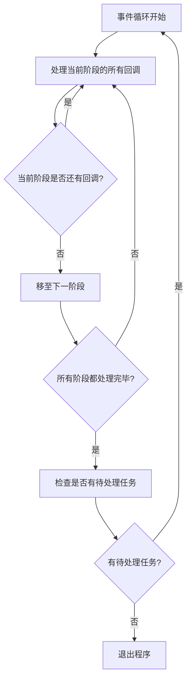

# JavaScript Node.js性能

## 介绍

在构建Node.js应用程序时，性能是一个至关重要的方面。高性能的应用可以处理更多的请求，提供更好的用户体验，并降低运行成本。本文将介绍Node.js性能的基础知识，包括影响性能的因素、如何监控性能以及优化性能的最佳实践。

:::tip
性能优化应该是渐进式的过程 - 先编写可工作的代码，然后在必要时进行优化。过早优化可能会导致代码复杂化，而没有实际收益。
:::

## Node.js性能的基本概念

### 事件循环

Node.js基于事件驱动、非阻塞I/O模型，这是其高性能的核心。理解事件循环对于优化Node.js应用至关重要：



事件循环的主要阶段包括：
1. **Timers**: 处理`setTimeout()`和`setInterval()`的回调
2. **Pending callbacks**: 执行某些系统操作的回调
3. **Idle, prepare**: 内部使用
4. **Poll**: 获取新的I/O事件
5. **Check**: 处理`setImmediate()`的回调
6. **Close callbacks**: 处理关闭事件的回调

### 单线程与工作线程

Node.js主线程是单线程的，这意味着CPU密集型任务会阻塞事件循环。从Node.js v10.5.0开始，工作线程(Worker Threads)被添加以支持多线程处理：

```javascript
// worker-example.js
const { Worker, isMainThread, parentPort } = require('worker_threads');

if (isMainThread) {
  // 这段代码运行在主线程
  const worker = new Worker(__filename);
  worker.on('message', (message) => {
    console.log(`主线程收到: ${message}`);
  });
  worker.postMessage('Hello, worker!');
} else {
  // 这段代码运行在工作线程
  parentPort.on('message', (message) => {
    console.log(`工作线程收到: ${message}`);
    parentPort.postMessage('你好，主线程！');
  });
}
```

输出:
```
工作线程收到: Hello, worker!
主线程收到: 你好，主线程！
```

## 监控Node.js性能

### 内置工具

#### 1. `console.time()` 和 `console.timeEnd()`

```javascript
console.time('操作耗时');
// 进行一些操作
for (let i = 0; i < 1000000; i++) {
  // 一些计算
}
console.timeEnd('操作耗时');
```

输出:
```
操作耗时: 8.157ms
```

#### 2. Node.js 性能钩子 API

```javascript
const { PerformanceObserver, performance } = require('perf_hooks');

// 创建性能观察器
const obs = new PerformanceObserver((items) => {
  const entries = items.getEntries();
  entries.forEach((entry) => {
    console.log(`${entry.name}: ${entry.duration}ms`);
  });
  performance.clearMarks();
});
obs.observe({ entryTypes: ['measure'] });

// 测量代码块的执行时间
performance.mark('A');
// 某些操作
for (let i = 0; i < 1000000; i++) {
  // 密集计算
}
performance.mark('B');
performance.measure('A 到 B', 'A', 'B');
```

### 外部工具

1. **Node.js Profiler**: 使用V8内置的分析器
2. **Clinic.js**: 一套强大的诊断工具
3. **New Relic、Datadog**: 生产环境监控工具

## 性能优化最佳实践

### 1. 异步编程

避免阻塞事件循环是关键。将CPU密集型任务拆分或使用工作线程：

```javascript
// 不好的做法 - 阻塞事件循环
app.get('/compute', (req, res) => {
  const result = computeHeavyTask(); // 这会阻塞事件循环
  res.json({ result });
});

// 好的做法 - 使用工作线程
const { Worker } = require('worker_threads');
app.get('/compute', (req, res) => {
  const worker = new Worker('./heavy-task-worker.js');
  worker.on('message', (result) => {
    res.json({ result });
  });
  worker.postMessage(req.query);
});
```

### 2. 内存管理

Node.js使用垃圾回收来管理内存。避免内存泄漏：

```javascript
// 内存泄漏示例
const leakyData = [];
function processData(data) {
  leakyData.push(data); // 数组会无限增长，导致内存泄漏
}

// 修复内存泄漏
function processDataFixed(data) {
  // 仅在必要时保存数据，或定期清理
  const result = transform(data);
  return result;
}
```

检测内存使用：

```javascript
const memoryUsage = process.memoryUsage();
console.log(`内存使用情况: ${JSON.stringify(memoryUsage, null, 2)}`);
```

### 3. 数据库优化

优化数据库查询和连接池：

```javascript
// 使用连接池
const { Pool } = require('pg');
const pool = new Pool({
  max: 20, // 最大连接数
  idleTimeoutMillis: 30000, // 连接最大空闲时间
});

// 使用索引和高效查询
async function getUsersEfficient(minAge) {
  // 假设在age字段上有索引
  const result = await pool.query('SELECT * FROM users WHERE age > $1', [minAge]);
  return result.rows;
}
```

### 4. 缓存

实现适当的缓存策略：

```javascript
const NodeCache = require('node-cache');
const cache = new NodeCache({ stdTTL: 600 }); // 缓存10分钟

async function getDataWithCache(key) {
  // 尝试从缓存中获取
  const cachedData = cache.get(key);
  if (cachedData) return cachedData;
  
  // 缓存未命中，从数据库获取
  const freshData = await fetchDataFromDatabase(key);
  
  // 存入缓存
  cache.set(key, freshData);
  return freshData;
}
```

### 5. 代码优化技巧

#### 避免深层嵌套回调

```javascript
// 不好的做法 - 回调地狱
getData(function(a) {
  getMoreData(a, function(b) {
    getEvenMoreData(b, function(c) {
      // 更多嵌套...
    });
  });
});

// 好的做法 - 使用Promise或async/await
async function processData() {
  try {
    const a = await getData();
    const b = await getMoreData(a);
    const c = await getEvenMoreData(b);
    return c;
  } catch (error) {
    console.error('处理数据错误:', error);
  }
}
```

#### 有效使用流

```javascript
const fs = require('fs');

// 不好的做法 - 一次性读取整个文件
app.get('/download', (req, res) => {
  fs.readFile('./large-file.pdf', (err, data) => {
    if (err) throw err;
    res.send(data); // 占用大量内存
  });
});

// 好的做法 - 使用流
app.get('/download', (req, res) => {
  const fileStream = fs.createReadStream('./large-file.pdf');
  fileStream.pipe(res); // 高效的内存使用
});
```

## 实际案例：构建高性能API服务器

让我们创建一个简单但高效的API服务器，应用我们学到的性能优化技巧：

```javascript
const express = require('express');
const { Worker } = require('worker_threads');
const NodeCache = require('node-cache');

const app = express();
const port = 3000;
const cache = new NodeCache({ stdTTL: 60 }); // 1分钟缓存

// 中间件：请求日志和计时
app.use((req, res, next) => {
  console.time(`${req.method} ${req.url}`);
  
  // 响应完成后记录耗时
  res.on('finish', () => {
    console.timeEnd(`${req.method} ${req.url}`);
  });
  
  next();
});

// 缓存中间件
function cacheMiddleware(duration) {
  return (req, res, next) => {
    const key = `__express__${req.originalUrl || req.url}`;
    const cachedBody = cache.get(key);
    
    if (cachedBody) {
      res.send(cachedBody);
      return;
    }
    
    // 保存原始的res.send方法
    const originalSend = res.send;
    
    // 重写res.send方法以缓存响应
    res.send = function(body) {
      cache.set(key, body, duration);
      originalSend.call(this, body);
    };
    
    next();
  };
}

// 常规API端点 - 使用缓存
app.get('/api/data', cacheMiddleware(30), (req, res) => {
  // 模拟数据库查询
  setTimeout(() => {
    res.json({ message: 'API数据', timestamp: Date.now() });
  }, 500);
});

// CPU密集型操作 - 使用工作线程
app.get('/api/compute', (req, res) => {
  const n = parseInt(req.query.n) || 40;
  
  // 创建工作线程执行斐波那契计算
  const worker = new Worker(`
    const { parentPort, workerData } = require('worker_threads');
    
    function fibonacci(n) {
      if (n <= 1) return n;
      return fibonacci(n - 1) + fibonacci(n - 2);
    }
    
    parentPort.on('message', (n) => {
      const result = fibonacci(n);
      parentPort.postMessage(result);
    });
  `, { eval: true });
  
  worker.on('message', (result) => {
    res.json({ result, input: n });
    worker.terminate();
  });
  
  worker.postMessage(n);
});

// 高效文件下载 - 使用流
app.get('/api/download', (req, res) => {
  const fs = require('fs');
  const path = require('path');
  
  const filePath = path.join(__dirname, 'sample.txt');
  const stat = fs.statSync(filePath);
  
  res.setHeader('Content-Length', stat.size);
  res.setHeader('Content-Type', 'text/plain');
  res.setHeader('Content-Disposition', 'attachment; filename=sample.txt');
  
  const stream = fs.createReadStream(filePath);
  stream.pipe(res);
});

// 错误处理中间件
app.use((err, req, res, next) => {
  console.error(err.stack);
  res.status(500).json({ error: '服务器内部错误' });
});

app.listen(port, () => {
  console.log(`服务器运行在 http://localhost:${port}`);
});
```

## 总结

提升Node.js应用性能的关键点：

1. **理解事件循环**：避免阻塞操作，合理使用异步编程
2. **使用工作线程**：将CPU密集型任务移至工作线程
3. **内存管理**：避免内存泄漏，监控内存使用
4. **数据库优化**：使用连接池，优化查询，创建索引
5. **实施缓存**：缓存计算结果和频繁请求的数据
6. **代码优化**：使用流处理大文件，避免回调地狱
7. **监控性能**：使用性能工具识别瓶颈

记住，性能优化是一个持续的过程，总是先测量，然后有针对性地优化最大的瓶颈。

## 练习与资源

### 练习

1. 创建一个简单的Node.js应用，使用`console.time()`测量不同操作的性能。
2. 实现一个使用工作线程处理CPU密集型任务的应用。
3. 构建一个API，使用缓存中间件提高响应速度。
4. 分析一个现有应用的内存使用模式，尝试识别并修复内存泄漏。

### 资源

- [Node.js官方文档](https://nodejs.org/en/docs/)
- [Node.js性能最佳实践](https://nodejs.org/en/docs/guides/dont-block-the-event-loop/)
- [使用Clinic.js诊断Node.js性能问题](https://clinicjs.org/)
- [Node.js设计模式（第三版）](https://www.packtpub.com/product/node-js-design-patterns-third-edition/9781839214110)

:::caution
性能优化应该是有针对性的，基于实际测量结果。避免过度优化，这可能会导致代码复杂性增加而没有实质性的性能改进。
:::