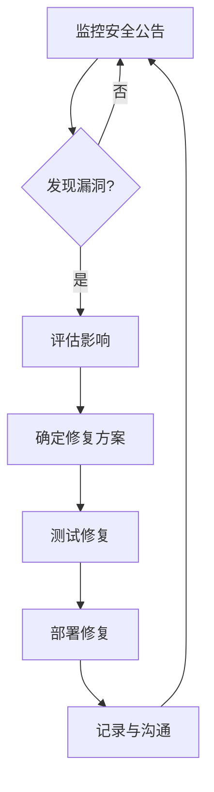

# JavaScript Node.js安全

## 介绍

在现代web开发中，安全性已成为不可忽视的关键因素。随着Node.js的广泛应用，了解并实施适当的安全措施变得尤为重要。本文将带您了解Node.js应用中的常见安全威胁、最佳安全实践以及如何保护您的应用免受潜在攻击。

:::note
安全不是一次性工作，而是一个持续的过程。养成良好的安全习惯，能够有效减少应用受攻击的风险。
:::

## Node.js应用中常见的安全威胁

### 1. 注入攻击

注入攻击是最常见的安全威胁之一，尤其是SQL注入和NoSQL注入。

**SQL注入示例:**

```javascript
// 不安全的代码
const query = `SELECT * FROM users WHERE username = '${username}' AND password = '${password}'`;
db.query(query);

// 安全的代码 (使用参数化查询)
const query = 'SELECT * FROM users WHERE username = ? AND password = ?';
db.query(query, [username, password]);
```

### 2. 跨站脚本攻击 (XSS)

XSS攻击允许攻击者在您的网页上注入恶意脚本，这些脚本会在用户的浏览器中执行。

**防范措施:**

```javascript
// 使用内置的escape函数
const escapeHtml = require('escape-html');
app.get('/user', (req, res) => {
  const username = escapeHtml(req.query.username);
  res.send(`<h1>欢迎, ${username}!</h1>`);
});

// 或使用安全的模板引擎如EJS, Pug等
```

### 3. 跨站请求伪造 (CSRF)

CSRF攻击利用用户已验证的身份，执行未经授权的命令。

**防范措施:**

```javascript
// 使用csurf中间件
const csrf = require('csurf');
const csrfProtection = csrf({ cookie: true });

app.get('/form', csrfProtection, (req, res) => {
  // 生成CSRF令牌并传递给视图
  res.render('form', { csrfToken: req.csrfToken() });
});

app.post('/process', csrfProtection, (req, res) => {
  // 处理表单提交，CSRF令牌已自动验证
  res.send('表单处理成功');
});
```

在前端表单中：

```html
<form action="/process" method="POST">
  <input type="hidden" name="_csrf" value="{{csrfToken}}">
  <!-- 其他表单字段 -->
  <button type="submit">提交</button>
</form>
```

### 4. 破解攻击与暴力攻击

攻击者通过自动化工具尝试多种密码组合来获取访问权限。

**防范措施:**

```javascript
const rateLimit = require('express-rate-limit');

// 创建限速器
const limiter = rateLimit({
  windowMs: 15 * 60 * 1000, // 15分钟
  max: 100, // 每IP限制100次请求
  message: '请求过于频繁，请稍后再试!'
});

// 应用于所有请求
app.use(limiter);

// 或仅应用于登录路由
const loginLimiter = rateLimit({
  windowMs: 15 * 60 * 1000,
  max: 5, // 每15分钟只允许5次登录尝试
  message: '登录失败次数过多，请15分钟后再试!'
});
app.use('/login', loginLimiter);
```

## Node.js安全最佳实践

### 1. 依赖项管理

Node.js应用通常依赖众多第三方包，这些包可能存在安全漏洞。

```bash
# 安装npm包审计工具
npm install -g npm-audit

# 检查项目依赖中的安全漏洞
npm audit

# 自动修复漏洞
npm audit fix
```

```javascript
// 示例输出
=== npm audit security report ===

# 发现漏洞 moderate severity
lodash < 4.17.11 中存在原型污染漏洞
推荐: 升级到 lodash@^4.17.11
```

### 2. 使用Helmet增强HTTP头部安全

```javascript
const express = require('express');
const helmet = require('helmet');
const app = express();

// 使用helmet中间件增强应用安全性
app.use(helmet());

app.get('/', (req, res) => {
  res.send('安全的应用');
});

app.listen(3000);
```

Helmet通过设置各种HTTP头来帮助保护应用：
- Content-Security-Policy
- X-XSS-Protection
- X-Frame-Options
- 等多种安全相关的头部

### 3. 安全的认证实践

```javascript
const bcrypt = require('bcrypt');
const saltRounds = 10;

// 注册用户时哈希密码
app.post('/register', async (req, res) => {
  try {
    const hashedPassword = await bcrypt.hash(req.body.password, saltRounds);
    // 将hashedPassword保存到数据库
    // ...
    res.send('注册成功');
  } catch (error) {
    res.status(500).send('注册失败');
  }
});

// 登录时验证密码
app.post('/login', async (req, res) => {
  try {
    // 从数据库获取用户
    const user = await User.findOne({ email: req.body.email });
    if (!user) return res.status(400).send('邮箱或密码不正确');
    
    // 比较密码
    const validPassword = await bcrypt.compare(req.body.password, user.password);
    if (!validPassword) return res.status(400).send('邮箱或密码不正确');
    
    // 生成JWT令牌
    // ...
    res.send('登录成功');
  } catch (error) {
    res.status(500).send('登录失败');
  }
});
```

### 4. 环境变量管理

敏感信息（如数据库密码、API密钥等）不应硬编码在源代码中，而应使用环境变量。

```javascript
// 安装dotenv
// npm install dotenv

// 在应用入口点（如app.js）
require('dotenv').config();

// 使用环境变量
const dbConnection = mysql.createConnection({
  host: process.env.DB_HOST,
  user: process.env.DB_USER,
  password: process.env.DB_PASSWORD,
  database: process.env.DB_NAME
});
```

创建一个`.env`文件：
```
DB_HOST=localhost
DB_USER=myuser
DB_PASSWORD=mypassword
DB_NAME=mydb
JWT_SECRET=mysupersecretkey
```

:::caution
永远不要提交`.env`文件到版本控制系统！确保将其添加到`.gitignore`文件中。
:::

### 5. 输入验证与净化

始终验证和净化来自用户的输入：

```javascript
const { body, validationResult } = require('express-validator');

app.post('/user',
  // 验证规则
  [
    body('username').isLength({ min: 5 }).trim().escape(),
    body('email').isEmail().normalizeEmail(),
    body('password').isLength({ min: 8 })
  ],
  (req, res) => {
    // 检查验证结果
    const errors = validationResult(req);
    if (!errors.isEmpty()) {
      return res.status(400).json({ errors: errors.array() });
    }
    
    // 处理验证通过的请求
    // ...
    res.send('用户创建成功');
  }
);
```

## 实际案例：构建安全的API服务

下面是一个结合多种安全措施的简单API服务示例：

```javascript
const express = require('express');
const helmet = require('helmet');
const rateLimit = require('express-rate-limit');
const jwt = require('jsonwebtoken');
const bcrypt = require('bcrypt');
const { body, validationResult } = require('express-validator');
require('dotenv').config();

const app = express();

// 中间件
app.use(express.json());
app.use(helmet());

// 速率限制
const apiLimiter = rateLimit({
  windowMs: 15 * 60 * 1000, // 15分钟
  max: 100 // 每IP限制100个请求
});
app.use('/api/', apiLimiter);

// 模拟用户数据库
let users = [];

// 注册路由
app.post('/api/register', 
  [
    body('email').isEmail().withMessage('请提供有效的电子邮件'),
    body('password').isLength({ min: 8 }).withMessage('密码至少8个字符')
  ],
  async (req, res) => {
    // 验证输入
    const errors = validationResult(req);
    if (!errors.isEmpty()) {
      return res.status(400).json({ errors: errors.array() });
    }
    
    try {
      const { email, password } = req.body;
      
      // 检查用户是否已存在
      if (users.find(user => user.email === email)) {
        return res.status(400).send({ message: '该邮箱已注册' });
      }
      
      // 哈希密码
      const hashedPassword = await bcrypt.hash(password, 10);
      
      // 存储用户
      users.push({
        id: Date.now().toString(),
        email,
        password: hashedPassword
      });
      
      res.status(201).send({ message: '注册成功' });
    } catch (error) {
      res.status(500).send({ message: '服务器错误' });
    }
  }
);

// 登录路由
app.post('/api/login', async (req, res) => {
  try {
    const { email, password } = req.body;
    
    // 查找用户
    const user = users.find(u => u.email === email);
    if (!user) {
      return res.status(400).send({ message: '邮箱或密码不正确' });
    }
    
    // 验证密码
    const validPassword = await bcrypt.compare(password, user.password);
    if (!validPassword) {
      return res.status(400).send({ message: '邮箱或密码不正确' });
    }
    
    // 创建JWT
    const token = jwt.sign(
      { userId: user.id },
      process.env.JWT_SECRET || 'fallbacksecretkey', // 生产环境必须使用环境变量
      { expiresIn: '1h' }
    );
    
    res.send({ token });
  } catch (error) {
    res.status(500).send({ message: '服务器错误' });
  }
});

// 验证JWT的中间件
function authenticateToken(req, res, next) {
  const authHeader = req.headers['authorization'];
  const token = authHeader && authHeader.split(' ')[1];
  
  if (token == null) return res.sendStatus(401);
  
  jwt.verify(token, process.env.JWT_SECRET || 'fallbacksecretkey', (err, user) => {
    if (err) return res.sendStatus(403);
    req.user = user;
    next();
  });
}

// 受保护的路由
app.get('/api/protected', authenticateToken, (req, res) => {
  res.send({ message: '这是受保护的数据', userId: req.user.userId });
});

// 启动服务器
const PORT = process.env.PORT || 3000;
app.listen(PORT, () => {
  console.log(`服务器运行在端口 ${PORT}`);
});
```

## Node.js安全测试工具

为确保应用安全，可以使用以下工具：

1. **OWASP Dependency Check** - 检查项目依赖是否存在已知漏洞
2. **npm audit** - 审计npm包的安全漏洞
3. **Snyk** - 发现和修复依赖中的漏洞
4. **ESLint安全插件** - 在开发过程中发现潜在安全问题
5. **OWASP ZAP** - 针对应用进行安全测试

## 安全更新流程

制定一个安全更新流程可以帮助团队有效应对安全问题：



## 总结

Node.js安全是一个广泛的主题，本文介绍了最关键的安全措施：

1. 防止注入攻击
2. 避免XSS和CSRF漏洞
3. 保护应用免受破解攻击
4. 安全管理依赖项
5. 使用Helmet加强HTTP安全
6. 实施安全的认证和授权
7. 保护敏感数据
8. 验证并净化所有用户输入

记住，安全是一个持续的过程，而不是一次性的实现。定期审查代码、更新依赖项并跟踪安全最佳实践的变化是维护安全Node.js应用的关键。

## 练习

1. 创建一个使用bcrypt进行密码哈希存储的简单用户注册系统
2. 实现基于JWT的认证系统
3. 为Node.js应用添加Helmet和其他安全中间件
4. 审计你的项目依赖，并修复发现的任何漏洞
5. 实现速率限制以防止暴力攻击

## 额外资源

- [OWASP Node.js安全备忘单](https://cheatsheetseries.owasp.org/cheatsheets/Nodejs_Security_Cheat_Sheet.html)
- [Node.js安全最佳实践](https://nodejs.org/en/docs/guides/security/)
- [Express安全最佳实践](https://expressjs.com/en/advanced/best-practice-security.html)
- [Snyk学习资源](https://snyk.io/learn/)

:::tip
安全不是一个功能，而是一种文化。培养良好的安全习惯和意识，将使您的应用在长期内保持安全。
:::