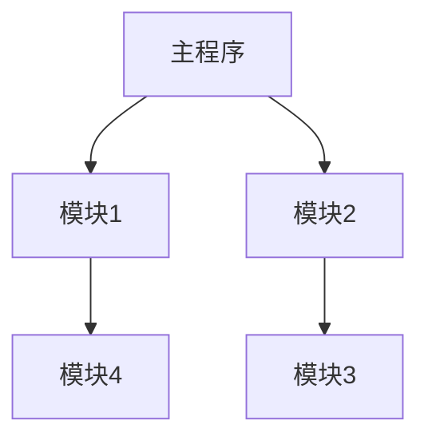

# JavaScript Node.js模块系统

## 介绍

在开发大型JavaScript应用程序时，将代码组织成可重用、可维护的结构至关重要。Node.js模块系统允许我们将代码分割成独立的功能块，这些块可以在需要时被导入和使用。无论你是构建Web服务器、命令行工具还是任何其他类型的应用程序，理解Node.js的模块系统都是必不可少的基础知识。

在本教程中，我们将探讨Node.js模块系统的核心概念，包括如何创建、导出和导入模块，以及如何使用npm管理第三方模块。

## 什么是模块？

模块是一段可重用的代码，它封装了特定的功能并可以被其他代码引用。在Node.js中，每个文件都被视为一个独立的模块。



### 模块的优势

- **代码组织**：将功能相关的代码组织在一起
- **代码重用**：避免重复编写相同的功能
- **依赖管理**：明确定义模块之间的依赖关系
- **命名空间**：避免全局变量命名冲突

## Node.js中的模块类型

Node.js主要支持两种模块系统：

1. **CommonJS模块**：Node.js的原生模块系统
2. **ES模块（ESM）**：JavaScript的官方标准模块系统

让我们首先了解更常用和传统的CommonJS模块。

## CommonJS模块

### 创建和导出模块

在Node.js中创建模块非常简单。你只需创建一个普通的JavaScript文件，然后使用`module.exports`对象来导出你想要共享的内容。

创建一个名为`math.js`的文件：

```javascript
// math.js
const add = (a, b) => a + b;
const subtract = (a, b) => a - b;
const multiply = (a, b) => a * b;
const divide = (a, b) => a / b;

// 导出单个函数
module.exports.add = add;
module.exports.subtract = subtract;

// 也可以一次导出多个函数
module.exports = {
  add,
  subtract,
  multiply,
  divide
};
```

:::tip
`exports`是`module.exports`的引用，可以直接使用`exports.add = add`来导出单个内容，但不要直接给`exports`赋值（如`exports = {add}`），这会破坏引用关系。
:::

### 导入模块

使用`require()`函数来导入模块：

```javascript
// app.js
const math = require('./math'); // 导入本地模块时需要添加路径

console.log(math.add(5, 3));     // 输出: 8
console.log(math.multiply(2, 4)); // 输出: 8
```

你也可以使用解构赋值只导入你需要的部分：

```javascript
// app.js
const { add, multiply } = require('./math');

console.log(add(5, 3));     // 输出: 8
console.log(multiply(2, 4)); // 输出: 8
```

### 导入内置模块

Node.js提供了许多内置模块，如`fs`用于文件系统操作，`http`用于创建HTTP服务器等。导入内置模块不需要提供路径：

```javascript
const fs = require('fs');
const http = require('http');

// 使用fs模块读取文件
fs.readFile('example.txt', 'utf8', (err, data) => {
  if (err) {
    console.error('读取文件出错:', err);
    return;
  }
  console.log('文件内容:', data);
});

// 使用http模块创建服务器
const server = http.createServer((req, res) => {
  res.statusCode = 200;
  res.setHeader('Content-Type', 'text/plain');
  res.end('Hello World\n');
});

server.listen(3000, () => {
  console.log('服务器运行在 http://localhost:3000/');
});
```

## ES模块 (ESM)

从Node.js v12开始，ES模块得到了实验性支持，在v14及以后版本中逐步稳定。要使用ES模块，你有两个选择：

1. 将文件扩展名改为`.mjs`
2. 在`package.json`中添加`"type": "module"`

### 创建和导出ES模块

使用`export`关键字导出：

```javascript
// mathES.js
export const add = (a, b) => a + b;
export const subtract = (a, b) => a - b;

// 也可以在文件末尾统一导出
const multiply = (a, b) => a * b;
const divide = (a, b) => a / b;

export { multiply, divide };
```

### 导入ES模块

使用`import`关键字导入：

```javascript
// appES.js
import { add, multiply } from './mathES.js';

console.log(add(5, 3));     // 输出: 8
console.log(multiply(2, 4)); // 输出: 8

// 也可以导入所有内容
import * as math from './mathES.js';
console.log(math.subtract(10, 5)); // 输出: 5
```

:::caution
使用ES模块导入时，必须指定扩展名（如`.js`、`.mjs`），而CommonJS则不需要。
:::

## 模块解析机制

当你使用`require()`或`import`导入模块时，Node.js会按照以下顺序查找模块：

1. **内置模块**：如果模块名与Node.js内置模块匹配（如`http`、`fs`），将直接加载内置模块
2. **node_modules**：如果模块名不是相对路径（不以`./`或`../`开头），Node.js会在当前目录及其父目录的`node_modules`文件夹中查找
3. **文件模块**：如果模块名是相对路径，Node.js会尝试按以下顺序解析：
   - 精确匹配文件名
   - 添加`.js`扩展名
   - 添加`.json`扩展名
   - 添加`.node`扩展名
   - 寻找包含`index.js`的目录

## NPM包管理

Node Package Manager (NPM) 是Node.js的官方包管理器，它允许你安装、共享和管理依赖包。

### 初始化项目

要开始一个新的Node.js项目，请运行：

```bash
npm init
```

这会创建一个`package.json`文件，用于跟踪项目依赖和配置。

### 安装第三方模块

要安装一个包：

```bash
npm install lodash
```

这将安装lodash包并更新`package.json`文件中的依赖列表。

### 使用第三方模块

安装后，可以直接导入使用：

```javascript
// CommonJS方式
const _ = require('lodash');

console.log(_.chunk(['a', 'b', 'c', 'd'], 2)); 
// 输出: [['a', 'b'], ['c', 'd']]

// ES模块方式
import _ from 'lodash';

console.log(_.chunk(['a', 'b', 'c', 'd'], 2));
// 输出: [['a', 'b'], ['c', 'd']]
```

## 模块缓存

Node.js会缓存模块，这意味着当你多次`require`同一个模块时，它不会重新加载和执行模块代码。相反，它会返回之前缓存的结果：

```javascript
// counter.js
let count = 0;

module.exports = {
  increment: () => {
    count += 1;
    return count;
  },
  getCount: () => count
};
```

```javascript
// app.js
const counter1 = require('./counter');
const counter2 = require('./counter');

console.log(counter1.increment()); // 输出: 1
console.log(counter2.increment()); // 输出: 2

// counter1和counter2引用的是同一个模块实例
console.log(counter1.getCount()); // 输出: 2
console.log(counter2.getCount()); // 输出: 2
```

如果需要每次获取新的实例，可以导出一个工厂函数：

```javascript
// counterFactory.js
module.exports = function() {
  let count = 0;
  return {
    increment: () => {
      count += 1;
      return count;
    },
    getCount: () => count
  };
};
```

```javascript
// app.js
const createCounter = require('./counterFactory');
const counter1 = createCounter();
const counter2 = createCounter();

console.log(counter1.increment()); // 输出: 1
console.log(counter2.increment()); // 输出: 1

// counter1和counter2是独立的实例
console.log(counter1.getCount()); // 输出: 1
console.log(counter2.getCount()); // 输出: 1
```

## 实际案例：构建简单的Web服务器

让我们使用模块化方式构建一个简单的Web服务器。我们将把路由处理、配置和服务器启动分离到不同的模块中：

### 1. 配置模块 (config.js)

```javascript
// config.js
module.exports = {
  port: process.env.PORT || 3000,
  host: '127.0.0.1'
};
```

### 2. 路由处理模块 (routes.js)

```javascript
// routes.js
function homeHandler(req, res) {
  res.writeHead(200, { 'Content-Type': 'text/plain' });
  res.end('首页\n');
}

function aboutHandler(req, res) {
  res.writeHead(200, { 'Content-Type': 'text/plain' });
  res.end('关于我们\n');
}

function notFoundHandler(req, res) {
  res.writeHead(404, { 'Content-Type': 'text/plain' });
  res.end('页面不存在\n');
}

module.exports = {
  '/': homeHandler,
  '/about': aboutHandler,
  notFound: notFoundHandler
};
```

### 3. 服务器模块 (server.js)

```javascript
// server.js
const http = require('http');
const routes = require('./routes');
const config = require('./config');

const server = http.createServer((req, res) => {
  const path = req.url;
  
  // 使用路由处理请求
  const handler = routes[path] || routes.notFound;
  handler(req, res);
});

function start() {
  server.listen(config.port, config.host, () => {
    console.log(`服务器运行在 http://${config.host}:${config.port}`);
  });
}

module.exports = { start };
```

### 4. 主应用文件 (app.js)

```javascript
// app.js
const server = require('./server');

// 启动服务器
server.start();
```

运行`node app.js`，你将看到：

```
服务器运行在 http://127.0.0.1:3000
```

通过这种模块化的方式，我们可以轻松地组织和维护代码，未来如果需要添加新功能或修改现有功能，只需修改相应的模块即可。

## CommonJS与ES模块的区别

| 特性 | CommonJS | ES模块 |
|------|---------|--------|
| 语法 | `require()`/`module.exports` | `import`/`export` |
| 加载时机 | 运行时 | 静态分析（编译时） |
| 默认导出 | `module.exports = value` | `export default value` |
| 导入路径 | 可以不带扩展名 | 需要带扩展名 |
| 条件导入 | 可以在条件语句中导入 | 必须在顶层作用域导入 |
| Node.js支持 | 从Node.js诞生就支持 | Node.js v12+开始支持 |

## 总结

Node.js的模块系统使我们能够构建模块化、可维护和可扩展的应用程序。通过本教程，你已经了解了：

- 如何使用CommonJS和ES模块创建和导入模块
- Node.js的模块解析机制
- 如何使用npm管理第三方依赖
- 模块缓存及其影响
- 如何构建模块化的应用程序

掌握模块系统是成为成熟的Node.js开发者的第一步。随着你构建更复杂的应用程序，你会发现模块化设计的巨大优势。

## 练习

1. 创建一个名为`utils.js`的模块，导出以下函数：
   - `randomNumber(min, max)`：生成指定范围内的随机数
   - `formatDate(date)`：将日期格式化为 YYYY-MM-DD 字符串

2. 创建一个简单的文件处理模块，包含读取、写入和删除文件的函数，然后在另一个文件中使用这些函数。

3. 尝试将上述Web服务器示例转换为使用ES模块的版本。

## 进一步学习资源

- [Node.js官方文档 - 模块](https://nodejs.org/api/modules.html)
- [MDN Web文档 - JavaScript模块](https://developer.mozilla.org/zh-CN/docs/Web/JavaScript/Guide/Modules)
- [ECMAScript模块](https://nodejs.org/api/esm.html)

通过这些练习和资源，你可以更深入地理解Node.js模块系统，并在实际项目中灵活运用它们。