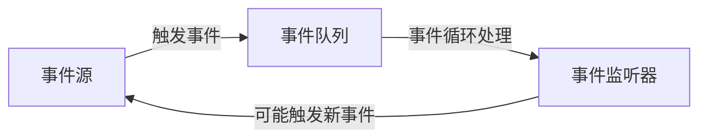

# JavaScript Node.js事件

## 事件驱动编程简介

Node.js 的核心架构是基于事件驱动的编程模型。这种模型使得 Node.js 能够高效处理异步操作，如文件系统访问、网络通信等。事件驱动编程的核心思想是：当某个事件发生时，系统会触发相应的回调函数来处理该事件。

:::tip
事件驱动编程就像是在餐厅点餐：你下完单后不需要一直等待，而是可以做其他事情，等餐点准备好时，服务员会通知你。
:::

## Node.js 中的 EventEmitter

在 Node.js 中，事件处理是通过 `EventEmitter` 类来实现的。这个类位于 Node.js 的 `events` 模块中，是 Node.js 事件系统的核心。

### 基本用法

```javascript
// 导入 events 模块
const EventEmitter = require('events');

// 创建 EventEmitter 实例
const myEmitter = new EventEmitter();

// 注册事件监听器
myEmitter.on('event', function(a, b) {
  console.log(a, b, this);
});

// 触发事件
myEmitter.emit('event', 'a', 'b');

// 输出:
// a b EventEmitter { ... }
```

### EventEmitter 的主要方法

1. **on(eventName, listener)**：添加事件监听器
2. **once(eventName, listener)**：添加一次性事件监听器
3. **emit(eventName[, ...args])**：触发事件
4. **removeListener(eventName, listener)**：移除特定的监听器
5. **removeAllListeners([eventName])**：移除所有监听器

## 事件监听器

事件监听器是一种回调函数，当特定的事件被触发时，它们会被自动执行。

### 添加事件监听器

```javascript
const EventEmitter = require('events');
const myEmitter = new EventEmitter();

// 方法 1: 使用 on 方法
myEmitter.on('greet', (name) => {
  console.log(`Hello, ${name}!`);
});

// 方法 2: 使用 addListener 方法 (是 on 的别名)
myEmitter.addListener('farewell', (name) => {
  console.log(`Goodbye, ${name}!`);
});

// 触发事件
myEmitter.emit('greet', 'John');
myEmitter.emit('farewell', 'John');

// 输出:
// Hello, John!
// Goodbye, John!
```

### 一次性事件监听器

如果你只想监听一个事件一次，可以使用 `once` 方法：

```javascript
const EventEmitter = require('events');
const myEmitter = new EventEmitter();

myEmitter.once('onlyOnce', () => {
  console.log('This will be called only once');
});

myEmitter.emit('onlyOnce'); // 触发事件
myEmitter.emit('onlyOnce'); // 不会有任何反应，因为监听器已被移除

// 输出:
// This will be called only once
```

## 移除事件监听器

在某些情况下，你可能需要移除事件监听器，以避免内存泄漏或其他问题。

```javascript
const EventEmitter = require('events');
const myEmitter = new EventEmitter();

function greetHandler(name) {
  console.log(`Hello, ${name}!`);
}

// 添加事件监听器
myEmitter.on('greet', greetHandler);

// 触发事件
myEmitter.emit('greet', 'Alice'); // 输出: Hello, Alice!

// 移除事件监听器
myEmitter.removeListener('greet', greetHandler);

// 再次触发事件
myEmitter.emit('greet', 'Bob'); // 没有输出，因为监听器已被移除
```

## 错误处理

在 Node.js 的事件系统中，错误处理是一个重要的环节。如果一个 `EventEmitter` 实例中发生了 `error` 事件，但没有对应的监听器，Node.js 会抛出错误并退出进程。

```javascript
const EventEmitter = require('events');
const myEmitter = new EventEmitter();

// 正确的错误处理方式
myEmitter.on('error', (err) => {
  console.error('捕获到错误:', err.message);
});

// 触发错误事件
myEmitter.emit('error', new Error('发生了一个错误'));

// 输出:
// 捕获到错误: 发生了一个错误
```

:::warning
总是为你的 EventEmitter 实例添加 'error' 事件监听器，以避免程序崩溃。
:::

## 创建自定义事件发射器

你可以通过继承 `EventEmitter` 类来创建自定义的事件发射器。这种方法在构建模块化和可扩展的应用程序时非常有用。

```javascript
const EventEmitter = require('events');

// 创建一个自定义的音乐播放器类
class MusicPlayer extends EventEmitter {
  constructor() {
    super();
    this.playing = false;
  }

  play(track) {
    this.playing = true;
    console.log(`正在播放: ${track}`);
    this.emit('play', track);
  }

  stop() {
    this.playing = false;
    console.log('停止播放');
    this.emit('stop');
  }
}

// 创建播放器实例
const player = new MusicPlayer();

// 添加事件监听器
player.on('play', (track) => {
  console.log(`事件: 开始播放 ${track}`);
});

player.on('stop', () => {
  console.log('事件: 播放已停止');
});

// 使用播放器
player.play('夜曲');
player.stop();

// 输出:
// 正在播放: 夜曲
// 事件: 开始播放 夜曲
// 停止播放
// 事件: 播放已停止
```

## 事件流和异步编程

Node.js 事件系统是异步编程的基础。它允许你处理可能在未来某个时刻发生的事件，而不会阻塞程序的执行流程。



## 实际案例：构建简单的聊天服务器

让我们使用 Node.js 的事件系统构建一个简单的聊天服务器：

```javascript
const EventEmitter = require('events');
const readline = require('readline');

// 创建聊天服务器类
class ChatServer extends EventEmitter {
  constructor() {
    super();
    this.users = {};
    this.nextId = 1;
  }

  // 添加用户
  addUser(name) {
    const id = this.nextId++;
    this.users[id] = name;
    console.log(`[系统] ${name} 加入了聊天室`);
    this.emit('userJoined', id, name);
    return id;
  }

  // 发送消息
  sendMessage(userId, message) {
    const name = this.users[userId];
    if (name) {
      console.log(`${name}: ${message}`);
      this.emit('message', userId, name, message);
    }
  }

  // 用户离开
  removeUser(userId) {
    const name = this.users[userId];
    if (name) {
      delete this.users[userId];
      console.log(`[系统] ${name} 离开了聊天室`);
      this.emit('userLeft', userId, name);
    }
  }
}

// 创建聊天服务器实例
const server = new ChatServer();

// 添加事件监听器
server.on('userJoined', (id, name) => {
  // 可以在这里通知其他用户有新用户加入
});

server.on('message', (userId, name, message) => {
  // 可以在这里将消息转发给其他用户
});

server.on('userLeft', (id, name) => {
  // 可以在这里通知其他用户有用户离开
});

// 模拟用户交互
const rl = readline.createInterface({
  input: process.stdin,
  output: process.stdout
});

console.log('聊天服务器已启动');
rl.question('请输入你的名字: ', (name) => {
  const userId = server.addUser(name);
  
  rl.setPrompt('> ');
  rl.prompt();
  
  rl.on('line', (line) => {
    if (line.toLowerCase() === 'exit') {
      server.removeUser(userId);
      rl.close();
      return;
    }
    
    server.sendMessage(userId, line);
    rl.prompt();
  });
});
```

## 小结

Node.js 的事件系统是其异步、非阻塞架构的核心。通过 `EventEmitter` 类，你可以创建自定义事件、注册事件监听器，并在需要时触发事件。这种事件驱动的编程模式使得 Node.js 非常适合构建高性能的网络应用程序。

深入理解 Node.js 的事件机制，将有助于你更好地设计和构建复杂的应用程序。事件驱动编程不仅可以提高程序的响应性能，还可以使代码更加模块化和可维护。

## 练习

1. 创建一个简单的计时器类，它继承自 `EventEmitter`，每隔一秒触发一次 `tick` 事件，并在计时结束时触发 `done` 事件。

2. 实现一个文件监视器，当监视的文件发生变化时，触发 `change` 事件。

3. 扩展聊天服务器示例，添加私聊功能，当用户发送私聊消息时，触发 `privateMessage` 事件。

## 额外资源

- [Node.js 官方文档 - Events](https://nodejs.org/api/events.html)
- [理解 Node.js 的事件循环](https://nodejs.org/en/docs/guides/event-loop-timers-and-nexttick/)
- [EventEmitter 最佳实践](https://nodejs.org/api/events.html#events_asynchronous_vs_synchronous)

通过掌握 Node.js 的事件系统，你将能够更好地理解 Node.js 的工作原理，并构建出更加高效、响应迅速的应用程序。