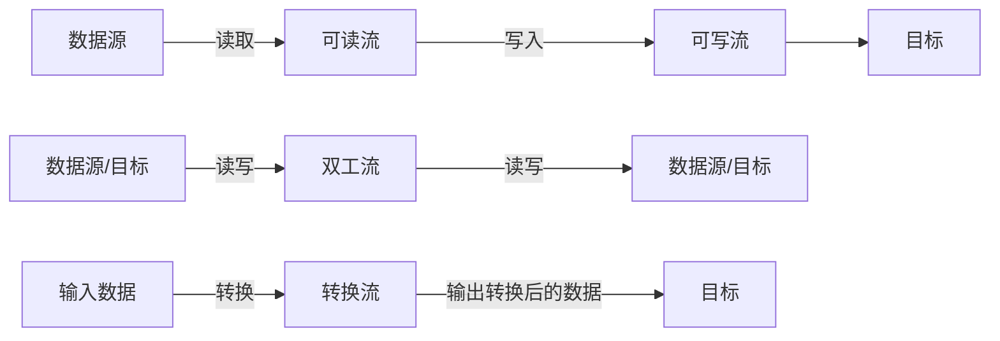

# JavaScript Node.js流

## 什么是流（Stream）？

在Node.js中，流（Stream）是处理读写数据的一种方式，它允许我们以连续的方式处理数据，而不需要一次性将数据全部加载到内存中。这在处理大文件或网络通信时特别有用，因为它可以显著降低内存使用量，提高应用程序的性能和响应速度。

:::tip
想象一下，流就像是自来水管中的水流，数据像水一样从一端流向另一端，你可以在途中对这些数据进行处理。
:::

## 为什么需要流？

假设我们需要读取一个1GB大小的文件并发送给客户端，有两种方式：

1. **不使用流**：一次性读取整个文件到内存，然后发送给客户端
2. **使用流**：读取一小块数据，立即处理并发送，然后继续读取下一块

使用流的优势显而易见：
- 减少内存占用
- 提高数据处理速度
- 更好的用户体验（可以更快地看到部分结果）

## Node.js中流的类型

Node.js中有四种基本类型的流：

1. **可读流（Readable）** - 用于读取数据（如文件读取）
2. **可写流（Writable）** - 用于写入数据（如文件写入）
3. **双工流（Duplex）** - 既可读又可写（如TCP连接）
4. **转换流（Transform）** - 一种特殊的双工流，可以在读写过程中修改或转换数据（如压缩/解压缩）



## 流的事件与方法

所有的流都是 EventEmitter 的实例，它们会发出可以监听和处理的事件。

### 常见的可读流事件

- `data` - 当有数据可读时触发
- `end` - 当没有更多数据可读时触发
- `error` - 发生错误时触发
- `close` - 流关闭时触发

### 常见的可写流事件

- `drain` - 可以继续写入数据时触发
- `finish` - 所有数据已被写入系统底层时触发
- `error` - 写入或管道出错时触发
- `close` - 流关闭时触发

## 使用流读取文件示例

下面是一个使用可读流来读取文件内容的简单示例：

```javascript
const fs = require('fs');

// 创建可读流
const readStream = fs.createReadStream('example.txt', { encoding: 'utf8' });

// 监听数据事件
readStream.on('data', (chunk) => {
  console.log('收到数据片段：');
  console.log(chunk);
});

// 监听结束事件
readStream.on('end', () => {
  console.log('文件读取完毕');
});

// 监听错误事件
readStream.on('error', (err) => {
  console.error('发生错误：', err);
});
```

输出示例：
```
收到数据片段：
这是文件的第一部分内容...
收到数据片段：
这是文件的第二部分内容...
文件读取完毕
```

## 使用流写入文件示例

以下是使用可写流将数据写入文件的示例：

```javascript
const fs = require('fs');

// 创建可写流
const writeStream = fs.createWriteStream('output.txt');

// 写入数据
writeStream.write('Hello, ');
writeStream.write('Node.js ');
writeStream.write('Streams!\n');

// 标记写入结束
writeStream.end();

// 监听完成事件
writeStream.on('finish', () => {
  console.log('写入完成');
});

// 监听错误事件
writeStream.on('error', (err) => {
  console.error('写入错误:', err);
});
```

输出：
```
写入完成
```

生成的output.txt文件内容：
```
Hello, Node.js Streams!
```

## 流的管道（Pipe）

流的强大之处在于可以使用管道（pipe）将它们链接起来。使用 `pipe()` 方法可以将一个可读流的输出直接连接到一个可写流的输入：

```javascript
const fs = require('fs');

// 创建可读流和可写流
const readStream = fs.createReadStream('source.txt');
const writeStream = fs.createWriteStream('destination.txt');

// 使用管道连接两个流
readStream.pipe(writeStream);

// 当管道完成时输出消息
writeStream.on('finish', () => {
  console.log('文件复制完成');
});
```

:::note
`pipe()` 方法自动处理背压（backpressure）问题，确保目标写入流不会被数据淹没，这是手动处理流时需要特别注意的问题。
:::

## 创建自定义流

在某些情况下，你可能需要创建自定义的流来满足特定需求。以下是一个创建自定义转换流的示例，它将输入的文本转换为大写：

```javascript
const { Transform } = require('stream');

// 创建自定义转换流
class UppercaseTransform extends Transform {
  _transform(chunk, encoding, callback) {
    // 将数据块转换为大写并推送到输出队列
    this.push(chunk.toString().toUpperCase());
    callback();
  }
}

// 使用自定义转换流
const uppercaseTransform = new UppercaseTransform();

// 从标准输入读取，通过转换流处理，然后写入标准输出
process.stdin
  .pipe(uppercaseTransform)
  .pipe(process.stdout);

console.log('请输入一些文本:');
```

运行以上代码，当你在控制台输入 "hello world" 时，它会输出 "HELLO WORLD"。

## 实际应用场景

### 1. 文件压缩

使用流来压缩文件，无需一次性读取整个文件：

```javascript
const fs = require('fs');
const zlib = require('zlib');

// 创建可读流、gzip转换流和可写流
const readStream = fs.createReadStream('large-file.txt');
const gzip = zlib.createGzip();
const writeStream = fs.createWriteStream('large-file.txt.gz');

// 使用管道链接流
readStream
  .pipe(gzip)
  .pipe(writeStream);

writeStream.on('finish', () => {
  console.log('文件压缩完成');
});
```

### 2. HTTP响应流

在Web服务器中使用流来发送大文件：

```javascript
const http = require('http');
const fs = require('fs');

const server = http.createServer((req, res) => {
  // 设置内容类型
  res.setHeader('Content-Type', 'video/mp4');
  
  // 创建视频文件的可读流
  const videoStream = fs.createReadStream('large-video.mp4');
  
  // 直接将文件流通过管道连接到HTTP响应
  videoStream.pipe(res);
  
  // 处理可能的错误
  videoStream.on('error', (err) => {
    console.error('流错误:', err);
    res.statusCode = 500;
    res.end('Server Error');
  });
});

server.listen(3000, () => {
  console.log('服务器运行在 http://localhost:3000');
});
```

### 3. 实时数据处理

处理来自IoT设备的实时数据流：

```javascript
const { Transform } = require('stream');

// 创建一个转换流来处理传感器数据
class TemperatureProcessor extends Transform {
  constructor(options) {
    super(options);
    this.totalTemp = 0;
    this.count = 0;
  }
  
  _transform(chunk, encoding, callback) {
    // 假设接收到的是温度数据
    const temp = parseFloat(chunk.toString());
    
    // 计算平均温度
    this.totalTemp += temp;
    this.count++;
    
    // 推送处理结果
    this.push(`当前温度: ${temp}°C, 平均温度: ${(this.totalTemp/this.count).toFixed(1)}°C\n`);
    callback();
  }
}

// 模拟传感器数据源
const sensorData = ['22.5', '23.1', '22.8', '23.9', '24.5'];
let index = 0;

// 模拟传感器数据流
const mockSensorStream = {
  read() {
    if (index < sensorData.length) {
      setTimeout(() => {
        const data = sensorData[index++];
        temperatureProcessor.write(data);
        this.read();
      }, 1000);
    }
  }
};

// 创建处理器并连接到输出
const temperatureProcessor = new TemperatureProcessor();
temperatureProcessor.pipe(process.stdout);

// 开始读取模拟数据
mockSensorStream.read();
```

## 流的优化和最佳实践

1. **设置合适的高水位线**：通过在创建流时设置 `highWaterMark` 选项来控制内部缓冲区的大小。

```javascript
const readStream = fs.createReadStream('file.txt', { 
  highWaterMark: 64 * 1024 // 64KB 缓冲区
});
```

2. **错误处理**：始终为流添加错误处理。

```javascript
stream.on('error', (err) => {
  console.error('发生错误:', err);
});
```

3. **使用流模式**：尽可能使用流的管道功能，而不是手动事件处理。

4. **避免背压问题**：使用 `.pipe()` 或在手动处理时留意 `.write()` 方法的返回值和 'drain' 事件。

```javascript
function writeData(writer, data) {
  let i = 0;
  
  function write() {
    let ok = true;
    
    while (i < data.length && ok) {
      // 如果返回false，说明需要等待drain事件
      ok = writer.write(data[i++]);
    }
    
    if (i < data.length) {
      // 还有数据要写，等待drain事件
      writer.once('drain', write);
    }
  }
  
  write();
}
```

## 总结

Node.js的流是一种强大的数据处理方式，它允许我们高效地处理大量数据，而不会占用过多内存。通过将流连接起来，可以创建复杂的数据处理管道，实现各种功能。在Web服务器、文件处理、数据转换等场景中，流都是不可或缺的工具。

- **可读流**用于读取数据
- **可写流**用于写入数据
- **双工流**同时支持读写
- **转换流**在读写过程中处理数据
- **管道**简化了流之间的连接

随着你对Node.js开发的深入，流将成为你工具箱中最有价值的工具之一，特别是在处理大数据量和构建高性能应用时。

## 练习

1. 创建一个程序，使用流将一个文本文件的所有内容转换为大写，并保存到新文件中。
2. 实现一个简单的HTTP服务器，使用流来提供静态文件。
3. 创建一个转换流，统计输入文本中每个单词出现的次数，并在结束时输出统计结果。
4. 尝试实现一个程序，使用多个转换流来处理CSV文件，例如过滤某些行、修改某些列，然后输出为新的CSV文件。

## 附加资源

- [Node.js官方文档 - Stream](https://nodejs.org/api/stream.html)
- [Stream Handbook](https://github.com/substack/stream-handbook)
- [Node.js Streams: Everything you need to know](https://www.freecodecamp.org/news/node-js-streams-everything-you-need-to-know-c9141306be93/)

通过学习和实践流的概念，你将能够构建更高效、更具扩展性的Node.js应用程序！