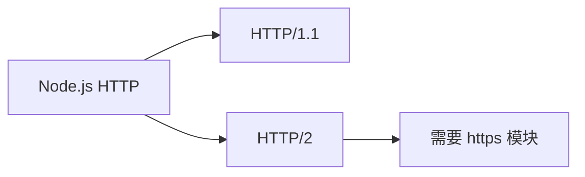

# JavaScript Node.js HTTP

在 Node.js 中，HTTP 是一个核心模块，允许你创建 Web 服务器和客户端，处理 HTTP 请求和响应。理解 Node.js 的 HTTP 功能对于开发 Web 应用程序、API 和微服务至关重要。

## HTTP 模块简介

Node.js 的 `http` 模块提供了创建 HTTP 服务器和发送 HTTP 请求的能力。它是 Node.js 最基础也是最重要的模块之一，为许多 Web 框架（如 Express、Koa、Fastify 等）提供了底层支持。

首先，我们需要导入 HTTP 模块：

```javascript
const http = require('http');
```

## 创建基本的 HTTP 服务器

让我们创建一个简单的 HTTP 服务器，它监听特定端口并返回一个"Hello World"消息：

```javascript
const http = require('http');

// 创建 HTTP 服务器
const server = http.createServer((req, res) => {
  // 设置响应头
  res.setHeader('Content-Type', 'text/plain');
  
  // 响应状态码
  res.statusCode = 200;
  
  // 结束响应，发送数据
  res.end('Hello, Node.js HTTP Server!');
});

// 指定监听端口和主机名
const PORT = 3000;
const HOST = 'localhost';

// 启动服务器
server.listen(PORT, HOST, () => {
  console.log(`服务器运行在 http://${HOST}:${PORT}/`);
});
```

运行这段代码后，你会在控制台看到：

```
服务器运行在 http://localhost:3000/
```

现在，当你在浏览器中访问 `http://localhost:3000/` 时，会看到文本 "Hello, Node.js HTTP Server!"。

## 理解请求对象

`req`（请求）对象包含了关于客户端请求的所有信息，比如 URL、请求方法（GET、POST 等）、HTTP 头部和请求体等。

让我们看看如何访问一些常见的请求信息：

```javascript
const http = require('http');

const server = http.createServer((req, res) => {
  // 请求 URL
  const url = req.url;
  
  // 请求方法
  const method = req.method;
  
  // 请求头
  const headers = req.headers;
  
  res.setHeader('Content-Type', 'text/html');
  res.statusCode = 200;
  res.end(`
    <html>
      <body>
        <h1>请求信息</h1>
        <p>URL: ${url}</p>
        <p>方法: ${method}</p>
        <p>用户代理: ${headers['user-agent']}</p>
      </body>
    </html>
  `);
});

server.listen(3000, 'localhost', () => {
  console.log('服务器运行在 http://localhost:3000/');
});
```

## 路由处理

我们可以基于请求的 URL 路径提供不同的响应。这是实现路由的基本方法：

```javascript
const http = require('http');

const server = http.createServer((req, res) => {
  const url = req.url;
  
  // 设置通用响应头
  res.setHeader('Content-Type', 'text/html');
  
  // 基于 URL 路由
  if (url === '/') {
    res.statusCode = 200;
    res.end('<h1>主页</h1><p>欢迎来到我们的网站！</p>');
  } else if (url === '/about') {
    res.statusCode = 200;
    res.end('<h1>关于我们</h1><p>这是关于页面。</p>');
  } else if (url === '/contact') {
    res.statusCode = 200;
    res.end('<h1>联系我们</h1><p>这是联系页面。</p>');
  } else {
    // 404 不存在的页面
    res.statusCode = 404;
    res.end('<h1>404</h1><p>页面不存在</p>');
  }
});

server.listen(3000, 'localhost', () => {
  console.log('服务器运行在 http://localhost:3000/');
});
```

## 处理 POST 请求

要处理 POST 请求，我们需要收集请求体数据，这在 Node.js 中是通过监听数据事件来完成的：

```javascript
const http = require('http');

const server = http.createServer((req, res) => {
  const method = req.method;
  const url = req.url;
  
  if (url === '/submit' && method === 'POST') {
    let body = '';
    
    // 收集数据块
    req.on('data', (chunk) => {
      body += chunk.toString();
    });
    
    // 数据接收完毕
    req.on('end', () => {
      res.setHeader('Content-Type', 'text/html');
      res.statusCode = 200;
      res.end(`
        <html>
          <body>
            <h1>提交成功！</h1>
            <p>收到的数据: ${body}</p>
          </body>
        </html>
      `);
    });
  } else {
    // 显示表单
    res.setHeader('Content-Type', 'text/html');
    res.statusCode = 200;
    res.end(`
      <html>
        <body>
          <h1>提交表单</h1>
          <form method="POST" action="/submit">
            <input type="text" name="message" placeholder="输入消息">
            <button type="submit">提交</button>
          </form>
        </body>
      </html>
    `);
  }
});

server.listen(3000, 'localhost', () => {
  console.log('服务器运行在 http://localhost:3000/');
});
```

:::note
处理大型 POST 请求时，应该设置数据大小限制，以防止潜在的 DoS（拒绝服务）攻击。
:::

## 发送 HTTP 请求

Node.js 的 HTTP 模块不仅可以创建服务器，还可以作为客户端发送 HTTP 请求：

```javascript
const http = require('http');

const options = {
  hostname: 'jsonplaceholder.typicode.com',
  port: 80,
  path: '/posts/1',
  method: 'GET'
};

const req = http.request(options, (res) => {
  console.log(`状态码: ${res.statusCode}`);
  
  res.on('data', (chunk) => {
    console.log(`响应体: ${chunk}`);
  });
});

req.on('error', (e) => {
  console.error(`请求出错: ${e.message}`);
});

// 完成请求
req.end();
```

更简单的 GET 请求可以使用 `http.get()` 方法：

```javascript
const http = require('http');

http.get('http://jsonplaceholder.typicode.com/posts/1', (res) => {
  let data = '';
  
  res.on('data', (chunk) => {
    data += chunk;
  });
  
  res.on('end', () => {
    console.log('响应数据：');
    console.log(JSON.parse(data));
  });
}).on('error', (err) => {
  console.error(`请求出错: ${err.message}`);
});
```

## 实际案例：简单的 REST API

以下是一个简单的 REST API 示例，支持基本的 CRUD 操作来管理用户数据：

```javascript
const http = require('http');

// 模拟数据库
let users = [
  { id: 1, name: '张三', email: 'zhangsan@example.com' },
  { id: 2, name: '李四', email: 'lisi@example.com' }
];

const server = http.createServer((req, res) => {
  const url = req.url;
  const method = req.method;
  
  // 设置 CORS 头，允许跨域请求
  res.setHeader('Access-Control-Allow-Origin', '*');
  res.setHeader('Access-Control-Allow-Methods', 'GET, POST, PUT, DELETE');
  res.setHeader('Access-Control-Allow-Headers', 'Content-Type');
  
  // 处理预检请求
  if (method === 'OPTIONS') {
    res.statusCode = 204;
    res.end();
    return;
  }
  
  // GET /users - 获取所有用户
  if (method === 'GET' && url === '/users') {
    res.setHeader('Content-Type', 'application/json');
    res.statusCode = 200;
    res.end(JSON.stringify(users));
  } 
  // GET /users/:id - 获取特定用户
  else if (method === 'GET' && url.match(/\/users\/\d+/)) {
    const id = parseInt(url.split('/')[2]);
    const user = users.find(u => u.id === id);
    
    res.setHeader('Content-Type', 'application/json');
    
    if (user) {
      res.statusCode = 200;
      res.end(JSON.stringify(user));
    } else {
      res.statusCode = 404;
      res.end(JSON.stringify({ message: '未找到用户' }));
    }
  } 
  // POST /users - 创建新用户
  else if (method === 'POST' && url === '/users') {
    let body = '';
    
    req.on('data', chunk => {
      body += chunk.toString();
    });
    
    req.on('end', () => {
      try {
        const userData = JSON.parse(body);
        
        // 生成新 ID
        const newId = users.length > 0 ? Math.max(...users.map(u => u.id)) + 1 : 1;
        const newUser = { id: newId, ...userData };
        
        users.push(newUser);
        
        res.setHeader('Content-Type', 'application/json');
        res.statusCode = 201; // Created
        res.end(JSON.stringify(newUser));
      } catch (e) {
        res.statusCode = 400;
        res.setHeader('Content-Type', 'application/json');
        res.end(JSON.stringify({ message: '无效的请求数据' }));
      }
    });
  } 
  // 处理 404 - 未找到
  else {
    res.statusCode = 404;
    res.setHeader('Content-Type', 'application/json');
    res.end(JSON.stringify({ message: '未找到该资源' }));
  }
});

server.listen(3000, 'localhost', () => {
  console.log('API 服务器运行在 http://localhost:3000/');
});
```

这个 API 示例允许你：
- 获取所有用户（GET /users）
- 获取特定用户（GET /users/:id）
- 创建新用户（POST /users）

## HTTP 服务器的常见功能

### 1. 设置超时

```javascript
const server = http.createServer((req, res) => {
  // 处理请求
});

// 设置超时时间（毫秒）
server.timeout = 5000;
```

### 2. 错误处理

```javascript
const server = http.createServer((req, res) => {
  // 处理请求
});

server.on('error', (err) => {
  console.error('服务器错误:', err);
});

server.on('clientError', (err, socket) => {
  socket.end('HTTP/1.1 400 Bad Request\r\n\r\n');
});
```

### 3. 处理文件上传

处理文件上传通常需要解析多部分表单数据。虽然可以使用原生 HTTP 模块实现，但在实际应用中，我们通常借助中间件如 `multer` 或 `formidable`。

## 扩展 HTTP 服务器安全性

安全是 Web 服务器的重要考虑因素，以下是一些基本安全实践：

```javascript
const server = http.createServer((req, res) => {
  // 添加安全响应头
  res.setHeader('X-Content-Type-Options', 'nosniff');
  res.setHeader('X-Frame-Options', 'DENY');
  res.setHeader('X-XSS-Protection', '1; mode=block');
  res.setHeader('Content-Security-Policy', "default-src 'self'");
  
  // 处理请求
  // ...
});
```

:::caution
原生 HTTP 模块缺乏内置的安全机制，生产环境中应考虑使用成熟的 Web 框架（如 Express）和安全中间件，或者使用 HTTPS。
:::

## 使用 HTTPS

对于需要加密通信的应用，Node.js 提供了 `https` 模块：

```javascript
const https = require('https');
const fs = require('fs');

const options = {
  key: fs.readFileSync('私钥文件路径'),
  cert: fs.readFileSync('证书文件路径')
};

https.createServer(options, (req, res) => {
  res.statusCode = 200;
  res.setHeader('Content-Type', 'text/plain');
  res.end('Hello Secure World!');
}).listen(443);
```

## HTTP 版本支持

Node.js HTTP 模块主要支持 HTTP/1.1，但最新版本也开始支持 HTTP/2：



## 总结

Node.js 的 HTTP 模块提供了构建 Web 服务器和客户端应用程序的基础功能。我们学习了：

- 创建基本的 HTTP 服务器
- 处理不同类型的请求（GET、POST）
- 实现基本的路由
- 发送 HTTP 请求
- 构建简单的 REST API
- 处理安全考虑

虽然 Node.js 的原生 HTTP 模块功能强大，但在实际开发中，使用基于它构建的高级框架（如 Express、Koa、Fastify 等）通常更加高效，因为这些框架提供了更多便捷功能、中间件支持和安全特性。

## 练习与附加资源

### 练习

1. 创建一个简单的 HTTP 服务器，根据不同的路径返回不同的 HTML 页面。
2. 实现一个能够处理 GET 和 POST 请求的简单表单提交和处理程序。
3. 扩展 REST API 示例，添加 PUT 和 DELETE 方法支持。
4. 创建一个代理服务器，将请求转发到另一个服务器并返回响应。

### 附加资源

- [Node.js 官方文档 - HTTP 模块](https://nodejs.org/api/http.html)
- [MDN Web Docs - HTTP](https://developer.mozilla.org/zh-CN/docs/Web/HTTP)
- [Express.js](https://expressjs.com/) - 基于 Node.js HTTP 模块构建的流行 Web 框架

掌握 Node.js 的 HTTP 模块是构建 Web 应用程序的基础。随着你的进步，可以探索更高级的框架和工具，但理解底层 HTTP 处理方式将始终对你的 Node.js 开发之旅有所帮助。