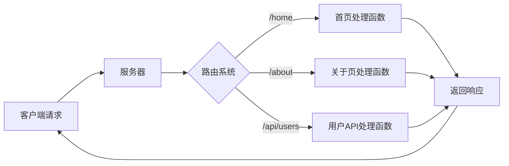

# JavaScript Node.js路由

## 什么是路由？

在 Web 开发中，**路由(Routing)** 是指确定应用程序如何响应客户端对特定端点的请求，这个端点是由 URI（或路径）和特定的 HTTP 请求方法（GET、POST 等）组成的。

简单来说，路由就是将用户请求映射到相应处理函数的过程，它决定了用户访问不同 URL 路径时，服务器应该返回什么内容。



## Node.js 原生路由

在 Node.js 中，可以使用内置的 `http` 模块来创建服务器并处理不同路由。下面是一个简单的例子：

```javascript
const http = require('http');
const url = require('url');

const server = http.createServer((req, res) => {
  // 解析请求的 URL
  const parsedUrl = url.parse(req.url, true);
  const path = parsedUrl.pathname;
  const trimmedPath = path.replace(/^\/+|\/+$/g, '');
  
  // 设置响应头
  res.setHeader('Content-Type', 'text/plain');
  
  // 路由逻辑
  if (trimmedPath === '') {
    res.writeHead(200);
    res.end('这是首页\n');
  } else if (trimmedPath === 'about') {
    res.writeHead(200);
    res.end('这是关于页面\n');
  } else if (trimmedPath === 'api/users') {
    res.setHeader('Content-Type', 'application/json');
    res.writeHead(200);
    res.end(JSON.stringify({ users: ['Alice', 'Bob', 'Charlie'] }));
  } else {
    res.writeHead(404);
    res.end('页面未找到\n');
  }
});

const PORT = 3000;
server.listen(PORT, () => {
  console.log(`服务器运行在 http://localhost:${PORT}`);
});
```

上面的代码实现了一个简单的路由系统：
- `/` (空路径) - 返回首页内容
- `/about` - 返回关于页内容
- `/api/users` - 返回用户列表 JSON
- 其他路径 - 返回 404 错误

:::note
原生 Node.js 路由实现相对繁琐，需要手动解析 URL，并使用条件语句处理不同路由。这种方式适合简单应用，但在复杂应用中会导致代码难以维护。
:::

## 使用 Express 框架实现路由

Express 是 Node.js 最流行的 Web 框架，它提供了更简洁和强大的路由系统。使用 Express，上述例子可以重写为：

```javascript
const express = require('express');
const app = express();

// 定义路由
app.get('/', (req, res) => {
  res.send('这是首页');
});

app.get('/about', (req, res) => {
  res.send('这是关于页面');
});

app.get('/api/users', (req, res) => {
  res.json({ users: ['Alice', 'Bob', 'Charlie'] });
});

// 处理 404 - 必须放在所有路由之后
app.use((req, res) => {
  res.status(404).send('页面未找到');
});

const PORT = 3000;
app.listen(PORT, () => {
  console.log(`服务器运行在 http://localhost:${PORT}`);
});
```

Express 路由的优势在于：
1. 语法简洁明了
2. 支持 HTTP 方法（GET, POST, PUT, DELETE 等）
3. 支持中间件
4. 可以组织路由到不同文件

### 路由参数

Express 允许我们定义带参数的路由：

```javascript
// 定义带参数的路由
app.get('/users/:id', (req, res) => {
  const userId = req.params.id;
  res.send(`查看用户: ${userId}`);
});

// 多参数路由
app.get('/products/:category/:id', (req, res) => {
  const category = req.params.category;
  const productId = req.params.id;
  res.send(`查看${category}类别的产品: ${productId}`);
});
```

访问 `/users/123` 将显示 "查看用户: 123"。  
访问 `/products/electronics/456` 将显示 "查看electronics类别的产品: 456"。

### 查询参数

除了路由参数，Express 也可以轻松处理查询参数：

```javascript
app.get('/search', (req, res) => {
  const query = req.query.q;
  const page = req.query.page || 1;
  res.send(`搜索: ${query}，页码: ${page}`);
});
```

访问 `/search?q=nodejs&page=2` 将显示 "搜索: nodejs，页码: 2"。

## 路由模块化

在大型应用中，将所有路由放在一个文件中会导致代码难以维护。Express 允许我们将路由拆分到不同文件中：

### 创建路由模块

```javascript
// routes/users.js
const express = require('express');
const router = express.Router();

// 定义用户相关路由
router.get('/', (req, res) => {
  res.send('用户列表');
});

router.get('/:id', (req, res) => {
  res.send(`用户详情: ${req.params.id}`);
});

router.post('/', (req, res) => {
  res.send('创建用户');
});

// 导出路由
module.exports = router;
```

### 在主应用中使用路由模块

```javascript
// app.js
const express = require('express');
const app = express();
const usersRouter = require('./routes/users');

// 使用用户路由，前缀为 /users
app.use('/users', usersRouter);

app.listen(3000, () => {
  console.log('服务器运行在 http://localhost:3000');
});
```

现在，所有以 `/users` 开头的请求都会被转发到 `usersRouter` 处理。

## 路由中间件

中间件是 Express 的一个强大特性，它可以在路由处理之前或之后执行代码。例如，我们可以创建一个验证用户是否登录的中间件：

```javascript
// 验证用户是否登录的中间件
const authenticateUser = (req, res, next) => {
  if (req.headers.authorization) {
    // 用户已登录，继续处理请求
    next();
  } else {
    // 用户未登录，返回错误
    res.status(401).send('请先登录');
  }
};

// 使用中间件保护路由
app.get('/dashboard', authenticateUser, (req, res) => {
  res.send('这是仪表板页面');
});
```

:::tip
中间件可以在全局应用、特定路由组或单个路由上使用，这提供了极大的灵活性。
:::

## 实际案例：构建简单的 REST API

下面是一个使用 Express 创建简单 REST API 的示例，展示了路由如何在实际项目中应用：

```javascript
const express = require('express');
const app = express();

// 解析 JSON 请求体的中间件
app.use(express.json());

// 模拟数据库
let books = [
  { id: 1, title: 'Node.js 入门', author: '张三' },
  { id: 2, title: 'Express 实战', author: '李四' }
];

// 获取所有图书
app.get('/api/books', (req, res) => {
  res.json(books);
});

// 获取单本图书
app.get('/api/books/:id', (req, res) => {
  const id = parseInt(req.params.id);
  const book = books.find(b => b.id === id);
  
  if (!book) {
    return res.status(404).json({ message: '图书未找到' });
  }
  
  res.json(book);
});

// 添加新图书
app.post('/api/books', (req, res) => {
  const { title, author } = req.body;
  
  if (!title || !author) {
    return res.status(400).json({ message: '标题和作者是必填字段' });
  }
  
  const newBook = {
    id: books.length + 1,
    title,
    author
  };
  
  books.push(newBook);
  res.status(201).json(newBook);
});

// 更新图书
app.put('/api/books/:id', (req, res) => {
  const id = parseInt(req.params.id);
  const { title, author } = req.body;
  
  const bookIndex = books.findIndex(b => b.id === id);
  
  if (bookIndex === -1) {
    return res.status(404).json({ message: '图书未找到' });
  }
  
  const updatedBook = {
    id,
    title: title || books[bookIndex].title,
    author: author || books[bookIndex].author
  };
  
  books[bookIndex] = updatedBook;
  res.json(updatedBook);
});

// 删除图书
app.delete('/api/books/:id', (req, res) => {
  const id = parseInt(req.params.id);
  const bookIndex = books.findIndex(b => b.id === id);
  
  if (bookIndex === -1) {
    return res.status(404).json({ message: '图书未找到' });
  }
  
  books.splice(bookIndex, 1);
  res.status(204).end();
});

app.listen(3000, () => {
  console.log('图书 API 服务器运行在 http://localhost:3000');
});
```

这个例子展示了一个完整的 CRUD (Create, Read, Update, Delete) API，使用不同的 HTTP 方法和路由来操作资源。

## 总结

Node.js 中的路由是构建 Web 应用和 API 的核心概念。通过本文，我们了解了：

1. 路由的基本概念和作用
2. 使用 Node.js 原生模块实现简单路由
3. Express 框架中的路由系统及其优势
4. 路由参数和查询参数的使用
5. 路由模块化的方法
6. 路由中间件的概念和应用
7. 通过实际案例展示了 REST API 的路由设计

掌握路由是成为一名优秀的 Node.js 开发者的关键步骤之一。虽然 Express 是最常用的路由解决方案，但也有其他框架如 Koa、Fastify 和 Hapi 等提供了类似功能。

## 练习

1. 创建一个 Express 应用，实现以下路由：
   - GET `/` - 返回欢迎信息
   - GET `/users` - 返回用户列表
   - GET `/users/:id` - 返回指定用户信息
   - POST `/users` - 添加新用户

2. 实现一个简单的博客 API，包括：
   - 获取所有文章
   - 获取单篇文章
   - 添加新文章
   - 更新文章
   - 删除文章
   - 为文章添加评论

3. 创建一个认证中间件，保护需要登录才能访问的路由。

## 附加资源

- [Express 官方文档](https://expressjs.com/zh-cn/)
- [Node.js 官方文档](https://nodejs.org/en/docs/)
- [HTTP 状态码参考](https://developer.mozilla.org/zh-CN/docs/Web/HTTP/Status)
- [RESTful API 设计最佳实践](https://restfulapi.net/)