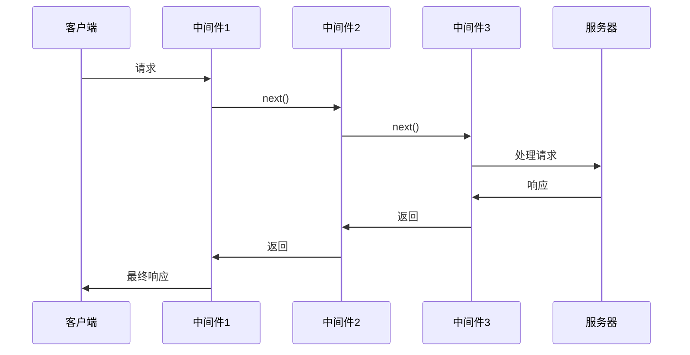

# JavaScript Node.js中间件

在Node.js的世界里，中间件是一个强大的概念，尤其是在Web应用开发中。如果你正在学习Node.js，理解中间件的工作原理和应用场景将极大提升你构建高效应用的能力。

## 什么是中间件？

中间件（Middleware）是一个函数，它可以访问请求对象（req）、响应对象（res）以及应用程序请求-响应周期中的下一个中间件函数（通常由变量next表示）。


:::note
中间件函数可以执行以下任务：
- 执行任何代码
- 修改请求和响应对象
- 结束请求-响应周期
- 调用堆栈中的下一个中间件
:::

## 中间件的基本结构

在Express.js（Node.js最流行的Web框架）中，中间件函数的基本结构如下：

```javascript
function middleware(req, res, next) {
  // 执行代码
  
  // 调用下一个中间件
  next();
}
```

其中：
- `req` 是请求对象
- `res` 是响应对象
- `next` 是一个函数，调用它将执行下一个中间件

## 中间件类型

在Node.js应用中，常见的中间件类型有：

### 1. 应用层中间件

这类中间件绑定到整个应用程序上，会处理所有进来的请求。

```javascript
const express = require('express');
const app = express();

// 应用层中间件
app.use((req, res, next) => {
  console.log('请求时间:', Date.now());
  next();
});

app.listen(3000);
```

### 2. 路由层中间件

这类中间件仅应用于特定路由。

```javascript
app.use('/user/:id', (req, res, next) => {
  console.log('请求类型:', req.method);
  next();
});
```

### 3. 错误处理中间件

用于捕获并处理应用中发生的错误。

```javascript
app.use((err, req, res, next) => {
  console.error(err.stack);
  res.status(500).send('服务器出错了！');
});
```

### 4. 内置中间件

Express自带的中间件，如`express.static`、`express.json`等。

```javascript
// 提供静态文件服务
app.use(express.static('public'));

// 解析JSON请求体
app.use(express.json());
```

### 5. 第三方中间件

由社区开发的中间件，如`morgan`（日志记录）、`cors`（跨域资源共享）等。

```javascript
const morgan = require('morgan');
const cors = require('cors');

app.use(morgan('dev'));
app.use(cors());
```

## 中间件执行流程

中间件按照它们被添加到应用中的顺序依次执行。当一个请求到达服务器时，它会依次通过每个中间件，直到某个中间件结束了请求-响应周期或者所有中间件都执行完毕。



## 实际应用案例

### 用户身份验证中间件

这个例子展示了如何创建一个简单的身份验证中间件：

```javascript
function authenticateUser(req, res, next) {
  const authHeader = req.headers.authorization;
  
  if (!authHeader) {
    return res.status(401).json({ message: '未提供授权头' });
  }
  
  const token = authHeader.split(' ')[1];
  
  try {
    // 验证token（实际应用中可能使用JWT等）
    const user = verifyToken(token);
    req.user = user; // 将用户信息添加到请求对象
    next();
  } catch (error) {
    res.status(401).json({ message: '验证失败' });
  }
}

// 在路由中使用
app.get('/profile', authenticateUser, (req, res) => {
  res.json({ user: req.user });
});
```

### 日志记录中间件

创建一个简单的日志中间件来记录所有请求：

```javascript
function requestLogger(req, res, next) {
  const start = Date.now();
  
  // 当响应结束时执行的函数
  res.on('finish', () => {
    const duration = Date.now() - start;
    console.log(`${req.method} ${req.originalUrl} - ${res.statusCode} - ${duration}ms`);
  });
  
  next();
}

// 应用到所有路由
app.use(requestLogger);
```

### 错误处理中间件链

创建一个错误处理中间件链：

```javascript
// 路由处理
app.get('/data', (req, res, next) => {
  try {
    // 模拟数据库查询错误
    throw new Error('数据库连接失败');
    // 正常响应...
  } catch (err) {
    next(err); // 传递错误到错误处理中间件
  }
});

// 错误处理中间件
app.use((err, req, res, next) => {
  console.error('错误:', err.message);
  res.status(500).json({ error: err.message });
});
```

## 创建自定义中间件的最佳实践

1. **保持简单**: 一个中间件应该只做一件事，并做好。
2. **避免阻塞**: 处理异步操作时使用Promise或async/await。
3. **正确使用next()**: 确保在适当的时候调用next()，避免请求挂起。
4. **错误处理**: 使用try/catch捕获错误，并通过next(err)传递。

```javascript
async function databaseMiddleware(req, res, next) {
  try {
    // 假设dbConnection是一个数据库连接
    req.db = await dbConnection();
    next();
  } catch (error) {
    next(error);
  }
}
```

## 中间件的组合与复用

中间件可以组合和复用，使代码更加模块化：

```javascript
// 权限检查中间件
function checkAdmin(req, res, next) {
  if (req.user && req.user.role === 'admin') {
    next();
  } else {
    res.status(403).send('权限不足');
  }
}

// 组合使用多个中间件
app.get('/admin/dashboard', 
  authenticateUser, // 先验证用户身份
  checkAdmin,       // 再检查用户权限
  (req, res) => {
    res.send('管理员面板');
  }
);
```

## 总结

Node.js中的中间件是构建Web应用的强大工具。它们允许你将应用逻辑分解成小的、可重用的组件，使代码更易于维护和扩展。理解中间件的工作原理和正确使用它们将帮助你构建更加健壮的Node.js应用。

通过本文，你应该已经了解：
- 中间件的基本概念和结构
- 不同类型的中间件及其用途
- 中间件的执行流程
- 如何创建和使用自定义中间件
- 实际应用中的中间件案例

## 练习与深入学习

1. 创建一个简单的Express应用，实现至少三个不同功能的中间件。
2. 尝试实现一个速率限制中间件，限制来自同一IP的请求频率。
3. 学习并使用流行的中间件如`helmet`（安全相关）、`compression`（压缩响应）等。

:::tip 扩展阅读
- [Express.js中间件官方文档](https://expressjs.com/en/guide/using-middleware.html)
- 了解Connect中间件系统（Express的前身）
- 探索Koa.js的中间件实现（基于异步函数）
:::

继续学习和实践，你将逐渐掌握中间件的精髓，成为更优秀的Node.js开发者！