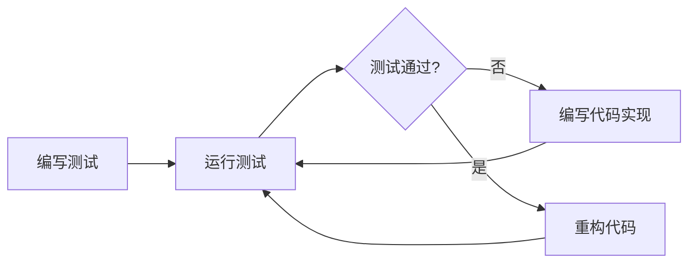

# JavaScript 测试基础

## 什么是JavaScript测试？

测试是软件开发过程中至关重要的一环，它能帮助我们确保代码按预期工作，并减少bug出现的几率。在JavaScript开发中，测试同样扮演着重要角色，特别是随着前端应用变得越来越复杂。

JavaScript测试是通过编写用于验证代码行为的额外代码来确保你的应用程序正确运行的过程。它可以帮助你：

- 提高代码质量
- 防止回归错误
- 便于代码重构
- 作为代码文档
- 提升开发信心

:::tip
好的测试不仅能提高代码质量，还能加速开发过程，因为找出并修复早期错误通常比在后期发现问题要容易得多。
:::

## 测试的类型

在JavaScript中，常见的测试类型包括：

### 1. 单元测试

单元测试是对代码中最小可测试单元（通常是函数或方法）的测试。这些测试应该是独立的，不依赖外部资源（如API、数据库等）。

```javascript
// 被测试的函数
function sum(a, b) {
  return a + b;
}

// 单元测试
test('adds 1 + 2 to equal 3', () => {
  expect(sum(1, 2)).toBe(3);
});
```

### 2. 集成测试

集成测试验证多个单元如何一起工作。这种测试会检查组件之间的交互是否正确。

```javascript
// 集成测试示例
test('user creation and authentication flow', async () => {
  // 创建用户
  const user = await createUser('test@example.com', 'password123');
  
  // 验证用户创建成功
  expect(user.id).toBeDefined();
  
  // 测试用户认证
  const authResult = await authenticate('test@example.com', 'password123');
  expect(authResult.success).toBe(true);
});
```

### 3. 端到端测试(E2E)

端到端测试模拟真实用户的行为，测试整个应用程序的工作流程。

```javascript
// 使用 Cypress 的端到端测试示例
describe('Login Flow', () => {
  it('should login with correct credentials', () => {
    cy.visit('/login');
    cy.get('input[name="email"]').type('user@example.com');
    cy.get('input[name="password"]').type('password123');
    cy.get('button[type="submit"]').click();
    cy.url().should('include', '/dashboard');
    cy.contains('Welcome, User').should('be.visible');
  });
});
```

## 测试框架简介

JavaScript测试有很多工具可供选择，以下是一些流行的测试框架：

### Jest

Jest是由Facebook开发的JavaScript测试框架，以其简单易用而闻名。它自带断言库、模拟工具和测试覆盖率报告。

```javascript
// Jest 测试示例
describe('Calculator', () => {
  test('addition works', () => {
    expect(2 + 2).toBe(4);
  });
  
  test('subtraction works', () => {
    expect(5 - 2).toBe(3);
  });
});
```

### Mocha

Mocha是一个灵活的测试框架，通常与Chai断言库一起使用。

```javascript
// Mocha + Chai 测试示例
const assert = require('chai').assert;

describe('Array', function() {
  describe('#indexOf()', function() {
    it('should return -1 when the value is not present', function() {
      assert.equal([1, 2, 3].indexOf(4), -1);
    });
  });
});
```

### Jasmine

Jasmine是一个行为驱动的测试框架，具有清晰的语法和内置断言。

```javascript
// Jasmine 测试示例
describe('Calculator', function() {
  it('should add numbers', function() {
    expect(add(1, 2)).toEqual(3);
  });
});
```

## 编写第一个测试

让我们使用Jest来编写一个简单的测试。首先，确保已安装Jest：

```bash
npm install --save-dev jest
```

创建一个简单的函数和对应的测试文件：

```javascript
// math.js
function sum(a, b) {
  return a + b;
}

module.exports = sum;
```

```javascript
// math.test.js
const sum = require('./math');

test('adds 1 + 2 to equal 3', () => {
  expect(sum(1, 2)).toBe(3);
});

test('adds 0 + 0 to equal 0', () => {
  expect(sum(0, 0)).toBe(0);
});

test('adds -1 + 1 to equal 0', () => {
  expect(sum(-1, 1)).toBe(0);
});
```

在`package.json`中添加测试脚本：

```json
{
  "scripts": {
    "test": "jest"
  }
}
```

运行测试：

```bash
npm test
```

输出应该类似于：

```
PASS  ./math.test.js
  ✓ adds 1 + 2 to equal 3 (2ms)
  ✓ adds 0 + 0 to equal 0
  ✓ adds -1 + 1 to equal 0 (1ms)

Test Suites: 1 passed, 1 total
Tests:       3 passed, 3 total
Snapshots:   0 total
Time:        1.125s
Ran all test suites.
```

## 测试驱动开发 (TDD)

测试驱动开发是一种开发方法，它遵循以下循环：

1. 编写一个失败的测试
2. 编写最小代码使测试通过
3. 重构代码以改进设计



### TDD实例

让我们使用TDD开发一个简单的计算器：

1. 首先编写测试：

```javascript
// calculator.test.js
const Calculator = require('./calculator');

describe('Calculator', () => {
  let calc;
  
  beforeEach(() => {
    calc = new Calculator();
  });
  
  test('add method exists', () => {
    expect(typeof calc.add).toBe('function');
  });
  
  test('adds two numbers correctly', () => {
    expect(calc.add(2, 3)).toBe(5);
  });
});
```

2. 运行测试（会失败）

3. 实现最小代码使测试通过：

```javascript
// calculator.js
class Calculator {
  add(a, b) {
    return a + b;
  }
}

module.exports = Calculator;
```

4. 运行测试（应该通过）

5. 继续添加新的测试和功能

## 模拟和存根

在测试中，我们经常需要模拟外部依赖，例如API调用或数据库访问。

### Jest模拟示例

```javascript
// api.js
const fetchUserData = async (userId) => {
  const response = await fetch(`https://api.example.com/users/${userId}`);
  const data = await response.json();
  return data;
};

module.exports = { fetchUserData };
```

```javascript
// user.test.js
const { fetchUserData } = require('./api');

// 模拟fetch API
jest.mock('./api');

test('fetchUserData returns user information', async () => {
  // 设置模拟函数的返回值
  fetchUserData.mockResolvedValue({ id: '123', name: 'John Doe' });
  
  const userData = await fetchUserData('123');
  
  expect(fetchUserData).toHaveBeenCalledWith('123');
  expect(userData).toEqual({ id: '123', name: 'John Doe' });
});
```

## 测试React组件

如果你正在开发React应用，你可能会使用React Testing Library或Enzyme来测试组件。

### 使用React Testing Library

```jsx
// Button.js
import React from 'react';

function Button({ onClick, children }) {
  return (
    <button onClick={onClick}>
      {children}
    </button>
  );
}

export default Button;
```

```javascript
// Button.test.js
import React from 'react';
import { render, fireEvent } from '@testing-library/react';
import Button from './Button';

test('calls onClick when clicked', () => {
  const handleClick = jest.fn();
  const { getByText } = render(
    <Button onClick={handleClick}>Click Me</Button>
  );
  
  fireEvent.click(getByText('Click Me'));
  
  expect(handleClick).toHaveBeenCalledTimes(1);
});
```

## 测试异步代码

测试异步代码需要特殊处理，以确保测试在Promise解析之前不会结束。

### Promise测试

```javascript
// asyncFunc.js
function fetchData() {
  return new Promise((resolve) => {
    setTimeout(() => {
      resolve('peanut butter');
    }, 100);
  });
}

module.exports = { fetchData };
```

```javascript
// asyncFunc.test.js
const { fetchData } = require('./asyncFunc');

// 方法1：使用done回调
test('the data is peanut butter (callback)', (done) => {
  fetchData().then(data => {
    expect(data).toBe('peanut butter');
    done();
  });
});

// 方法2：返回Promise
test('the data is peanut butter (promise)', () => {
  return fetchData().then(data => {
    expect(data).toBe('peanut butter');
  });
});

// 方法3：使用async/await
test('the data is peanut butter (async/await)', async () => {
  const data = await fetchData();
  expect(data).toBe('peanut butter');
});
```

## 测试覆盖率

测试覆盖率是衡量你的测试覆盖了多少代码的指标。Jest可以生成覆盖率报告：

```bash
npx jest --coverage
```

这将生成一个覆盖率报告，包含以下指标：

- **Statements**: 执行的语句百分比
- **Branches**: 执行的代码分支百分比
- **Functions**: 测试的函数百分比
- **Lines**: 测试的代码行百分比

:::caution
不要过度追求100%的测试覆盖率，而应该关注代码的关键部分和容易出错的逻辑。
:::

## 最佳实践

1. **测试应该是独立的** - 每个测试应该可以单独运行，不依赖于其他测试的状态。

2. **一个测试只测试一件事** - 每个测试应该专注于一个行为或功能点。

3. **使用清晰的测试描述** - 测试名称应该清楚地说明被测试的内容和预期结果。

4. **避免测试实现细节** - 测试应该关注组件或函数的公共API和行为，而不是其内部实现。

5. **优先测试关键业务逻辑** - 把测试资源集中在应用程序的核心功能上。

6. **保持测试简单** - 复杂的测试更难维护，也更容易产生误导性的结果。

## 总结

JavaScript测试是现代前端开发不可或缺的一部分。通过编写有效的测试，你可以提高代码质量，减少bug，并使代码更容易维护和重构。

本文介绍了：
- 测试的类型（单元测试、集成测试、端到端测试）
- 流行的测试框架（Jest、Mocha、Jasmine）
- 如何编写基本测试
- 测试驱动开发方法
- 模拟和存根技术
- 如何测试React组件
- 如何测试异步代码
- 测试覆盖率的概念和最佳实践

## 练习

1. 创建一个简单的计算器类，包含加减乘除四个方法，并为每个方法编写单元测试。

2. 使用TDD方法实现一个字符串反转函数。

3. 创建一个模拟API调用的函数，并编写测试来验证它的行为。

4. 在React应用程序中，创建一个简单的计数器组件，并使用React Testing Library测试它。

## 附加资源

- [Jest官方文档](https://jestjs.io/docs/en/getting-started)
- [Testing JavaScript with Kent C. Dodds](https://testingjavascript.com/)
- [React Testing Library](https://testing-library.com/docs/react-testing-library/intro/)
- [JavaScript测试最佳实践](https://github.com/goldbergyoni/javascript-testing-best-practices)

开始测试你的JavaScript代码吧，你会惊讶于它能如何提高你的开发效率和代码质量！