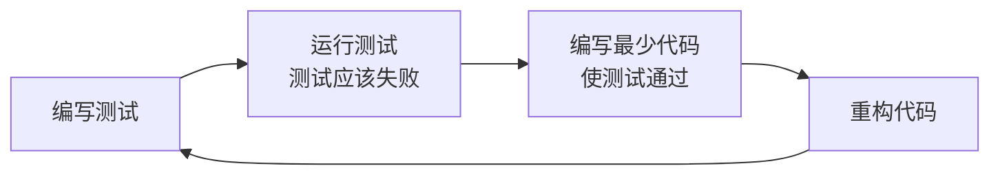

# JavaScript 单元测试

## 什么是单元测试？

单元测试是一种软件测试方法，它验证代码的最小可测试部分（称为"单元"）是否按预期工作。在JavaScript中，一个单元通常是一个函数、一个方法或一个小模块。

:::tip 单元测试的好处
- 提早发现bug，避免它们流入生产环境
- 促使开发者编写更清晰、更模块化的代码
- 作为代码的活文档，展示代码应如何工作
- 使重构代码变得更安全
:::

## 为什么需要单元测试？

想象一下，你正在构建一个计算器应用，其中有一个加法函数：

```javascript
function add(a, b) {
  return a + b;
}
```

看起来很简单对吧？但如果没有测试，你怎么确保：
- 它能正确处理整数？
- 它能正确处理负数？
- 它能正确处理浮点数？
- 当传入非数字时会发生什么？

单元测试可以回答这些问题，并确保你的代码在所有可能的场景下都能正确工作。

## JavaScript 测试框架简介

JavaScript有多种流行的测试框架：

### 1. Jest

Jest是Facebook开发的一个完整的JavaScript测试解决方案，具有零配置、内置断言、快照测试等特点。

### 2. Mocha

Mocha是一个灵活的测试框架，通常与Chai（断言库）和Sinon（模拟库）搭配使用。

### 3. Jasmine

Jasmine是一个行为驱动的测试框架，包含断言、模拟和spy功能。

### 4. QUnit

由jQuery团队开发的简单测试框架，适合浏览器环境中的测试。

## 开始使用Jest进行测试

在本教程中，我们将主要使用Jest，因为它对初学者最友好，设置也最简单。

### 安装Jest

首先，我们需要安装Jest：

```bash
# 使用npm
npm install --save-dev jest

# 使用yarn
yarn add --dev jest
```

然后，在`package.json`中添加测试脚本：

```json
{
  "scripts": {
    "test": "jest"
  }
}
```

### 编写第一个测试

让我们为上面的`add`函数编写一个测试。首先，创建一个`math.js`文件：

```javascript
// math.js
function add(a, b) {
  return a + b;
}

module.exports = { add };
```

然后创建一个测试文件`math.test.js`：

```javascript
// math.test.js
const { add } = require('./math');

test('adds 1 + 2 to equal 3', () => {
  expect(add(1, 2)).toBe(3);
});

test('adds -1 + 5 to equal 4', () => {
  expect(add(-1, 5)).toBe(4);
});

test('adds 0.1 + 0.2 to be close to 0.3', () => {
  expect(add(0.1, 0.2)).toBeCloseTo(0.3);
});
```

### 运行测试

通过以下命令运行测试：

```bash
npm test
```

你应该会看到类似这样的输出：

```
 PASS  ./math.test.js
  ✓ adds 1 + 2 to equal 3 (2ms)
  ✓ adds -1 + 5 to equal 4
  ✓ adds 0.1 + 0.2 to be close to 0.3 (1ms)

Test Suites: 1 passed, 1 total
Tests:       3 passed, 3 total
Snapshots:   0 total
Time:        0.5s, estimated 1s
```

恭喜！你已成功编写并运行了你的第一组单元测试！

## Jest常用断言

Jest提供了许多强大的断言方法（在Jest中称为"matchers"）：

```javascript
// 相等性测试
expect(value).toBe(otherValue); // 严格相等 (===)
expect(value).toEqual(otherValue); // 深度比较对象

// 真值测试
expect(value).toBeTruthy();
expect(value).toBeFalsy();
expect(value).toBeNull();
expect(value).toBeUndefined();
expect(value).toBeDefined();

// 数字比较
expect(value).toBeGreaterThan(3);
expect(value).toBeGreaterThanOrEqual(3.5);
expect(value).toBeLessThan(5);
expect(value).toBeLessThanOrEqual(4.5);
expect(value).toBeCloseTo(0.3); // 对浮点数有用

// 字符串测试
expect('team').toMatch(/ea/);

// 数组测试
expect(['apple', 'banana']).toContain('banana');

// 异常测试
expect(() => { throw new Error('错误') }).toThrow();
expect(() => { throw new Error('特定错误') }).toThrow('特定错误');
```

## 测试异步代码

### Promise测试

```javascript
// user.js
function fetchUser(id) {
  return fetch(`https://jsonplaceholder.typicode.com/users/${id}`)
    .then(response => response.json());
}

module.exports = { fetchUser };
```

```javascript
// user.test.js
const { fetchUser } = require('./user');

// 使用return Promise方式
test('用户名称应该是Leanne Graham', () => {
  return fetchUser(1).then(data => {
    expect(data.name).toBe('Leanne Graham');
  });
});

// 使用async/await方式
test('用户email应该以Sincere开头', async () => {
  const user = await fetchUser(1);
  expect(user.email).toMatch(/^Sincere/);
});
```

### 回调测试

```javascript
// callback.js
function fetchDataWithCallback(callback) {
  setTimeout(() => {
    callback('peanut butter');
  }, 1000);
}

module.exports = { fetchDataWithCallback };
```

```javascript
// callback.test.js
const { fetchDataWithCallback } = require('./callback');

test('数据应该是peanut butter', done => {
  function callback(data) {
    try {
      expect(data).toBe('peanut butter');
      done();
    } catch (error) {
      done(error);
    }
  }

  fetchDataWithCallback(callback);
});
```

## 模拟函数和依赖

在单元测试中，我们通常希望隔离被测试的单元，避免外部依赖（如API调用、数据库操作）影响测试结果。Jest提供了强大的模拟功能：

### 模拟函数

```javascript
test('测试模拟函数调用', () => {
  const mockFn = jest.fn();
  
  mockFn('arg1', 'arg2');
  
  // 测试函数被调用
  expect(mockFn).toHaveBeenCalled();
  
  // 测试调用参数
  expect(mockFn).toHaveBeenCalledWith('arg1', 'arg2');
  
  // 测试调用次数
  expect(mockFn).toHaveBeenCalledTimes(1);
});

test('模拟函数返回值', () => {
  const mockFn = jest.fn();
  
  // 设置返回值
  mockFn.mockReturnValue('mocked value');
  
  expect(mockFn()).toBe('mocked value');
});
```

### 模拟模块

假设我们有一个依赖于axios的函数：

```javascript
// api.js
const axios = require('axios');

async function fetchUserData(id) {
  const response = await axios.get(`https://api.example.com/users/${id}`);
  return response.data;
}

module.exports = { fetchUserData };
```

我们可以模拟axios来测试这个函数：

```javascript
// api.test.js
const axios = require('axios');
const { fetchUserData } = require('./api');

// 模拟axios模块
jest.mock('axios');

test('fetchUserData应该返回用户数据', async () => {
  // 设置模拟返回值
  const mockUser = { id: 1, name: 'John Doe' };
  axios.get.mockResolvedValue({ data: mockUser });
  
  // 调用被测试函数
  const userData = await fetchUserData(1);
  
  // 验证结果
  expect(userData).toEqual(mockUser);
  
  // 验证axios.get被正确调用
  expect(axios.get).toHaveBeenCalledWith('https://api.example.com/users/1');
});
```

## 测试实战：用户注册表单验证

现在，让我们通过一个实际案例来应用我们学到的知识，我们将为一个用户注册表单的验证函数编写单元测试。

### 被测试代码

```javascript
// validation.js
function validateEmail(email) {
  const re = /^[^\s@]+@[^\s@]+\.[^\s@]+$/;
  return re.test(email);
}

function validatePassword(password) {
  // 密码至少8位，包含大小写字母和数字
  const re = /^(?=.*[a-z])(?=.*[A-Z])(?=.*\d)[a-zA-Z\d]{8,}$/;
  return re.test(password);
}

function validateForm(formData) {
  const errors = {};
  
  if (!formData.email || !validateEmail(formData.email)) {
    errors.email = '请输入有效的电子邮件地址';
  }
  
  if (!formData.password || !validatePassword(formData.password)) {
    errors.password = '密码至少需要8位，并包含大小写字母和数字';
  }
  
  if (formData.password !== formData.confirmPassword) {
    errors.confirmPassword = '两次输入的密码不一致';
  }
  
  return {
    isValid: Object.keys(errors).length === 0,
    errors
  };
}

module.exports = {
  validateEmail,
  validatePassword,
  validateForm
};
```

### 测试文件

```javascript
// validation.test.js
const { validateEmail, validatePassword, validateForm } = require('./validation');

describe('Email验证', () => {
  test('有效的电子邮件地址', () => {
    expect(validateEmail('user@example.com')).toBe(true);
    expect(validateEmail('name.lastname@domain.co')).toBe(true);
  });

  test('无效的电子邮件地址', () => {
    expect(validateEmail('user@example')).toBe(false);
    expect(validateEmail('user.example.com')).toBe(false);
    expect(validateEmail('@example.com')).toBe(false);
    expect(validateEmail('user@.com')).toBe(false);
    expect(validateEmail('')).toBe(false);
  });
});

describe('密码验证', () => {
  test('有效的密码', () => {
    expect(validatePassword('Password123')).toBe(true);
    expect(validatePassword('Secure987Password')).toBe(true);
  });

  test('无效的密码', () => {
    // 太短
    expect(validatePassword('Pass12')).toBe(false);
    // 没有大写字母
    expect(validatePassword('password123')).toBe(false);
    // 没有小写字母
    expect(validatePassword('PASSWORD123')).toBe(false);
    // 没有数字
    expect(validatePassword('PasswordABC')).toBe(false);
    // 空密码
    expect(validatePassword('')).toBe(false);
  });
});

describe('表单验证', () => {
  test('所有字段有效', () => {
    const formData = {
      email: 'user@example.com',
      password: 'Password123',
      confirmPassword: 'Password123'
    };
    
    const result = validateForm(formData);
    expect(result.isValid).toBe(true);
    expect(result.errors).toEqual({});
  });
  
  test('电子邮件无效', () => {
    const formData = {
      email: 'invalid-email',
      password: 'Password123',
      confirmPassword: 'Password123'
    };
    
    const result = validateForm(formData);
    expect(result.isValid).toBe(false);
    expect(result.errors).toHaveProperty('email');
  });
  
  test('密码无效', () => {
    const formData = {
      email: 'user@example.com',
      password: 'weak',
      confirmPassword: 'weak'
    };
    
    const result = validateForm(formData);
    expect(result.isValid).toBe(false);
    expect(result.errors).toHaveProperty('password');
  });
  
  test('密码不匹配', () => {
    const formData = {
      email: 'user@example.com',
      password: 'Password123',
      confirmPassword: 'DifferentPassword123'
    };
    
    const result = validateForm(formData);
    expect(result.isValid).toBe(false);
    expect(result.errors).toHaveProperty('confirmPassword');
  });
  
  test('多个错误', () => {
    const formData = {
      email: 'invalid-email',
      password: 'weak',
      confirmPassword: 'different'
    };
    
    const result = validateForm(formData);
    expect(result.isValid).toBe(false);
    expect(Object.keys(result.errors).length).toBe(3);
  });
});
```

## 测试覆盖率

测试覆盖率是衡量代码被测试覆盖程度的指标。Jest内置了覆盖率报告功能：

```bash
npm test -- --coverage
```

这会生成详细的覆盖率报告，显示哪些行、函数、分支和语句被测试覆盖，哪些没有。

:::caution 注意
100%的测试覆盖率并不意味着你的代码没有bug。测试覆盖率是一个有用的指标，但不要过度追求它而忽略了测试质量。
:::

## 测试驱动开发(TDD)

测试驱动开发是一种编程方法，它遵循以下循环：



TDD的好处：

1. 确保代码始终有测试覆盖
2. 防止过度工程化，只编写满足需求的代码
3. 引导更好的设计，因为可测试的代码通常设计更好
4. 提供即时反馈

## 总结

单元测试是现代JavaScript开发的重要组成部分。通过本教程，你已经学习了：

- 什么是单元测试以及为什么它很重要
- 如何使用Jest设置测试环境
- 如何编写基本的测试用例
- 如何测试异步代码
- 如何使用模拟函数和模块
- 如何在实际项目中应用单元测试
- 测试覆盖率和测试驱动开发的概念

掌握单元测试将帮助你编写更稳定、更可靠的代码，提高你作为JavaScript开发者的技能水平。

## 练习

1. 为一个计算器模块编写单元测试，该模块包含加、减、乘、除功能。
2. 创建一个字符串工具函数库（包含诸如反转字符串、计算单词数量等功能），并为其编写测试。
3. 尝试使用测试驱动开发方法，实现一个简单的购物车功能（添加商品、移除商品、计算总价等）。

## 扩展资源

- [Jest官方文档](https://jestjs.io/docs/getting-started)
- [Mocha官方文档](https://mochajs.org/)
- [JavaScript测试最佳实践](https://github.com/goldbergyoni/javascript-testing-best-practices)
- [测试驱动开发实用指南](https://www.amazon.com/Test-Driven-Development-By-Example/dp/0321146530)

祝你测试愉快！