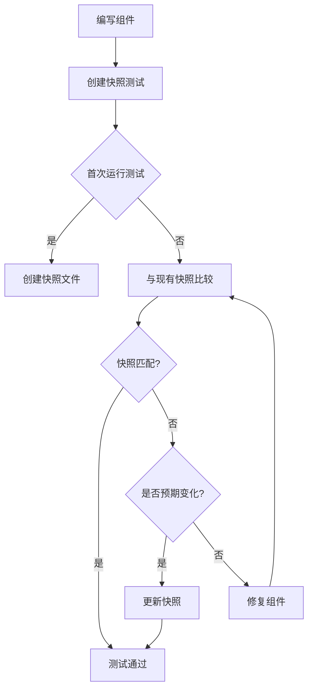

# JavaScript 快照测试

在开发JavaScript应用程序时，确保UI和组件行为的一致性是一项挑战。快照测试提供了一种简单而强大的解决方案，帮助开发者捕获组件的"快照"并在未来的变更中验证其一致性。

## 什么是快照测试？

快照测试是一种测试方法，它通过捕获组件的输出（例如HTML结构、DOM树或渲染内容）并将其保存为"快照"文件，然后在后续测试运行中将新的输出与之前保存的快照进行比较。

:::note
快照测试的核心思想是：一旦你确认了组件的当前输出是正确的，任何意外的变化都应该被检测到。
:::

## 快照测试的优势

- **简单高效**：编写一行代码即可创建快照
- **易于维护**：快照自动更新，减少手动维护测试的工作量
- **可视化差异**：直观地展示变更内容
- **防止意外更改**：捕获非预期的UI变化
- **提高测试覆盖率**：容易为组件添加测试

## 使用Jest进行快照测试

[Jest](https://jestjs.io/)是Facebook开发的一个流行的JavaScript测试框架，它内置了快照测试功能，特别适合React应用程序，但也可用于任何JavaScript项目。

### 安装Jest

```bash
npm install --save-dev jest
```

### 基本快照测试示例

假设我们有一个简单的React组件：

```jsx
// Button.js
import React from 'react';

function Button({ text, onClick }) {
  return (
    <button 
      className="custom-button" 
      onClick={onClick}
    >
      {text}
    </button>
  );
}

export default Button;
```

为这个组件创建快照测试：

```jsx
// Button.test.js
import React from 'react';
import renderer from 'react-test-renderer';
import Button from './Button';

test('Button renders correctly', () => {
  const tree = renderer
    .create(<Button text="Click me" onClick={() => {}} />)
    .toJSON();
  expect(tree).toMatchSnapshot();
});
```

### 快照测试的工作流程



### 运行快照测试

当你第一次运行测试时，Jest会创建一个`__snapshots__`文件夹并保存组件的快照：

```bash
npm test
```

首次测试输出：

```
PASS  src/components/Button.test.js
  ✓ Button renders correctly (14ms)

 › 1 snapshot written.
Snapshot Summary
 › 1 snapshot written from 1 test suite.
```

生成的快照文件（`__snapshots__/Button.test.js.snap`）看起来像这样：

```jsx
// Jest Snapshot v1, https://goo.gl/fbAQLP

exports[`Button renders correctly 1`] = `
<button
  className="custom-button"
  onClick={[Function]}
>
  Click me
</button>
`;
```

### 处理快照变更

如果你修改了Button组件：

```jsx
// 修改后的Button.js
import React from 'react';

function Button({ text, onClick }) {
  return (
    <button 
      className="new-button-style" 
      onClick={onClick}
      data-testid="button"
    >
      {text}
    </button>
  );
}

export default Button;
```

再次运行测试，它会失败并显示差异：

```
FAIL  src/components/Button.test.js
  ● Button renders correctly

    expect(received).toMatchSnapshot()

    Snapshot name: `Button renders correctly 1`

    - Snapshot  - 1
    + Received  + 2

      <button
    -   className="custom-button"
    +   className="new-button-style"
    +   data-testid="button"
        onClick={[Function]}
      >
        Click me
      </button>

      at Object.<anonymous> (src/components/Button.test.js:8:16)
```

如果这个变化是预期的，你可以更新快照：

```bash
npm test -- -u
```

## 实际应用场景

### 场景1：React组件库维护

想象你正在维护一个包含数十个UI组件的组件库。每次你更新组件样式或结构时，快照测试可以帮助你：

1. 确保变更不会意外影响到其他组件
2. 查看确切的渲染输出差异
3. 自动文档化组件的预期输出

### 场景2：防止回归错误

当多人合作开发一个大型应用程序时，快照测试可以防止无意中修改了其他人负责的组件：

```jsx
// Header.test.js
import React from 'react';
import renderer from 'react-test-renderer';
import Header from './Header';

describe('Header component', () => {
  it('renders correctly with user logged in', () => {
    const tree = renderer
      .create(<Header user={{ name: 'John' }} />)
      .toJSON();
    expect(tree).toMatchSnapshot();
  });

  it('renders correctly with user logged out', () => {
    const tree = renderer
      .create(<Header user={null} />)
      .toJSON();
    expect(tree).toMatchSnapshot();
  });
});
```

### 场景3：测试不同状态

快照测试特别适合测试组件在不同状态下的渲染输出：

```jsx
// ProductCard.test.js
import React from 'react';
import renderer from 'react-test-renderer';
import ProductCard from './ProductCard';

test('ProductCard renders in different states', () => {
  // 标准状态
  expect(renderer.create(
    <ProductCard 
      product={{ id: 1, name: 'Product', price: 99 }} 
    />
  ).toJSON()).toMatchSnapshot();

  // 打折状态
  expect(renderer.create(
    <ProductCard 
      product={{ id: 1, name: 'Product', price: 99, discount: 0.2 }} 
    />
  ).toJSON()).toMatchSnapshot();

  // 缺货状态
  expect(renderer.create(
    <ProductCard 
      product={{ id: 1, name: 'Product', price: 99, outOfStock: true }} 
    />
  ).toJSON()).toMatchSnapshot();
});
```

## 快照测试最佳实践

1. **保持快照小而集中**：测试特定组件而不是整个页面
2. **使用有意义的测试描述**：例如"按钮在禁用状态下渲染正确"
3. **在代码审查中检查快照变更**：将快照文件添加到版本控制系统中
4. **不要轻易更新快照**：总是先检查变更是否符合预期
5. **有选择地使用快照测试**：不要依赖快照作为唯一的测试方式

:::caution
快照测试不是功能测试的替代品。它们只验证渲染输出，而不验证功能行为。
:::

## 常见问题和解决方案

### 动态内容处理

如果组件包含动态内容（如日期或随机数），可以使用Jest的mock功能：

```jsx
// 模拟Date.now()以返回固定时间
Date.now = jest.fn(() => 1611345342000);
```

### 大型快照的替代方案

对于大型组件，可以使用内联快照而不是单独的文件：

```jsx
test('Large component renders correctly', () => {
  const tree = renderer.create(<LargeComponent />).toJSON();
  expect(tree).toMatchInlineSnapshot();
});
```

## 总结

快照测试为JavaScript应用程序提供了一种强大而简单的方法来验证UI组件的一致性，特别适合React和其他UI库。通过捕获组件的输出并在未来的测试中进行比较，你可以轻松发现意外的变化，避免回归错误，并在大型团队中维护一致的UI。

虽然快照测试不能替代功能测试，但它们是测试策略中有价值的一部分，特别是在前端开发中。

## 练习与资源

### 练习

1. 为一个简单的React组件创建快照测试
2. 故意修改组件并观察测试失败
3. 更新快照并验证测试通过
4. 为一个有多种状态的组件创建多个快照测试

### 进一步学习

- [Jest官方文档](https://jestjs.io/docs/snapshot-testing)
- [React测试库](https://testing-library.com/docs/react-testing-library/intro/)
- [Storybook快照测试](https://storybook.js.org/docs/react/workflows/snapshot-testing)

通过掌握快照测试，你可以更加自信地进行UI开发，确保你的应用在不断迭代的过程中保持稳定和一致的用户体验。