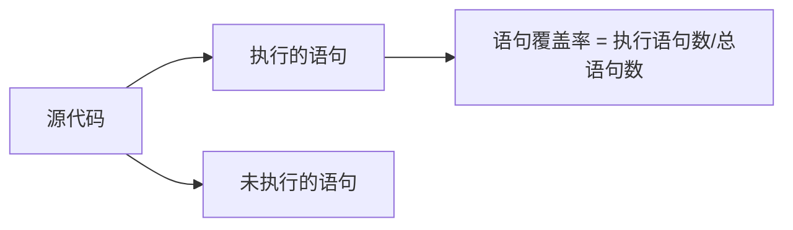

# JavaScript 代码覆盖率

## 什么是代码覆盖率？

代码覆盖率是一种用来衡量测试完整性的度量标准，它表示在测试过程中，有多少源代码被实际执行了。简单来说，它回答了一个重要问题：**我们的测试是否充分验证了代码的各个部分？**

代码覆盖率通常用百分比表示，例如：如果代码有100行，而测试过程中执行了80行，则覆盖率为80%。

:::tip
高代码覆盖率并不意味着代码没有错误，但它提供了一种可衡量的方式来评估测试的全面性。
:::

## 为什么代码覆盖率很重要？

对于初学者和专业开发者来说，代码覆盖率有几个关键好处：

1. **发现未测试的代码** - 帮助找出没有被任何测试用例覆盖的代码区域
2. **提高代码质量** - 通常覆盖率高的代码包含更少的缺陷
3. **增强重构信心** - 当你修改代码时，全面的测试覆盖可以帮助确保不会引入新的问题
4. **文档价值** - 测试本身可以作为代码功能的文档

## 代码覆盖率的类型

在JavaScript测试中，常见的覆盖率类型包括：

### 1. 语句覆盖率 (Statement Coverage)

这是最基本的覆盖率类型，它衡量有多少语句被执行过。



### 2. 分支覆盖率 (Branch Coverage)

测量条件语句（如 if-else、switch）的所有可能分支是否都被执行。

### 3. 函数覆盖率 (Function Coverage)

计算被调用过的函数比例。

### 4. 行覆盖率 (Line Coverage)

类似语句覆盖率，但以代码行为单位。

## 如何在JavaScript中测量代码覆盖率

### 使用Jest进行代码覆盖率测量

[Jest](https://jestjs.io/) 是一个流行的JavaScript测试框架，内置了代码覆盖率工具。

#### 设置步骤：

1. 安装Jest：

```bash
npm install --save-dev jest
```

2. 在package.json中添加测试脚本：

```json
{
  "scripts": {
    "test": "jest",
    "test:coverage": "jest --coverage"
  }
}
```

3. 运行覆盖率报告：

```bash
npm run test:coverage
```

### 示例：使用Jest测量覆盖率

假设我们有以下简单的JavaScript函数：

```javascript
// math.js
function calculateDiscount(price, isPremiumUser) {
  if (price <= 0) {
    return 0;
  }
  
  if (isPremiumUser) {
    return price * 0.2; // 20% 折扣
  } else {
    return price >= 100 ? price * 0.1 : 0; // 10% 折扣，但仅限于价格≥100
  }
}

module.exports = { calculateDiscount };
```

现在，我们可以为它编写测试：

```javascript
// math.test.js
const { calculateDiscount } = require('./math');

test('普通用户购买低于100元商品无折扣', () => {
  expect(calculateDiscount(50, false)).toBe(0);
});

test('普通用户购买100元以上商品有10%折扣', () => {
  expect(calculateDiscount(100, false)).toBe(10);
});

test('会员用户总是获得20%折扣', () => {
  expect(calculateDiscount(100, true)).toBe(20);
});
```

运行覆盖率测试后，Jest会生成类似下面的报告：

```
----------|---------|----------|---------|---------|-------------------
File      | % Stmts | % Branch | % Funcs | % Lines | Uncovered Line #s 
----------|---------|----------|---------|---------|-------------------
All files |    88.9 |      75 |     100 |    88.9 |                   
 math.js  |    88.9 |      75 |     100 |    88.9 | 3                 
----------|---------|----------|---------|---------|-------------------
```

这个报告显示我们的覆盖率不是100%，因为我们没有测试价格为0或负数的情况。

### 使用Istanbul (nyc)

[Istanbul](https://istanbul.js.org/)（通常以命令行界面 `nyc` 使用）是另一个流行的JavaScript代码覆盖率工具。

```bash
# 安装
npm install --save-dev nyc

# 在package.json中配置
"scripts": {
  "test": "mocha tests",
  "coverage": "nyc mocha tests"
}

# 运行覆盖率测试
npm run coverage
```

## 解读覆盖率报告

覆盖率报告通常包括几个关键指标：

- **语句覆盖率(% Stmts)**: 执行的语句百分比
- **分支覆盖率(% Branch)**: 执行的分支百分比
- **函数覆盖率(% Funcs)**: 调用的函数百分比
- **行覆盖率(% Lines)**: 执行的代码行百分比

大多数工具还提供可视化报告，展示哪些代码行未被覆盖。

## 实际应用案例：电子商务网站购物车功能

假设我们正在开发一个购物车功能，它有以下代码：

```javascript
// shoppingCart.js
class ShoppingCart {
  constructor() {
    this.items = [];
  }

  addItem(item) {
    if (!item.id || !item.name || item.price === undefined) {
      throw new Error('无效商品');
    }
    
    const existingItemIndex = this.items.findIndex(i => i.id === item.id);
    
    if (existingItemIndex >= 0) {
      this.items[existingItemIndex].quantity += 1;
    } else {
      this.items.push({
        ...item,
        quantity: 1
      });
    }
  }

  removeItem(itemId) {
    const index = this.items.findIndex(i => i.id === itemId);
    if (index === -1) return false;
    
    this.items.splice(index, 1);
    return true;
  }

  updateQuantity(itemId, quantity) {
    if (quantity <= 0) {
      return this.removeItem(itemId);
    }
    
    const item = this.items.find(i => i.id === itemId);
    if (!item) return false;
    
    item.quantity = quantity;
    return true;
  }

  calculateTotal() {
    return this.items.reduce((total, item) => {
      return total + (item.price * item.quantity);
    }, 0);
  }
}

module.exports = ShoppingCart;
```

我们可以编写以下测试来提高覆盖率：

```javascript
// shoppingCart.test.js
const ShoppingCart = require('./shoppingCart');
const assert = require('assert');

describe('ShoppingCart', () => {
  let cart;
  
  beforeEach(() => {
    cart = new ShoppingCart();
  });
  
  describe('addItem', () => {
    it('应该添加新商品', () => {
      cart.addItem({ id: 1, name: '笔记本', price: 10 });
      assert.strictEqual(cart.items.length, 1);
      assert.strictEqual(cart.items[0].quantity, 1);
    });
    
    it('添加已存在的商品应该增加数量', () => {
      cart.addItem({ id: 1, name: '笔记本', price: 10 });
      cart.addItem({ id: 1, name: '笔记本', price: 10 });
      assert.strictEqual(cart.items.length, 1);
      assert.strictEqual(cart.items[0].quantity, 2);
    });
    
    it('添加无效商品应该抛出错误', () => {
      assert.throws(() => {
        cart.addItem({ name: '无ID商品', price: 5 });
      }, /无效商品/);
    });
  });
  
  describe('removeItem', () => {
    it('应该移除存在的商品', () => {
      cart.addItem({ id: 1, name: '笔记本', price: 10 });
      const result = cart.removeItem(1);
      assert.strictEqual(result, true);
      assert.strictEqual(cart.items.length, 0);
    });
    
    it('移除不存在的商品应该返回false', () => {
      const result = cart.removeItem(999);
      assert.strictEqual(result, false);
    });
  });
  
  describe('updateQuantity', () => {
    it('应该更新商品数量', () => {
      cart.addItem({ id: 1, name: '笔记本', price: 10 });
      const result = cart.updateQuantity(1, 5);
      assert.strictEqual(result, true);
      assert.strictEqual(cart.items[0].quantity, 5);
    });
    
    it('数量为0应该移除商品', () => {
      cart.addItem({ id: 1, name: '笔记本', price: 10 });
      const result = cart.updateQuantity(1, 0);
      assert.strictEqual(result, true);
      assert.strictEqual(cart.items.length, 0);
    });
    
    it('更新不存在的商品应该返回false', () => {
      const result = cart.updateQuantity(999, 5);
      assert.strictEqual(result, false);
    });
  });
  
  describe('calculateTotal', () => {
    it('应该计算购物车总价', () => {
      cart.addItem({ id: 1, name: '笔记本', price: 10 });
      cart.addItem({ id: 2, name: '铅笔', price: 2 });
      cart.updateQuantity(2, 3);
      
      // 10*1 + 2*3 = 16
      assert.strictEqual(cart.calculateTotal(), 16);
    });
    
    it('空购物车总价应为0', () => {
      assert.strictEqual(cart.calculateTotal(), 0);
    });
  });
});
```

此测试套件应该能达到接近100%的代码覆盖率，因为我们测试了所有功能分支。

## 提高代码覆盖率的最佳实践

1. **先编写测试，后写代码（TDD）** - 测试驱动开发有助于自然地获得高覆盖率
2. **关注边缘情况** - 确保测试包含特殊情况（空值、边界值等）
3. **设置最低覆盖率阈值** - 在CI/CD流程中设置最低覆盖率要求
4. **定期检查覆盖率** - 保持对覆盖率的监控，防止随时间下降
5. **平衡价值和成本** - 100%的覆盖率可能不是总是必要的，关注关键业务逻辑

:::caution
不要盲目追求高覆盖率。有意义的测试比覆盖率数字更重要！一个测试可以执行代码但不会验证其正确性，这种测试虽然提高了覆盖率，但价值有限。
:::

## 常见问题及挑战

1. **异步代码测试** - 确保覆盖Promise、回调和异步代码流
2. **DOM操作** - 测试与DOM相关的代码通常需要特殊工具
3. **第三方依赖** - 考虑使用模拟(mocking)隔离测试
4. **不可测代码** - 重构代码提高可测试性
5. **平台相关代码** - 处理浏览器或Node.js特定的功能

## 总结

JavaScript代码覆盖率是衡量测试完整性的重要度量标准。通过使用如Jest或Istanbul等工具，开发者可以了解测试覆盖的代码比例和未测试区域。

高覆盖率并不能保证代码完全无错，但它是提升代码质量的重要工具。对于任何规模的项目，特别是团队协作项目，代码覆盖率能够提供一个客观的质量度量，帮助团队更有信心地进行开发和重构。

记住，测试的价值不仅在于覆盖率数字，更在于测试的质量和它们验证功能正确性的能力。

## 练习与进一步学习

### 练习

1. 为一个简单的计算器函数编写测试，尝试达到100%覆盖率
2. 在现有项目中集成覆盖率工具，分析当前覆盖情况
3. 找出低覆盖率的区域，编写新测试提高覆盖率

### 进一步学习资源

- [Jest官方文档中的覆盖率部分](https://jestjs.io/docs/configuration#collectcoverage-boolean)
- [Istanbul文档](https://istanbul.js.org/)
- [测试驱动开发（TDD）方法](https://www.agilealliance.org/glossary/tdd/)
- [《JavaScript测试实践》](https://github.com/goldbergyoni/javascript-testing-best-practices)

通过持续实践和学习，你将能够掌握代码覆盖率测试，并将其作为提高代码质量的有效工具。