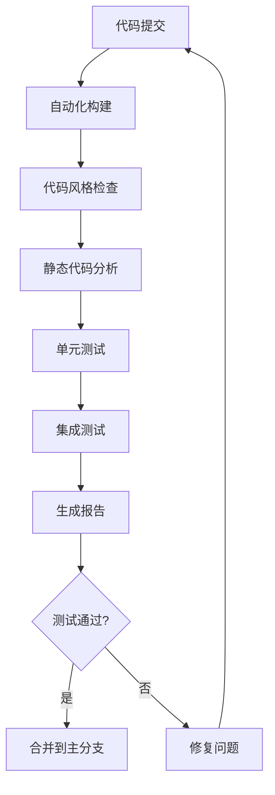

# JavaScript 持续集成

## 什么是持续集成？

持续集成（Continuous Integration，简称CI）是一种软件开发实践，团队成员频繁地（通常是每天多次）将他们的代码更改集成到主分支或主干中。每次集成都会通过自动化构建和测试进行验证，从而尽早地发现集成错误。

对于JavaScript项目，持续集成意味着：

- 自动运行单元测试和集成测试
- 检查代码风格和质量
- 自动化构建过程
- 及早发现并解决问题

:::tip
持续集成的核心价值在于：尽早发现问题，降低修复成本，提高团队协作效率。
:::

## 持续集成的好处

对JavaScript开发者而言，采用持续集成有以下几个明显的好处：

1. **减少bug和错误**：通过频繁集成和自动化测试，尽早发现问题
2. **提高代码质量**：通过代码分析工具强制执行编码标准
3. **加速开发过程**：自动化重复任务，开发者可以专注于编码
4. **简化团队协作**：减少集成冲突，提高团队效率
5. **信心满满地发布**：确保每次部署的代码都经过全面测试

## JavaScript 持续集成工具

### 1. GitHub Actions

GitHub Actions是GitHub提供的CI/CD服务，可直接在GitHub仓库中配置工作流程。

以下是一个基础的JavaScript项目GitHub Actions配置示例：

```yaml
name: JavaScript CI

on:
  push:
    branches: [ main ]
  pull_request:
    branches: [ main ]

jobs:
  build:
    runs-on: ubuntu-latest

    strategy:
      matrix:
        node-version: [14.x, 16.x, 18.x]

    steps:
    - uses: actions/checkout@v3
    - name: Use Node.js ${{ matrix.node-version }}
      uses: actions/setup-node@v3
      with:
        node-version: ${{ matrix.node-version }}
    - run: npm ci
    - run: npm test
    - run: npm run lint
```

### 2. Travis CI

Travis CI是一个流行的CI服务，对开源项目免费。以下是一个`.travis.yml`配置示例：

```yaml
language: node_js
node_js:
  - 14
  - 16
  - 18

cache: npm

install:
  - npm ci

script:
  - npm test
  - npm run lint
```

### 3. CircleCI

CircleCI是另一个流行的CI/CD平台。以下是一个`config.yml`配置示例：

```yaml
version: 2.1
jobs:
  build:
    docker:
      - image: cimg/node:16.13
    steps:
      - checkout
      - restore_cache:
          key: dependency-cache-{{ checksum "package-lock.json" }}
      - run:
          name: Install Dependencies
          command: npm ci
      - save_cache:
          key: dependency-cache-{{ checksum "package-lock.json" }}
          paths:
            - ./node_modules
      - run:
          name: Run tests
          command: npm test
      - run:
          name: Run linting
          command: npm run lint
```

## 持续集成流程步骤

一个完整的JavaScript持续集成流程通常包括以下几个步骤：



## 实现JavaScript项目持续集成的步骤

### 1. 设置测试框架

首先，你需要为你的项目设置一个测试框架，如Jest、Mocha或Jasmine：

```bash
npm install --save-dev jest
```

在`package.json`中添加测试脚本：

```json
{
  "scripts": {
    "test": "jest"
  }
}
```

### 2. 添加代码质量检查工具

使用ESLint检查代码质量：

```bash
npm install --save-dev eslint
npx eslint --init
```

添加lint脚本到`package.json`：

```json
{
  "scripts": {
    "test": "jest",
    "lint": "eslint ."
  }
}
```

### 3. 设置CI配置文件

在项目根目录创建CI配置文件。以GitHub Actions为例，创建`.github/workflows/ci.yml`：

```yaml
name: CI

on:
  push:
    branches: [ main ]
  pull_request:
    branches: [ main ]

jobs:
  test:
    runs-on: ubuntu-latest
    steps:
    - uses: actions/checkout@v3
    - name: Use Node.js
      uses: actions/setup-node@v3
      with:
        node-version: '16.x'
    - run: npm ci
    - run: npm run lint
    - run: npm test
```

### 4. 自动化版本控制

使用语义化版本控制来自动管理版本号：

```bash
npm install --save-dev semantic-release
```

### 5. 配置持续部署（可选）

如果需要自动部署，可以设置部署脚本：

```yaml
# 在GitHub Actions配置中添加
deploy:
  needs: test
  runs-on: ubuntu-latest
  steps:
  - uses: actions/checkout@v3
  - name: Deploy to production
    if: github.ref == 'refs/heads/main'
    run: |
      npm ci
      npm run build
      # 部署命令
```

## 实际案例：React应用的持续集成

下面是一个React应用的持续集成实践案例：

### 目录结构

```
my-react-app/
├── .github/
│   └── workflows/
│       └── ci.yml
├── src/
│   ├── components/
│   ├── App.js
│   ├── App.test.js
│   └── index.js
├── .eslintrc.js
├── .gitignore
├── package.json
└── README.md
```

### GitHub Actions配置

`.github/workflows/ci.yml`:

```yaml
name: React App CI

on:
  push:
    branches: [ main ]
  pull_request:
    branches: [ main ]

jobs:
  test:
    runs-on: ubuntu-latest
    steps:
    - uses: actions/checkout@v3
    - name: Setup Node.js
      uses: actions/setup-node@v3
      with:
        node-version: '16.x'
        cache: 'npm'
    - name: Install dependencies
      run: npm ci
    - name: Lint code
      run: npm run lint
    - name: Test
      run: npm test -- --coverage
    - name: Build
      run: npm run build

  deploy:
    needs: test
    if: github.ref == 'refs/heads/main'
    runs-on: ubuntu-latest
    steps:
    - uses: actions/checkout@v3
    - name: Setup Node.js
      uses: actions/setup-node@v3
      with:
        node-version: '16.x'
        cache: 'npm'
    - run: npm ci
    - run: npm run build
    - name: Deploy to Netlify
      uses: netlify/actions/cli@master
      with:
        args: deploy --prod --dir=build
      env:
        NETLIFY_AUTH_TOKEN: ${{ secrets.NETLIFY_AUTH_TOKEN }}
        NETLIFY_SITE_ID: ${{ secrets.NETLIFY_SITE_ID }}
```

### 测试配置

在React项目中编写测试示例，`App.test.js`:

```jsx
import { render, screen } from '@testing-library/react';
import App from './App';

test('renders learn react link', () => {
  render(<App />);
  const linkElement = screen.getByText(/learn react/i);
  expect(linkElement).toBeInTheDocument();
});
```

### ESLint配置

`.eslintrc.js`:

```javascript
module.exports = {
  env: {
    browser: true,
    es2021: true,
    jest: true,
  },
  extends: ['eslint:recommended', 'plugin:react/recommended'],
  parserOptions: {
    ecmaFeatures: {
      jsx: true,
    },
    ecmaVersion: 12,
    sourceType: 'module',
  },
  plugins: ['react'],
  rules: {
    'react/react-in-jsx-scope': 'off',
  },
  settings: {
    react: {
      version: 'detect',
    },
  },
};
```

:::caution
每次提交代码前，最好先在本地运行测试和代码检查，确保代码符合项目标准。
:::

## 持续集成最佳实践

1. **保持测试快速运行**：CI过程应该尽可能快，以便开发者能够快速获得反馈。
2. **编写有意义的测试**：关注核心功能和边缘情况。
3. **维护高测试覆盖率**：理想情况下，测试覆盖率应达到70%以上。
4. **自动化一切可能的环节**：减少人工干预。
5. **监控CI状态**：及时修复失败的构建。
6. **使用缓存优化构建速度**：缓存依赖项可以显著提高CI速度。
7. **针对不同环境进行测试**：测试在不同Node.js版本下的兼容性。

## 常见问题与解决方案

### 1. CI构建缓慢

**解决方案**：
- 缓存依赖项
- 并行运行测试
- 只运行受影响文件的测试

### 2. 测试在本地通过但在CI中失败

**解决方案**：
- 确保CI环境与开发环境一致
- 检查环境变量配置
- 检查时区或路径差异

### 3. 依赖安装失败

**解决方案**：
- 使用锁定文件（package-lock.json或yarn.lock）
- 设置私有NPM注册表的认证信息
- 检查网络连接问题

## 总结

持续集成已经成为现代JavaScript开发的标准实践。通过自动化测试、代码检查和部署流程，可以显著提高代码质量和团队效率。对于初学者来说，建议从简单的配置开始，逐步构建完整的CI/CD流水线。

记住，好的持续集成不只是关于工具，更是关于团队文化和开发习惯。频繁提交代码、编写好的测试、及时修复问题，这些习惯与工具一起构成了成功的持续集成实践。

## 练习与资源

### 练习

1. 为一个简单的JavaScript项目设置GitHub Actions配置文件。
2. 使用Jest编写单元测试并确保它们在CI中通过。
3. 为项目添加ESLint配置，并在CI中添加代码检查步骤。
4. 模拟一个失败的测试场景，然后修复它。

### 额外资源

- [GitHub Actions 文档](https://docs.github.com/en/actions)
- [Jest 测试框架官方文档](https://jestjs.io/docs/getting-started)
- [ESLint 官方文档](https://eslint.org/docs/user-guide/getting-started)
- [持续集成最佳实践](https://www.martinfowler.com/articles/continuousIntegration.html)
- [JavaScript 测试策略](https://kentcdodds.com/blog/write-tests)

开始使用持续集成可能看起来有些复杂，但掌握了这项技能将为你的开发生涯带来巨大价值，帮助你构建更加可靠和高质量的JavaScript应用程序。